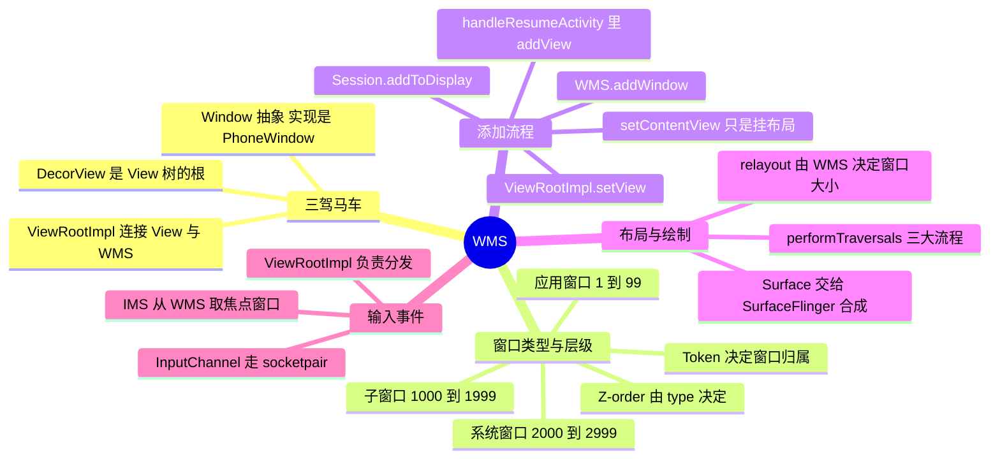

# WMS（WindowManagerService）



> WMS 管的是"**窗口**"，不是"View"：它决定每个窗口在屏幕上的位置、大小、层级和可见性，并负责把输入事件路由到正确的窗口。而 App 侧的 `ViewRootImpl` 才是把"View 树"和"WMS 的窗口"连起来的那座桥——**很多看似是 View 的问题（子线程改 UI、getWidth 为 0、BadToken），根因都在这一层**。

---

## 一、三驾马车：Activity、Window、View

### 1. 三个角色

| 角色 | 是什么 | 说明 |
| --- | --- | --- |
| `Window` | 抽象概念，实现类是 `PhoneWindow` | 每个 Activity 持有一个 Window，负责承载视图、管理标题栏/菜单等 |
| `DecorView` | View 树的根 | `setContentView` 只是把布局 inflate 后加到 DecorView 的 content 区域，**它本身不负责显示** |
| `ViewRootImpl` | View 树与 WMS 的桥梁 | 它是 View 树的"根 Parent"，负责与 WMS 通信、触发三大流程、接收输入事件 |

- `WindowManager`（应用侧接口）的实现链是 `WindowManagerImpl` → `WindowManagerGlobal`（**进程单例**）→ `IWindowSession`（Binder 代理）→ WMS；
- `setContentView` 只做了两件事：创建 DecorView、把布局挂上去。**此时视图还没有被测量、没有 Surface、也还没有窗口**。

### 2. App 侧与系统侧的分工

```
App 进程                                      system_server
┌──────────────────────────┐                 ┌─────────────────────────┐
│ Activity → PhoneWindow   │                 │        WMS              │
│            DecorView     │  IWindowSession │  维护所有窗口的层级/位置  │
│         ViewRootImpl ────┼────────────────►│  Z-order、焦点、转屏      │
│            Surface       │◄────────────────┤  SurfaceControl          │
└──────────────────────────┘                 └───────────┬─────────────┘
                                                         │
                                                  SurfaceFlinger（合成上屏）
```

- WMS 负责**决策**（谁在上面、多大、在哪、谁有焦点），App 负责**渲染**（在 WMS 给的 Surface 上画自己的内容）；
- 两者通过 `IWindowSession` 通信，`ViewRootImpl` 是 App 侧唯一的窗口代表（每个窗口一个 `ViewRootImpl`）。

---

## 二、窗口的类型与层级

### 1. 三种类型

`WindowManager.LayoutParams.type` 决定了窗口属于哪一层：

| 类型 | 取值范围 | 常见成员 | 是否需要 Token |
| --- | --- | --- | --- |
| 应用窗口 | `FIRST_APPLICATION_WINDOW(1) ~ 99` | `TYPE_BASE_APPLICATION(1)`、`TYPE_APPLICATION(2)`、`TYPE_APPLICATION_STARTING(3)` | **需要**（Activity 的 Token） |
| 子窗口 | `FIRST_SUB_WINDOW(1000) ~ 1999` | `TYPE_APPLICATION_PANEL(1000)`、`TYPE_APPLICATION_MEDIA(1001)`、`TYPE_APPLICATION_ATTACHED_DIALOG(1003)` | 需要（父窗口的 Token） |
| 系统窗口 | `FIRST_SYSTEM_WINDOW(2000) ~ 2999` | `TYPE_STATUS_BAR(2000)`、`TYPE_SYSTEM_ALERT(2003，已废弃)`、`TYPE_TOAST(2005)`、`TYPE_INPUT_METHOD(2011)`、`TYPE_APPLICATION_OVERLAY(2038)` | 视类型而定 |

- **Z-order 由 type 决定**：系统窗口 > 子窗口 > 应用窗口；同类型之间按添加顺序/子层级排列；
- 应用之所以不能随便加系统窗口，就是因为系统窗口位于上层、能覆盖一切——8.0 起把可以覆盖其他应用的 `TYPE_SYSTEM_ALERT` 换成了需要授权的 `TYPE_APPLICATION_OVERLAY`，并且要申请 `SYSTEM_ALERT_WINDOW` 权限。

### 2. Token：窗口的"身份证"

- 添加应用窗口时必须带有效的 `token`（通常就是 `Activity` 的 Token，见 [AMS](../AMS/AMS.md) 的 `ActivityRecord.Token`）；
- WMS 用 token 校验"这个窗口属于哪个 Activity/应用"，并据此决定窗口的层级归属与生命周期绑定——Activity 销毁时，属于它的窗口会被一并清理；
- 拿不到有效 token 就会抛经典崩溃：

```
android.view.WindowManager$BadTokenException:
  Unable to add window -- token android.os.BinderProxy@xxx is not valid; is your activity running?
```

常见触发场景：Activity 已 `finish()` 之后在异步回调里 `Dialog.show()`；用 **Application 的 Context** 弹 Dialog（没有 Activity Token）；在 `Service` 里直接弹 Dialog。正确做法是先在 `isFinishing()/isDestroyed()` 上做判断，或改用 `TYPE_APPLICATION_OVERLAY`（需权限）、`Toast`、通知等方式。

---

## 三、窗口的添加流程

### 1. 从 setContentView 到 WMS.addWindow

```
Activity.setContentView                    // 只创建 DecorView + 挂布局
  ↓
ActivityThread.handleResumeActivity        // onResume 之后
  → WindowManagerGlobal.addView(decorView, params)
      → new ViewRootImpl(...)              // ViewRootImpl 在这里才被创建
      → root.setView(decorView, params, parent)
          → IWindowSession.addToDisplay(...)   // Binder 到 system_server
              → WMS.addWindow(...)             // 创建 WindowState、分配层级
          → requestLayout()                    // 触发第一次绘制
```

关键结论：

- **`ViewRootImpl` 是在 `handleResumeActivity` 里创建的**，不是 `setContentView` 时；
- 窗口是"onResume 之后才真正加进 WMS"的，所以 `onCreate`/`onResume` 里拿不到 View 的宽高；
- 相应地，**在 `onResume` 之前从子线程操作 UI 可能不会崩**（此时还没有 `ViewRootImpl`，也就没有人做线程检查）——这正是"子线程能不能更新 UI"这个经典问题的完整答案（见高频问答 5）。

### 2. 布局由 WMS 决定，绘制由 App 完成

- `ViewRootImpl.performTraversals()` 中会先调用 `relayoutWindow()`：**把布局参数交给 WMS，由 WMS 计算窗口最终的大小、位置、可见性，并把 `Surface` 返回给 App**；
- 拿到尺寸后，才开始 `measure → layout → draw` 三大流程；
- 所以"View 的绘制"从 `ViewRootImpl.performTraversals` 开始（详见 [View 的绘制](../View的绘制/View的绘制.md)）；
- 每次需要窗口变化（转屏、软键盘弹出、多窗口拖拽）都会重新走一遍 `relayoutWindow` → `performTraversals`。

### 3. Surface 与 SurfaceFlinger

- 每个窗口对应一个 `Surface`，它是图形缓冲队列（BufferQueue）的**生产端**；App 用 Canvas / OpenGL ES 把内容画进 Surface 的缓冲区；
- `SurfaceFlinger` 是**消费端**，负责把所有窗口的缓冲区按 WMS 给出的层级合成为一帧送显（详见 [图形系统](../图形/图形.md)）；
- 因此一次"界面卡顿"可能出在 App 的绘制（measure/layout/draw 慢）、也可以出在合成环节，用 Perfetto 可以区分（见 [Perfetto](../perfetto.md)）。

---

## 四、输入事件的分发

```
硬件 → InputReader → InputDispatcher（都在 IMS 中，属于 system_server）
   → 向 WMS 询问：这个坐标下谁是焦点窗口/触摸窗口？
   → 通过 InputChannel（socketpair）把事件发给目标 App 进程
   → ViewRootImpl 的 InputEventReceiver 收到
   → DecorView → Activity → Window → DecorView → View 树分层分发
```

- WMS 只负责**决定分发给哪个窗口**（焦点窗口的维护也是它的职责），真正的分发在 App 进程内由 `ViewRootImpl` 驱动；
- 如果目标窗口的主线程 5 秒内没有消费掉输入事件，就会触发 **ANR（Input dispatching timed out）**——这是最常见的一类 ANR；
- `FLAG_NOT_FOCUSABLE`、`FLAG_NOT_TOUCHABLE`、`FLAG_WATCH_OUTSIDE_TOUCH` 等窗口 flags 会直接影响事件能否到达该窗口。

---

## 五、Dialog、PopupWindow、Toast 的差别

| 方式 | 窗口类型 | 依赖 | 说明 |
| --- | --- | --- | --- |
| `Dialog` | **应用窗口**（`TYPE_APPLICATION`）或子窗口 | 必须有 Activity 的 Token | 是独立的窗口，有自己的 `Window` 与 `DecorView`；用错 Context 会 `BadTokenException` |
| `PopupWindow` | **子窗口**（`TYPE_APPLICATION_PANEL`） | 依附于锚点 View 所在的窗口 | 不是独立窗口，随宿主窗口移动/销毁；`showAsDropDown` 内部走的是子窗口的添加 |
| `Toast` | **系统窗口**（`TYPE_TOAST`） | 不需要 Activity Token | 因此可以在没有 Activity 的场景弹，但系统对它做了专门限制（时长、后台弹出限制），不适合承载交互 |

> 一个延伸问题：**一个 Activity 有几个 Window？** 通常是一个主窗口（`PhoneWindow`），Dialog、PopupWindow、自定义的 `TYPE_APPLICATION_OVERLAY` 都会额外增加窗口——多窗口会带来额外的合成开销，也是性能优化时值得排查的点。

---

## 六、面试高频问答

### 1. Activity、Window、View 三者的关系？

Activity 持有一个 `PhoneWindow`；`setContentView` 把布局挂到 PhoneWindow 的 `DecorView`（View 树根）上；`ViewRootImpl` 在 `onResume` 之后被创建，它把 DecorView 与 WMS 连接起来——负责与 WMS 通信（`addToDisplay`/`relayout`）、驱动 measure/layout/draw、接收并分发输入事件。

### 2. Window 的添加过程？

`handleResumeActivity` → `WindowManagerGlobal.addView` → 创建 `ViewRootImpl` → `ViewRootImpl.setView` → `IWindowSession.addToDisplay` → `WMS.addWindow` 创建 `WindowState` 并层级化 → 随即 `requestLayout()`，在 `performTraversals` 中通过 `relayoutWindow` 拿到 WMS 计算的尺寸和 Surface，开始绘制。

### 3. 为什么在 onCreate/onResume 里拿不到 View 的宽高？

因为窗口在 `onResume` 之后才被添加到 WMS，宽高由 WMS 在 `relayoutWindow` 中计算后才回给 App；在此之前 View 还没有 `ViewRootImpl` 主导的测量。获取尺寸的正确姿势：`View.post{}`、`OnGlobalLayoutListener`（`getViewTreeObserver`）、`OnPreDrawListener`，或 `ViewTreeObserver` 中的 `onGlobalLayout`。

### 4. 为什么子线程不能更新 UI？

- 根因：**View 体系不是线程安全的**（共享的 View 树、绘制状态、可能同时在 measure/layout/draw）；
- 防护：`ViewRootImpl` 在 `requestLayout`/`invalidate` 时会 `checkThread()`，线程不一致就抛 `CalledFromWrongThreadException: Only the original thread that created a view hierarchy can touch its views.`；
- 有趣之处：`ViewRootImpl` 是 `onResume` 之后才创建的，所以**在 `onResume` 之前子线程改 UI 可能不会报错**——但这是"没被发现"而不是"合法"，运行期依然可能出现状态错乱；
- 结论：所有 View 操作都应在主线程（或用 `View.post`、`Handler`、协程 `Main` 调度回去）。

### 5. 什么是 BadTokenException？什么时候会遇到？

添加应用窗口时 Token 无效导致的崩溃。典型场景：Activity 已经 `finish()`/`destroy` 后还在异步回调里 `show()` Dialog，或者用 Application Context 弹 Dialog。因为应用窗口必须属于一个真实的 Activity（Token 就是它在系统侧的身份证）。解决：弹窗统一收口到 Activity、弹出前判断 `isFinishing()/isDestroyed()`、或改用不需要 Token 的方式。

### 6. 窗口类型有哪些？为什么 TYPE_SYSTEM_ALERT 被废弃？

分应用窗口（1-99）、子窗口（1000-1999）、系统窗口（2000-2999），类型决定 Z-order。`TYPE_SYSTEM_ALERT` 能让任意应用把窗口盖在其他应用之上，被滥用得非常严重（钓鱼/劫持），Android 8.0 起要求改用 `TYPE_APPLICATION_OVERLAY` 并申请 `SYSTEM_ALERT_WINDOW` 特殊权限，且悬浮窗行为受到严格限制。

### 7. 输入事件是怎么到达 Activity 的？

`InputReader` 读取硬件事件 → `InputDispatcher` 向 WMS 查询目标窗口（焦点/触摸窗口）→ 通过 `InputChannel`（socketpair）跨进程发到 App → `ViewRootImpl` 的 `InputEventReceiver` 收到后交给 DecorView → Activity → Window 的 `dispatchTouchEvent` 走 View 树分发。5 秒内没处理完就是输入类型的 ANR。

### 8. WMS 和 AMS 是怎么配合的？

AMS（ATMS）管理 Activity 的存在与状态，WMS 管理窗口的存在与层级，二者通过 **Activity 的 Token** 关联：ATMS 创建 `ActivityRecord` 时生成的 Token 同时是 WMS 认可的 `WindowToken`，Activity 销毁时 WMS 会把属于它的窗口一并清理。所以"Activity 已经死了但窗口还在"这类泄漏，本质是两个服务之间的状态不一致。

### 9. Surface 是什么？和 SurfaceFlinger 什么关系？

Surface 是图形缓冲队列（BufferQueue）的生产端，对应一个窗口；App 把内容绘制到它上面，SurfaceFlinger 作为消费端按 WMS 给出的层级做合成并送显。WMS 决定"怎么摆"，SurfaceFlinger 决定"怎么合"。

### 10. 为什么转屏会引起 Activity 重建？

转屏会让窗口尺寸、资源配置（如横竖屏的 `layout-land`）发生变化：WMS 重新 `relayout` 并更新显示配置，系统据此判断该 Activity 是否需要重建（未声明 `configChanges` 时就会走销毁重建流程，从而触发 [Fragment](../Fragment/Fragment.md) 的保存恢复与常见的"状态丢失/重叠"问题）。
