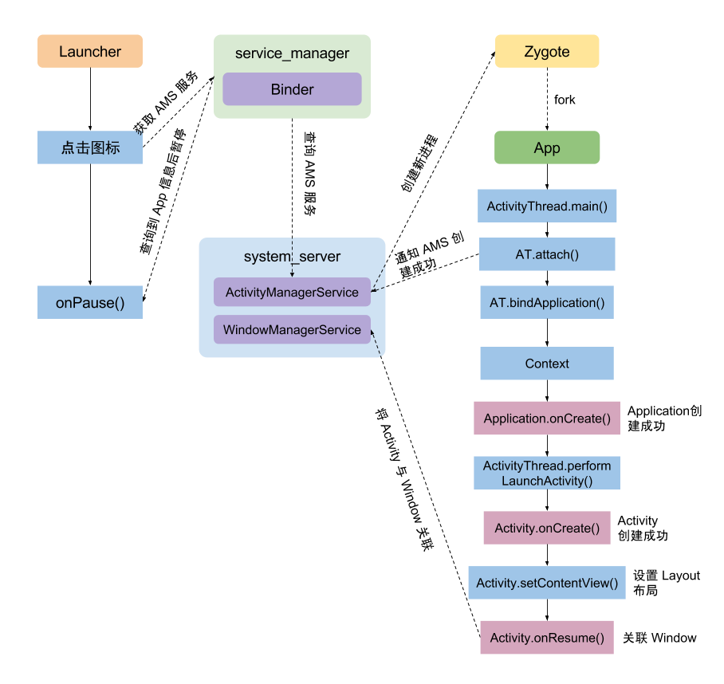
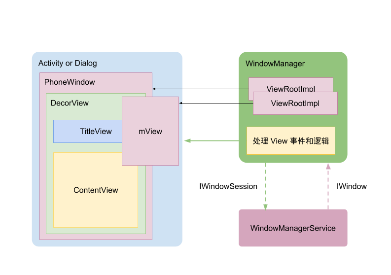

# Window

## 一、Window 体系总览
- Window 是抽象概念，**唯一实现类是 PhoneWindow**；Window 本身不显示内容，真正的显示载体是 View，Window 是"视图的容器"
- 一个 Activity 对应一个 Window（PhoneWindow）、一个 DecorView、一个 ViewRootImpl
- **view,activity,window关系**：Activity → Window（PhoneWindow）→ DecorView（根 View）→ mContentParent（业务布局）
- WindowManager 负责 Window 的增删改：WindowManager 接口 → WindowManagerImpl → **WindowManagerGlobal** → **IWindowSession（Binder）** → 跨进程调用 **WindowManagerService（WMS）**
- WMS 管理所有 Window 的 Z 序、大小、焦点、token；**SurfaceFlinger** 负责合成上屏

## 二、Window 三种类型（显示层级用 type 表示）
1. **应用 Window**：对应 Activity，层级 **1~99**，视图最下层
2. **子 Window**：不能单独存在，必须依附父 Window（Dialog 就是子 Window），层级 **1000~1999**
3. **系统 Window**：需要声明权限才能创建（Toast、系统状态栏），层级 **2000~2999**，最上层

type 决定显示层级，flag 决定行为。

## 三、Window 属性 flags（常用）
- **FLAG_NOT_FOCUSABLE**：Window 不获取焦点，不接收输入事件；会同时启用 FLAG_NOT_TOUCH_MODAL 标记位；不需要和软键盘交互（Z-ordered，独立于软键盘激活状态，可覆盖软键盘；可用 FLAG_ALT_FOCUSABLE_IM 修改）
- **FLAG_NOT_TOUCH_MODAL**：Window 是否 modal。即使 Window 可获得焦点，Window 外的点击事件都会传递给后面的 Window；否则 Window 会处理所有的点击事件，无论是否在范围内
- **FLAG_SHOW_WHEN_LOCKED**：Window 可显示在 KeyGuard（锁屏界面）之上；和 FLAG_KEEP_SCREEN_ON 一起使用可在屏幕打开后直接显示 Window 而不用经历 KeyGuard；与 FLAG_DISMISS_KEYGUARD 一起使用可自动跳过 non-secure KeyGuard；此 Flag 只能用于最顶层全屏 Window
- 补充高频：**FLAG_SECURE**（防截屏）、**FLAG_KEEP_SCREEN_ON**（保持屏幕常亮）、FLAG_DIM_BEHIND（背景变暗）

## 四、Window 创建与显示流程（面试高频）
### 1. 创建过程
window创建过程–>ActivityThread.perfomLaunchActivity()的attach()创建PhoneWindow,mWindow = new PhoneWindow(this, window, activityConfigCallback);mWindow.setWindowManager((WindowManager)context.getSystemService(Context.WINDOW_SERVICE),mToken,mComponent.flattenToString(),(info.flags & ActivityInfo.FLAG_HARDWARE_ACCELERATED) != 0);

同时从 AMS 拿到 **token**，供后续 WMS 校验（token 缺失/失效 → BadTokenException）。

### 2. onResume 时 Window 显示过程
onResume() Window 显示过程,ActivityThread.performResumeActivity–>onResume–>WindowManagerImpl.addView–>new ViewRootImpl

### 3. 完整添加流程（setContentView → 上屏）
1. `setContentView` → PhoneWindow.setContentView → **installDecor** 创建 DecorView 和 mContentParent
2. handleResumeActivity → `WindowManager.addView(decorView, layoutParams)`
3. WindowManagerGlobal.addView → 创建 **ViewRootImpl** → `viewRoot.setView(decorView)`
4. ViewRootImpl 通过 **IWindowSession（Binder）** 调用 WMS.addWindow：创建 WindowState、**校验 token**、注册 **InputChannel**、分配 Surface
5. 回到 App 进程：requestLayout → **scheduleTraversals** → 等 vsync → **performTraversals**（measure → layout → draw）

### 4. 删除流程
`removeView` → WMS.removeWindow → destroySurface。**Dialog / 弹窗不及时移除是典型内存泄漏点**（Window 持有 DecorView → Activity）。

## 五、ViewRootImpl 与三大绘制流程
- ViewRootImpl，ViewRoot是GUI管理系统与GUI呈现系统之间的桥梁。每一个ViewRootImpl关联一个Window，ViewRootImpl最终会通过它的setView方法绑定Window所对应的View，并通过其performTraversals方法对View进行布局、测量和绘制
- 绘制调度链路：`requestLayout` → `scheduleTraversals`（注册 Choreographer.CALLBACK_TRAVERSAL，等 vsync）→ `doTraversal` → **performTraversals**：
  1. **performMeasure**：从 DecorView 自顶向下测量
  2. **performLayout**：确定各 View 位置
  3. **performDraw**：绘制
- **invalidate 与 requestLayout 的区别**：
  - `requestLayout`：触发 **measure + layout**（可能不 draw），沿**父链上溯**直到 ViewRootImpl
  - `invalidate`：只触发 **draw（重绘）**，不上溯父链，**不会触发其他 View 重绘**（脏区域重绘）
- 详细绘制流程见 [View的绘制](../View的绘制/View的绘制.md)，vsync 机制见 [Android屏幕刷新](../Android屏幕刷新/Android屏幕刷新.md)

## 六、子 Window：Dialog / PopupWindow / Toast
### 1. Dialog
- 子 Window，**需要 Activity 的 context（token）**；用 ApplicationContext 创建会 **BadTokenException**
- token 机制：Activity.attach 时从 AMS 拿到 token（WindowToken），addView 时 WMS 校验；**Activity 销毁后 token 失效**，此时再 show Dialog 会崩溃

### 2. PopupWindow
- 子 Window；Android 7.1 之后 `showAsDropDown` 超出屏幕范围时系统会强制调整位置
- 与 Dialog 区别：PopupWindow 非模态、不阻塞交互；Dialog 通常模态

### 3. Toast
- **系统 Window**，token 来自 **NotificationManagerService**（不是 Activity）
- Android 11 起自定义 View Toast 受限；**Android 12 起 Toast 由系统进程渲染**（文本样式），App 内自定义 Toast 被弃用

### 4. BadTokenException 本质
token 缺失或失效：ApplicationContext 没有 token；Activity 已 finish 后 token 失效。解决：用有效 Activity 的 context，销毁时同步 dismiss。

## 七、子线程更新 UI 与线程检查（高频）
- **ViewRootImpl.checkThread()** 校验"当前线程 == 创建 ViewRootImpl 的线程（主线程）"
- 检查时机：`requestLayout` / `invalidate` 等触发 traversals 的入口；`setText` 本身只是改数据 + requestLayout
- 关键结论：**View 未 attach 到窗口（ViewRootImpl 未创建）时，子线程 setText 不报错；attach 之后会抛 CalledFromWrongThreadException**
- 标准回答："子线程能不能更新 UI"——View 已 attach 后不能（checkThread 拦截）；attach 前系统不检查，但不推荐

## 八、软件绘制与硬件加速
- **软件绘制**：整个 View 树**共用一个 Canvas**（同一块 Bitmap），通过 save/translate/clip 变换绘制到各自区域；CPU 绘制，性能差
- **硬件加速**：每个 View 拥有独立 **RenderNode（DisplayList）**，draw 时只更新自己的 RenderNode，由 GPU 渲染合成；重绘只重录对应 RenderNode；Android 4.0 起默认开启
- **SurfaceView**：拥有独立 Surface，在宿主 Window 上"挖洞"，由 SurfaceFlinger 单独合成，适合视频/相机场景

## 九、软键盘与 Window 调整
- `softInputMode`：
  - **adjustResize**：Window 缩小到键盘上方（配合 fitsSystemWindows / WindowInsets 生效）
  - **adjustPan**：内容整体平移
  - **adjustNothing**：不调整
- 全屏 Activity 下 adjustResize 可能失效，需手动处理 WindowInsets 分发（dispatchApplyWindowInsets → onApplyWindowInsets）

## 十、高频面试题（附答案）

1. **invalidate 会触发其他 view 的重绘吗？**
   不会。invalidate 只标记自己重绘（draw），**不上溯父链**；只有 requestLayout 才会沿父链上溯触发重新 measure/layout。

2. **Activity 如何与 window 与 view 进行分工合作？**
   Activity 负责生命周期与业务逻辑；Window（PhoneWindow）负责视图容器管理（setContentView、持有 DecorView）；View 负责显示与交互。Activity 通过 Window 挂载 View，通过 WindowManager 与 WMS 通信。

3. **onResume 函数中度量宽高有效吗？**
   无效。measure 发生在 onResume 之后的首帧 **performTraversals**；onResume 时 DecorView 尚未完成测量，getWidth/getMeasuredWidth 为 0。正确做法：`view.post()`、`ViewTreeObserver.OnGlobalLayoutListener`、`OnPreDrawListener`、`doOnLayout`。

4. **子线程 view.setText 一定会报错吗？为什么**
   不一定。setText 触发 requestLayout；只有 **View 已 attach**（ViewRootImpl 已创建）时，checkThread 才会抛 CalledFromWrongThreadException；attach 之前不检查、不报错。

5. **view 的绘制过程都是用的同一个 canvas 吗？**
   软件绘制：整棵树**共用一个 Canvas**（同一 Bitmap），通过 translate 变换绘制各自区域；硬件加速：每个 View 绘制到自己的 **RenderNode**，由 GPU 合成，不是同一个 Canvas。

6. **Dialog 用 ApplicationContext 创建为什么崩溃？**
   BadTokenException。Dialog 是子 Window，attach 时需要 Activity 的 **token**；ApplicationContext 没有 token，WMS 校验失败。用 Activity 的 context 创建即可。

7. **Window 添加流程口述（5 步）？**
   setContentView 创建 DecorView → handleResumeActivity 调 addView → WindowManagerGlobal 创建 ViewRootImpl → IWindowSession 跨进程到 WMS（校验 token、注册 InputChannel、分配 Surface）→ scheduleTraversals 等 vsync 后 performTraversals 绘制上屏。

8. **Toast 在高版本有什么变化？**
   Android 11 起自定义 View Toast 受限；Android 12 起 Toast 由**系统进程渲染**，App 内自定义样式失效，跨版本差异是面试常考点。
