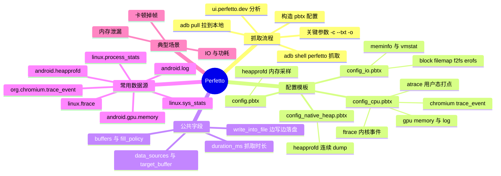

# Perfetto 抓取与分析



---

## 一、抓取流程与公共字段

Perfetto 的抓取分三步：准备 `.pbtx` 文本配置 → 在设备上抓取 → 拉回本地用 [ui.perfetto.dev](https://ui.perfetto.dev) 打开分析。

最常用的命令行抓取方式（配置从标准输入传入）：

```bash
cat config.pbtx | adb shell perfetto -c - --txt -o /data/misc/perfetto-traces/trace.pftrace

adb pull /data/misc/perfetto-traces/trace.pftrace
```

关键参数：

- `-c -`：指定配置文件，`-` 表示从标准输入读取，也可以直接写设备上的配置路径；
- `--txt`：声明配置是文本格式；不指定则按 protobuf 二进制解析，所以文本配置必须显式加上；
- `-o`：设备上的输出路径，抓完用 `adb pull` 拉到本地。

### 1. 配置文件的公共字段

| 字段 | 作用 |
| --- | --- |
| `buffers` | 声明共享内存缓冲区，可以声明多个 |
| `size_kb` | 单个缓冲区大小 |
| `fill_policy: DISCARD` | 写满后**丢弃新数据**，只保留开头一段 |
| `fill_policy: RING_BUFFER` | 环形缓冲，写满后**覆盖最旧数据**，适合长时间抓取 |
| `data_sources.config.name` | 数据源名称，如 `linux.ftrace` |
| `data_sources.config.target_buffer` | 该数据源写入第几个 buffer |
| `duration_ms` | 抓取时长（毫秒） |
| `write_into_file` | 边抓边写文件，常配 `file_write_period_ms`、`max_file_size_bytes`、`flush_period_ms` 使用，避免大 trace 全压在内存里 |

---

## 二、内存采样：config.pbtx

这份配置用 `android.heapprofd` 做内存采样，按分配量抽样记录调用栈：

```
buffers {
  size_kb: 65536
  fill_policy: DISCARD
}
data_sources {
  config {
    name: "android.heapprofd"
    heapprofd_config {
      sampling_interval_bytes: 4096
      process_cmdline: "com.example.memory.test"
      shmem_size_bytes: 8388608
      block_client: true
      all_heaps: false
      heaps: "com.android.art"
    }
  }
}
duration_ms: 10000
```

- `sampling_interval_bytes: 4096`：每分配 4096 字节采样一次；
- `process_cmdline`：目标进程名；
- `shmem_size_bytes`：采样共享内存大小；
- `block_client: true`：缓冲满时阻塞目标进程以保证不丢样本，会拖慢 app，线上慎用；
- `all_heaps: false` + `heaps: "com.android.art"`：只采样指定的堆（这里是 ART 堆）；
- `fill_policy: DISCARD` + `duration_ms: 10000`：抓 10 秒，写满丢新数据。

---

## 三、CPU 与图形综合抓取：config_cpu.pbtx

面向**卡顿/性能分析**的全家桶配置：一次抓全 CPU 调度、GPU 内存、日志、SurfaceFlinger 和 WebView/Chromium 信息。

```
buffers: {
    size_kb: 522240
    fill_policy: RING_BUFFER
}
buffers: {
    size_kb: 2048
    fill_policy: RING_BUFFER
}
data_sources: {
    config {
        name: "android.gpu.memory"
    }
}
data_sources: {
    config {
        name: "linux.process_stats"
        target_buffer: 1
        process_stats_config {
            scan_all_processes_on_start: true
        }
    }
}
data_sources: {
    config {
        name: "android.log"
        android_log_config {
            log_ids: LID_DEFAULT
            log_ids: LID_RADIO
            log_ids: LID_EVENTS
            log_ids: LID_SYSTEM
            log_ids: LID_CRASH
            log_ids: LID_STATS
            log_ids: LID_SECURITY
            log_ids: LID_KERNEL
        }
    }
}
data_sources: {
    config {
        name: "android.surfaceflinger.frametimeline"
    }
}
data_sources: {
    config {
        name: "org.chromium.trace_event"
        chrome_config {
            trace_config: "{\"record_mode\":\"record-until-full\",\"included_categories\":[\"toplevel\",\"cc\",\"gpu\",\"viz\",\"ui\",\"views\",\"benchmark\",\"evdev\",\"input\",\"disabled-by-default-toplevel.flow\"],\"memory_dump_config\":{}}"
        }
    }
}
data_sources: {
    config {
        name: "org.chromium.trace_metadata"
        chrome_config {
            trace_config: "{\"record_mode\":\"record-until-full\",\"included_categories\":[\"toplevel\",\"cc\",\"gpu\",\"viz\",\"ui\",\"views\",\"benchmark\",\"evdev\",\"input\",\"disabled-by-default-toplevel.flow\"],\"memory_dump_config\":{}}"
        }
    }
}
data_sources: {
    config {
        name: "linux.sys_stats"
        sys_stats_config {
            stat_period_ms: 1000
            stat_counters: STAT_CPU_TIMES
            stat_counters: STAT_FORK_COUNT
        }
    }
}
data_sources: {
    config {
        name: "linux.ftrace"
        ftrace_config {
            ftrace_events: "sched/sched_switch"
            ftrace_events: "power/suspend_resume"
            ftrace_events: "sched/sched_wakeup"
            ftrace_events: "sched/sched_wakeup_new"
            ftrace_events: "sched/sched_waking"
            ftrace_events: "power/cpu_frequency"
            ftrace_events: "power/cpu_idle"
            ftrace_events: "power/gpu_frequency"
            ftrace_events: "gpu_mem/gpu_mem_total"
            ftrace_events: "raw_syscalls/sys_enter"
            ftrace_events: "raw_syscalls/sys_exit"
            ftrace_events: "sched/sched_process_exit"
            ftrace_events: "sched/sched_process_free"
            ftrace_events: "task/task_newtask"
            ftrace_events: "task/task_rename"
            ftrace_events: "ftrace/print"
            atrace_categories: "gfx"
            atrace_categories: "input"
            atrace_categories: "view"
            atrace_categories: "webview"
            atrace_categories: "wm"
            atrace_categories: "am"
            atrace_categories: "sm"
            atrace_categories: "audio"
            atrace_categories: "video"
            atrace_categories: "camera"
            atrace_categories: "hal"
            atrace_categories: "res"
            atrace_categories: "freq"
            atrace_categories: "dalvik"
            atrace_categories: "rs"
            atrace_categories: "bionic"
            atrace_categories: "power"
            atrace_categories: "pm"
            atrace_categories: "ss"
            atrace_categories: "database"
            atrace_categories: "network"
            atrace_categories: "adb"
            atrace_categories: "vibrator"
            atrace_categories: "aidl"
            atrace_categories: "nnapi"
            atrace_categories: "rro"
            atrace_categories: "binder_driver"
            atrace_categories: "binder_lock"
			atrace_apps: "com.example.memory.test"
        }
    }
}
duration_ms: 10000
write_into_file: true
file_write_period_ms: 2500
max_file_size_bytes: 10000000000
flush_period_ms: 30000
incremental_state_config {
    clear_period_ms: 5000
}
```

### 1. buffers 与 GPU 内存

两个 buffer 分别是主缓冲（522240 KB，环形）和 process_stats 专用的小缓冲（2048 KB）；`android.gpu.memory` 数据源抓 GPU 内存占用。

### 2. process_stats 与 android.log

- `linux.process_stats`：进程/线程信息，`scan_all_processes_on_start: true` 表示开始时扫描全部进程，写入 `target_buffer: 1`；
- `android.log`：抓 logcat，`log_ids` 覆盖 DEFAULT / RADIO / EVENTS / SYSTEM / CRASH / STATS / SECURITY / KERNEL。

### 3. surfaceflinger 与 chromium

- `android.surfaceflinger.frametimeline`：SurfaceFlinger 帧时间线，分析掉帧用；
- `org.chromium.trace_event` / `org.chromium.trace_metadata`：WebView / Chromium 内核的 trace 打点，`included_categories` 指定了 toplevel、cc、gpu、viz、ui、views、benchmark、evdev、input 等类别。

### 4. sys_stats

`linux.sys_stats` 按 `stat_period_ms: 1000` 采集 `STAT_CPU_TIMES`（CPU 时间）和 `STAT_FORK_COUNT`（fork 次数）。

### 5. ftrace 与 atrace

- `ftrace_events` 抓内核事件：调度（sched_switch / sched_wakeup / sched_waking 等）、电源（suspend_resume / cpu_frequency / cpu_idle / gpu_frequency）、GPU 内存、系统调用（sys_enter / sys_exit）、进程生命周期（sched_process_exit / task_newtask 等）；
- `atrace_categories` 抓用户态打点：gfx、input、view、webview、wm、am、sm、audio、video、camera、hal、res、freq、dalvik、bionic、power、pm、ss、database、network、adb、vibrator、aidl、nnapi、rro、binder_driver、binder_lock 等；
- `atrace_apps` 限定只对指定 app 开启 atrace 打点，避免抓全量的开销；
- `write_into_file: true` + `file_write_period_ms: 2500` + `max_file_size_bytes`：长 trace 边写边落盘。

---

## 四、IO 抓取：config_io.pbtx

面向 **IO/内存压力**分析的配置，重点是内存计数器与文件系统事件。两个 buffer 分别为 30720 KB 和 15360 KB，`linux.process_stats` 写入第二个。

```

buffers: {
    size_kb: 30720
    fill_policy: RING_BUFFER
}
buffers: {
    size_kb: 15360
    fill_policy: RING_BUFFER
}
data_sources: {
    config {
        name: "linux.process_stats"
        target_buffer: 1
        process_stats_config {
            scan_all_processes_on_start: true
        }
    }
}

data_sources: {
    config {
        name: "linux.sys_stats"
        sys_stats_config {
            meminfo_period_ms: 250
            meminfo_counters: MEMINFO_CMA_FREE
            meminfo_counters: MEMINFO_MEM_AVAILABLE
            meminfo_counters: MEMINFO_MEM_FREE
            stat_period_ms: 250
            stat_counters: STAT_CPU_TIMES
            stat_counters: STAT_FORK_COUNT
        }
    }
}

data_sources: {
    config {
        name: "linux.sys_stats"
        sys_stats_config {
            meminfo_period_ms: 1
            meminfo_counters: MEMINFO_ACTIVE_FILE
            meminfo_counters: MEMINFO_CACHED
            meminfo_counters: MEMINFO_INACTIVE_FILE
            meminfo_counters: MEMINFO_MEM_AVAILABLE
            meminfo_counters: MEMINFO_MEM_FREE
            vmstat_period_ms: 1
            vmstat_counters: VMSTAT_ALLOCSTALL
            vmstat_counters: VMSTAT_KSWAPD_HIGH_WMARK_HIT_QUICKLY
            vmstat_counters: VMSTAT_KSWAPD_LOW_WMARK_HIT_QUICKLY
            vmstat_counters: VMSTAT_WORKINGSET_REFAULT
        }
    }
}

data_sources: {
    config {
        name: "android.log"
        android_log_config {
            log_ids: LID_DEFAULT
            log_ids: LID_RADIO
            log_ids: LID_EVENTS
            log_ids: LID_SYSTEM
            log_ids: LID_CRASH
            log_ids: LID_STATS
            log_ids: LID_SECURITY
            log_ids: LID_KERNEL
        }
    }
}
data_sources: {
    config {
        name: "linux.ftrace"
        ftrace_config {
            ftrace_events: "sched/sched_switch"
            ftrace_events: "power/suspend_resume"
            ftrace_events: "sched/sched_wakeup"
            ftrace_events: "sched/sched_wakeup_new"
            ftrace_events: "sched/sched_waking"
			ftrace_events: "sched/sched_blocked_reason"
            ftrace_events: "power/cpu_frequency"
            ftrace_events: "power/cpu_idle"
            ftrace_events: "power/gpu_frequency"
            ftrace_events: "sched/sched_process_exit"
            ftrace_events: "sched/sched_process_free"
            ftrace_events: "task/task_newtask"
            ftrace_events: "task/task_rename"
            ftrace_events: "block/block_rq_insert"
            ftrace_events: "filemap/filemap_op_page_cache_miss"
            ftrace_events: "f2fs/f2fs_readpage"
            ftrace_events: "f2fs/f2fs_readpages"
            ftrace_events: "erofs/erofs_readpage"
            ftrace_events: "erofs/erofs_readpages"
            ftrace_events: "scsi/scsi_dispatch_cmd_start"
            ftrace_events: "scsi/scsi_dispatch_cmd_start_lifetime"
            ftrace_events: "scsi/scsi_dispatch_cmd_done"
            atrace_categories: "gfx"
            atrace_categories: "view"
            atrace_categories: "wm"
            atrace_categories: "am"
            atrace_categories: "pm"
            atrace_categories: "ss"
            atrace_categories: "power"
            atrace_categories: "binder_lock"
            atrace_categories: "freq"
            atrace_categories: "input"
            atrace_categories: "disk"
            atrace_categories: "idle"
            atrace_categories: "binder_driver"
            atrace_categories: "dalvik"
            atrace_categories: "pagecache"
            atrace_categories: "workq"
			atrace_apps: "com.example.memory.test"

        }
    }
}

duration_ms: 10000
write_into_file: true
file_write_period_ms: 2000
max_file_size_bytes: 1500000000
flush_period_ms: 3000

```

### 1. meminfo 与 vmstat 计数器

- 第一组 `linux.sys_stats`：`meminfo_period_ms: 250`，采集 MEMINFO_CMA_FREE、MEM_AVAILABLE、MEM_FREE；
- 第二组 `linux.sys_stats`：`meminfo_period_ms: 1`、`vmstat_period_ms: 1`，采集 ACTIVE_FILE、CACHED、INACTIVE_FILE、MEM_AVAILABLE、MEM_FREE 以及 VMSTAT_ALLOCSTALL、KSWAPD_HIGH_WMARK_HIT_QUICKLY、WORKINGSET_REFAULT 等内存压力指标；
- `linux.process_stats` 同样开了 `scan_all_processes_on_start`。

### 2. IO 相关 ftrace 事件

在通用调度事件之外，额外抓：

- `block/block_rq_insert`：块设备请求；
- `filemap/filemap_op_page_cache_miss`：page cache miss；
- `f2fs/f2fs_readpage`、`erofs/erofs_readpage` 及 readpages：文件系统读页；
- `scsi/scsi_dispatch_cmd_start` 等：SCSI 命令下发。

atrace 分类增加了 disk、idle、pagecache、workq 等。

---

## 五、Native Heap 连续采样：config_native_heap.pbtx

用 heapprofd 对内存做**连续 dump**，观察一段时间内的分配增长：

```
buffers: {
    size_kb: 634880
    fill_policy: DISCARD
}

data_sources: {
    config {
        name: "linux.process_stats"
        target_buffer: 0
        process_stats_config {
            scan_all_processes_on_start: true
            proc_stats_poll_ms: 100
        }
    }
}
data_sources: {
    config {
        name: "linux.sys_stats"
        sys_stats_config {
            vmstat_period_ms: 100
        }
    }
}
data_sources: {
    config {
        name: "android.heapprofd"
        target_buffer: 0
        heapprofd_config {
            sampling_interval_bytes: 4096
            continuous_dump_config {
                dump_phase_ms: 100
                dump_interval_ms: 100
            }
            shmem_size_bytes: 8388608
            block_client: true
			process_cmdline: "com.example.memory.test"
        }
    }
}


duration_ms: 10000
write_into_file: true
flush_period_ms:1000
data_sources {
  config {
    name: "android.packages_list"
  }
}

```

- `continuous_dump_config`：`dump_phase_ms: 100`、`dump_interval_ms: 100`，周期性 dump 采样结果，适合持续观察内存增长；
- `proc_stats_poll_ms: 100`：进程统计轮询间隔；
- `android.packages_list`：抓包名列表，便于在工具里把 uid 解析成应用名；
- 大缓冲（634880 KB）+ DISCARD + `write_into_file`，长时间抓取时按 `flush_period_ms: 1000` 刷盘。

---

## 六、小结

- **抓取链路**：写 `.pbtx` 配置 → `cat config.pbtx | adb shell perfetto -c - --txt -o <设备路径>` → `adb pull` → 用 [ui.perfetto.dev](https://ui.perfetto.dev) 或 trace_processor 分析。
- **配置结构**：`buffers` 管内存，`data_sources` 管抓什么（各自可指定 `target_buffer`），`duration_ms` / `write_into_file` 管时长与落盘。
- **按场景选模板**：内存采样 `config.pbtx`、CPU/图形综合 `config_cpu.pbtx`、IO/内存压力 `config_io.pbtx`、内存连续观察 `config_native_heap.pbtx`，可组合数据源使用。

（更多配置模板待补充……）
