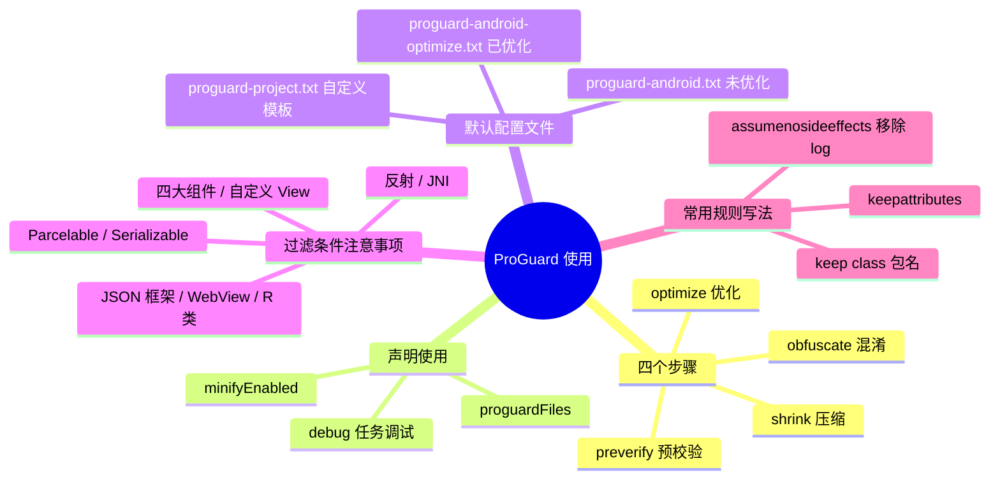

# ProGuard 使用



---

## 一、ProGuard 是什么

ProGuard 官网介绍：

> ProGuard is a Java class file shrinker, optimizer, obfuscator, and preverifier. The shrinking step detects and removes unused classes, fields, methods, and attributes. The optimization step analyzes and optimizes the bytecode of the methods. The obfuscation step renames the remaining classes, fields, and methods using short meaningless names. These first steps make the code base smaller, more efficient, and harder to reverse-engineer. The final preverification step adds preverification information to the classes, which is required for Java Micro Edition or which improves the start-up time for Java 6.
>
> For instance, ProGuard can also be used to just list dead code in an application, or to preverify class files for efficient use in Java 6.

译文：

> ProGuard 是一个 Java 类文件缩小器、优化器、混淆器和预验证器。收缩步骤检测和删除未使用的类、字段、方法和属性；优化步骤分析和优化方法的字节码；混淆步骤使用短无意义的名称重命名剩余的类、字段和方法。这些步骤使代码库更小、更高效，并且更难以进行逆向工程。最终的预验证步骤向 Java Micro Edition 所需的类添加预验证信息，或者提高 Java 6 的启动时间。
>
> 每个步骤都是可选的。例如，ProGuard 也可以用于在应用程序中列出死代码，或者预验证类文件以便在 Java 6 中有效使用。

[ProGuard 语法](https://stuff.mit.edu/afs/sipb/project/android/sdk/android-sdk-linux/tools/proguard/docs/index.html#manual/usage.html)请参照官网介绍。

---

## 二、在 AS 中声明使用混淆文件

在编译的任务里声明以下语句：

```gradle
//是否使用混淆，旧版gradle的声明语法有所不同
minifyEnabled true
//声明混淆文件的路径，前面的是默认文件路径，后面的是添加的自定义文件路径。文件一般是放在项目根目录，也可以写绝对路径
proguardFiles getDefaultProguardFile('proguard-android.txt'), 'proguard-rules.pro'
```

**Tips**：这个声明默认是在 release 任务里，平时开发为了测试混淆效果同时也输出 log，可以在 debug 任务中也添加，通过 `minifyEnabled` 开关控制。

---

## 三、谷歌默认的配置文件

文件在 `\sdk\tools\proguard` 目录下：

| 文件 | 说明 |
| --- | --- |
| `proguard-android.txt` | 默认的 ProGuard 配置文件（未优化） |
| `proguard-android-optimize.txt` | 默认的 ProGuard 配置文件（已优化） |
| `proguard-project.txt` | 默认的用户定制 ProGuard 配置文件，是用户自定义的模板，自己添加混淆条件时可在此基础上添加 |

优化的区别在于是否采用算法对压缩进行优化，但是添加优化会带来风险，因为并非所有由 ProGuard 执行的优化都适用于所有版本的 Dalvik。

### 1. 未优化的配置文件（proguard-android.txt）及注释

```proguard
# This is a configuration file for ProGuard.
# http://proguard.sourceforge.net/index.html#manual/usage.html

-dontusemixedcaseclassnames //混淆后的类名为小写
-dontskipnonpubliclibraryclasses //混淆第三方库，加上此句后，不混淆类库需在后面配置
-verbose //混淆时是否记录日志

# Optimization is turned off by default. Dex does not like code run
# through the ProGuard optimize and preverify steps (and performs some
# of these optimizations on its own).
-dontoptimize //不优化输入的类文件
-dontpreverify //不预校验，默认选项
# Note that if you want to enable optimization, you cannot just
# include optimization flags in your own project configuration file;
# instead you will need to point to the
# "proguard-android-optimize.txt" file instead of this one from your
# project.properties file.

-keepattributes *Annotation* //使用注解需要添加
-keep public class com.google.vending.licensing.ILicensingService
-keep public class com.android.vending.licensing.ILicensingService

# For native methods, see http://proguard.sourceforge.net/manual/examples.html#native
-keepclasseswithmembernames class * {//JNI方法不混淆
    native <methods>;
}

# keep setters in Views so that animations can still work.
# see http://proguard.sourceforge.net/manual/examples.html#beans
-keepclassmembers public class * extends android.view.View {//所有View的子类及其子类的get、set方法都不进行混淆
   void set*(***);
   *** get*();
}

# We want to keep methods in Activity that could be used in the XML attribute onClick
-keepclassmembers class * extends android.app.Activity {//不混淆Activity中参数类型为View的所有方法
   public void *(android.view.View);
}

# For enumeration classes, see http://proguard.sourceforge.net/manual/examples.html#enumerations
-keepclassmembers enum * {//不混淆Enum类型的指定方法
    public static **[] values();
    public static ** valueOf(java.lang.String);
}

-keepclassmembers class * implements android.os.Parcelable {//不混淆Parcelable和它的子类，还有Creator成员变量
  public static final android.os.Parcelable$Creator CREATOR;
}

-keepclassmembers class **.R$* {//R类里及其所有内部static类中的所有static变量字段不混淆
    public static <fields>;
}

# The support library contains references to newer platform versions.
# Don't warn about those in case this app is linking against an older
# platform version.  We know about them, and they are safe.
-dontwarn android.support.**//不提示兼容库的错误警告

# Understand the @Keep support annotation.
-keep class android.support.annotation.Keep

-keep @android.support.annotation.Keep class * {*;}

-keepclasseswithmembers class * {
    @android.support.annotation.Keep <methods>;
}

-keepclasseswithmembers class * {
    @android.support.annotation.Keep <fields>;
}

-keepclasseswithmembers class * {
    @android.support.annotation.Keep <init>(...);
}
```

### 2. 优化配置多出的声明（proguard-android-optimize.txt）

优化的配置文件会比未优化的多以下声明（优化与否的区别官方也在以下注释中有提到），并删除 `-dontoptimize` 不优化输入文件选项：

```proguard
# Optimizations: If you don't want to optimize, use the
# proguard-android.txt configuration file instead of this one, which
# turns off the optimization flags.  Adding optimization introduces
# certain risks, since for example not all optimizations performed by
# ProGuard works on all versions of Dalvik.  The following flags turn
# off various optimizations known to have issues, but the list may not
# be complete or up to date. (The "arithmetic" optimization can be
# used if you are only targeting Android 2.0 or later.)  Make sure you
# test thoroughly if you go this route.
-optimizations !code/simplification/arithmetic,!code/simplification/cast,!field/*,!class/merging/* //代码混淆采用的算法，一般不改变，用谷歌推荐算即可
-optimizationpasses 5 //指定代码的压缩级别 默认为5，范围1-7,
-allowaccessmodification //优化时允许访问并修改有修饰符的类和类的成员
-dontpreverify //混淆时是否做预校验
```

---

## 四、添加混淆过滤条件需要注意的地方

1. **反射用到的类不混淆**，如一些注解框架需要保证类名方法不变，不然就反射不了；
2. **JNI 方法不混淆**；
3. **AndroidMainfest 中的类不混淆**，四大组件和 Application 的子类及 Framework 层下所有的类默认不会进行混淆（自定义的 View 类要记得添加过滤混淆）；
4. **Parcelable 的子类和 Creator 静态成员变量不混淆**，否则会产生 `android.os.BadParcelableException` 异常；
5. **继承了 Serializable 接口的类**；
6. 使用 **GSON、fastjson** 等框架时，所写的 JSON 对象类不混淆，否则无法将 JSON 解析成对应的对象；
7. 使用第三方开源库或者引用其他第三方的 SDK 包时，需要在混淆文件中加入对应的混淆规则（建议第三方包全部不混淆）；
8. 有用到 **WebView 的 JS 调用**也需要保证写的接口方法不混淆；
9. **R 类**里及其所有内部 static 类中的所有 static 变量字段不混淆。

---

## 五、常用过滤规则示例

### 1. 代码中使用了反射功能

```proguard
-keepattributes Signature //过滤泛型

-keepattributes EnclosingMethod
```

### 2. 使用 GSON、fastjson 等 JSON 解析框架所生成的对象类

例如把所有对象类都统一在 `com.xunlei.xllive.bean` 包下：

```proguard
-keep class com.xunlei.xllive.bean.**{*;}  //不混淆所有的com.xunlei.xllive.bean包下的类和这些类的所有成员变量
```

### 3. 继承了 Serializable 接口的类

```proguard
//不混淆Serializable接口的子类中指定的某些成员变量和方法

-keepclassmembers class * implements java.io.Serializable {
    static final long serialVersionUID;
    private static final java.io.ObjectStreamField[] serialPersistentFields;
    private void writeObject(java.io.ObjectOutputStream);
    private void readObject(java.io.ObjectInputStream);
    java.lang.Object writeReplace();
    java.lang.Object readResolve();
}
```

### 4. 有用到 WebView 的 JS 调用接口

需加入如下规则（可以对整个类过滤，也可以细分只过滤提供的接口）：

```proguard
-keepattributes *JavascriptInterface* //有声明JavascriptInterface注释的
-keep class com.xxx.xxx.className { *; }//保持Web接口不被混淆 此处xxx.xxx是自己接口的包名,className为Activity的类名
```

### 5. R 类里及其所有内部 static 类中的所有 static 变量字段不混淆

```proguard
-keep public class com.xunlei.xllive.R$*{
    public static final int *;
}
```

### 6. 移除一些 log 代码

移除 Log 类打印各个等级日志的代码，打正式包的时候可以做为禁 log 使用，这里可以作为禁止 log 打印的功能使用。另外的一种实现方案是通过 `BuildConfig.DEBUG` 的变量来控制（混淆添加这个可以防止 `BuildConfig.DEBUG` 控制没关）。

```proguard
-assumenosideeffects class android.util.Log {
    public static *** v(...);
    public static *** i(...);
    public static *** d(...);
    public static *** w(...);
    public static *** e(...);
}
```

---

## 六、30 秒口述版

ProGuard 是 Java 字节码的压缩、优化、混淆、预校验四件套，Android 上由 R8 接棒。使用上就两步：`minifyEnabled true` 打开开关，`proguardFiles` 指定规则文件；默认规则来自 SDK 自带的 proguard-android（-optimize）文件，再叠加自己的 proguard-rules.pro。写规则的核心是"动了名字就会坏的地方不能混淆"——反射、JNI、四大组件、Parcelable/Serializable、JSON 实体类、WebView 桥接口和 R 类，都用 `-keep` / `-keepclassmembers` 保住。
