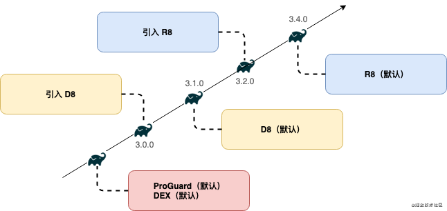
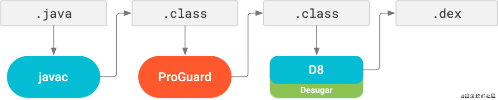
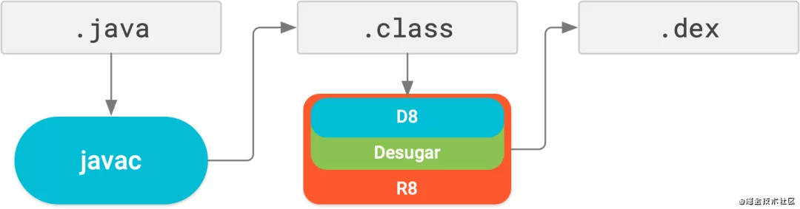
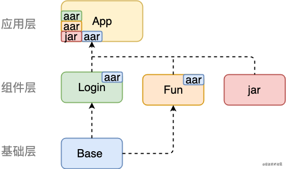

# 代码混淆
ProGuard：一个通用的 Java 字节码优化工具，由比利时团队 GuardSquare 开发

R8：ProGuard 的继承者，专为 Android 设计，编译性能和编译产物更优秀

在gradle中使用迭代

## 四大功能
* 压缩（也称为摇树优化，tree shaking）：从 应用及依赖项 中移除 未使用 的类、方法和字段，有助于规避 64 方法数的瓶颈。
* 优化：通过代码 分析 移除更多未使用的代码，甚至重写代码。
* 混淆：使用无意义的简短名称 重命名 类/方法/字段，增加逆向难度。
* 预校验：对于面向 Java 6 或者 Java 7 JVM 的 class 文件，编译时可以把 预校验信息 添加到类文件中（StackMap 和 StackMapTable属性），从而加快类加载效率。预校验对于 Java 7 JVM 来说是必须的，但是对于 Android 平台 无效。

## 性能对比
使用 ProGuard 时，部分编译流程如下图所示：

ProGuard 对 .class 文件执行代码压缩、优化与混淆。

D8 编译器执行脱糖，并将 .class 文件转换为 .dex文件。

使用 R8 时，部分编译流程如下图所示：

R8 将脱糖（Desugar）、压缩、优化、混淆和 dex（D8 编译器）整合到一个步骤。

R8 对 .class 文件执行代码压缩、优化与混淆。

D8 编译器执行脱糖，并将.class 文件转换为 .dex文件。

1、ProGuard 可用于 Java 项目，而 R8 专为 Android 项目设计。

2、R8 将脱糖（Desugar）、压缩、优化、混淆和 dex（D8 编译器）整合到一个步骤中，显着提高了编译性能。

## 使用

	minifyEnabled true
    shrinkResources true
    proguardFiles getDefaultProguardFile('proguard-android-optimize.txt'), 'proguard-rules.pro'

proguard-rules.pro配置

关闭压缩

	-dontshrink

关闭优化（R8 无效）

	-dontoptimize

关闭混淆（建议在开发版本关闭混淆）

	-dontobfuscate

关闭预校验（对 Android 平台无效，建议关闭）

	-dontpreverify

## ProGuard 规则文件
* Android Gradle 插件,Android Gradle 插件会生成 proguard-android-optimize.txt、 proguard-android.txt，位置在<module-dir>/build/intermediates/proguard-files/
* Android Asset Package Tool 2 (AAPT2)AAPT2 会根据对 Manifest 中的类、布局及其他应用资源的引用来生成aapt_rules.txt，位置在<module-dir>/build/intermediates/proguard-rules/debug/aapt_rules.txt。
* Module

## 组件化混淆
编译时会依次对各层 Library Module进行编译，最底层的 Base Module 会最先被编译为 aar 文件，然后上一层编译时会将依赖 Module 输出的 aar 文件/ jar 文件解压到模块的 build 中相应的文件夹中

App Module 这一层汇总了全部的 aar 文件后，才真正开始编译操作

后编译的 Module 会覆盖之前编译的 Module 中的同名资源

混淆开启由 App Module 决定， 与Lib Module 无关,混淆规则以 App Module 中的混淆规则文件为准.

### 两种混淆方案
* 在 App Module 中设置混淆规则，这种方案将混淆规则都放置到 App Module 的proguard-rules.pro中，最简单也最直观，缺点是移除 Lib Module 时，需要从 App Module 中移除相应的混淆规则。尽管多余的混淆规则并不会造成编译错误或者运行错误，但还是会影响编译效率。
很多的第三方 SDK，就是采用了这种组件化混淆方案。在 App Module 中添加依赖的同时，也需要在proguard-rules.pro中添加专属的混淆规则，这样才能保证release版本正常运行。

* 在 App Module 中设置公共混淆规则，在 Lib Module 中设置专属混淆规则，这种方案将专属的混淆规则设置到 Lib Module 的proguard-rules.pro，但是根据前面的测试，在 Lib Module 中设置的混淆规则是不生效的。为了让规则生效，还需要在 Lib Module 的build.gradle中添加以下配置：
	
	 	consumerProguardFiles 'consumer-rules.pro'

	使用consumerProguardFiles的方式有以下几个特点：
	* consumerProguardFiles只对 Lib Module 生效，对 App Module 无效。
	* consumerProguardFiles会将混淆规则输出为proguard.txt文件，并打包进 aar 文件。
	* App Module 会使用 aar 文件中的proguard.txt汇总为最终的混淆规则，这一点可以通过前面提到的-printconfiguration证明。