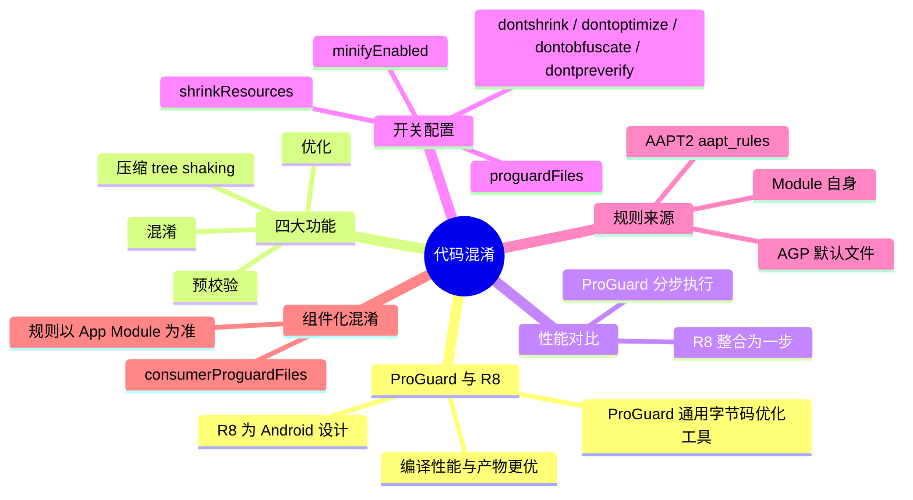
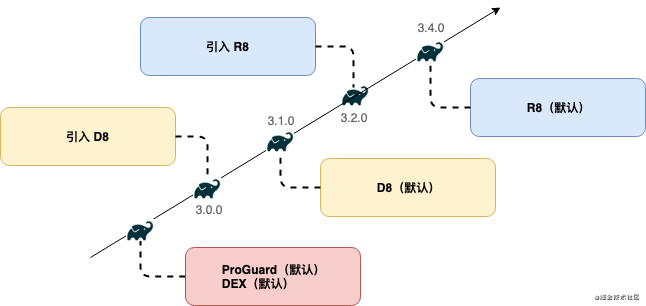
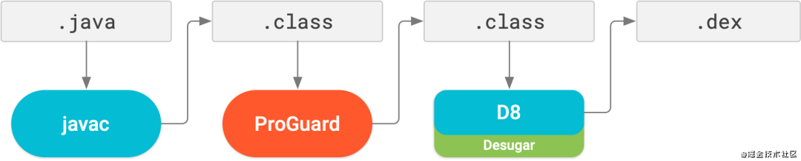
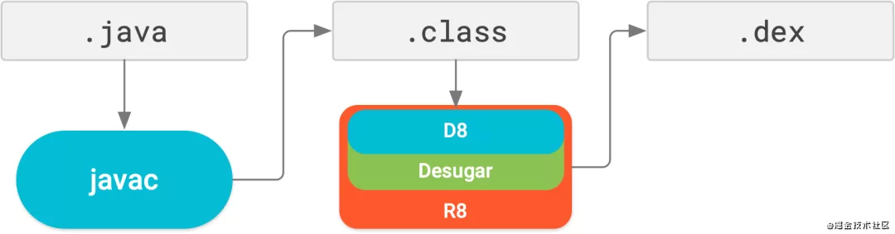
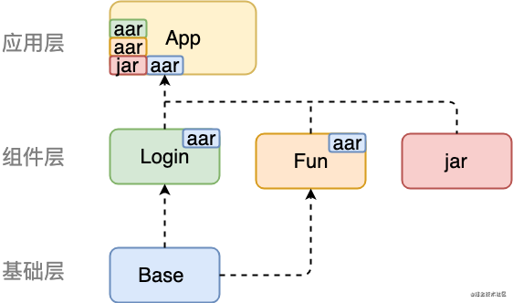

# 代码混淆


```mermaid
mindmap
  root((代码混淆))
    ProGuard 与 R8
      ProGuard 通用字节码优化工具
      R8 为 Android 设计
      编译性能与产物更优
    四大功能
      压缩 tree shaking
      优化
      混淆
      预校验
    性能对比
      ProGuard 分步执行
      R8 整合为一步
    开关配置
      minifyEnabled
      shrinkResources
      proguardFiles
      dontshrink / dontoptimize / dontobfuscate / dontpreverify
    规则来源
      AGP 默认文件
      AAPT2 aapt_rules
      Module 自身
    组件化混淆
      规则以 App Module 为准
      consumerProguardFiles
```

---

## 一、ProGuard 与 R8

- **ProGuard**：一个通用的 Java 字节码优化工具，由比利时团队 GuardSquare 开发。
- **R8**：ProGuard 的继承者，专为 Android 设计，编译性能和编译产物更优秀。

在 Gradle 中使用：



---

## 二、四大功能

| 功能 | 说明 |
| --- | --- |
| **压缩**（摇树优化，tree shaking） | 从应用及依赖项中移除**未使用**的类、方法和字段，有助于规避 64K 方法数的瓶颈 |
| **优化** | 通过代码分析移除更多未使用的代码，甚至重写代码 |
| **混淆** | 使用无意义的简短名称**重命名**类/方法/字段，增加逆向难度 |
| **预校验** | 对于面向 Java 6/7 JVM 的 class 文件，编译时把预校验信息（StackMap 和 StackMapTable 属性）添加到类文件中，从而加快类加载效率。预校验对 Java 7 JVM 是必须的，但**对 Android 平台无效** |

---

## 三、性能对比：ProGuard vs R8

**使用 ProGuard 时**，部分编译流程如下：

1. ProGuard 对 `.class` 文件执行代码压缩、优化与混淆；
2. D8 编译器执行脱糖，并将 `.class` 文件转换为 `.dex` 文件。



**使用 R8 时**，部分编译流程如下：

1. R8 将脱糖（Desugar）、压缩、优化、混淆和 dex（D8 编译器）整合到一个步骤；
2. R8 对 `.class` 文件执行代码压缩、优化与混淆；
3. D8 编译器执行脱糖，并将 `.class` 文件转换为 `.dex` 文件。



两者的区别：

1. ProGuard 可用于 Java 项目，而 R8 专为 Android 项目设计；
2. R8 将脱糖（Desugar）、压缩、优化、混淆和 dex（D8 编译器）整合到一个步骤中，显著提高了编译性能。

---

## 四、开启混淆

Gradle 中的基本配置：

```gradle
minifyEnabled true
shrinkResources true
proguardFiles getDefaultProguardFile('proguard-android-optimize.txt'), 'proguard-rules.pro'
```

`proguard-rules.pro` 中常用的开关配置：

| 配置 | 作用 |
| --- | --- |
| `-dontshrink` | 关闭压缩 |
| `-dontoptimize` | 关闭优化（对 R8 无效） |
| `-dontobfuscate` | 关闭混淆（建议开发版本关闭混淆） |
| `-dontpreverify` | 关闭预校验（对 Android 平台无效，建议关闭） |

---

## 五、ProGuard 规则文件从哪里来

1. **Android Gradle 插件**：会生成 `proguard-android-optimize.txt`、`proguard-android.txt`，位置在 `<module-dir>/build/intermediates/proguard-files/`；
2. **Android Asset Package Tool 2（AAPT2）**：会根据 Manifest 中的类、布局及其他应用资源的引用生成 `aapt_rules.txt`，位置在 `<module-dir>/build/intermediates/proguard-rules/debug/aapt_rules.txt`；
3. **Module**：模块自身的混淆规则。

---

## 六、组件化混淆

### 1. 编译顺序与规则汇总

编译时会依次对各层 Library Module 进行编译：

1. 最底层的 Base Module 会最先被编译为 aar 文件，然后上一层编译时会将依赖 Module 输出的 aar 文件/jar 文件解压到模块的 build 中相应的文件夹中；
2. App Module 这一层汇总了全部的 aar 文件后，才真正开始编译操作；
3. 后编译的 Module 会覆盖之前编译的 Module 中的同名资源。



**混淆开启由 App Module 决定，与 Lib Module 无关；混淆规则以 App Module 中的混淆规则文件为准。**

### 2. 两种混淆方案

| 方案 | 做法 | 优缺点 |
| --- | --- | --- |
| 规则集中在 App Module | 把混淆规则都放到 App Module 的 `proguard-rules.pro` 中 | 最简单直观；缺点是移除 Lib Module 时要从 App Module 中移除相应规则，多余的规则虽不会造成编译或运行错误，但会影响编译效率 |
| 规则分散到各 Lib Module | App Module 放公共规则，Lib Module 用 `consumerProguardFiles` 放专属规则 | 规则随模块走，移除模块时无需清理 |

很多第三方 SDK 采用第一种方案：在 App Module 中添加依赖的同时，也需要在 `proguard-rules.pro` 中添加专属混淆规则，这样才能保证 release 版本正常运行。

在 Lib Module 中直接写混淆规则是不生效的，需要在 Lib Module 的 `build.gradle` 中添加：

```gradle
consumerProguardFiles 'consumer-rules.pro'
```

`consumerProguardFiles` 的特点：

- 只对 Lib Module 生效，对 App Module 无效；
- 会将混淆规则输出为 `proguard.txt` 文件，并打包进 aar 文件；
- App Module 会使用 aar 文件中的 `proguard.txt` 汇总为最终的混淆规则（可通过 `-printconfiguration` 证明）。

---

## 七、30 秒口述版

混淆工具从 ProGuard 演进到 R8：R8 专为 Android 设计，把脱糖、压缩、优化、混淆和 dex 整合成一步，性能更好。混淆有压缩、优化、混淆、预校验四大功能，其中预校验对 Android 无效。组件化项目中，混淆开关和最终规则都由 App Module 决定；Lib Module 想让自己的规则生效，要用 `consumerProguardFiles` 把规则打进 aar。
