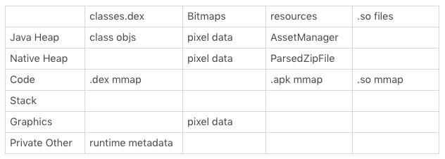
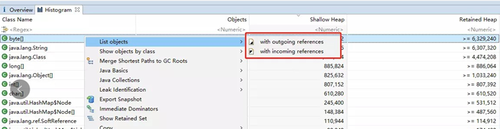
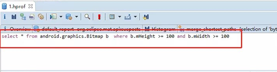
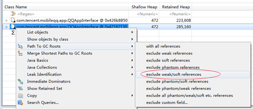
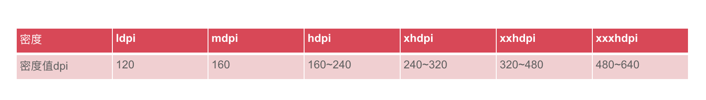

# 内存优化

内存优化不是内存用得越少越好，需要分设备，device-year

## 内存分析

- 内存类型：一般 VSS >= RSS >= PSS >= USS

    - VSS （Virtual Set Size）虚拟耗用内存 （包含共享库所占内存）
    - RSS （Resident Set Size）实际使用物理内存 （包含共享库所占内存）
    - PSS （Proportional Set Size）实际使用物理内存（比例分配共享库所占内存）
    - USS （Unique Set Size）进程独自占用物理内存（不包含共享库内存）
    - 共享内存是，Android基础公共库、组件、还有一些native library使用的内存，被所用进程共享。进程都是从Zygote进程fork出来的，新进程产生的时候就带有了 Shared 内存从而提高进程创建速度。

- adb shell cat map

- adb shell dumsys meminfo

- Allocation Tracker 和 MAT 。

重点关注大内存，小内存个数，bitmap

    - https://developer.android.com/studio/command-line/dumpsys#meminfo
    - Heap Dump，MAT中查看
         - 普通的hprof文件内，包含下面的信息：
              - 所有的对象
              - 所有的类
              - GCRoots
              - 线程的栈信息、局部变量（在安卓中，这部分被阉割）

         - Histogram

              - shadowHeap：对象自身占用的内存大小，不包括它引用的对象。
              - RetainedSize：当前对象大小+当前对象可直接或间接引用到的对象的大小总和
              - with outgoing references - 表示的是 当前对象，引用了内部哪些成员对象
              - with incoming references - 表示的是 当前对象，被外部哪些对象应用了
              - merge shortest paths to gc roots -从GC roots到一个或一组对象的公共路径

         - OQL查询,select * from android.grahics.Bitmap b where b.mHeight>=100 and b.mWidth>=100

         - Dominator Tree（支配树）:查找持有与被持有，Path To GC Roots->exclude waek/soft references

         - 左边Inspect可以查看Attributes可以查看bitmap的宽高，buffer，buffer右键copy->save to file后可以用gimp软件打开查图片

## 内存问题主要模块

### bitmap
    - 演化
         - 在 Android 3.0 之前，Bitmap 对象放在 Java 堆，而像素数据是放在 Native 内存中。如果不手动调用 recycle，Bitmap Native 内存的回收完全依赖 finalize 函数回调，熟悉 Java 的同学应该知道，这个时机不太可控。
         - Android 3.0～Android 7.0 将 Bitmap 对象和像素数据统一放到 Java 堆中，这样就算我们不调用 recycle，Bitmap 内存也会随着对象一起被回收。不过 Bitmap 是内存消耗的大户，把它的内存放到 Java 堆中似乎不是那么美妙。
		 - Android 8.0 正是使用这个辅助回收 Native 内存的机制，NativeAllocationRegistry来实现像素数据放到 Native 内存中。Android 8.0 还新增了硬件位图 Hardware Bitmap，它可以减少图片内存并提升绘制效率。
              - NativeAllocationRegistry底层实际上使用了sun.misc.Cleaner,可以为对象注册一个清理的Runnable。当对象内存被回收的时候jvm就会调用它。
              - Cleaner的原理也很暴力,首先它是一个虚引用,registerNativeAllocation实际上创建了一个Bitmap的虚引用,虚引用的话我们都知道需要配合一个ReferenceQueue使用，当对象的引用被回收的时候，jvm就会将这个虚引用丢到ReferenceQueue里面。而ReferenceQueue在插入的时候居然通过instanceof判断了下是不是Cleaner
              - 就是说Bitmap对象被回收,就会触发Cleaner这个虚引用被丢入ReferenceQueue，而ReferenceQueue里面会判断丢进来的虚引用是不是Cleaner，如果是就调用Cleaner.clean()方法。而clean方法内部就会再去执行我们注册的清理的Runnable。
         - Fresco 图片库在 Dalvik 会把图片放到 Native 内存中
         - native hook

	         - 原分配java内存的地方，分配空对象
	         - Native层面完成实际的内存分配
	         - 及时回收假对象和Native内存

    - 计算大小

         - ppi：每英寸像素点(Pixels Per Inch)，以Nexus6为例，分辨率1440*2560，5.96英寸，ppi是什么？ppi的计算公式可表示为：√(X²+Y²）/对角线英寸=492
         - dpi,但dpi只有120(low)、160(medium)、240(high)、260、280、300、320(xhigh)、340、360、400、420、480（xxhpdi）、560、640（xxxhpi）这几种.所以Nexus6的dpi为560.

         - 以Nexus6为例，一张180*180的图片，放在设置了wrap_content属性的ImageView中,drawable-hdpi, drawable-xhdpi这个资源目录中，在屏幕上分别显示多大(像素)的图片,h:int (180 * (560 / 240) +0.5f ) = 420px;xh:int (180 * (560 / 320) +0.5f ) = 315px
         - Android官方支持的RGB格式ALPHA_8，RGB_565，ARGB_4444，ARGB_8888，Android decode资源图片时默认会选择ARGB_8888，如果将180*180放入hdpi目录中，那实际大小应该为int (180 * (560 / 240) +0.5f ) = 420px，像素内存大小为 420 * 420 * 4 = 705600byte = 689kb

    - 图片库Glide

         - Glide.with(viewHolder.getImageView().getContext()).clear(viewHolder.getImageView());
         - Gilde.this(mContext).load(url).skipMemoryCache(true)，加载大图不被缓存
         - Glide.get(this).clearMemory()
         - 缩略图原理使用LayerDrawable，LayerDrawable.setImageDrawable(null);
         - BitmapReginDecoder加载大图

    - Bitmap.recycle(),BitmapFactory统一收拢，根据分辨率缩放，超宽，重复图检测

### Java内存泄漏

    - 单例（主要原因还是因为一般情况下单例都是全局的，有时候会引用一些实际生命周期比较短的变量，导致其无法释放）
    - 静态变量（同样也是因为生命周期比较长）
    - Handler内存泄露
    - 匿名内部类（匿名内部类会引用外部类，导致无法释放，比如各种回调）
    - 资源使用完未关闭（BraodcastReceiver，ContentObserver，File，Cursor，Stream，Bitmap）
    - 线程，运行的线程是GCRoot,线程持有的对象无法释放。提供强制停止的接口。指定线程名称，便于问题定位。自检机制：运行中判断有效性，无效即停止
    - Timer，销毁时调用了cancel，根据Timer的实现里，cancel并不会把Task从队列中删除，只是做了个标记销毁时调用purge
    - webview

### OOM优化
#### OOM分类

* java堆内存溢出，为对象分配内存时达到进程的内存上限。由Runtime.getRuntime.MaxMemory()可以得到Android中每个进程被系统分配的内存上限，当进程占用内存达到这个上限时就会发生OOM
无足够连续内存空间，failed due to fragmentation (required continguous free "<< required_bytes << " bytes for a new buffer where largest contiguous free " <<  largest_continuous_free_pages << " bytes)"; 其详细代码在art/runtime/gc/allocator/rosalloc.cc中
* FD数量超出限制
* 线程数量超出限制
    * 创建JNI失败
		* 通过Andorid的匿名共享内存（Anonymous Shared Memory）分配 4KB（一个page）内核态内存。E/art: ashmem_create_region failed for 'indirect ref table': Too many open files java.lang.OutOfMemoryError: Could not allocate JNI Env
        * 再通过Linux的mmap调用映射到用户态虚拟内存地址空间。E/art: Failed anonymous mmap(0x0, 8192, 0x3, 0x2, 116, 0): Operation not permitted. See process maps in the log.

    * 创建线程失败
        * 调用mmap分配栈内存。这里mmap flag中指定了MAP_ANONYMOUS，即匿名内存映射。这是在Linux中分配大块内存的常用方式。其分配的是虚拟内存，对应页的物理内存并不会立即分配，而是在用到的时候触发内核的缺页中断，然后中断处理函数再分配物理内存。W/libc: pthread_create failed: couldn't allocate 1073152-bytes mapped space: Out of memory W/tch.crowdsourc: Throwing OutOfMemoryError with VmSize  4191668 kB "pthread_create (1040KB stack) failed: Try again"
        * 调用clone方法进行线程创建。W/libc: pthread_create failed: clone failed: Out of memory W/art: Throwing OutOfMemoryError "pthread_create (1040KB stack) failed: Out of memory"

* 虚拟内存不足

#### 方法
    - 1，图片专项 ， 图片合理性，缓存统一控制，图片私藏检测，HAHA库批量分析
    - 2，缓存专项，LruCache,HashMap, ConcurrentHashMap等,缓存管理。我们需要有一套统一的缓存管理机制，可以适当地使用内存；当“系统有难”时，也要义不容辞地归还。我们可以使用 OnTrimMemory 回调，根据不同的状态决定释放多少内存。对于大项目来说，可能存在几十上百个模块，统一缓存管理可以更好地监控每个模块的缓存大小。
    - 4，触顶清理体系，分级清理策略：触顶清理图片缓存，ZipFile清理，业务缓存，系统预加载资源清理。
    - 5，动态扩堆， 针对不同机型，低端机，开启largeMemory（native层修改内存地址）

         - ActivityManager.getMemoryClass()虚拟机java堆大小的上限，分配对象时突破这个大小就会OOM
         - ActivityManager.getLargeMemoryClass()manifest中设置largeheap=true时虚拟机java堆的上限
         - Runtime.getRuntime().maxMemory()当前虚拟机实例的内存使用上限，为上述两者之一
         - Runtime.getRuntime().totalMemory()当前已经申请的内存，包括已经使用的和还没有使用的
         - Runtime.getRuntime().freeMemory()上一条中已经申请但是尚未使用的那部分。那么已经申请并且正在使用的部分  used=totalMemory()- freeMemory()

    - 6，自杀逻辑
    - 7，线程栈裁剪，从1M裁剪到512b
    - 8.Chunk unmap 主动unmap减少虚拟内存使用

### 进程模型。
一个空的进程也会占用 10MB 的内存，而有些应用启动就有十几个进程，甚至有些应用已经从双进程保活升级到四进程保活，所以减少应用启动的进程数、减少常驻进程、有节操的保活，对低端机内存优化非常重要。

### 安装包大小。
安装包中的代码、资源、图片以及 so 库的体积，跟它们占用的内存有很大的关系。一个 80MB 的应用很难在 512MB 内存的手机上流畅运行。这种情况我们需要考虑针对低端机用户推出 4MB 的轻量版本，例如 Facebook Lite、今日头条极速版都是这个思路。

# 内存监控
建立监控体系，指标：OOM率，内存触顶率，统计：OOM时图片缓存，OOM场景监控统计，OOM线程、FD统计上报,Native 内存泄漏监控

         - 查看内存映射,/proc/[pid]/maps
         - 查看Native内存，/proc/[pid]/smaps
         - 查看FD,Os.readkLink(),/proc/[pid]/fd,/proc/[pid]/limits,解释Max open file
         - 查看线程,/proc/[pid]/status
	         - watch/proc/pid/fd来监控app打开文件的情况,
	         - watch/proc/pid/task来监控线程使用情况．

## gc监控

    - 运行的GC次数Debug.getRuntimeStat("art.gc.gc-count");
    - GC使用的总耗时，单位是毫秒Debug.getRuntimeStat("art.gc.gc-time");
    - 阻塞式GC的次数Debug.getRuntimeStat("art.gc.blocking-gc-count");
    - 阻塞式GC的总耗时Debug.getRuntimeStat("art.gc.blocking-gc-time");

## Java内存泄漏
    - adb shell dumpsys meminfo 可看Objects中Activities,Views
    - LeakCanary
         - Activity的&onDestroy方法中，手动调用 GC，然后利用ReferenceQueue+WeakReference，来判断是否有释放不掉的引用
         - 然后结合dump memory的hpof文件, 用HaHa分析出泄漏地方。

## native内存监控

    - debug环境 Malloc钩子
    - 使用了 PLT Hook 拦截库的内存分配函数，malloc,free。高性能unwind(回溯)
    - 针对可重编的 so 情况，通过 GCC 的“-finstrument-functions”参数给所有函数插桩，桩中模拟调用栈入栈出栈操作；通过 ld 的“–wrap”参数拦截内存分配和释放函数，重定向到我们自己的实现后记录分配的内存地址、大小、来源 so 以及插桩记录的调用栈此刻的内容，定期扫描分配与释放是否配对，对于不配对的分配输出我们记录的信息。

- 腾讯的Matrix

- 快手的koom

    - 主进程发现内存到达阈值的时候，用leakcanary的方案，通过shark fork进程内存，之后生成hrop。由于hrop文件相对较大，所以我们需要对于我们所要分析的内容进行筛选，可以通过xhook，之后对hrop的写入操作进行hook，当发现写入内容的类型符合我们的需要的情况下才进行写入。

    - 而当我们要做线上日志回捞的情况，需要对hprof 进行压缩，具体算法可以参考koom/raphel，有提供对应的压缩算法。

- OOM监控，美团的Probe

## gc降活
让GC不容易触发=增大target size=增大预留size

## Jemalloc动态调优
