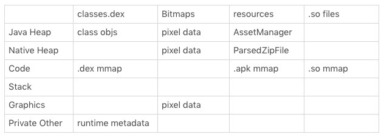
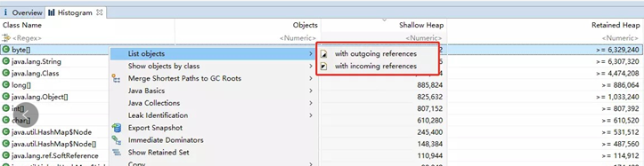
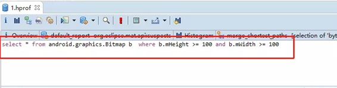
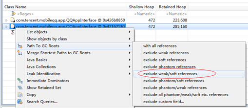
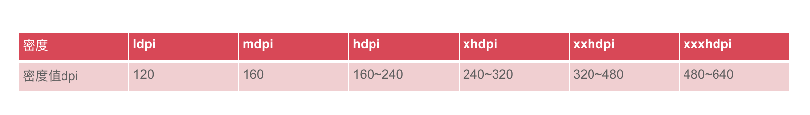

# 内存优化

内存优化不是内存用得越少越好，需要分设备，device-year

## 内存分析

- 内存类型：一般 VSS >= RSS >= PSS >= USS

    - VSS （Virtual Set Size）虚拟耗用内存 （包含共享库所占内存）
    - RSS （Resident Set Size）实际使用物理内存 （包含共享库所占内存）
    - PSS （Proportional Set Size）实际使用物理内存（比例分配共享库所占内存）
    - USS （Unique Set Size）进程独自占用物理内存（不包含共享库内存）
    - 共享内存是，Android基础公共库、组件、还有一些native library使用的内存，被所用进程共享。进程都是从Zygote进程fork出来的，新进程产生的时候就带有了 Shared 内存从而提高进程创建速度。

- adb shell cat map

- adb shell dumsys meminfo

- Allocation Tracker 和 MAT 。

重点关注大内存，小内存个数，bitmap

    - https://developer.android.com/studio/command-line/dumpsys#meminfo
    - Heap Dump，MAT中查看
         - 普通的hprof文件内，包含下面的信息：
              - 所有的对象
              - 所有的类
              - GCRoots
              - 线程的栈信息、局部变量（在安卓中，这部分被阉割）

         - Histogram

              - shadowHeap：对象自身占用的内存大小，不包括它引用的对象。
              - RetainedSize：当前对象大小+当前对象可直接或间接引用到的对象的大小总和
              - with outgoing references - 表示的是 当前对象，引用了内部哪些成员对象
              - with incoming references - 表示的是 当前对象，被外部哪些对象应用了
              - merge shortest paths to gc roots -从GC roots到一个或一组对象的公共路径

         - OQL查询,select * from android.grahics.Bitmap b where b.mHeight>=100 and b.mWidth>=100

         - Dominator Tree（支配树）:查找持有与被持有，Path To GC Roots->exclude waek/soft references

         - 左边Inspect可以查看Attributes可以查看bitmap的宽高，buffer，buffer右键copy->save to file后可以用gimp软件打开查图片

## GC机制

- 基础概念
    - GC（Garbage Collection）：虚拟机自动回收**无有效引用指向、不再使用的堆内存对象**，释放内存给系统复用；Android 使用 ART 虚拟机 GC，废弃了早期 Dalvik 标记清除
    - 栈内存：局部变量、方法调用帧，自动入栈出栈，无需GC
    - 堆内存：所有new出来的对象、集合、Bitmap、图片资源，GC管理核心区域

- 主流GC算法
    - 标记清除（Mark-Sweep）：遍历标记所有存活对象→清除未标记对象；缺点：产生大量**内存碎片**，大对象分配容易OOM
    - 标记整理（Mark-Compact）：标记存活对象后向内存一端平移整理，消除碎片；缺点：移动对象需要更新所有引用地址，开销大、耗时久
    - 复制算法（Copy）：堆分为From、To两块同等空间，存活对象复制到To区，清空From；新生代大量短命对象使用；缺点：内存空间浪费一半

- ART分代GC（最核心考点）
    - 新生代（Young Generation）：短期临时对象（循环临时对象、方法内临时实例）；分为Eden区、Survivor(S0、S1)；采用复制算法，GC频率高、速度快，叫Minor GC
    - 老年代（Old Generation）：长期存活对象、大对象（Bitmap、大图、长生命周期单例）；标记清除/标记整理，GC耗时更长，Major GC
    - 晋升规则：对象多次熬过新生代GC，自动晋升到老年代

- GC触发时机
    - 堆内存占用达到阈值，系统自动触发
    - 手动调用System.gc()：仅建议虚拟机GC，不保证立即执行
    - App进入后台、内存紧张，系统主动调度GC
    - 创建超大对象，剩余堆空间不足

- GC停顿（STW Stop-The-World）：GC标记阶段会暂停所有用户线程，是卡顿、掉帧根源；频繁GC、长时间STW → UI卡顿、ANR、内存抖动

## 内存抖动

- 本质：短时间内**频繁创建大量临时小对象**，快速分配、快速被GC回收，造成连续高频Minor GC，持续STW卡顿
- 常见场景
    - 循环、onDraw、onTouchEvent 频繁new对象（String、数组、Paint、Bitmap、自定义实体）
    - 动画、滑动列表中不断创建临时对象
    - 字符串频繁拼接+创建大量String临时对象
    - 集合在循环里反复创建、销毁
- 危害
    - 频繁GC产生持续STW，页面滑动卡顿、动画掉帧
    - 加剧内存碎片，诱发OOM
    - 耗电增加
- 解决方案
    - 把循环内对象提升为成员变量，复用实例，避免重复new
    - 使用对象池（ObjectPool）复用对象，减少创建销毁
    - 字符串拼接改用StringBuilder
    - 自定义View的Paint、Rect、Matrix放到构造初始化，不在onDraw新建
    - 避免在MotionEvent.MOVE中创建对象

## 内存问题主要模块

### bitmap
    - 演化
         - 在 Android 3.0 之前，Bitmap 对象放在 Java 堆，而像素数据是放在 Native 内存中。如果不手动调用 recycle，Bitmap Native 内存的回收完全依赖 finalize 函数回调，熟悉 Java 的同学应该知道，这个时机不太可控。
         - Android 3.0～Android 7.0 将 Bitmap 对象和像素数据统一放到 Java 堆中，这样就算我们不调用 recycle，Bitmap 内存也会随着对象一起被回收。不过 Bitmap 是内存消耗的大户，把它的内存放到 Java 堆中似乎不是那么美妙。
		 - Android 8.0 正是使用这个辅助回收 Native 内存的机制，NativeAllocationRegistry来实现像素数据放到 Native 内存中。Android 8.0 还新增了硬件位图 Hardware Bitmap，它可以减少图片内存并提升绘制效率。
              - NativeAllocationRegistry底层实际上使用了sun.misc.Cleaner,可以为对象注册一个清理的Runnable。当对象内存被回收的时候jvm就会调用它。
              - Cleaner的原理也很暴力,首先它是一个虚引用,registerNativeAllocation实际上创建了一个Bitmap的虚引用,虚引用的话我们都知道需要配合一个ReferenceQueue使用，当对象的引用被回收的时候，jvm就会将这个虚引用丢到ReferenceQueue里面。而ReferenceQueue在插入的时候居然通过instanceof判断了下是不是Cleaner
              - 就是说Bitmap对象被回收,就会触发Cleaner这个虚引用被丢入ReferenceQueue，而ReferenceQueue里面会判断丢进来的虚引用是不是Cleaner，如果是就调用Cleaner.clean()方法。而clean方法内部就会再去执行我们注册的清理的Runnable。
         - Fresco 图片库在 Dalvik 会把图片放到 Native 内存中
         - native hook

	         - 原分配java内存的地方，分配空对象
	         - Native层面完成实际的内存分配
	         - 及时回收假对象和Native内存

    - 计算大小

         - ppi：每英寸像素点(Pixels Per Inch)，以Nexus6为例，分辨率1440*2560，5.96英寸，ppi是什么？ppi的计算公式可表示为：√(X²+Y²）/对角线英寸=492
         - dpi,但dpi只有120(low)、160(medium)、240(high)、260、280、300、320(xhigh)、340、360、400、420、480（xxhpdi）、560、640（xxxhpi）这几种.所以Nexus6的dpi为560.

         - 以Nexus6为例，一张180*180的图片，放在设置了wrap_content属性的ImageView中,drawable-hdpi, drawable-xhdpi这个资源目录中，在屏幕上分别显示多大(像素)的图片,h:int (180 * (560 / 240) +0.5f ) = 420px;xh:int (180 * (560 / 320) +0.5f ) = 315px
         - Android官方支持的RGB格式ALPHA_8，RGB_565，ARGB_4444，ARGB_8888，Android decode资源图片时默认会选择ARGB_8888，如果将180*180放入hdpi目录中，那实际大小应该为int (180 * (560 / 240) +0.5f ) = 420px，像素内存大小为 420 * 420 * 4 = 705600byte = 689kb

    - 图片库Glide

         - Glide.with(viewHolder.getImageView().getContext()).clear(viewHolder.getImageView());
         - Gilde.this(mContext).load(url).skipMemoryCache(true)，加载大图不被缓存
         - Glide.get(this).clearMemory()
         - 缩略图原理使用LayerDrawable，LayerDrawable.setImageDrawable(null);
         - BitmapReginDecoder加载大图

    - Bitmap.recycle(),BitmapFactory统一收拢，根据分辨率缩放，超宽，重复图检测

### Java内存泄漏

本质：**本应该被GC回收的对象，被一个更长生命周期的引用持有，导致无法被虚拟机回收，对象常驻堆内存**；内存泄漏不断堆积 → 可用内存持续减少 → OOM崩溃。
生命周期大小关系：`Application > Activity/Fragment > View > 临时方法对象`，短生命周期对象被长生命周期持有，最容易泄漏。

高频泄漏场景&解决方案：

    - 单例/静态变量持有Activity、Fragment上下文（单例一般是全局的，常引用生命周期短的变量，导致其无法释放；静态变量生命周期长）
         - 解决：使用ApplicationContext应用上下文；页面销毁手动置空静态引用
    - Handler内存泄漏（非静态内部类）
         - 非静态内部类、匿名内部类默认持有外部Activity引用（比如各种回调）；Handler延迟消息排队，页面finish后消息未执行，Activity被持有泄漏
         - 解决：Handler改为静态内部类；使用WeakReference弱引用包裹Activity；Activity销毁removeCallbacksAndMessages(null)清空消息队列
    - 线程/协程持有页面引用，页面销毁未取消
         - 运行的线程是GCRoot，线程持有的对象无法释放；子线程、ViewModelScope外的协程、RxJava异步任务持有View、Activity，页面关闭任务还在执行
         - 解决：使用viewModelScope、lifecycleScope绑定生命周期，页面销毁自动取消；Activity onDestroy手动终止线程、dispose Rx订阅；提供强制停止的接口、指定线程名称便于问题定位、自检机制（运行中判断有效性，无效即停止）
    - 集合静态常驻，不断添加对象不清理
         - 全局List、Map持续add页面资源，不移除
         - 解决：页面销毁清空集合对应数据
    - 资源使用完未关闭（BraodcastReceiver、ContentObserver、File、Cursor、Stream、Bitmap、Camera、MediaPlayer）
         - 解决：finally中close/recycle
    - 第三方监听、广播注册未反注册：注册广播、EventBus、第三方SDK监听，onDestroy没有unregister
    - Timer：销毁时调用了cancel，但根据Timer的实现里，cancel并不会把Task从队列中删除，只是做了个标记 → 销毁时还要调用purge
    - webview泄漏
    - Fragment静态复用、View引用未解绑：Fragment detached后View引用没清空；静态Fragment持有页面View

引用类型区分（辅助理解泄漏）：
    - 强引用：默认引用，只要存在，GC永远不回收（泄漏元凶）
    - 软引用 SoftReference：内存不足时GC回收，适合缓存
    - 弱引用 WeakReference：下次GC直接回收，Handler防泄漏常用
    - 虚引用 PhantomReference：仅监控回收状态，几乎不用

### OOM优化
#### OOM分类

* java堆内存溢出，为对象分配内存时达到进程的内存上限。由Runtime.getRuntime.MaxMemory()可以得到Android中每个进程被系统分配的内存上限，当进程占用内存达到这个上限时就会发生OOM
无足够连续内存空间，failed due to fragmentation (required continguous free "<< required_bytes << " bytes for a new buffer where largest contiguous free " <<  largest_continuous_free_pages << " bytes)"; 其详细代码在art/runtime/gc/allocator/rosalloc.cc中
* FD数量超出限制
* 线程数量超出限制
    * 创建JNI失败
		* 通过Andorid的匿名共享内存（Anonymous Shared Memory）分配 4KB（一个page）内核态内存。E/art: ashmem_create_region failed for 'indirect ref table': Too many open files java.lang.OutOfMemoryError: Could not allocate JNI Env
        * 再通过Linux的mmap调用映射到用户态虚拟内存地址空间。E/art: Failed anonymous mmap(0x0, 8192, 0x3, 0x2, 116, 0): Operation not permitted. See process maps in the log.

    * 创建线程失败
        * 调用mmap分配栈内存。这里mmap flag中指定了MAP_ANONYMOUS，即匿名内存映射。这是在Linux中分配大块内存的常用方式。其分配的是虚拟内存，对应页的物理内存并不会立即分配，而是在用到的时候触发内核的缺页中断，然后中断处理函数再分配物理内存。W/libc: pthread_create failed: couldn't allocate 1073152-bytes mapped space: Out of memory W/tch.crowdsourc: Throwing OutOfMemoryError with VmSize  4191668 kB "pthread_create (1040KB stack) failed: Try again"
        * 调用clone方法进行线程创建。W/libc: pthread_create failed: clone failed: Out of memory W/art: Throwing OutOfMemoryError "pthread_create (1040KB stack) failed: Out of memory"

* 虚拟内存不足

#### 方法
    - 1，图片专项 ， 图片合理性，缓存统一控制，图片私藏检测，HAHA库批量分析
    - 2，缓存专项，LruCache,HashMap, ConcurrentHashMap等,缓存管理。我们需要有一套统一的缓存管理机制，可以适当地使用内存；当“系统有难”时，也要义不容辞地归还。我们可以使用 OnTrimMemory 回调，根据不同的状态决定释放多少内存。对于大项目来说，可能存在几十上百个模块，统一缓存管理可以更好地监控每个模块的缓存大小。
    - 4，触顶清理体系，分级清理策略：触顶清理图片缓存，ZipFile清理，业务缓存，系统预加载资源清理。
    - 5，动态扩堆， 针对不同机型，低端机，开启largeMemory（native层修改内存地址）

         - ActivityManager.getMemoryClass()虚拟机java堆大小的上限，分配对象时突破这个大小就会OOM
         - ActivityManager.getLargeMemoryClass()manifest中设置largeheap=true时虚拟机java堆的上限
         - Runtime.getRuntime().maxMemory()当前虚拟机实例的内存使用上限，为上述两者之一
         - Runtime.getRuntime().totalMemory()当前已经申请的内存，包括已经使用的和还没有使用的
         - Runtime.getRuntime().freeMemory()上一条中已经申请但是尚未使用的那部分。那么已经申请并且正在使用的部分  used=totalMemory()- freeMemory()

    - 6，自杀逻辑
    - 7，线程栈裁剪，从1M裁剪到512b
    - 8.Chunk unmap 主动unmap减少虚拟内存使用

### 进程模型。
一个空的进程也会占用 10MB 的内存，而有些应用启动就有十几个进程，甚至有些应用已经从双进程保活升级到四进程保活，所以减少应用启动的进程数、减少常驻进程、有节操的保活，对低端机内存优化非常重要。

### 安装包大小。
安装包中的代码、资源、图片以及 so 库的体积，跟它们占用的内存有很大的关系。一个 80MB 的应用很难在 512MB 内存的手机上流畅运行。这种情况我们需要考虑针对低端机用户推出 4MB 的轻量版本，例如 Facebook Lite、今日头条极速版都是这个思路。

# 内存监控
建立监控体系，指标：OOM率，内存触顶率，统计：OOM时图片缓存，OOM场景监控统计，OOM线程、FD统计上报,Native 内存泄漏监控

         - 查看内存映射,/proc/[pid]/maps
         - 查看Native内存，/proc/[pid]/smaps
         - 查看FD,Os.readkLink(),/proc/[pid]/fd,/proc/[pid]/limits,解释Max open file
         - 查看线程,/proc/[pid]/status
	         - watch/proc/pid/fd来监控app打开文件的情况,
	         - watch/proc/pid/task来监控线程使用情况．

## gc监控

    - 运行的GC次数Debug.getRuntimeStat("art.gc.gc-count");
    - GC使用的总耗时，单位是毫秒Debug.getRuntimeStat("art.gc.gc-time");
    - 阻塞式GC的次数Debug.getRuntimeStat("art.gc.blocking-gc-count");
    - 阻塞式GC的总耗时Debug.getRuntimeStat("art.gc.blocking-gc-time");

## Java内存泄漏
    - adb shell dumpsys meminfo 可看Objects中Activities,Views

    - LeakCanary核心检测原理（面试高频）
         - 整体作用：自动检测Activity/Fragment/View等内存泄漏，抓取堆快照，分析引用链，展示泄漏路径
         - 步骤1 监听目标对象生命周期：监听Activity注册Application.ActivityLifecycleCallbacks，捕获onDestroy；监听Fragment监听FragmentManager生命周期回调，捕获销毁事件
         - 步骤2 延迟主动触发GC：Activity销毁后延迟一段时间（主线程空闲、几秒延时）手动触发GC，区分「临时内存占用」和「真正泄漏」，避免误判
         - 步骤3 判断对象是否存活：用WeakReference弱引用封装销毁的Activity，搭配ReferenceQueue引用队列；无泄漏→GC后弱引用入队，对象被回收；泄漏→强引用还持有对象，弱引用不会入队，判定泄漏
         - 步骤4 生成Heap Dump堆快照（hprof文件）：确认泄漏后抓取当前APP堆内存快照，保存所有对象、引用关系
         - 步骤5 分析hprof，解析最短泄漏引用链：内置HAHA库解析快照，查找泄漏对象到GC Roots的强引用链路，找到泄漏源头（如静态变量、Handler、线程）
         - 步骤6 弹窗展示泄漏详情、引用链，方便修复
         - GC Roots概念（判断存活的基准）：GC Roots是虚拟机认定的存活起点，被GC Roots直达强引用的对象全部存活不会回收；常见GC Roots：Application静态变量、主线程运行栈局部变量、系统Native层引用、活跃线程、虚拟机全局引用
         - 优化点：不会频繁dump hprof（dump卡顿极大），只确认泄漏后抓取；低版本ART兼容；自动过滤系统非业务泄漏

## native内存监控

    - debug环境 Malloc钩子
    - 使用了 PLT Hook 拦截库的内存分配函数，malloc,free。高性能unwind(回溯)
    - 针对可重编的 so 情况，通过 GCC 的“-finstrument-functions”参数给所有函数插桩，桩中模拟调用栈入栈出栈操作；通过 ld 的“–wrap”参数拦截内存分配和释放函数，重定向到我们自己的实现后记录分配的内存地址、大小、来源 so 以及插桩记录的调用栈此刻的内容，定期扫描分配与释放是否配对，对于不配对的分配输出我们记录的信息。

- 腾讯的Matrix

- 快手的KOOM（高性能线上OOM监控）

    - 整体定位：KOOM（Kwai OOM）是快手开源的高性能**线上** OOM 监控方案，覆盖 Java Heap、Native Heap、Thread、FD 泄漏；核心解决 LeakCanary/Matrix dump 时冻结主进程、只能线下使用的痛点，实现线上大规模部署、低开销

    - 触发机制：内存阈值检测（区别于LeakCanary）
         - LeakCanary靠Activity.onDestroy + 主动GC触发（频繁GC会卡顿）；KOOM改为阈值检测
         - MonitorThread（HandlerThread）周期轮询，默认5s一次，调用HeapMonitor.isTrigger()判断是否触发
         - 通过Runtime.getRuntime()取maxMemory/totalMemory/freeMemory，计算已用内存占比
         - 动态阈值按机型内存分级：maxMem ≥ 510M → 超80%触发；≥ 250M → 85%；≥ 128M → 90%；最大阈值统一95%（超过强制触发，防止OOM崩溃后dump不到现场）
         - 连续3次超阈值 → 认定泄漏触发dump；内存回落则重置计数
         - 内置五种检测器：HeapOOMTracker、ThreadOOMTracker、FdOOMTracker、PhysicalMemoryOOMTracker、FastHugeMemoryOOMTracker（高危检测：内存超90%或两次检测增长超350M即dump）

    - Fork Dump：无感知堆镜像采集（核心创新）
         - 问题：传统Debug.dumpHprofData会STW，冻结应用数秒甚至数十秒
         - 方案：利用内核COW（Copy-on-Write写时复制）——fork子进程，父子共享内存页，子进程写入时才拷贝独立内存，父进程几乎零开销：art::Dbg::SuspendVM暂停虚拟机 → fork()子进程 → 父进程立即resume恢复运行；子进程执行dumpHprofData输出hprof（native层suspendAndFork()/resumeAndWait(pid)）；父进程冻结总耗时仅几毫秒（<100ms），用户完全无感知
         - 兼容性：Android 7.0起限制App调用系统库，快手自研kwai-linker（caller address替换 + dl_iterate_phdr解析）绕过限制

    - hprof解析与报告（本地边缘计算）
         - hprof文件相对较大，需要对待分析内容进行筛选：通过xhook对hprof的写入操作进行hook，当发现写入内容的类型符合需要时才进行写入
         - 闲时在独立进程单线程本地分析，分析完即删除镜像，不占磁盘
         - 上传的只是KB级报告，不消耗用户流量
         - 解析三环节：扫描镜像构建索引 → 根据framework知识及策略判定泄漏对象（泄漏判定延迟到解析阶段，而非监控阶段）→ 生成报告（泄漏路径、数量、类统计、运行时信息）
         - 镜像裁剪：运行时hook只保留分析OOM必需的类与对象组织结构，不上传真实业务数据，兼顾流量与隐私
         - 线上日志回捞需要对hprof进行压缩，具体算法可以参考koom/raphael，有提供对应的压缩算法

    - KOOM vs LeakCanary对比（面试高频）
        | 维度 | LeakCanary | KOOM |
        |---|---|---|
        | 定位 | 开发期泄漏检测（线下） | 线上大规模OOM监控 |
        | 触发方式 | Activity.onDestroy + 延迟主动GC | 内存阈值检测（不主动GC），连续超阈值触发 |
        | dump影响 | 进程内dump，STW秒级卡顿 | fork子进程 + COW，主进程仅毫秒级冻结 |
        | 检测范围 | 主要定位Activity/Fragment/View泄漏 | Java/Native/Thread/FD，大对象、频繁分配 |
        | 结果消费 | 本机弹窗 + 引用链展示 | 本地分析、上传KB级报告，后端聚合报警 |

参考：[KOOM GitHub](https://github.com/KwaiAppTeam/KOOM)、[快手开源KOOM浅析](https://zhuanlan.zhihu.com/p/411811259)

- OOM监控，美团的Probe

## gc降活
让GC不容易触发=增大target size=增大预留size

## Jemalloc动态调优

## Kenzo（Memory Insight）内存监控（字节）

- 定位：字节抖音团队自研的内存监控工具，解决**动态内存分配造成的GC卡顿**（内存抖动）问题，是对静态内存占用（OOM）治理之外的补充——LeakCanary/KOOM找"回收不了的对象"，Kenzo找"频繁创建的对象"

- 原理：基于JVMTI事件回调
    - JVMTI（JVM Tool Interface）是虚拟机提供的native编程接口；Kenzo以Agent形式集成，通过Jvmti SetEventCallbacks注册回调，从虚拟机获取运行态信息，hook四类事件：
    - ClassPrepare：类加载准备事件 → 监控类加载
    - GarbageCollectionStart / GarbageCollectionFinish：监控GC事件与耗时
    - ObjectFree：GC释放对象时触发 → 监控对象释放
    - VMObjectAlloc：虚拟机分配对象时触发 → 监控内存分配

- 框架设计（生产端/消费端）：生产端以SDK形式集成到宿主App，采集内存数据；消费端处理生产端数据，输出可视化报表（哪些类频繁分配、GC耗时分布等）

参考：[抖音 Android 性能优化系列：Java 内存优化（Kenzo 原理）](https://blog.csdn.net/weixin_49559515/article/details/112191133)

## 面试高频汇总问答

1. 内存泄漏和内存抖动区别？
内存泄漏：对象永久无法回收，内存持续上涨；内存抖动：频繁创建销毁小对象，内存锯齿状起伏，高频GC卡顿。

2. 为什么不能随便用Activity上下文给静态组件？
Activity持有窗口、View资源，生命周期短；静态变量生命周期等于App，强持有后Activity销毁无法GC，造成泄漏。

3. 弱引用为什么不会内存泄漏？
弱引用不阻止GC，只要没有强引用，GC到来直接回收对象。

4. OOM常见原因？
大量内存泄漏堆积、超大Bitmap未压缩加载、一次性创建超多对象、内存碎片分配失败。

5. 怎么手动排查内存问题？
Android Studio Profiler（内存面板）、MAT分析hprof、LeakCanary自动化检测。

6. LeakCanary 为什么只能线下用，KOOM 为什么能上线上？
LeakCanary 靠 onDestroy 后主动 GC + 进程内 dump hprof（STW 秒级卡顿）、本机弹窗展示，只适合开发调试；KOOM 用内存阈值触发（不主动 GC）、fork 子进程 + COW 毫秒级 dump、本地解析只上传 KB 级报告，开销低，适合线上大规模部署。

## 优化总结

1. 规避内存泄漏：及时取消异步、反注册监听、静态慎用页面引用、销毁置空资源
2. 解决内存抖动：复用对象、减少循环内临时创建、优化onDraw逻辑
3. GC优化：减少短命大对象，图片压缩采样加载，使用内存缓存
4. 检测工具：LeakCanary、Profiler、MAT；线上监控 KOOM（OOM）、Kenzo（GC/分配）
