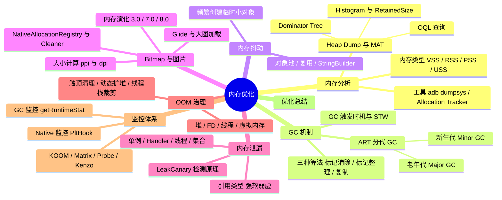
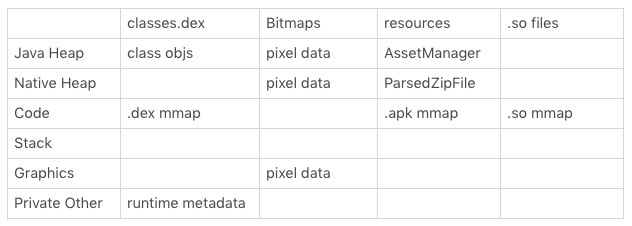
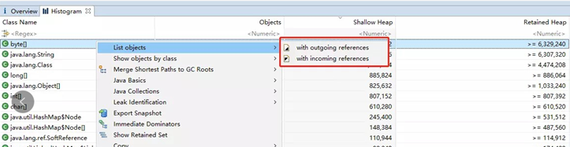
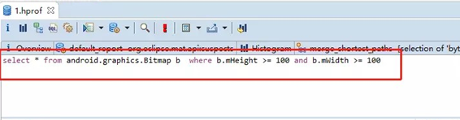
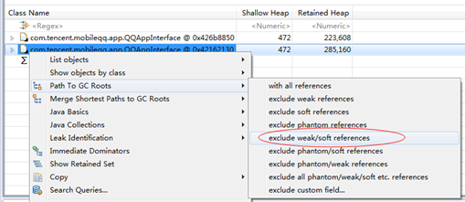
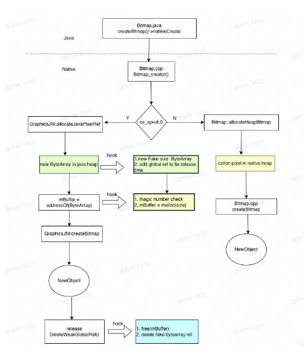
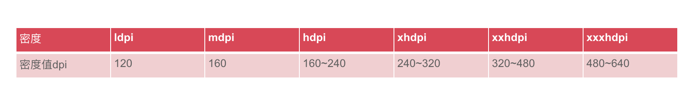
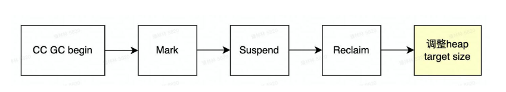
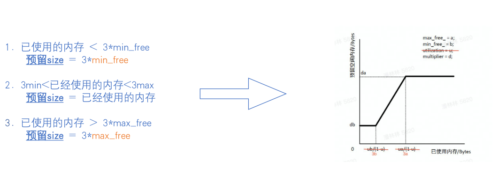
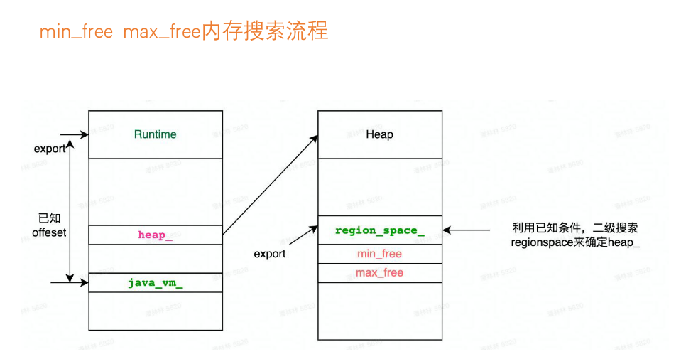

# 内存优化


```mermaid
mindmap
  root((内存优化))
    内存分析
      内存类型 VSS / RSS / PSS / USS
      工具 adb dumpsys / Allocation Tracker
      Heap Dump 与 MAT
        Histogram 与 RetainedSize
        OQL 查询
        Dominator Tree
    GC 机制
      三种算法 标记清除 / 标记整理 / 复制
      ART 分代 GC
        新生代 Minor GC
        老年代 Major GC
      GC 触发时机与 STW
    内存抖动
      频繁创建临时小对象
      对象池 / 复用 / StringBuilder
    Bitmap 与图片
      内存演化 3.0 / 7.0 / 8.0
      大小计算 ppi 与 dpi
      NativeAllocationRegistry 与 Cleaner
      Glide 与大图加载
    内存泄漏
      单例 / Handler / 线程 / 集合
      引用类型 强软弱虚
      LeakCanary 检测原理
    OOM 治理
      堆 / FD / 线程 / 虚拟内存
      触顶清理 / 动态扩堆 / 线程栈裁剪
    监控体系
      GC 监控 getRuntimeStat
      Native 监控 PltHook
      KOOM / Matrix / Probe / Kenzo
    优化总结
```

---

## 一、内存分析

内存优化不是内存用得越少越好，需要分设备、分 device-year 制定标准。

### 1. 内存类型

一般 **VSS >= RSS >= PSS >= USS**：

| 指标 | 含义 |
| --- | --- |
| VSS（Virtual Set Size） | 虚拟耗用内存（包含共享库所占内存） |
| RSS（Resident Set Size） | 实际使用物理内存（包含共享库所占内存） |
| PSS（Proportional Set Size） | 实际使用物理内存（比例分配共享库所占内存） |
| USS（Unique Set Size） | 进程独自占用物理内存（不包含共享库内存） |

共享内存是 Android 基础公共库、组件、还有一些 native library 使用的内存，被所有进程共享。进程都是从 Zygote 进程 fork 出来的，新进程产生的时候就带有了 Shared 内存，从而提高进程创建速度。

### 2. 常用分析手段

- `adb shell cat /proc/[pid]/maps` 查看内存映射；
- `adb shell dumpsys meminfo` 查看进程内存概况（[官方文档](https://developer.android.com/studio/command-line/dumpsys#meminfo)）；
- **Allocation Tracker 和 MAT**；
- 重点关注**大内存、小内存个数、Bitmap**。



### 3. Heap Dump 与 MAT

Heap Dump 得到 hprof 文件，在 MAT 中查看。普通的 hprof 文件内包含下面的信息：

- 所有的对象、所有的类、GCRoots；
- 线程的栈信息、局部变量（在 Android 中，这部分被阉割）。

**Histogram（直方图）：**



- **shadowHeap**：对象自身占用的内存大小，不包括它引用的对象；
- **RetainedSize**：当前对象大小 + 当前对象可直接或间接引用到的对象的大小总和；
- with outgoing references：当前对象引用了内部哪些成员对象；
- with incoming references：当前对象被外部哪些对象引用了；
- merge shortest paths to gc roots：从 GC roots 到一个或一组对象的公共路径。

**OQL 查询：**

```sql
select * from android.graphics.Bitmap b where b.mHeight >= 100 and b.mWidth >= 100
```



**Dominator Tree（支配树）：** 查找持有与被持有，`Path To GC Roots → exclude weak/soft references`。



**Inspect 面板：** 可以查看 Attributes，看到 Bitmap 的宽高、buffer；buffer 右键 copy → save to file 后，可以用 gimp 软件打开查看图片。

---

## 二、GC 机制

### 1. 基础概念

- **GC（Garbage Collection）**：虚拟机自动回收**无有效引用指向、不再使用的堆内存对象**，释放内存给系统复用；Android 使用 ART 虚拟机 GC，废弃了早期 Dalvik 的标记清除。
- **栈内存**：局部变量、方法调用帧，自动入栈出栈，无需 GC。
- **堆内存**：所有 new 出来的对象、集合、Bitmap、图片资源，GC 管理的核心区域。

### 2. 主流 GC 算法

| 算法 | 做法 | 缺点 |
| --- | --- | --- |
| 标记清除（Mark-Sweep） | 遍历标记所有存活对象 → 清除未标记对象 | 产生大量**内存碎片**，大对象分配容易 OOM |
| 标记整理（Mark-Compact） | 标记存活对象后向内存一端平移整理，消除碎片 | 移动对象需要更新所有引用地址，开销大、耗时久 |
| 复制算法（Copy） | 堆分为 From、To 两块同等空间，存活对象复制到 To 区，清空 From | 内存空间浪费一半；新生代大量短命对象使用 |

### 3. ART 分代 GC（最核心考点）

- **新生代（Young Generation）**：短期临时对象（循环临时对象、方法内临时实例）；分为 Eden 区、Survivor（S0、S1）；采用复制算法，GC 频率高、速度快，叫 **Minor GC**。
- **老年代（Old Generation）**：长期存活对象、大对象（Bitmap、大图、长生命周期单例）；标记清除/标记整理，GC 耗时更长，即 **Major GC**。
- **晋升规则**：对象多次熬过新生代 GC，自动晋升到老年代。

### 4. GC 触发时机

1. 堆内存占用达到阈值，系统自动触发；
2. 手动调用 `System.gc()`：仅建议虚拟机 GC，不保证立即执行；
3. App 进入后台、内存紧张，系统主动调度 GC；
4. 创建超大对象，剩余堆空间不足。

### 5. GC 停顿（STW，Stop-The-World）

GC 标记阶段会暂停所有用户线程，是卡顿、掉帧的根源；频繁 GC、长时间 STW → UI 卡顿、ANR、内存抖动。

---

## 三、内存抖动

### 1. 本质与常见场景

**本质**：短时间内**频繁创建大量临时小对象**，快速分配、快速被 GC 回收，造成连续高频 Minor GC，持续 STW 卡顿。

常见场景：

- 循环、`onDraw`、`onTouchEvent` 频繁 new 对象（String、数组、Paint、Bitmap、自定义实体）；
- 动画、滑动列表中不断创建临时对象；
- 字符串频繁拼接 + 创建大量 String 临时对象；
- 集合在循环里反复创建、销毁。

### 2. 危害

- 频繁 GC 产生持续 STW，页面滑动卡顿、动画掉帧；
- 加剧内存碎片，诱发 OOM；
- 耗电增加。

### 3. 解决方案

- 把循环内对象提升为成员变量，复用实例，避免重复 new；
- 使用对象池（ObjectPool）复用对象，减少创建销毁；
- 字符串拼接改用 `StringBuilder`；
- 自定义 View 的 Paint、Rect、Matrix 放到构造初始化，不在 `onDraw` 新建；
- 避免在 `MotionEvent.MOVE` 中创建对象。

---

## 四、Bitmap 与图片内存

### 1. Bitmap 内存演化

- **Android 3.0 之前**：Bitmap 对象放在 Java 堆，而像素数据是放在 Native 内存中。如果不手动调用 recycle，Bitmap Native 内存的回收完全依赖 `finalize` 函数回调，这个时机不太可控。
- **Android 3.0 ~ Android 7.0**：将 Bitmap 对象和像素数据统一放到 Java 堆中，这样就算我们不调用 recycle，Bitmap 内存也会随着对象一起被回收。不过 Bitmap 是内存消耗的大户，把它的内存放到 Java 堆中似乎不是那么美妙。
- **Android 8.0**：使用 NativeAllocationRegistry 实现像素数据放到 Native 内存中，正是这个辅助回收 Native 内存的机制。Android 8.0 还新增了硬件位图 **Hardware Bitmap**，可以减少图片内存并提升绘制效率。
  - NativeAllocationRegistry 底层实际上使用了 `sun.misc.Cleaner`，可以为对象注册一个清理的 Runnable，当对象内存被回收时 JVM 就会调用它。
  - Cleaner 的原理也很"暴力"：首先它是一个**虚引用**，`registerNativeAllocation` 实际上创建了一个 Bitmap 的虚引用；虚引用需要配合一个 **ReferenceQueue** 使用，当对象的引用被回收时，JVM 就会将这个虚引用丢到 ReferenceQueue 里面。而 ReferenceQueue 在插入的时候通过 `instanceof` 判断了一下是不是 Cleaner。
  - 也就是说：Bitmap 对象被回收 → Cleaner 这个虚引用被丢入 ReferenceQueue → ReferenceQueue 判断丢进来的虚引用是不是 Cleaner，如果是就调用 `Cleaner.clean()` → clean 方法内部再去执行我们注册的清理 Runnable。
- **Fresco 图片库**在 Dalvik 上会把图片放到 Native 内存中。
- **native hook**：



  - 原分配 Java 内存的地方，分配空对象；
  - Native 层面完成实际的内存分配；
  - 及时回收假对象和 Native 内存。

### 2. Bitmap 大小计算

- **ppi**（Pixels Per Inch）：每英寸像素点。以 Nexus 6 为例，分辨率 1440×2560，5.96 英寸，ppi 的计算公式可表示为：**√(X²+Y²) / 对角线英寸 = 492**。
- **dpi**：但 dpi 只有 120（low）、160（medium）、240（high）、260、280、300、320（xhigh）、340、360、400、420、480（xxhdpi）、560、640（xxxhdpi）这几种，所以 Nexus 6 的 dpi 为 **560**。



- 以 Nexus 6 为例，一张 180×180 的图片，放在设置了 `wrap_content` 属性的 ImageView 中，放在 `drawable-hdpi`、`drawable-xhdpi` 资源目录中，在屏幕上分别显示多大（像素）的图片：
  - hdpi：`int (180 * (560 / 240) + 0.5f) = 420px`；
  - xhdpi：`int (180 * (560 / 320) + 0.5f) = 315px`。
- Android 官方支持的 RGB 格式有 `ALPHA_8`、`RGB_565`、`ARGB_4444`、`ARGB_8888`，Android decode 资源图片时默认会选择 `ARGB_8888`。如果将 180×180 放入 hdpi 目录中，那实际大小应该为 `int (180 * (560 / 240) + 0.5f) = 420px`，像素内存大小为 `420 * 420 * 4 = 705600 byte = 689KB`。

### 3. 图片库 Glide

- `Glide.with(viewHolder.getImageView().getContext()).clear(viewHolder.getImageView());`
- `Glide.with(mContext).load(url).skipMemoryCache(true)`，加载大图不被缓存；
- `Glide.get(this).clearMemory()`；
- 缩略图原理使用 LayerDrawable：`LayerDrawable.setImageDrawable(null);`
- `BitmapRegionDecoder` 加载大图。

### 4. Bitmap 治理

`Bitmap.recycle()`；`BitmapFactory` 统一收拢，根据分辨率缩放；超宽、重复图检测。

---

## 五、Java 内存泄漏

### 1. 本质

**本应该被 GC 回收的对象，被一个更长生命周期的引用持有，导致无法被虚拟机回收，对象常驻堆内存**；内存泄漏不断堆积 → 可用内存持续减少 → OOM 崩溃。

生命周期大小关系：`Application > Activity/Fragment > View > 临时方法对象`，短生命周期对象被长生命周期持有，最容易泄漏。

### 2. 高频泄漏场景与解决方案

1. **单例/静态变量持有 Activity、Fragment 上下文**（单例一般是全局的，常引用生命周期短的变量，导致其无法释放；静态变量生命周期长）
   - 解决：使用 `ApplicationContext` 应用上下文；页面销毁手动置空静态引用。
2. **Handler 内存泄漏（非静态内部类）**
   - 非静态内部类、匿名内部类默认持有外部 Activity 引用（比如各种回调）；Handler 延迟消息排队，页面 finish 后消息未执行，Activity 被持有泄漏。
   - 解决：Handler 改为静态内部类；使用 `WeakReference` 弱引用包裹 Activity；Activity 销毁 `removeCallbacksAndMessages(null)` 清空消息队列。
3. **线程/协程持有页面引用，页面销毁未取消**
   - 运行的线程是 GC Root，线程持有的对象无法释放；子线程、ViewModelScope 外的协程、RxJava 异步任务持有 View、Activity，页面关闭任务还在执行。
   - 解决：使用 `viewModelScope`、`lifecycleScope` 绑定生命周期，页面销毁自动取消；Activity `onDestroy` 手动终止线程、dispose Rx 订阅；提供强制停止的接口、指定线程名称便于问题定位、自检机制（运行中判断有效性，无效即停止）。
4. **集合静态常驻，不断添加对象不清理**：全局 List、Map 持续 add 页面资源，不移除。
   - 解决：页面销毁清空集合对应数据。
5. **资源使用完未关闭**（BroadcastReceiver、ContentObserver、File、Cursor、Stream、Bitmap、Camera、MediaPlayer）
   - 解决：finally 中 close/recycle。
6. **第三方监听、广播注册未反注册**：注册广播、EventBus、第三方 SDK 监听，`onDestroy` 没有 unregister。
7. **Timer**：销毁时调用了 cancel，但根据 Timer 的实现，cancel 并不会把 Task 从队列中删除，只是做了个标记 → 销毁时还要调用 `purge`。
8. **WebView 泄漏**。
9. **Fragment 静态复用、View 引用未解绑**：Fragment detached 后 View 引用没清空；静态 Fragment 持有页面 View。

### 3. 引用类型区分（辅助理解泄漏）

| 引用类型 | 回收时机 | 用途 |
| --- | --- | --- |
| 强引用 | 只要存在，GC 永远不回收 | 默认引用（泄漏元凶） |
| 软引用 SoftReference | 内存不足时 GC 回收 | 适合缓存 |
| 弱引用 WeakReference | 下次 GC 直接回收 | Handler 防泄漏常用 |
| 虚引用 PhantomReference | 仅监控回收状态 | 几乎不用 |

### 4. LeakCanary 检测原理（面试高频）

**整体作用**：自动检测 Activity/Fragment/View 等内存泄漏，抓取堆快照，分析引用链，展示泄漏路径。

1. **监听目标对象生命周期**：监听 Activity 注册 `Application.ActivityLifecycleCallbacks`，捕获 `onDestroy`；监听 Fragment 监听 FragmentManager 生命周期回调，捕获销毁事件。
2. **延迟主动触发 GC**：Activity 销毁后延迟一段时间（主线程空闲、几秒延时）手动触发 GC，区分「临时内存占用」和「真正泄漏」，避免误判。
3. **判断对象是否存活**：用 WeakReference 弱引用封装销毁的 Activity，搭配 ReferenceQueue 引用队列；无泄漏 → GC 后弱引用入队，对象被回收；泄漏 → 强引用还持有对象，弱引用不会入队，判定泄漏。
4. **生成 Heap Dump 堆快照（hprof 文件）**：确认泄漏后抓取当前 App 堆内存快照，保存所有对象、引用关系。
5. **分析 hprof，解析最短泄漏引用链**：内置 HAHA 库解析快照，查找泄漏对象到 GC Roots 的强引用链路，找到泄漏源头（如静态变量、Handler、线程）。
6. **弹窗展示泄漏详情、引用链**，方便修复。

**GC Roots 概念（判断存活的基准）**：GC Roots 是虚拟机认定的存活起点，被 GC Roots 直达强引用的对象全部存活不会回收；常见 GC Roots：Application 静态变量、主线程运行栈局部变量、系统 Native 层引用、活跃线程、虚拟机全局引用。

**优化点**：不会频繁 dump hprof（dump 卡顿极大），只确认泄漏后抓取；低版本 ART 兼容；自动过滤系统非业务泄漏。

---

## 六、OOM 治理

### 1. OOM 分类

- **Java 堆内存溢出**：为对象分配内存时达到进程的内存上限。由 `Runtime.getRuntime().maxMemory()` 可以得到 Android 中每个进程被系统分配的内存上限，当进程占用内存达到这个上限时就会发生 OOM。
  - 无足够连续内存空间：`failed due to fragmentation (required continguous free " << required_bytes << " bytes for a new buffer where largest contiguous free " << largest_continuous_free_pages << " bytes)"`，其详细代码在 `art/runtime/gc/allocator/rosalloc.cc` 中（注意原文报错里 `continguous` 就是 AOSP 的原始拼写）。
- **FD 数量超出限制**。
- **线程数量超出限制**：
  - 创建 JNI 失败：通过 Android 的匿名共享内存（Anonymous Shared Memory）分配 4KB（一个 page）内核态内存。`E/art: ashmem_create_region failed for 'indirect ref table': Too many open files java.lang.OutOfMemoryError: Could not allocate JNI Env`
  - 再通过 Linux 的 mmap 调用映射到用户态虚拟内存地址空间。`E/art: Failed anonymous mmap(0x0, 8192, 0x3, 0x2, 116, 0): Operation not permitted. See process maps in the log.`
  - 创建线程失败——调用 mmap 分配栈内存：这里 mmap flag 中指定了 `MAP_ANONYMOUS`，即匿名内存映射。这是在 Linux 中分配大块内存的常用方式。其分配的是虚拟内存，对应页的物理内存并不会立即分配，而是在用到的时候触发内核的缺页中断，然后中断处理函数再分配物理内存。`W/libc: pthread_create failed: couldn't allocate 1073152-bytes mapped space: Out of memory W/tch.crowdsourc: Throwing OutOfMemoryError with VmSize 4191668 kB "pthread_create (1040KB stack) failed: Try again"`
  - 创建线程失败——调用 clone 方法进行线程创建：`W/libc: pthread_create failed: clone failed: Out of memory W/art: Throwing OutOfMemoryError "pthread_create (1040KB stack) failed: Out of memory"`
- **虚拟内存不足**。

### 2. 治理方法

1. **图片专项**：图片合理性、缓存统一控制、图片私藏检测、HAHA 库批量分析。
2. **缓存专项**：LruCache、HashMap、ConcurrentHashMap 等缓存管理。我们需要有一套统一的缓存管理机制，可以适当地使用内存；当"系统有难"时，也要义不容辞地归还。可以使用 `OnTrimMemory` 回调，根据不同的状态决定释放多少内存。对于大项目来说，可能存在几十上百个模块，统一缓存管理可以更好地监控每个模块的缓存大小。
3. **触顶清理体系**：分级清理策略——触顶清理图片缓存、ZipFile 清理、业务缓存、系统预加载资源清理。
4. **动态扩堆**：针对不同机型、低端机，开启 largeMemory（native 层修改内存地址）。
5. **自杀逻辑**。
6. **线程栈裁剪**：从 1M 裁剪到 512B。
7. **Chunk unmap**：主动 unmap 减少虚拟内存使用。

### 3. 堆大小相关 API

- `ActivityManager.getMemoryClass()`：虚拟机 Java 堆大小的上限，分配对象时突破这个大小就会 OOM；
- `ActivityManager.getLargeMemoryClass()`：manifest 中设置 `largeHeap=true` 时虚拟机 Java 堆的上限；
- `Runtime.getRuntime().maxMemory()`：当前虚拟机实例的内存使用上限，为上述两者之一；
- `Runtime.getRuntime().totalMemory()`：当前已经申请的内存，包括已经使用的和还没有使用的；
- `Runtime.getRuntime().freeMemory()`：上一条中已经申请但是尚未使用的那部分；那么已经申请并且正在使用的部分 `used = totalMemory() - freeMemory()`。

---

## 七、其他专项优化

### 1. 进程模型

一个空的进程也会占用 10MB 的内存，而有些应用启动就有十几个进程，甚至有些应用已经从双进程保活升级到四进程保活，所以减少应用启动的进程数、减少常驻进程、有节操的保活，对低端机内存优化非常重要。

### 2. 安装包大小

安装包中的代码、资源、图片以及 so 库的体积，跟它们占用的内存有很大的关系。一个 80MB 的应用很难在 512MB 内存的手机上流畅运行。这种情况我们需要考虑针对低端机用户推出 4MB 的轻量版本，例如 Facebook Lite、今日头条极速版都是这个思路。

### 3. GC 降活

让 GC 不容易触发 = 增大 target size = 增大预留 size。





### 4. Jemalloc 动态调优

---

## 八、内存监控体系

### 1. 监控指标

建立监控体系，指标：OOM 率、内存触顶率；统计：OOM 时图片缓存、OOM 场景监控统计、OOM 线程与 FD 统计上报、Native 内存泄漏监控。

常用排查命令：

- 查看内存映射：`/proc/[pid]/maps`；
- 查看 Native 内存：`/proc/[pid]/smaps`；
- 查看 FD：`Os.readlink()`、`/proc/[pid]/fd`、`/proc/[pid]/limits`（解释 `Max open file`）；
- 查看线程：`/proc/[pid]/status`；
- `adb shell dumpsys meminfo` 可看 Objects 中 Activities、Views；
  - watch `/proc/pid/fd` 来监控 App 打开文件的情况；
  - watch `/proc/pid/task` 来监控线程使用情况。

### 2. GC 监控

- 运行的 GC 次数：`Debug.getRuntimeStat("art.gc.gc-count")`；
- GC 使用的总耗时，单位是毫秒：`Debug.getRuntimeStat("art.gc.gc-time")`；
- 阻塞式 GC 的次数：`Debug.getRuntimeStat("art.gc.blocking-gc-count")`；
- 阻塞式 GC 的总耗时：`Debug.getRuntimeStat("art.gc.blocking-gc-time")`。

### 3. Native 内存监控

- Debug 环境 Malloc 钩子；
- 使用 **PLT Hook** 拦截库的内存分配函数 `malloc`、`free`，配合高性能 unwind（回溯）；
- 针对可重编的 so：通过 GCC 的 `-finstrument-functions` 参数给所有函数插桩，桩中模拟调用栈入栈出栈操作；通过 ld 的 `--wrap` 参数拦截内存分配和释放函数，重定向到我们自己的实现后，记录分配的内存地址、大小、来源 so 以及插桩记录的调用栈此时的内容，定期扫描分配与释放是否配对，对于不配对的分配输出我们记录的信息；
- 其他工具：腾讯的 **Matrix**、美团的 **Probe**（OOM 监控）。

### 4. KOOM（快手线上 OOM 监控）

**整体定位**：KOOM（Kwai OOM）是快手开源的高性能**线上** OOM 监控方案，覆盖 Java Heap、Native Heap、Thread、FD 泄漏；核心解决 LeakCanary/Matrix dump 时冻结主进程、只能线下使用的痛点，实现线上大规模部署、低开销。

**触发机制（内存阈值检测，区别于 LeakCanary）：**

- LeakCanary 靠 `Activity.onDestroy` + 主动 GC 触发（频繁 GC 会卡顿）；KOOM 改为阈值检测；
- MonitorThread（HandlerThread）周期轮询，默认 5s 一次，调用 `HeapMonitor.isTrigger()` 判断是否触发；
- 通过 `Runtime.getRuntime()` 取 maxMemory/totalMemory/freeMemory，计算已用内存占比；
- 动态阈值按机型内存分级：maxMem ≥ 510M → 超 80% 触发；≥ 250M → 85%；≥ 128M → 90%；最大阈值统一 95%（超过强制触发，防止 OOM 崩溃后 dump 不到现场）；
- 连续 3 次超阈值 → 认定泄漏触发 dump；内存回落则重置计数；
- 内置五种检测器：HeapOOMTracker、ThreadOOMTracker、FdOOMTracker、PhysicalMemoryOOMTracker、FastHugeMemoryOOMTracker（高危检测：内存超 90% 或两次检测增长超 350M 即 dump）。

**Fork Dump：无感知堆镜像采集（核心创新）**

- 问题：传统 `Debug.dumpHprofData` 会 STW，冻结应用数秒甚至数十秒；
- 方案：利用内核 COW（Copy-on-Write 写时复制）——fork 子进程，父子共享内存页，子进程写入时才拷贝独立内存，父进程几乎零开销：`art::Dbg::SuspendVM` 暂停虚拟机 → `fork()` 子进程 → 父进程立即 resume 恢复运行；子进程执行 `dumpHprofData` 输出 hprof（native 层 `suspendAndFork()` / `resumeAndWait(pid)`）；父进程冻结总耗时仅几毫秒（<100ms），用户完全无感知；
- 兼容性：Android 7.0 起限制 App 调用系统库，快手自研 kwai-linker（caller address 替换 + `dl_iterate_phdr` 解析）绕过限制。

**hprof 解析与报告（本地边缘计算）**

- hprof 文件相对较大，需要对待分析内容进行筛选：通过 xhook 对 hprof 的写入操作进行 hook，当发现写入内容的类型符合需要时才进行写入；
- 闲时在独立进程单线程本地分析，分析完即删除镜像，不占磁盘；
- 上传的只是 KB 级报告，不消耗用户流量；
- 解析三环节：扫描镜像构建索引 → 根据 framework 知识及策略判定泄漏对象（泄漏判定延迟到解析阶段，而非监控阶段）→ 生成报告（泄漏路径、数量、类统计、运行时信息）；
- 镜像裁剪：运行时 hook 只保留分析 OOM 必需的类与对象组织结构，不上传真实业务数据，兼顾流量与隐私；
- 线上日志回捞需要对 hprof 进行压缩，具体算法可以参考 koom/raphael，有提供对应的压缩算法。

**KOOM vs LeakCanary 对比（面试高频）**

| 维度 | LeakCanary | KOOM |
| --- | --- | --- |
| 定位 | 开发期泄漏检测（线下） | 线上大规模 OOM 监控 |
| 触发方式 | `Activity.onDestroy` + 延迟主动 GC | 内存阈值检测（不主动 GC），连续超阈值触发 |
| dump 影响 | 进程内 dump，STW 秒级卡顿 | fork 子进程 + COW，主进程仅毫秒级冻结 |
| 检测范围 | 主要定位 Activity/Fragment/View 泄漏 | Java/Native/Thread/FD，大对象、频繁分配 |
| 结果消费 | 本机弹窗 + 引用链展示 | 本地分析、上传 KB 级报告，后端聚合报警 |

参考：[KOOM GitHub](https://github.com/KwaiAppTeam/KOOM)、[快手开源 KOOM 浅析](https://zhuanlan.zhihu.com/p/411811259)

### 5. Kenzo（字节 Memory Insight 内存监控）

**定位**：字节抖音团队自研的内存监控工具，解决**动态内存分配造成的 GC 卡顿**（内存抖动）问题，是对静态内存占用（OOM）治理之外的补充——LeakCanary/KOOM 找"回收不了的对象"，Kenzo 找"频繁创建的对象"。

**原理：基于 JVMTI 事件回调**

- JVMTI（JVM Tool Interface）是虚拟机提供的 native 编程接口；Kenzo 以 Agent 形式集成，通过 Jvmti `SetEventCallbacks` 注册回调，从虚拟机获取运行态信息，hook 四类事件：
  - **ClassPrepare**：类加载准备事件 → 监控类加载；
  - **GarbageCollectionStart / GarbageCollectionFinish**：监控 GC 事件与耗时；
  - **ObjectFree**：GC 释放对象时触发 → 监控对象释放；
  - **VMObjectAlloc**：虚拟机分配对象时触发 → 监控内存分配。

**框架设计（生产端/消费端）**：生产端以 SDK 形式集成到宿主 App，采集内存数据；消费端处理生产端数据，输出可视化报表（哪些类频繁分配、GC 耗时分布等）。

参考：[抖音 Android 性能优化系列：Java 内存优化（Kenzo 原理）](https://blog.csdn.net/weixin_49559515/article/details/112191133)

---

## 九、面试高频问答

### 1. 内存泄漏和内存抖动区别？

内存泄漏：对象永久无法回收，内存持续上涨；内存抖动：频繁创建销毁小对象，内存锯齿状起伏，高频 GC 卡顿。

### 2. 为什么不能随便用 Activity 上下文给静态组件？

Activity 持有窗口、View 资源，生命周期短；静态变量生命周期等于 App，强持有后 Activity 销毁无法 GC，造成泄漏。

### 3. 弱引用为什么不会内存泄漏？

弱引用不阻止 GC，只要没有强引用，GC 到来直接回收对象。

### 4. OOM 常见原因？

大量内存泄漏堆积、超大 Bitmap 未压缩加载、一次性创建超多对象、内存碎片分配失败。

### 5. 怎么手动排查内存问题？

Android Studio Profiler（内存面板）、MAT 分析 hprof、LeakCanary 自动化检测。

### 6. LeakCanary 为什么只能线下用，KOOM 为什么能上线上？

LeakCanary 靠 `onDestroy` 后主动 GC + 进程内 dump hprof（STW 秒级卡顿）、本机弹窗展示，只适合开发调试；KOOM 用内存阈值触发（不主动 GC）、fork 子进程 + COW 毫秒级 dump、本地解析只上传 KB 级报告，开销低，适合线上大规模部署。

---

## 十、优化总结

1. **规避内存泄漏**：及时取消异步、反注册监听、静态慎用页面引用、销毁置空资源；
2. **解决内存抖动**：复用对象、减少循环内临时创建、优化 onDraw 逻辑；
3. **GC 优化**：减少短命大对象，图片压缩采样加载，使用内存缓存；
4. **检测工具**：LeakCanary、Profiler、MAT；线上监控 KOOM（OOM）、Kenzo（GC/分配）。

**30 秒口述版**：内存优化先要会看——VSS/RSS/PSS/USS 分清共享内存，dumpsys meminfo 和 MAT 定位大对象。GC 上 ART 分代回收，注意 STW 带来的卡顿。问题治理三个方向：泄漏（长生命周期持有短生命周期，LeakCanary 线下查、KOOM 线上阈值触发 + Fork Dump 无感采集）、抖动（复用对象、避免 onDraw 新建）、OOM（图片缓存、触顶清理、动态扩堆）。最后落到监控体系，线上用 KOOM/Kenzo 做常态观测。
