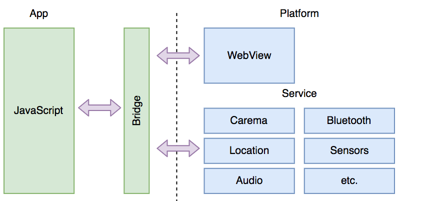
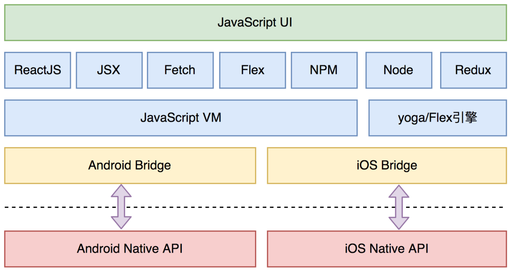

# Android动态化

# WebView
容器的工作原理是基于Web技术来实现界面和功能，通过将原生的接口封装、暴露给JavaScript调用，JavaScript编写的页面可以运行在系统自带的WebView中。这样做的优势是，对于前端开发者比较友好，可以很快地实现页面跨端，同时保留调用原生的能力，通过搭建桥接层和原生能力打通。但这种设计，跨端的能力受限于桥接层，当调用之前没有的原生能力时，就需要增加桥。另外，浏览器内核的渲染独立于系统组件，无法保证原生体验，渲染的效果会差不少。

# React Native
2015年，Facebook推出了React Native，一经推出就备受关注。它的思路是最大化地复用前端的生态和Native的生态，和WebView容器的最大区别在于View的渲染体系。React Native抛弃了低效的浏览器内核渲染，转而使用自己的DSL生成中间格式，然后映射到对应的平台，渲染成平台的组件。相对WebView容器，体验会有一定的提升。不过，渲染时需要JavaScript和原生之间通信，在有些场景可能会导致卡顿。另外就是，渲染还是在Native层，要求开发人员对Native有一定的熟悉度。

# Flutter
与上述Recat Native、WebView容器本质上都是不同的，它没有使用WebView、JavaScript解释器或者系统平台自带的原生控件，而是有一套自己专属的Widget，底层渲染使用自身的高性能C/C++ 引擎自绘。但大部分移动端发展到今天，都已经形成了自己的架构，在现有基础上加上Flutter，会形成原有架构和Flutter双平台共存的问题。目前，对新的App来说，是最被看好的跨端方案。

