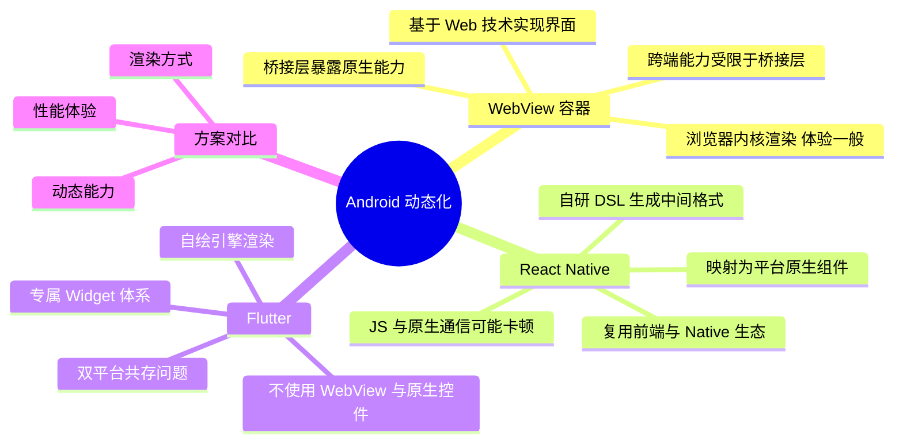
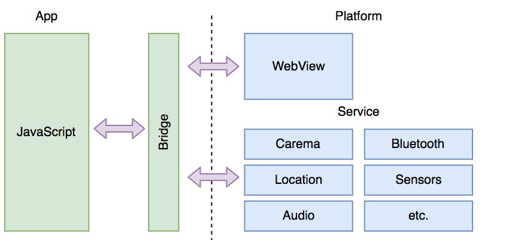
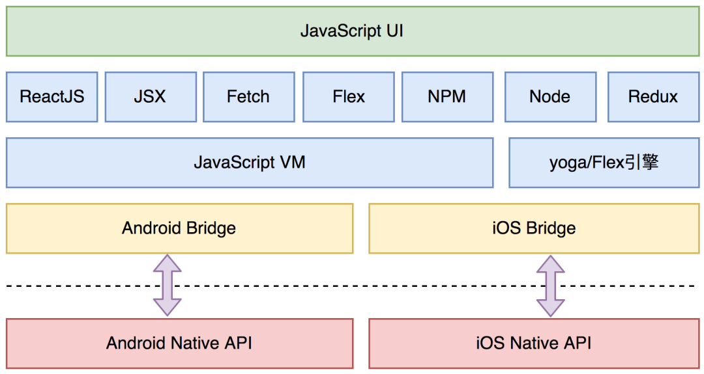

# Android 动态化

```mermaid
mindmap
  root((Android 动态化))
    WebView 容器
      基于 Web 技术实现界面
      桥接层暴露原生能力
      跨端能力受限于桥接层
      浏览器内核渲染 体验一般
    React Native
      复用前端与 Native 生态
      自研 DSL 生成中间格式
      映射为平台原生组件
      JS 与原生通信可能卡顿
    Flutter
      不使用 WebView 与原生控件
      专属 Widget 体系
      自绘引擎渲染
      双平台共存问题
    方案对比
      渲染方式
      性能体验
      动态能力
```

---

## 一、WebView 容器

容器的工作原理是基于 **Web 技术**来实现界面和功能：通过将原生的接口封装、暴露给 JavaScript 调用，JavaScript 编写的页面可以运行在系统自带的 **WebView** 中。

- **优势**：对前端开发者比较友好，可以很快地实现页面跨端，同时保留调用原生的能力（通过搭建**桥接层**和原生能力打通）。
- **劣势**：
  - 跨端的能力**受限于桥接层**——当需要调用之前没有的原生能力时，就需要增加桥；
  - 浏览器内核的渲染独立于系统组件，**无法保证原生体验**，渲染效果会差不少。

---

## 二、React Native

2015 年，Facebook 推出了 **React Native**，一经推出就备受关注。它的思路是**最大化地复用前端的生态和 Native 的生态**，和 WebView 容器的最大区别在于 **View 的渲染体系**：

- React Native 抛弃了低效的浏览器内核渲染，转而使用自己的 **DSL 生成中间格式**，然后映射到对应的平台，**渲染成平台的组件**；
- 相对 WebView 容器，体验会有一定的提升；
- 但渲染时需要 JavaScript 和原生之间**通信**，在有些场景可能会导致卡顿；另外渲染还是在 Native 层，要求开发人员对 Native 有一定的熟悉度。

---

## 三、Flutter

**Flutter** 与上述 React Native、WebView 容器本质上都不同：它没有使用 WebView、JavaScript 解释器或者系统平台自带的原生控件，而是有一套**自己专属的 Widget**，底层渲染使用自身的**高性能 C/C++ 引擎自绘**。

但大部分移动端发展到今天，都已经形成了自己的架构，在现有基础上加上 Flutter，会形成**原有架构和 Flutter 双平台共存**的问题。目前，对新的 App 来说，Flutter 是最被看好的跨端方案。

---

## 四、三种方案对比

| 维度 | WebView 容器 | React Native | Flutter |
| --- | --- | --- | --- |
| 渲染方式 | 浏览器内核渲染，通过桥接层调用原生 | DSL 生成中间格式，映射为平台原生组件 | 自绘引擎，不依赖原生控件 |
| 性能体验 | 渲染独立于系统组件，体验一般 | 接近原生，但 JS 与原生通信可能卡顿 | 接近原生，一致性好 |
| 动态能力 | 最强，发版即生效 | 较强，可动态下发 JS bundle | 相对弱，依赖自身的动态化方案 |
| 开发成本 | 前端开发者友好 | 需熟悉前端与 Native | 需学习 Dart 与自有 Widget 体系 |
| 主要问题 | 桥接层能力受限、体验差 | 通信卡顿、Native 熟悉度要求 | 与现有架构双平台共存 |

> 以上三种属于"跨端渲染"路线；Android 动态化还有插件化、热修复等原生路线，以及小程序类容器方案，各自解决的是不同层面的问题。

---

## 五、30 秒口述版

Android 动态化的三种主流跨端方案：**WebView 容器**基于 Web 技术、用桥接层暴露原生能力，前端友好但受限于桥接层、渲染体验差；**React Native** 用 DSL 把声明映射成平台原生组件，复用前端和 Native 生态，体验更好但 JS 与原生通信可能卡顿；**Flutter** 既不用 WebView 也不用原生控件，靠自绘引擎渲染专属 Widget，性能与一致性最好，代价是与现有架构双平台共存、学习成本高。
