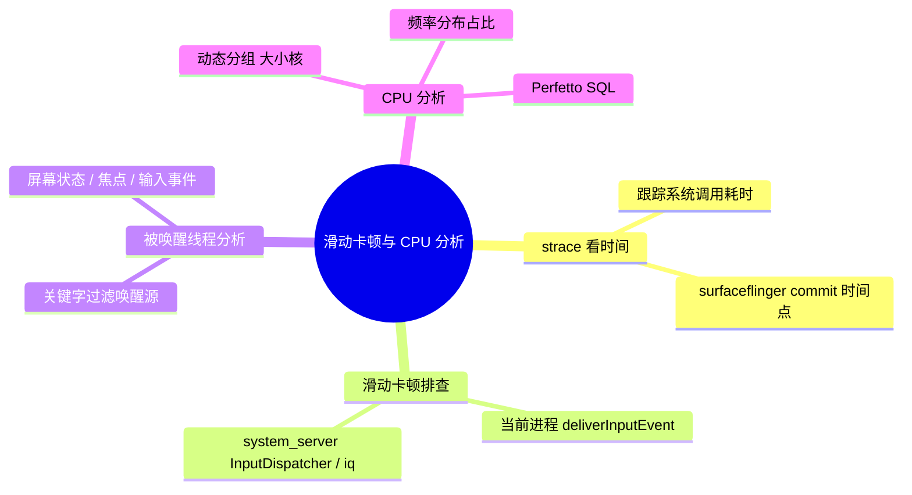

# 滑动卡顿与 CPU 分析



---

## 一、用 strace 看时间

- strace 用于跟踪进程的系统调用，常用参数：`-p <pid>` 附加到目标进程、`-T` 显示每个系统调用的耗时、`-tt` 打印时间戳、`-f` 跟随子线程。
- 通过系统调用的耗时分布，可以判断线程时间花在哪里：是等锁、等 IO，还是等 binder 回包。
- 滑动场景下重点看 **surfaceflinger 的 commit**：每一帧合成提交的时间点，能看出帧的提交节奏是否规律、是否出现空档。

---

## 二、滑动卡顿：从输入分发链路看

滑动卡顿要从**输入事件的分发链路**两端一起看：

1. **当前进程（App）**：看 `deliverInputEvent`——输入事件从 system_server 分发到 App 的入口。如果从它到下一帧绘制之间耗时过长，说明是 App 自己处理慢（主线程被占用、布局/绘制耗时等）。
2. **system_server**：看 InputDispatcher 与 iq（输入队列）相关状态——判断延迟是出在系统侧分发，还是 App 侧处理。

两端对照，就能定位卡顿发生在"事件送达前"还是"送达后"。

---

## 三、看被唤醒的线程、进程

滑动过程中的频繁唤醒会带来额外的调度与功耗开销，排查时用关键字在 trace / log 中过滤唤醒源：

```
ScreenState change|GOOD TO GO|State movement|isKeyguardShowing=|START u0|Changing focus|InputEvent:|InputDispatcher:|Updating screen state: state=|intercept Key|WindowManager_visibility|WindowManager: java.lang
```

这些关键字覆盖了**屏幕状态变化、焦点切换、输入事件分发、窗口可见性更新**等常见唤醒来源，命中后顺着调用栈找到发起唤醒的线程，判断是否必要、能否延后。

---

## 四、CPU 分析：动态分组并统计频率分布

滑动的流畅度与功耗最终都体现在 CPU 的调频行为上：看频率在大小核各档位的分布，可以判断**负载落在哪类核心、是否被降频、调度是否合理**。

思路是**动态分组**——先把 cpufreq 的 track 按 CPU 编号分成小核 / 中核 / 大核三组，再统计每组内各频率档位的采样占比。基于 Perfetto 的 `track`、`counter` 表：

```sql
WITH sorted_tracks AS (
  SELECT 
    id AS track_id,
    ROW_NUMBER() OVER (ORDER BY id) AS row_num,
    CASE 
      WHEN ROW_NUMBER() OVER (ORDER BY id) BETWEEN 1 AND 4 THEN 'CPU 0-3 小核心'
      WHEN ROW_NUMBER() OVER (ORDER BY id) BETWEEN 5 AND 7 THEN 'CPU 4-6 中核心'
      WHEN ROW_NUMBER() OVER (ORDER BY id) = 8 THEN 'CPU 7 大核心'
    END AS cluster_type
  FROM track
  WHERE name = 'cpufreq'
),
frequency_stats AS (
  SELECT
    st.cluster_type,
    c.value AS frequency_MHz,
    COUNT(*) AS sample_count
  FROM counter c
  JOIN sorted_tracks st ON c.track_id = st.track_id
  GROUP BY st.cluster_type, c.value
)
SELECT
  cluster_type,
  frequency_MHz,
  sample_count,
  ROUND(sample_count * 100.0 / SUM(sample_count) OVER (PARTITION BY cluster_type), 2) AS percentage
FROM frequency_stats
ORDER BY cluster_type, sample_count DESC;
```

**结果解读：**

- 频率占比集中在中低频：负载轻或调频保守，若此时仍卡顿，卡点通常不在 CPU 算力；
- 高频占比高：负载重或调频激进，需要结合线程调度看是**哪个线程**在跑、是否有不必要的唤醒；
- 结合前面的唤醒分析，把"谁唤醒了谁、唤醒后跑了多久、跑在哪个核"串起来，才能同时解释卡顿与功耗。
