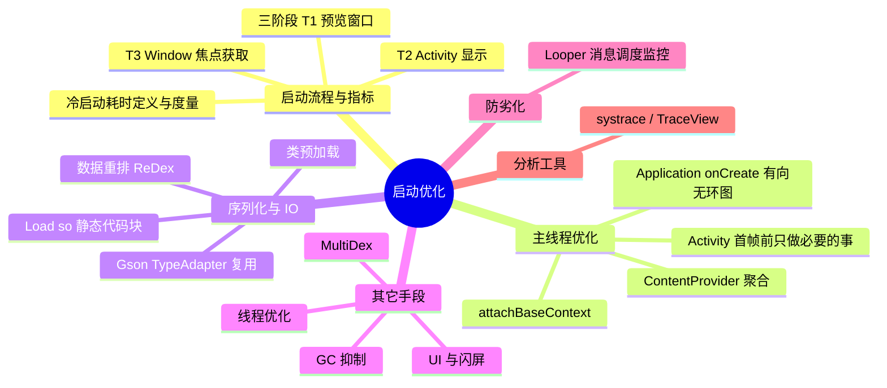

# 启动优化

---

## 一、启动流程与指标

### 1. 启动的定义与本质

启动是指用户从点击 icon 到看到页面首帧的整个过程，启动优化的目标就是减少这一过程的耗时。

启动过程比较复杂：在**进程与线程维度**，它涉及多次跨进程通信与多个线程之间的切换；在**耗时成因维度**，它包括 CPU、CPU 调度、IO、锁等待等多类耗时。虽然过程复杂，但最终可以把它**抽象成主线程的一个线性过程**——因此启动性能优化，就是去缩短主线程的这个线性过程。

### 2. 启动的三个阶段

- **T1 预览窗口显示**：系统在拉起进程之前，会先根据 App Theme 属性创建预览窗口。当然如果我们禁用预览窗口或者将预览窗口指定为透明，用户在这段时间依然看到的是桌面。
- **T2 Activity 显示**
- **T3 Window 焦点获取**

### 3. 冷启动耗时

冷启动指进程不存在，从点击 icon 开始，经历**创建进程 → Application 初始化 → Activity 创建 → 首帧绘制**的全过程；进程仍在时则是温启动/热启动，耗时显著更低，所以谈启动优化通常以冷启动为准。

度量方式：

- 线下：`adb shell am start -W <包名>/<Activity>`，关注 **ThisTime**（最后一个 Activity 的启动耗时）、**TotalTime**（含进程创建与 Application 初始化）、**WaitTime**（还包含系统调度耗时）；
- 线上：在关键节点打点（Application 创建、attachBaseContext、onCreate、首帧），分段统计各阶段耗时，才能知道时间花在哪。

---

## 二、优化措施

### 1. UI

- **启动主题/闪屏**：把预览窗口背景设置成与首页一致的图片，避免启动瞬间白屏、黑屏的不良观感；
- **布局**：减少层级、次要视图用 ViewStub 延迟加载、避免过度绘制；
- **资源**：首帧前只加载必要资源，图片解码、大对象创建等尽量延后。

### 2. 主线程优化

#### （1）Application attachBaseContext

Application 最早的入口，此时 Application 还未完成 attach。**必须最先执行**的初始化（如 MultiDex 安装）要放在这里；也正因为最早，**不宜放耗时逻辑**，否则会直接拉长整个启动时间线。

#### （2）ContentProvider

我们可以通过 JetPack 提供的 Startup 将多个初始化的 ContentProvider 聚合成一个来进行优化。

#### （3）Application onCreate

依赖有向无环图（如阿里 Alpha），把初始化任务按依赖关系编排：无依赖的并发执行、有依赖的按序执行，而不是在 onCreate 里顺序堆砌。

#### （4）Activity

onCreate 里只保留首帧必需的工作；非关键初始化用 ViewStub 延迟 inflate，或放到首帧之后（如 Choreographer.postFrameCallback、IdleHandler 空闲时）执行；避免在 onCreate/onResume 里做 IO、反射和大对象创建。

### 3. 序列化优化

#### gson优化

- **统一 Gson 对象**：Gson 会对解析过的 Class 进行 TypeAdapter 的缓存，但是这个缓存是 Gson 对象级别的，不同 Gson 对象之间不会进行复用，通过统一 Gson 对象可以实现 TypeAdapter 的复用；
- **预创建 TypeAdapter**：对于有足够的并发空间场景，我们在异步线程提前创建相关 Class 的 TypeAdapter，后续则可以直接使用预创建的 TypeAdapter 进行数据解析；
- **使用其他协议**：对于本地数据的序列化与反序列化我们尝试使用了二进制顺序化的存储方式，将反序列化耗时减少了 95%。

### 4. Load so 优化

`System.loadLibrary()` 方法用于加载当前 apk 中的 so 库，这个方法对 Runtime 对象加了锁，相当于一个类锁。

基础 SDK 在设计上通常会将 load so 的操作写到类的静态代码块中，确保在 SDK 初始化代码执行之前就准备好了 so 库。如果这个基础 SDK 恰巧是网络库这类基础库，会被很多其他 SDK 调用，就会出现多个线程同时竞争这个锁的情况。那么在最坏的情况下，此时 IO 资源紧张，读 so 文件变慢，并且主线程是锁等待队列中最后一个，那么启动耗时将远超预期。

优化方式：把这些 so 加载的代码全部挪到相关类的静态代码块中，然后再去触发这些类的加载即可——利用**类加载机制**确保这些 so 的加载操作不会重复执行，同时这些类加载的顺序也要**按照 so 的使用顺序**来编排。

### 5. WebView 初始化

`WebSettings.getDefaultUserAgent()` 延时加载：把 WebView 的初始化从启动路径上移走，等真正要用时再触发。

### 6. GC 抑制

触发 GC 后可能会抢占我们的 CPU 资源，甚至导致我们的线程被挂起；如果启动过程中存在大量的 GC，那么启动速度将会受到比较大的影响。

解决这个问题的一个方法就是**减少启动阶段代码的执行**，减少内存资源的申请与占用——这个方案需要我们去改造代码实现，是解决 GC 影响启动速度的最根本办法。

---

## 三、防劣化

- **主线程消息 Looper 调度监控**：根据 `message.what` 和 `message.getTarget()` 判断消息队列中是否存在目标消息，及时发现主线程被长任务、重复消息占住的情况，防止启动优化成果随版本迭代劣化。

---

## 四、分析工具

- **systrace / Perfetto**：看系统调用、锁等待、binder、绘制等耗时，定位启动过程中的阻塞点；
- **TraceView**：方法级耗时分析；
- **adb shell am start -W**：启动耗时指标（ThisTime / TotalTime / WaitTime）；
- **阿里 Alpha**：以有向无环图编排初始化任务，同时提供各任务的耗时数据。

---

## 五、其他优化手段

### 1. 闪屏优化

- 将启动页主题背景设置成闪屏页图片
- 主页面布局优化

### 2. 业务梳理与业务优化

- 业务梳理：哪些是一定需要的、哪些可以砍掉、哪些可以懒加载。
- 业务优化：能砍的砍掉，能懒加载的延后到首帧之后。

### 3. 线程优化

- TraceView、systrace（可以看到锁等待的事件）
- 阿里的 alpha 构成的有向无环图

### 4. MultiDex 优化

App 集成一堆库之后，方法数一般都是超过 65536 的，解决办法就是：一个 dex 装不下，用多个 dex 来装，gradle 增加一行配置即可，`multiDexEnabled true`。这样解决了编译问题，在 5.0 以上手机运行正常，但是 **5.0 以下手机运行直接 crash**，报错 Class NotFound xxx。

原因：Android 5.0 以下，ClassLoader 加载类的时候只会从 classes.dex（主 dex）里加载，ClassLoader 不认识其它的 class2.dex、class3.dex、...，当访问到不在主 dex 中的类的时候，就会报错：Class NotFound xxx。因此谷歌给出兼容方案：MultiDex。

### 5. IO 优化与数据重排

- IO 优化：减少启动阶段的磁盘 IO（详见 [IO优化](./IO优化/IO优化.md)）。
- **类重排（ReDex）**：利用 Linux 文件系统的 pagecache 机制，用最少的磁盘 IO 次数，读取尽可能多的启动阶段需要的文件，减少 IO 开销，从而达到提升启动性能的目的。
- **资源重排**

### 6. 类预加载优化

在 Application 中提前异步加载初始化耗时较长的类。

- **如何找到耗时较长的类？** 替换系统的 ClassLoader，打印类加载的时间，按需选取需要异步加载的类。
- **注意**：
  - `Class.forName()` 只加载类本身及其静态变量的引用类。
  - `new` 类实例可以额外加载类成员变量的引用类。

---

## 六、30 秒口述版

启动优化就是把"点击 icon 到首帧"这条主线程线性路径尽量缩短。指标上线下看 `am start -W` 的 TotalTime，线上按阶段打点。优化分几路：主线程上把初始化按依赖编排（有向无环图）、非关键初始化延后到首帧之后，ContentProvider 用 Startup 聚合，attachBaseContext 只放必须最早执行的逻辑；IO 上统一 Gson 对象复用 TypeAdapter、so 加载收拢到静态代码块、类与资源重排；再配合 GC 抑制（减少启动期内存申请）、闪屏与布局优化、MultiDex 兼容。最后用 systrace/Perfetto 验证，并做常驻监控防止劣化。
