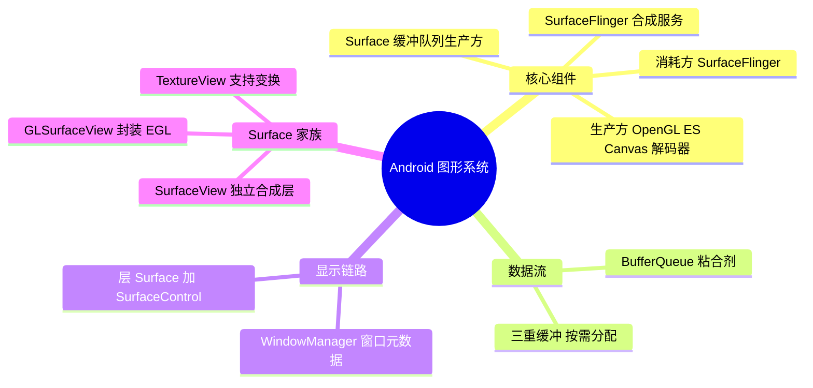
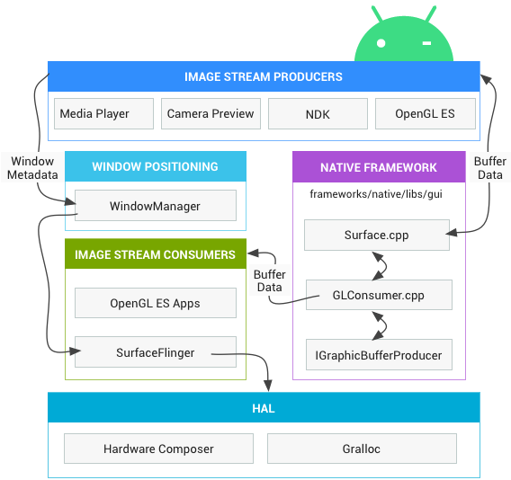
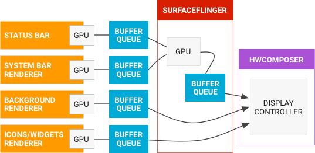
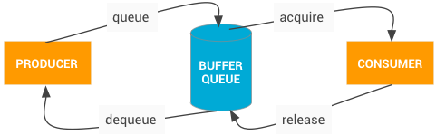

# Android 图形系统

---

## 一、图形组件总览

无论开发者使用什么渲染 API，一切内容都会渲染到 **Surface**。Surface 表示缓冲队列中的生产方，而缓冲队列通常会被 **SurfaceFlinger** 消耗。在 Android 平台上创建的每个窗口都由 Surface 提供支持，所有被渲染的可见 Surface 都被 SurfaceFlinger 合成到显示部分。

- **图像流生产方**：可以是生成图形缓冲区以供消耗的任何内容，例如 OpenGL ES、Canvas 2D 和 mediaserver 视频解码器。
- **图像流消耗方**：最常见的是 SurfaceFlinger，该系统服务会消耗当前可见的 Surface，并使用窗口管理器中提供的信息将它们合成到显示部分。**SurfaceFlinger 是可以修改所显示部分内容的唯一服务**，它使用 OpenGL 和 Hardware Composer 来合成一组 Surface。

---

## 二、数据流：BufferQueue

**BufferQueues 是 Android 图形组件之间的粘合剂**。它们是一对队列，可以调解缓冲区从生产方到消耗方的固定周期。一旦生产方移交其缓冲区，SurfaceFlinger 便会负责将所有内容合成到显示部分。

---

## 三、Surface

Surface 是一个接口，供生产方与使用方交换缓冲区。

用于显示 Surface 的 BufferQueue 通常配置为**三重缓冲**。缓冲区是按需分配的，因此，如果生产方足够缓慢地生成缓冲区（例如在 60 fps 的显示屏上以 30 fps 的速度进行缓冲），队列中可能只有两个分配的缓冲区。按需分配缓冲区有助于最大限度地减少内存消耗。您可以查看 `dumpsys SurfaceFlinger` 输出中与每个层级相关的缓冲区的摘要。

---

## 四、SurfaceView

SurfaceView 是一个组件，可用于在 View 层次结构中嵌入其他合成层。SurfaceView 采用与其他 View 相同的布局参数，因此可以像对待其他任何 View 一样对其进行操作，但 SurfaceView 的内容是透明的。

当您使用外部缓冲区来源（例如 GL 上下文和媒体解码器）进行渲染时，需要从缓冲区来源复制缓冲区，以便在屏幕上显示这些缓冲区，为此可以使用 SurfaceView。

- 当 SurfaceView 的 View 组件即将变得可见时，框架会要求 SurfaceControl 从 SurfaceFlinger 请求新的 Surface。要在创建或销毁 Surface 时收到回调，请使用 **SurfaceHolder** 接口。
- 默认情况下，新创建的 Surface 放置在应用界面 Surface 的**后面**；您可以替换默认的 Z 轴顺序，将新的 Surface 放在前面。
- 在需要渲染到单独的 Surface（例如使用 Camera API 或 OpenGL ES 上下文进行渲染）时，使用 SurfaceView 渲染很有帮助。使用 SurfaceView 渲染时，**SurfaceFlinger 会直接将缓冲区合成到屏幕上**；如果没有 SurfaceView，您需要将缓冲区合成到屏幕上的 Surface，然后该 Surface 再合成到屏幕上，而使用 SurfaceView 进行渲染可以省去额外的工作。使用 SurfaceView 进行渲染后，请使用界面线程与 Activity 生命周期相协调，并根据需要调整 View 的大小或位置，然后硬件混合渲染器会将应用界面与其他层混合在一起。
- 新的 Surface 是 BufferQueue 的生产方，其使用方是 SurfaceFlinger 层。您可以通过任何可向 BufferQueue 馈送资源的机制更新 Surface，例如使用提供 Surface 的 Canvas 函数、附加 EGLSurface 并使用 GLES 在 Surface 上绘制，或者配置媒体解码器以写入 Surface。

---

## 五、SurfaceFlinger 与 WindowManager

### 1. SurfaceFlinger 接受缓冲区的两种方式

SurfaceFlinger 可通过两种方式接受缓冲区：通过 **BufferQueue 和 SurfaceControl**，或通过 **ASurfaceControl**。

以第一种方式为例：当应用进入前台时，它会从 WindowManager 请求缓冲区；然后 WindowManager 会从 SurfaceFlinger 请求层。**层是 Surface（包含 BufferQueue）和 SurfaceControl（包含屏幕框架等层元数据）的组合**。SurfaceFlinger 创建层并将其发送至 WindowManager，然后 WindowManager 将 Surface 发送至应用，但会保留 SurfaceControl 来操控应用在屏幕上的外观。

### 2. WindowManager

WindowManager 会控制窗口对象，它们是用于容纳视图对象的容器。窗口对象始终由 Surface 对象提供支持。WindowManager 会监督生命周期、输入和聚焦事件、屏幕方向、转换、动画、位置、变形、Z 轴顺序以及窗口的许多其他方面。WindowManager 会将所有窗口元数据发送到 SurfaceFlinger，以便 SurfaceFlinger 可以使用这些数据在屏幕上合成 Surface。

---

## 六、View、SurfaceView、GLSurfaceView、TextureView 区别与联系

| 组件 | 特点 |
| --- | --- |
| View | 显示视图，内置画布，提供了图形绘制函数、触屏事件、按键事件函数等，必须在 UI 主线程内更新画面 |
| SurfaceView | 基于 View 视图拓展的视图类，更适合 2D 游戏开发，是 View 的子类，使用了双缓冲机制，**允许在子线程中更新画面** |
| GLSurfaceView | 基于 SurfaceView 再次拓展的视图类，在 SurfaceView 基础上封装了 EGL 环境管理以及 render 线程，专用于 3D 游戏开发，是 SurfaceView 的子类，OpenGL 专用 |
| TextureView | SurfaceView 的工作方式是创建一个置于应用窗口之后的新窗口，脱离了 Android 的普通窗口，因此无法对其应用变换操作（平移、缩放、旋转等），而 TextureView 解决了此问题（Android 4.0 引入） |

---

## 七、30 秒口述版

Android 图形系统的核心是"生产—缓冲—合成"：OpenGL ES、Canvas、解码器等生产方把图形缓冲区写入 **BufferQueue**（窗口通常配三重缓冲，按需分配），**SurfaceFlinger** 作为消耗方，用 OpenGL 和 Hardware Composer 把所有可见 Surface 合成到屏幕，它是唯一能修改显示内容的服务。应用侧窗口由 WindowManager 管理，WindowManager 从 SurfaceFlinger 申请"层"（Surface + SurfaceControl），保留 SurfaceControl 操控外观。SurfaceView 在 View 树中嵌入独立合成层、可在子线程绘制但无法做变换，GLSurfaceView 在其上封装 EGL 与渲染线程，TextureView 则支持平移缩放旋转等变换。
