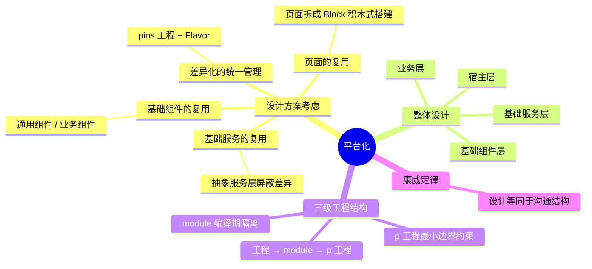

# 平台化

---

## 一、设计方案考虑

1. **差异化的统一管理**：`pins 工程 + Flavor 管理`的方案；
2. **基础服务的复用**：不同 baseActivity 实现多个接口；
3. **基础组件的复用**：基础通用组件、基础业务组件；
4. **页面的复用**——页面模块化：先将页面功能按照业务相似性以及两端差异拆分成高内聚低耦合的功能单元 Block，然后两端页面使用拆分的功能单元 Block 像搭积木似的搭建页面，单个的单元 Block 可以采用 MVP 模式实现。

---

## 二、整体设计

自下而上分四层：

1. **基础服务层**：包含多端统一的基础服务和有差异的基础服务。其中统一的基础服务包括网络库、图片库、统计、监控等；对于登录、分享、定位等外卖 App 和外卖频道两端有差异的部分，通过抽象服务层来屏蔽两端的差异；
2. **基础组件层**：包括统一的两端 Model、埋点、下拉刷新、权限、Toast、A/B 测试、Utils 等两端复用的基础组件；
3. **业务层**：包括外卖的具体业务模块，目前可以分为列表页模块（如首页、金刚页等）、商家模块（如商家页、商品详情页等）和订单模块（如下单页、订单状态页等）。这些业务模块的特点是：模块间复用可能性小，模块内的复用可能性大；
4. **宿主层**：主要是初始化服务，例如 Application 的初始化、dex 加载和其他各种必要组件的初始化。

---

## 三、三级工程结构

指的是**工程 → module → p 工程**的三级结构。

我们可以将任何一个非常复杂的业务工程内部划分成若干个独立单元的 module 工程，同时独立单元的 module 工程，可以继续去划分它内部的独立 p 工程。

- module 具备**编译时**的代码隔离，边界不容易被打破，它可以随时升级为一个工程；
- 需要通信的 p 工程依赖 module 的主目录、base 目录，通过 base 目录实现通信；
- 工程和 module 具有编译上隔离代码的能力，p 工程具有最小约束代码边界的能力。

这样的设计可以使得工程内边界清晰、向下依赖。

---

## 四、康威定律

> 设计系统的组织，其产生的设计等同于组织之内、组织之间的沟通结构。

也就是说：系统的架构会不自觉地映射出组织的沟通结构；反过来，想让架构按期望的方向演进，也要考虑调整团队的组织与协作方式。

---

## 五、30 秒口述版

平台化要解决的是多端（如外卖 App 和外卖频道）复用同一套能力的问题。设计上四点：差异化的统一管理（pins 工程 + Flavor）、基础服务复用（抽象服务层屏蔽差异）、基础组件复用、页面复用（页面拆成 Block 积木式搭建）。整体分四层：基础服务层、基础组件层、业务层、宿主层。工程结构上采用"工程 → module → p 工程"三级结构，靠 module 的编译期隔离保证边界清晰、向下依赖。康威定律提醒我们：架构最终会映射组织的沟通结构。
