# Class与Dex
Class

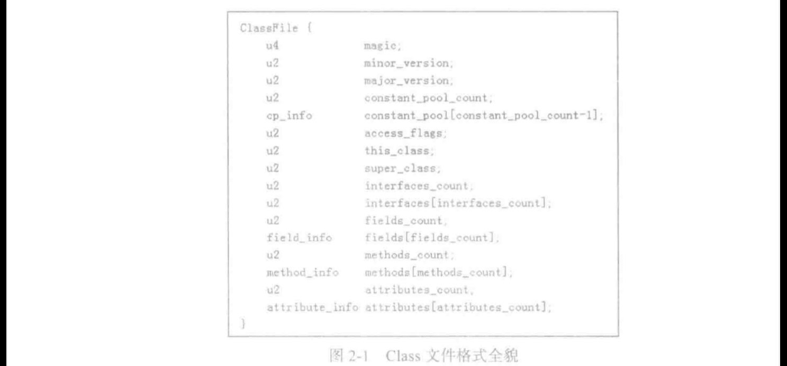

图2-1所示为 Class 文件格式的全貌，下面我们分类来介绍各个字段。
口 根据规范，Class 文件前8个字节依次是magic（4 个字节长，取值必须是 OxCAFEBABE)，
minor version（2 个宇节长，表示该class 文件版本的小版本信息）和major verion ( 2
个字节长，表示该class 文件版本的大版本信息）。
口 constant pool count 表示常量池数组中元素的个数，而 constant pool 是-
一个存储
epinfo信息（cp为constant pool 缩写，译为常量池）的数组。每一个Class 文件都包
含一
-个常量池。常量池在代码中对应为一个数组，其元素的类型就是op\_ info。注意
ep数组的索引从 1 开始。
access\_ filags：标明该类的访问权限，比如 public、private 之类的信息。
this class 和 super class：存储的是指向常量池数组元素的素引。通过这两个索引
和常量池对应元素的内容，我们可以知道本类和父类的类名（只是类名，不包含包名。
类名最终用宇符串描述)。
口 interfaces\_ count 和 interfaces：这两个成员表示该类实现了多少个接口以及接口类的
类名。和this class
- 样，这两个成员也只是常量池数组里的素引号。真正的信息需要
通过解析常量池的内容才能得到。
口 fields\_ count 和 fields：该类包含了成员变量的数量和它们的信息。成员变量信息由
field info 结构体表示。
methods\_ count 和 methods：该类包含了成员两数的数量和它们的信息。成员函数信
息由 method info 结构体表示。
口 attributes\_ count 和 attributes：该类包含的属性信息。属性信息由 attributes\_ info 结构
体表示。属性包含哪些信息呢？ 比如：调试信息就记录了某句代码对应源文件哪一行
两数对应的 Java 字节码也属于属性信息的一种。另外，源文件中的注解也属于属性，

常量池

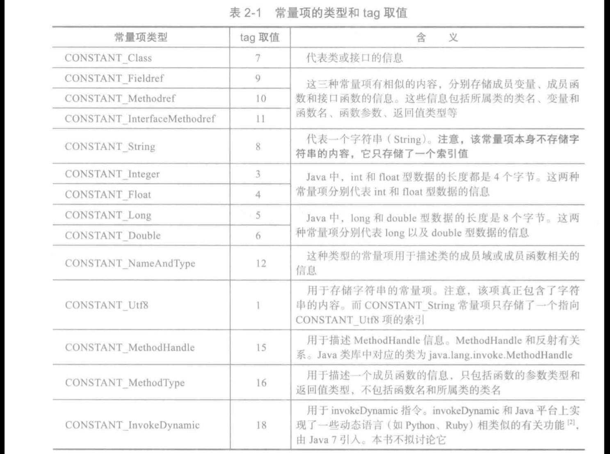

CONSTANT\_ String 和 CONSTANT\_Utf8 的区别
CONSTANT Utf8：该常量项真正存储了宇符串的内容。以后我们将看到此类型常量
项对应的数据结构中有一个字节数组，宇符串就存储在这个字节数组中，
CONSTANT\_ String ：代表了一个宇符串，
但是它本身不包含宇符串的内容，而仅仅
包含一个指向类型为 CONSTANT Utf8常量项的索引。

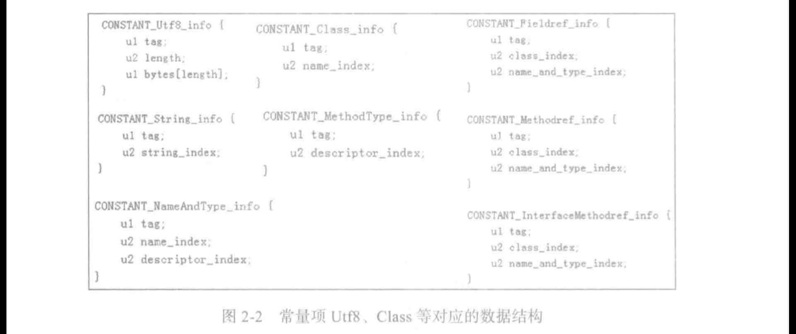

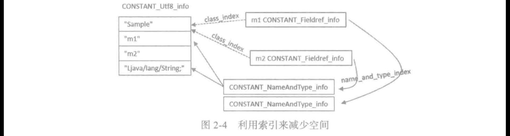

属性

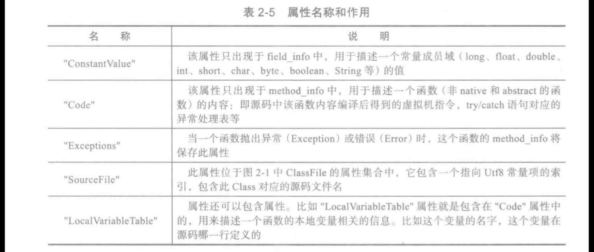

Code

图2-7中 Code attribute 各成员变量的说明如下。
attribute\_name\_index 指向内容为"Code" 的Utf8\_info常量项。attribute\_ Jength 表示
接下来内容的长度。
max\_stack ：JVM执行一个指令的时候，该指令的操作数存储在一个名叫 “操作数栈(operand stack）” 的地方，每一个操作数古用一个或两个（1ong、double 类型的操作数）
栈项。stack 就是
一块只能进行先人后出的内存。max stack 用手说明这个函数在执行
过程中，需要最深名少栈空间（也就是多少栈项）。max locals 表示该两数包括最多
几个局部变量。注意，max stack 和max locals 都和JVM 如何执行一个两数有关。根
据 JVM官方规范，每-
一个两数执行的时候都会分配-
一个操作数栈和局部变量数组。所
以 Code attribute 需要包含这些内容，这样 JVM 在执行两数前就可以分配相应的空间。
code\_ length 和 code：两数对应的指令内容也就是这个函数的源码经过编译器转换后
得到的 Java 指令码存储在code 数组中，其长度由code length 表明。
exception\_table\_length #ll exception table :
-个两数可以包含多个try/catch 语句，
个try/catch 语句对应 exception table 数组中的一项

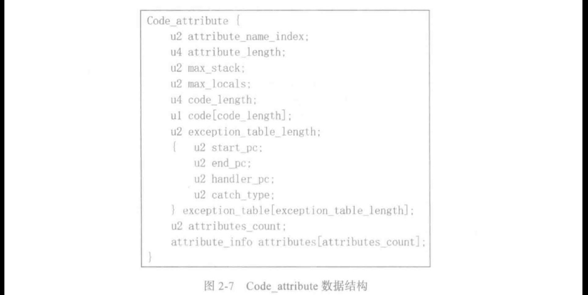

LineNumberTable

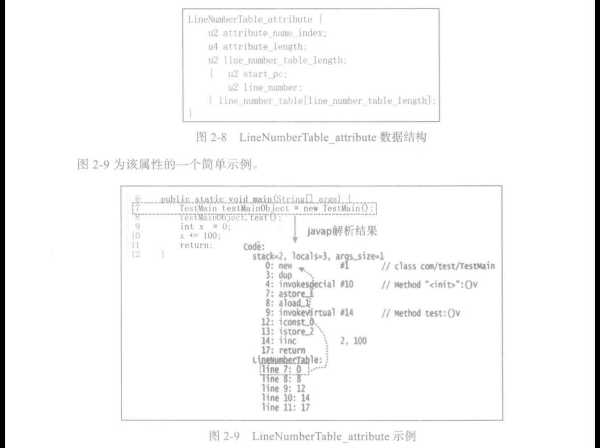

Dex

Android 系统主要针对移动设备，而移动设备的内存、存储空间相对 PC 平台而言较小
并且主要使用 ARM 的 CPU。 这种CPU 有
一个显著特点，就是通用寄存器比较多。在这种情
况下，Class 格式的文件在移动设备上不能扬长避短。比如，2.6.2节介绍 ivokevirtual 指令的
时候，我们看到 Class 文件中指令码执行的时候需要存取操作数栈(operand stack)。而在移动
设备上，由于 ARM 的CPU 有很多通用寄存器，Dex 中的指令码可以利用它们来存取参数。显
然，寄存器的存取速度比位于内存中的操作数栈的存取速度要快得多。

Dex 和Class 文件格式的区别  

3.1.1.1 字节码文件的创建
一个Class 文件对应一个Java 源码文件，而一个Dex 文件可对应多个Java 源码文件。开发者开发一个Java 模块（不管是Jar 包还是 Abk）时：
口在PC平台上，该模块包含的每
- 个Java 源码文件都会对应生成
-个同文件名（不包
含后缀）的.class 文件。这此文件最终打包到-
一个压缩包（即Jar包）中
口而在 Android 平台上，这些Java源码文件的内容最终会编译、
合并到
个名为
classes.dex 的文件中。不过，从编译过程来看，Java 源文件其实会先编译成多个.class
文件，然后再由相关工具将它们合并到 Jar 包或 Apk 包中的 classes.dex 文件中
读者可以推测一下 Dex 文件的这种做法有什么好处。笔者至少能想出如下两个优点：
口 虽然 Class 文件通过素引方式能减少字符串等信息的冗余度，但是多个 Class 文件之间
可能还是有重复字符串等信息。而classes.dex 由于包含了多个 Class 文件的内容．所
以可以进一步去除其中的重复信息
口 如果-
一个Class 文件依赖另外。
一个Class 文件，则虚拟机在处理的时候需要读取另外。
个Class 文件的内容，这可能会导致 CPU 和存储设备进行更多的V/O操作。而 classes.
dex 由于一个文件就包含了所有的信息，相对而言会减少1/O 操作的次数。  

3.1.1.2
字节序
Java 平台上，字节序采用的是 Big Endian。所以，Class 文件的内容也采用 Big Endian
节序来组织其内容。而 Android 平台上的Dex 文件默认的字节序是 Little Endian  

3.1.1.4.2 简短描述
在Dex 文件格式中，Shorty Descriptor (简短描述）用来描述两数的参数和返回值信息，类
似 Class 文件格式的MethodDescriptor。不过，Shorty Descriptor 比 MethodDescriptor 要抵，省
略了好些个字符.  

和 Class 文件的 MethodDescriptor 比较会发现：
MethodDescriptor 描述两数和返回值是"（参数类型）返回值类型"，参数放在括号里，
而 ShortyDescriptor 则是"返回值类型"+" 参数类型 ”，如果有参数就会带参数类型，
没有参数就只有返回值类型。
在 Shorty Descriptor 的 ShortyFieldType 中，引用类型只需要用"L" 表示，而不需要像
MethodDescriptor 那样填写"全路径类名；  

Dex文件概貌

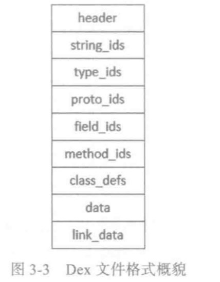

Code\_item

code item 和Class 文件中的Code 属性类似。

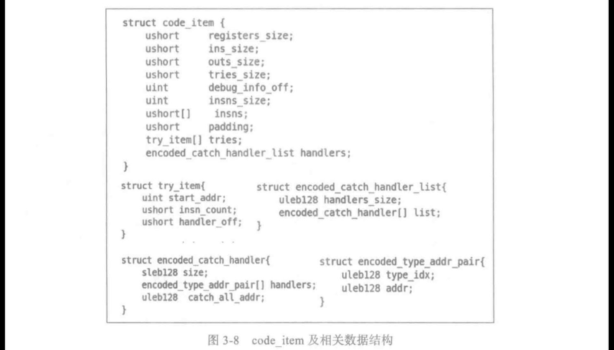

registers\_ size：此两数需要用到的寄存器个数  

ins\_ size：输人参数所占空间，以双字节为单位
outs\_ size：该两数表示内部调用其他西数时，所需参数占用的空间。同样以双字节为单位。
口 insns size 和 insns 数组：指令码数组的长度和指令码的内容。Dex 文件格式中 JVM
指令码长度为2个字节，而 Class 文件中JVM指令码长度为1个字节。
口tries\_size 和 tries 数组：如果该两数内部有ry语句块，则tries\_ size 和tries 数组用
于描述try语句块相关的信息。注意，tries 数组是可选项，如果 tries\_ size 为0，则此
code item 不包含tries 数组。
padding：用于将 tries 数组（如果有，并且 insns\_ size 是奇数长度的话）进行4字节对齐
handlers: catch 语句对应的内容，也是可选项。如果 tries size 不为零才有handlers 域。  

Dex 指令码介绍
Dex 指令码的条数和 Class 指令码差不多，
都不超过255条，但是 Dex 文件中存储函数
内容的 insns 数组（位于code\_item 结构体里，见图3-8）却比 Class 文件中存储西数内容的
code 数组（位于 Code 属性中，见第2 章图 2-7）解析起来要有难度。其中
—个原因是 Android
虚拟机在执行指令码的时候不需要操作数栈，所有参数要么和 Class 指令码
-样直接跟在指令码
后面，要么就存储在奇存器中。对于参数位于寄存器中的指令，指令码就需要携带一些信息来表示
该指令执行时需要操作哪些寄存器。  

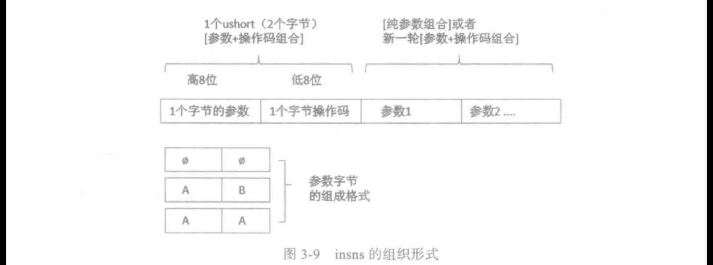

Dex 指令码日的长度还是1个字节，所以指令码的个数不会超过 255条。但是和 Class
指令码不同的是，Dex 指令码与第一个参数混在一起构成了一个双字节元素存储在
insns 内。在这个双字节中，低8位才是指令码，高8位是参数。笔者称这种双字节元
素为\[参数＋操作码组合 \]。
口\[参数＋操作码组合】后的下一个ushort 双字节元素可以是新一组的\[参数＋操作码组
合\]，也可以是\[纯参数组合了。
口 参数组合的格式也有要求，不同的字符代表不同的参数，参数的比特位长度又是由字
符的个数决定。  

指令码规则

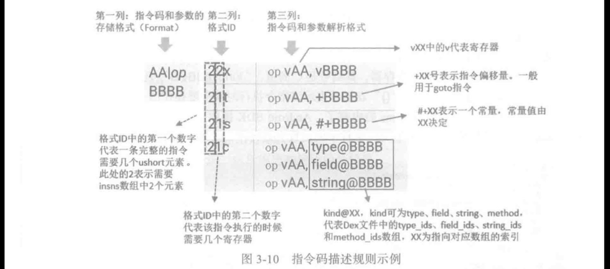

第一列叫Format，指明指令码和参数的存储格式，也就是我们在图3-9中介绍的
insns 内容的组织形式。
口第二列叫 Format 1D，简称 1D，其内容包含两个数字和一到多个后级字符。其中，第
-个数字表示一条完整的指令（即执行该指令需要的指令码和参数）包含几个 ushort
元素，第二个数字表示这条指令将用到几个寄存器。另外，数字后面的后缀字符也有
含义，不过其含义比较琐碎，本文不拟介绍。
口第三列则具体展示了各个参数的用法。读者尤其要注意其中特殊字符的含义，比如
\*，
• “#＋” 和诸如“kind@〞这样的字符串的含义。

由第
一列 Format 可知
- 共有A、BBBB、C、D、E、F、G7个参数。每个参数的位长
由代表该参数的字符的个数决定。即，除了BBBB 是16位长之外，其他6 个参数都
是4位。Format 同时还指明了这7个参数位于 ushort 元素中的位置。  

第二列D的“35c” 可知，这种类型的指令需要 了个ushort 元素，并且需要5个寄
存器
口 第三列给出符合第二列 ID格式的指令的具体表现形式。其中，\[A=X\] 表示 A 参数取值
为x。
“vC〞表示某个奇存器，其编号是C 的值，“kind@BBBB” 表示 BBBB 为指向
xxxids 的素引。另外，“{〞花括号表示该指令执行时候需要操作的-
-组寄存器