# Class 与 Dex

> 图片摘自《深入理解 Android：Java 虚拟机 ART》，按主题归档。

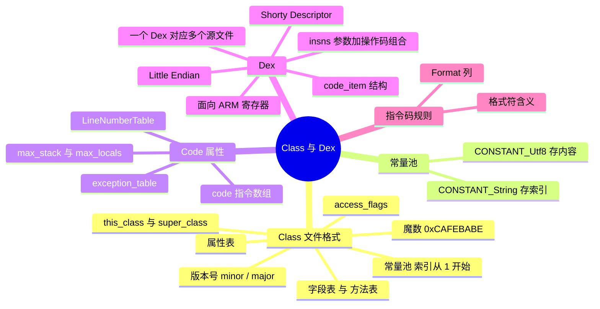
```mermaid
mindmap
  root((Class 与 Dex))
    Class 文件格式
      魔数 0xCAFEBABE
      版本号 minor / major
      常量池 索引从 1 开始
      access_flags
      this_class 与 super_class
      字段表 与 方法表
      属性表
    常量池
      CONSTANT_Utf8 存内容
      CONSTANT_String 存索引
    Code 属性
      max_stack 与 max_locals
      code 指令数组
      exception_table
      LineNumberTable
    Dex
      面向 ARM 寄存器
      一个 Dex 对应多个源文件
      Little Endian
      Shorty Descriptor
      code_item 结构
      insns 参数加操作码组合
    指令码规则
      Format 列
      格式符含义
```

---

## 一、Class 文件格式总览

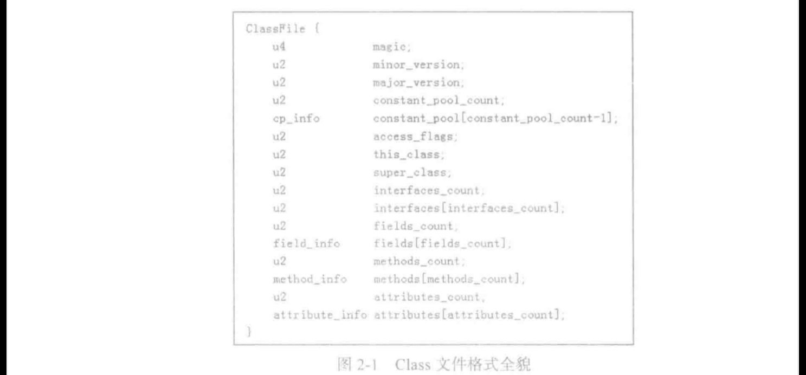

图 2-1 所示为 Class 文件格式的全貌，分类介绍各字段：

- 根据规范，Class 文件**前 8 个字节**依次是：
  - `magic`（4 个字节长，取值必须是 `0xCAFEBABE`）；
  - `minor_version`（2 个字节长，表示该 class 文件版本的小版本信息）；
  - `major_version`（2 个字节长，表示该 class 文件版本的大版本信息）。
- `constant_pool_count` 表示常量池数组中元素的个数，而 `constant_pool` 是一个存储 `cp_info` 信息（cp 为 constant pool 缩写，译为常量池）的数组。每一个 Class 文件都包含一个常量池，常量池在代码中对应为一个数组，其元素的类型就是 `cp_info`。注意 **cp 数组的索引从 1 开始**。
- `access_flags`：标明该类的访问权限，比如 public、private 之类的信息。
- `this_class` 和 `super_class`：存储的是指向常量池数组元素的索引。通过这两个索引和常量池对应元素的内容，可以知道本类和父类的类名（**只是类名，不包含包名**，类名最终用字符串描述）。
- `interfaces_count` 和 `interfaces`：这两个成员表示该类实现了多少个接口以及接口类的类名。和 `this_class` 一样，这两个成员也只是常量池数组里的索引号，真正的信息需要通过解析常量池的内容才能得到。
- `fields_count` 和 `fields`：该类包含了成员变量的数量和它们的信息。成员变量信息由 `field_info` 结构体表示。
- `methods_count` 和 `methods`：该类包含了成员函数的数量和它们的信息。成员函数信息由 `method_info` 结构体表示。
- `attributes_count` 和 `attributes`：该类包含的属性信息，由 `attribute_info` 结构体表示。属性包含哪些信息呢？比如：调试信息就记录了某句代码对应源文件哪一行；函数对应的 Java 字节码也属于属性信息的一种；另外，源文件中的注解也属于属性。

---

## 二、常量池：CONSTANT_Utf8 与 CONSTANT_String

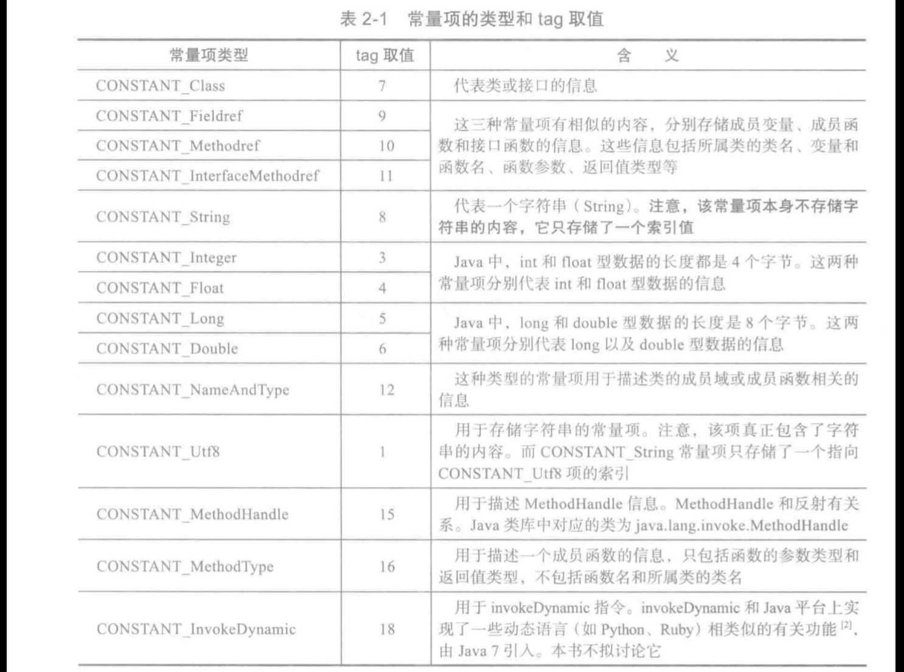

- **CONSTANT_Utf8**：该常量项真正存储了字符串的内容。此类型常量项对应的数据结构中有一个字节数组，字符串就存储在这个字节数组中。
- **CONSTANT_String**：代表了一个字符串，但是它本身不包含字符串的内容，而仅仅包含一个指向类型为 CONSTANT_Utf8 常量项的索引。

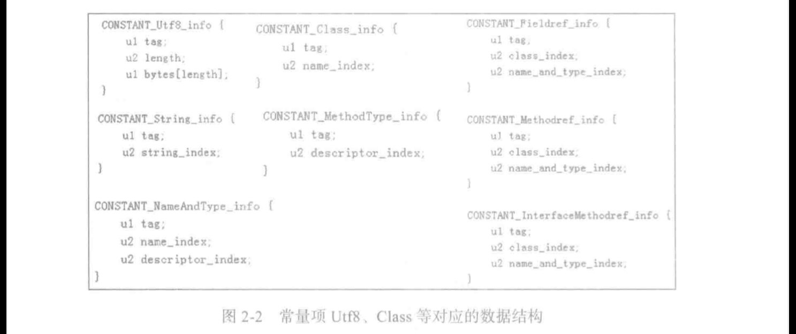

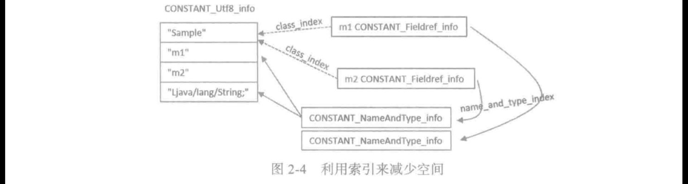

---

## 三、属性与 Code 属性

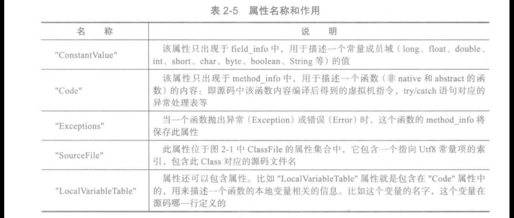

图 2-7 中 Code attribute 各成员变量的说明如下：

- `attribute_name_index` 指向内容为 "Code" 的 `Utf8_info` 常量项；`attribute_length` 表示接下来内容的长度。
- `max_stack`：JVM 执行一个指令的时候，该指令的操作数存储在一个名叫"操作数栈（operand stack）"的地方，每一个操作数占用一个或两个（long、double 类型的操作数）栈顶。栈就是一块只能进行先进后出的内存。`max_stack` 用于说明这个函数在执行过程中需要最深多少栈空间（也就是多少栈顶）。
- `max_locals` 表示该函数包括最多几个局部变量。注意，`max_stack` 和 `max_locals` 都和 JVM 如何执行一个函数有关。根据 JVM 官方规范，每一个函数执行的时候都会分配一个操作数栈和局部变量数组，所以 Code attribute 需要包含这些内容，这样 JVM 在执行函数前就可以分配相应的空间。
- `code_length` 和 `code`：函数对应的指令内容，也就是这个函数的源码经过编译器转换后得到的 Java 指令码，存储在 `code` 数组中，其长度由 `code_length` 表明。
- `exception_table_length` 和 `exception_table`：一个函数可以包含多个 try/catch 语句，一个 try/catch 语句对应 exception table 数组中的一项。

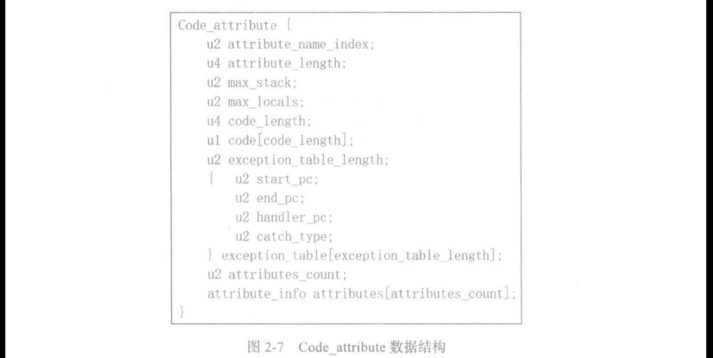

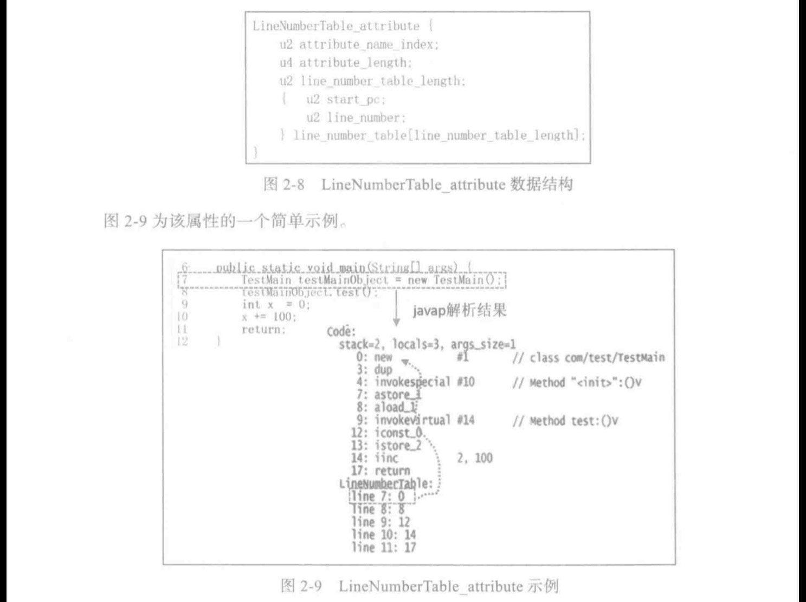

---

## 四、Dex：为什么移动设备上用 Dex

Android 系统主要针对移动设备，而移动设备的内存、存储空间相对 PC 平台而言较小，并且主要使用 ARM 的 CPU。这种 CPU 有一个显著特点，就是**通用寄存器比较多**。在这种情况下，Class 格式的文件在移动设备上不能扬长避短。比如 `invokevirtual` 指令执行的时候，Class 文件中指令码需要存取操作数栈（operand stack）。而在移动设备上，由于 ARM 的 CPU 有很多通用寄存器，**Dex 中的指令码可以利用它们来存取参数**——显然，寄存器的存取速度比位于内存中的操作数栈的存取速度要快得多。

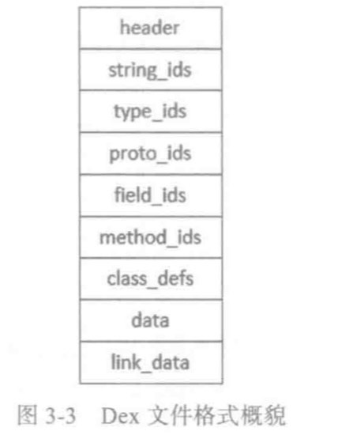

### 1. 字节码文件的创建方式

- 一个 Class 文件对应一个 Java 源码文件，而一个 Dex 文件可对应多个 Java 源码文件。开发者开发一个 Java 模块（不管是 Jar 包还是 Apk）时：
  - 在 PC 平台上，该模块包含的每一个 Java 源码文件都会对应生成一个同文件名（不包含后缀）的 `.class` 文件，这些文件最终打包到一个压缩包（即 Jar 包）中；
  - 而在 Android 平台上，这些 Java 源码文件的内容最终会编译、合并到一个名为 `classes.dex` 的文件中。不过，从编译过程来看，Java 源文件其实会先编译成多个 `.class` 文件，然后再由相关工具将它们合并到 Jar 包或 Apk 包中的 `classes.dex` 文件中。
- Dex 文件这种做法的好处至少有两点：
  1. 虽然 Class 文件通过索引方式能减少字符串等信息的冗余度，但是多个 Class 文件之间可能还是有重复字符串等信息。而 `classes.dex` 由于包含了多个 Class 文件的内容，所以可以进一步去除其中的重复信息；
  2. 如果一个 Class 文件依赖另外一个 Class 文件，则虚拟机在处理的时候需要读取另外一个 Class 文件的内容，这可能会导致 CPU 和存储设备进行更多的 I/O 操作。而 `classes.dex` 由于一个文件就包含了所有的信息，相对而言会减少 I/O 操作的次数。

### 2. 字节序

Java 平台上，字节序采用的是 **Big Endian**，所以 Class 文件的内容也采用 Big Endian 字节序来组织；而 Android 平台上的 Dex 文件默认的字节序是 **Little Endian**。

### 3. Shorty Descriptor（简短描述）

在 Dex 文件格式中，Shorty Descriptor 用来描述函数的参数和返回值信息，类似 Class 文件格式的 MethodDescriptor。不过，Shorty Descriptor 比 MethodDescriptor 要短，省略了好些个字符。和 Class 文件的 MethodDescriptor 比较会发现：

- MethodDescriptor 描述函数和返回值是"（参数类型）返回值类型"，参数放在括号里；而 ShortyDescriptor 则是"返回值类型"+"参数类型"，如果有参数就会带参数类型，没有参数就只有返回值类型。
- 在 Shorty Descriptor 的 ShortyFieldType 中，引用类型只需要用 "L" 表示，而不需要像 MethodDescriptor 那样填写"全路径类名"。

---

## 五、Dex 文件结构：Code_item

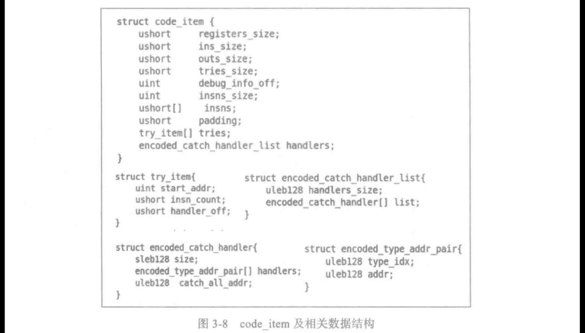

`code_item` 和 Class 文件中的 Code 属性类似，各成员说明如下：

- `registers_size`：此函数需要用到的寄存器个数。
- `ins_size`：输入参数所占空间，以双字节为单位。
- `outs_size`：该函数表示内部调用其他函数时，所需参数占用的空间，同样以双字节为单位。
- `insns_size` 和 `insns` 数组：指令码数组的长度和指令码的内容。Dex 文件格式中指令码长度为 **2 个字节**，而 Class 文件中指令码长度为 1 个字节。
- `tries_size` 和 `tries` 数组：如果该函数内部有 try 语句块，则用于描述 try 语句块相关的信息。注意，tries 数组是可选项，如果 `tries_size` 为 0，则此 code_item 不包含 tries 数组。
- `padding`：用于将 tries 数组（如果有，并且 `insns_size` 是奇数长度的话）进行 4 字节对齐。
- `handlers`：catch 语句对应的内容，也是可选项。如果 `tries_size` 不为零才有 handlers 域。

---

## 六、Dex 指令码介绍

Dex 指令码的条数和 Class 指令码差不多，都不超过 255 条。但是 Dex 文件中存储函数内容的 `insns` 数组（位于 `code_item` 结构体里）却比 Class 文件中存储函数内容的 `code` 数组（位于 Code 属性中）解析起来要有难度。其中一个原因是：Android 虚拟机在执行指令码的时候**不需要操作数栈**，所有参数要么和 Class 指令码一样直接跟在指令码后面，要么就存储在寄存器中。对于参数位于寄存器中的指令，指令码就需要携带一些信息来表示该指令执行时需要操作哪些寄存器。

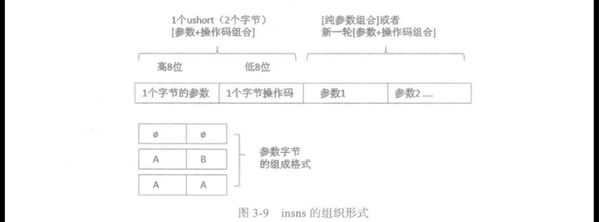

Dex 指令码的长度还是 1 个字节，所以指令码的个数不会超过 255 条。但是和 Class 指令码不同的是，**Dex 指令码与第一个参数混在一起构成了一个双字节元素存储在 `insns` 内**。在这个双字节中，低 8 位才是指令码，高 8 位是参数。笔者称这种双字节元素为"[参数＋操作码组合]"：

- [参数＋操作码组合]后的下一个 ushort 双字节元素可以是新一组的[参数＋操作码组合]，也可以是[纯参数组合]。
- 参数组合的格式也有要求，不同的字符代表不同的参数，参数的比特位长度又是由字符的个数决定。

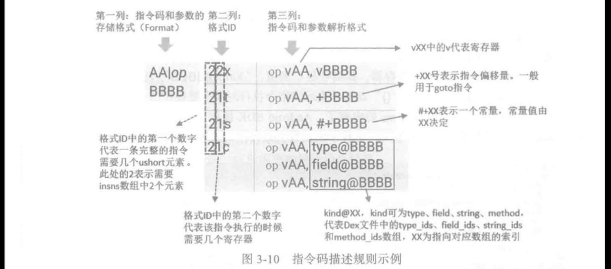

指令码规则表的三列含义：

- 第一列叫 **Format**，指明指令码和参数的存储格式，也就是 `insns` 内容的组织形式。
- 第二列是 **Format ID**（简称 ID），其内容包含两个数字和一到多个后缀字符。其中，第一个数字表示一条完整的指令（即执行该指令需要的指令码和参数）包含几个 ushort 元素，第二个数字表示这条指令将用到几个寄存器。另外，数字后面的后缀字符也有含义，不过其含义比较琐碎。
- 第三列则具体展示了各个参数的用法，尤其要注意其中特殊字符的含义，比如 `*`、`#+` 和诸如 `kind@` 这样的字符串的含义。

以 `A|BBBB|C|D|E|F|G` 格式为例：由第一列 Format 可知一共有 A、BBBB、C、D、E、F、G 7 个参数。每个参数的位长由代表该参数的字符的个数决定，即除了 BBBB 是 16 位长之外，其他 6 个参数都是 4 位。Format 同时还指明了这 7 个参数位于 ushort 元素中的位置。

再看第二列 ID 的 "35c"：可知这种类型的指令需要 3 个 ushort 元素，并且需要 5 个寄存器。第三列给出符合第二列 ID 格式的指令的具体表现形式。其中，`[A=X]` 表示 A 参数取值为 X，`vC` 表示某个寄存器（其编号是 C 的值），`kind@BBBB` 表示 BBBB 为指向 xxxids 的索引。另外，花括号 `{` 表示该指令执行时候需要操作的一组寄存器。
