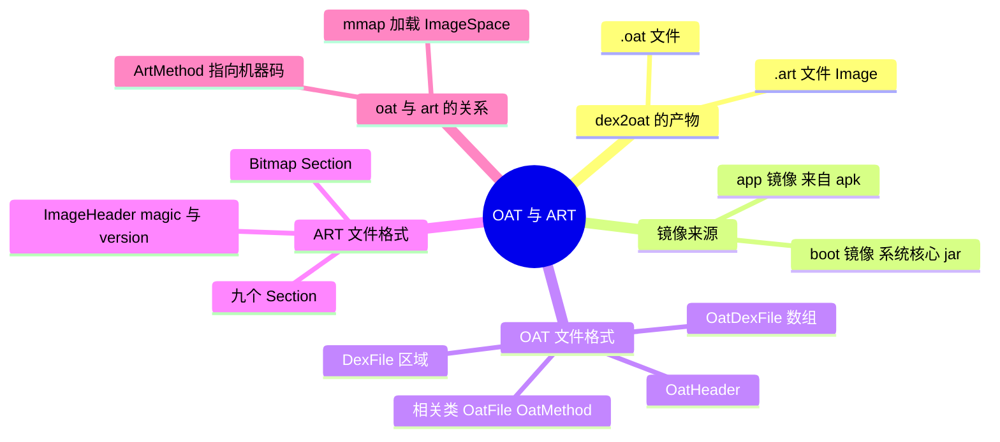
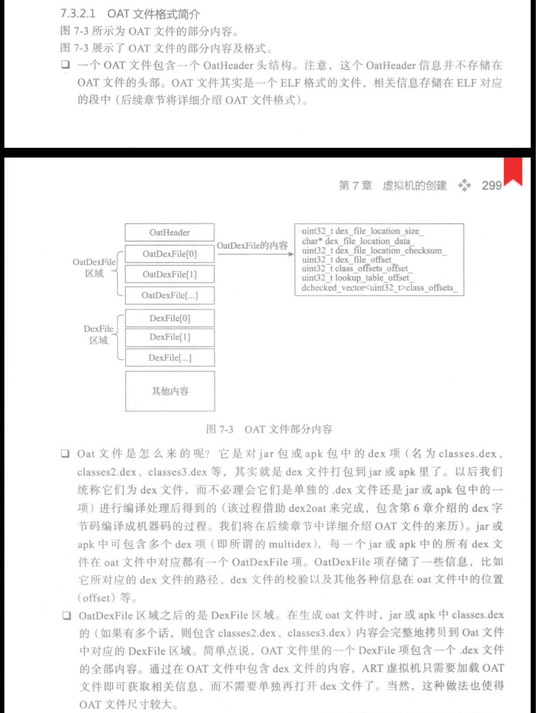
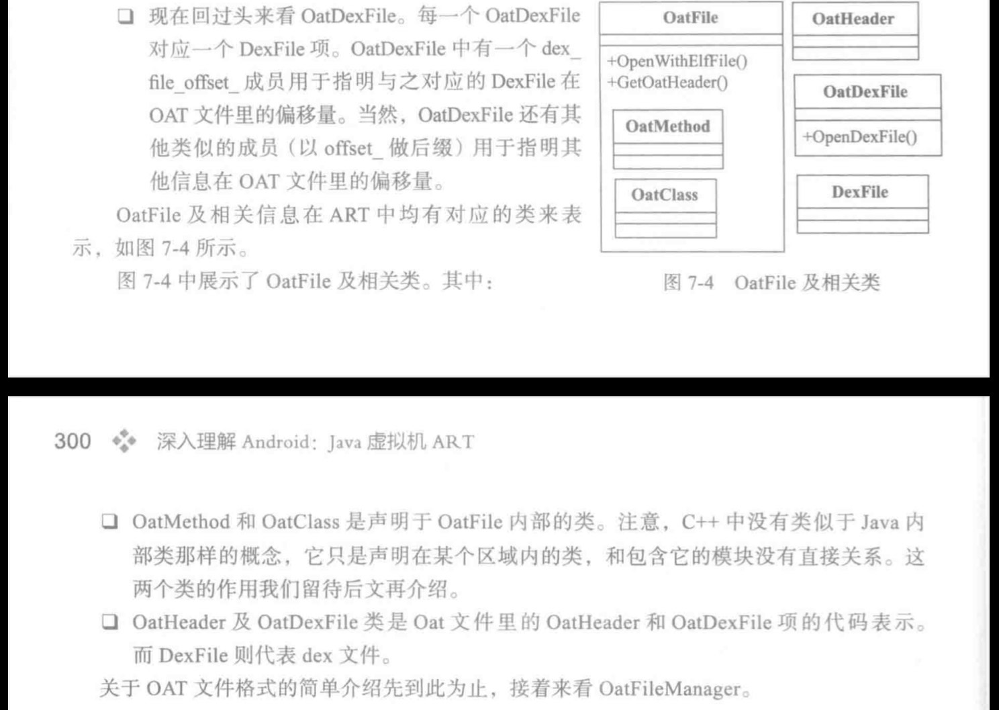
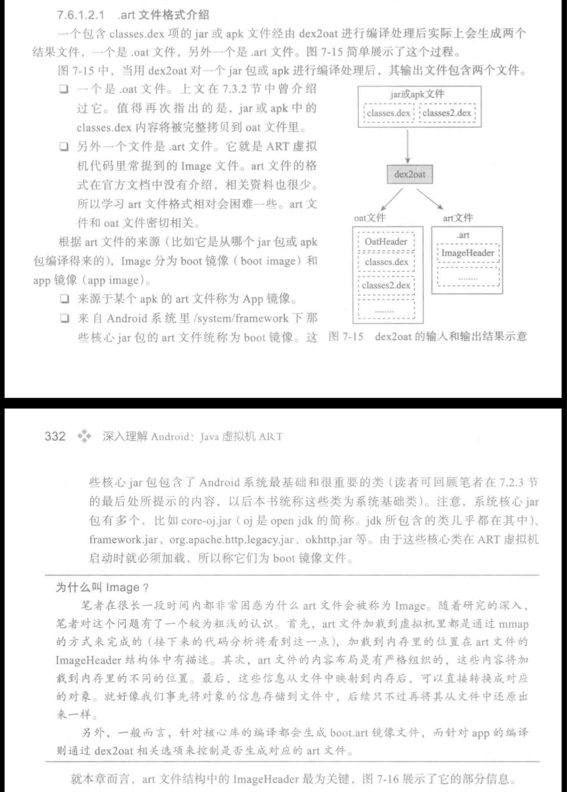
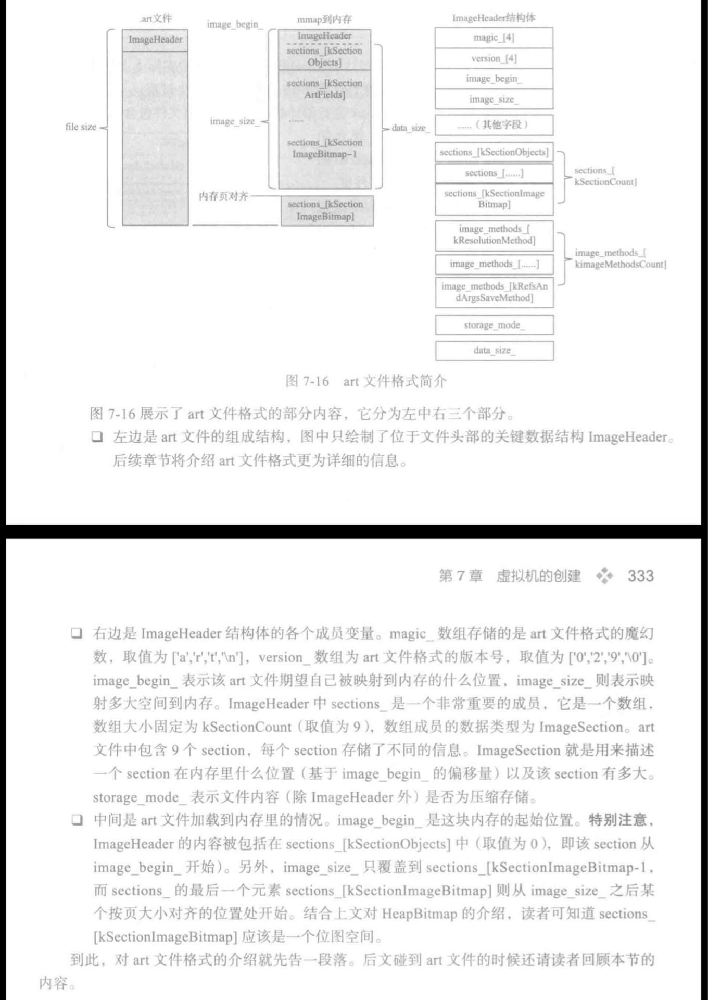
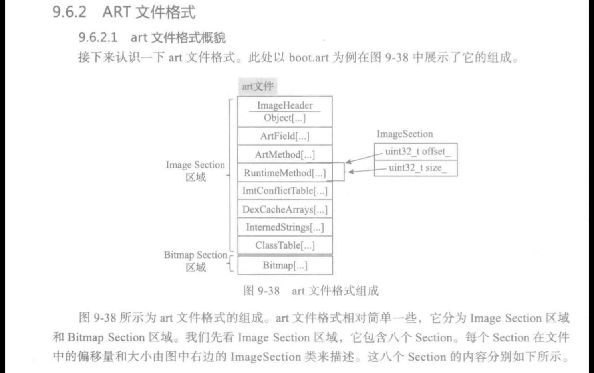
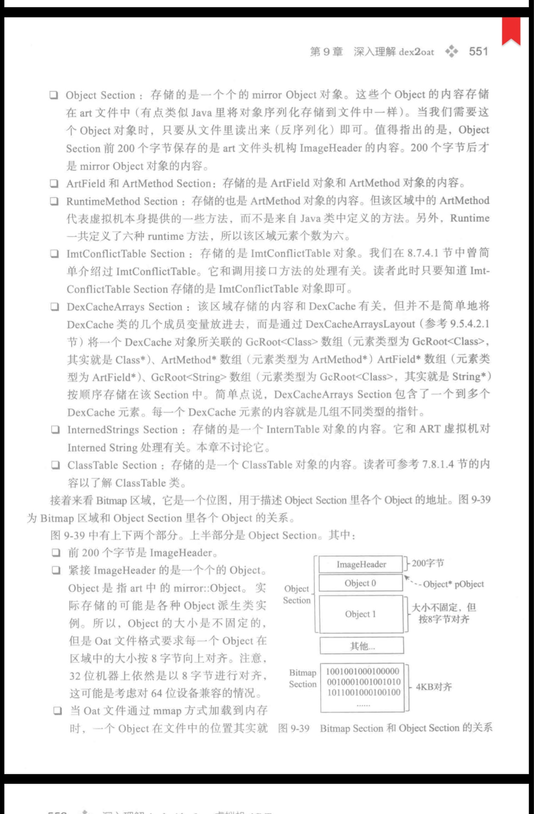
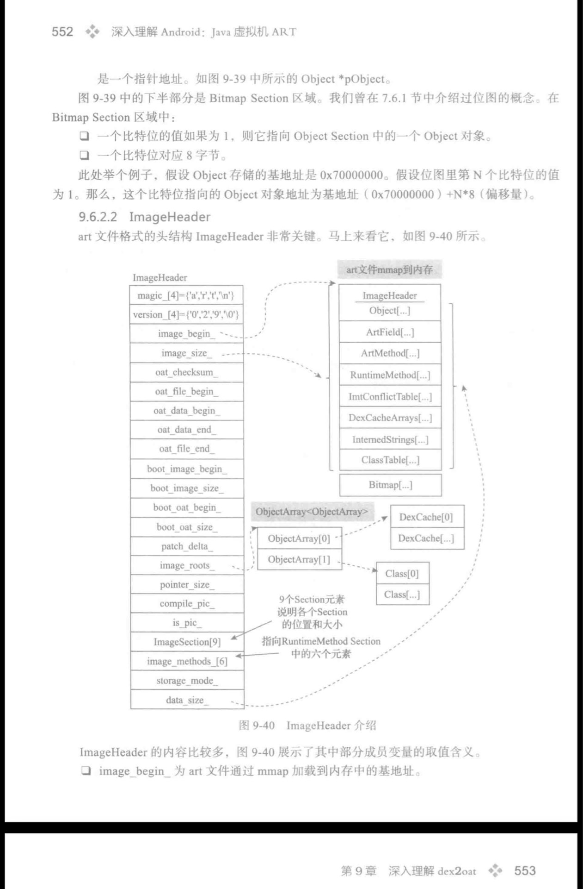
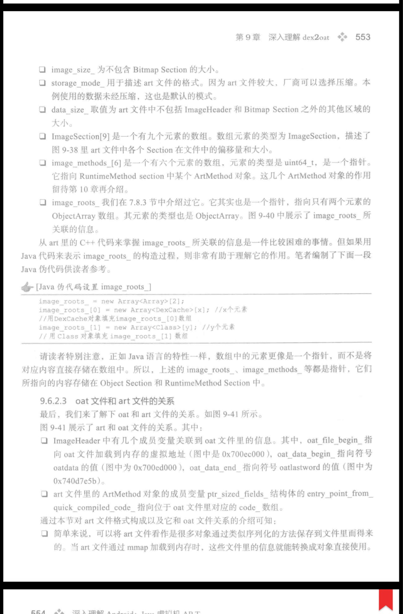
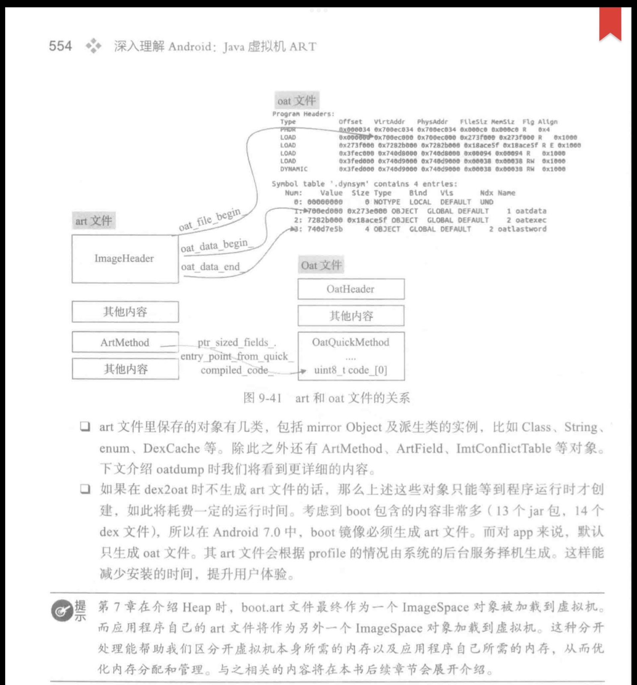

# OAT 与 ART 文件

> 图片摘自《深入理解 Android：Java 虚拟机 ART》第 7、9 章。

---

## 一、dex2oat 的产物：.oat 与 .art

一个包含 classes.dex 项的 jar 或 apk 文件，经由 **dex2oat** 进行编译处理后实际上会生成两个结果文件：一个是 `.oat` 文件，另外一个是 `.art` 文件。

- **OAT 文件**：OAT 文件其实是一个 **ELF 格式的文件**，一个 OAT 文件包含一个 OatHeader 头结构。注意，这个 OatHeader 信息并不存储在 OAT 文件的头部，相关信息存储在 ELF 对应的段中。
- 在 OAT 文件内部：OatHeader 之后是 **OatDexFile 区域**，再之后是 **DexFile 区域**。jar 或 apk 中可包含多个 dex 项（即所谓的 multidex），每一个 dex 文件在 oat 文件中都对应一个 OatDexFile 项，其中存储了 dex 文件的路径、校验以及各种信息在 oat 文件中的位置（offset）等。
- 生成 oat 文件时，classes.dex（如果有多个则是 classes2.dex、classes3.dex 等）的内容会**完整地拷贝**到 OAT 文件中对应的 DexFile 区域。通过在 OAT 文件中包含 dex 文件的内容，ART 虚拟机只需要加载 OAT 文件即可获取相关信息，而不需要单独再打开 dex 文件了；当然，这也使得 OAT 文件尺寸较大。
- OAT 文件在 ART 中有对应的 C++ 类来表示：OatFile（`OpenWithElfFile`、`GetOatHeader`）、OatHeader、OatDexFile（`OpenDexFile`）、DexFile，以及声明于 OatFile 内部的 OatMethod 和 OatClass。

---

## 二、镜像（Image）的来源：boot 镜像与 app 镜像

`.art` 文件就是 ART 虚拟机代码里常提到的 **Image 文件**。根据 art 文件的来源（比如它是从哪个 jar 或 apk 包编译得来的），Image 分为 **boot 镜像（boot image）** 和 **app 镜像（app image）**：

- 来源于某个 apk 的 art 文件称为 App 镜像；
- 来自 Android 系统里 `/system/framework` 下那些核心 jar 包的 art 文件统称为 boot 镜像。这些核心 jar 包（如 `core-oj.jar`、`framework.jar`、`org.apache.http.legacy.jar`、`okhttp.jar` 等）包含了 Android 系统最基础和最重要的类，它们在 ART 虚拟机启动时就必须加载，所以称其为 boot 镜像文件。

**为什么叫 Image？** art 文件加载到虚拟机里都是通过 **mmap** 的方式完成的，加载到内存里的位置在 art 文件的 ImageHeader 结构体中有描述；art 文件的内容布局是有严格组织的，这些内容将加载到内存里的不同位置；这些信息从文件中映射到内存后，可以直接转换成对应的对象——就好像事先将对象的信息存储到文件中，后续只不过再将其从文件中还原出来一样。另外，一般而言，针对核心库的编译都会生成 `boot.art` 镜像文件，而针对 app 的编译则通过 dex2oat 相关选项来控制是否生成对应的 art 文件。

---

## 三、ART 文件格式：ImageHeader 与 Section

art 文件格式相对简单一些，它分为 **Image Section 区域**和 **Bitmap Section 区域**，其中 Image Section 区域包含八个 Section（加上 Bitmap Section 共九个），每个 Section 在文件中的偏移量和大小由 ImageSection 类来描述：

- **ImageHeader** 最为关键，各成员变量包括：`magic_` 数组存储 art 文件格式的魔幻数，取值为 `['a','r','t','\n']`；`version_` 数组为 art 文件格式的版本号；`image_begin_` 表示该 art 文件期望自己被映射到内存的什么位置；`image_size_` 则表示映射多大空间到内存；`sections_` 是一个大小固定为 kSectionCount（取值为 9）的数组，数组成员的数据类型为 ImageSection；`storage_mode_` 表示文件内容（除 ImageHeader 外）是否为压缩存储；`data_size_` 为数据大小。
- **Object Section**：存储一个个 mirror Object 对象，内容存储在 art 文件中（有点类似 Java 里将对象序列化存储到文件中一样），需要时从文件里读出来（反序列化）即可。注意 Object Section 前 200 个字节保存的是 art 文件头结构 ImageHeader 的内容，200 字节后才是 mirror Object 对象的内容，且每个 Object 大小按 8 字节向上对齐（32 位机器上也是，可能是考虑对 64 位设备兼容）。
- **ArtField 和 ArtMethod Section**：存储 ArtField 对象和 ArtMethod 对象的内容。
- **RuntimeMethod Section**：存储的也是 ArtMethod 对象的内容，但代表虚拟机自身提供的一些方法，而不是来自 Java 类中定义的方法（Runtime 一共定义了六种 runtime 方法，所以该区域元素个数为六）。
- **ImtConflictTable Section**：存储 ImtConflictTable 对象，和调用接口方法的处理有关。
- **DexCacheArrays Section**：通过 DexCacheArraysLayout 将一个 DexCache 对象所关联的 `GcRoot<Class>[]`（即 Class*）、`ArtMethod*[]`、`ArtField*[]`、`GcRoot<String>[]`（即 String*）按顺序存储在该 Section 中。简单点说，DexCacheArrays Section 包含了一个到多个 DexCache 元素，每一个 DexCache 元素的内容就是几组不同类型的指针。
- **InternedStrings Section**：存储一个 InternTable 对象的内容，和 ART 虚拟机对 Interned String 处理有关。
- **ClassTable Section**：存储一个 ClassTable 对象的内容。
- **Bitmap Section**：一个位图，用于描述 Object Section 里各个 Object 的地址（按 4KB 对齐）。

---

## 四、OAT 与 ART 的关系

- art 文件里保存的对象有几类，包括 mirror Object 及派生类的实例（比如 Class、String、enum、DexCache 等），除此之外还有 ArtMethod、ArtField、ImtConflictTable 等对象。
- art 文件中的 **ArtMethod** 通过 `ptr_sized_fields_.entry_point_from_quick_compiled_code_` 指向 oat 文件中 **OatQuickMethod** 的 `code_`（即编译产出的机器码），这就是 oat 与 art 文件的联系：**art 存对象快照，oat 存机器码**。
- 如果在 dex2oat 时不生成 art 文件，那么上述这些对象只能等到程序运行时才创建，如此将耗费一定的运行时间。考虑到 boot 包含的内容非常多（13 个 jar 包、14 个 dex 文件），所以在 Android 7.0 中，boot 镜像必须生成 art 文件；而对 app 来说，默认只生成 oat 文件，其 art 文件会根据 profile 的情况由系统的后台服务择机生成，这样能减少安装的时间、提升用户体验。
- 加载时，`boot.art` 文件最终作为一个 **ImageSpace** 对象被加载到虚拟机，而应用程序自己的 art 文件将作为另外一个 ImageSpace 对象加载——这种分开处理能帮助我们区分开虚拟机本身所需的内存以及应用程序自己所需的内存，从而优化内存分配和管理。

