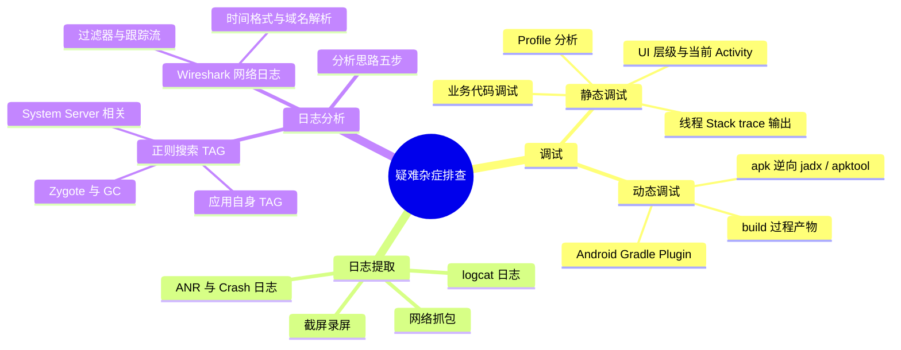

# Android 疑难杂症排查

---

## 一、调试

### 1. 静态调试

**（1）UI 调试**

- 查询当前屏幕界面所在（对应）的 Activity；
- Inspect 当前正在调试的前台 App 的 UI 层级和信息；
- dump 当前屏幕界面的 UI 树层级信息（pull 之后打开对应的 xml 即可查看）；
- 属性动画：可以在开发者选项中调整大小和时长缩放，比如加大时长缩放值，则可以以类似慢镜头的方式查看动画效果。

**（2）内存、CPU、电量、网络分析等 Profiler 调试**

**（3）业务代码调试**

- 打印断点撞击信息；
- 打印当前线程的方法调用堆栈：Java 并发编程是无法避免的，Android 中 Handler/Message 机制的引入，有的时候跟踪调用堆栈比较困难，该方法可以很高效地进行追踪；
- 进行表达式求值并打印；
- 打印 Stack trace：
  - `Thread.dumpStack()`；
  - 异常；
- 输出所有线程的 Stack trace：
  - 断点调试时直接向应用进程发送 SIGNAL_QUIT 信号（SIGNAL_QUIT = 3，定义在 `android.os.Process.java`），可在断点调试时 Evaluate Expression：`android.os.Process.sendSignal(android.os.Process.myPid(), android.os.Process.SIGNAL_QUIT);`
  - `adb bugreport`，`adb shell "cat /data/anr/dumptrace_xxxx" > YourLogFileName.log`。

### 2. 动态调试

- Android Gradle Plugin；
- build 过程产物；
- apk 逆向：jadx、apktool。

---

## 二、日志提取

- **截屏和录屏**；
- **网络日志**：`.cap` 或 `.pcap`；
- **logcat 日志**：只需要包含 default 缓冲区（即包含 main、system、crash buffers）和 events 缓冲区信息即可；
- **ANR 或 Crash 日志**：logcat 日志中包含的 crash 缓冲区日志较少。Android 系统在应用 ANR 时会将 ANR 详细的 stack trace 信息写入到 `/data/anr/traces.txt`（较低的操作系统版本中）或 `/data/anr/anr_*`（较新的操作系统版本中）；对于 NDK crash，系统则会将 crash 的 stack trace 信息写入到 `/data/tombstones/` 目录中的子文件。如果 `adb pull` 命令拉取这些日志提示无权限，请采用 `adb bugreport` 方式拉取。

---

## 三、日志分析

### 1. 分析思路

1. 根据 bug 描述或者现象，对问题进行分类和初步的判断（ANR / crash / 业务逻辑问题 / 其他等）；
2. 如果有 bug 发生时的截屏或录屏，从中找到 bug 发生时的时间段（最好是精确的时间点）；
3. 分析 logcat 日志信息（如是 ANR 则需附带分析 ANR trace 文件，如果是 NDK crash 则需附带分析 tombstones 中的 stack trace 文件）；
4. 如果涉及网络交互，需要结合分析网络抓包日志；
5. 找到问题点，并将思路、关键日志摘录、总结一并保存到单独的一个文本文件（比如取名 analyze.txt）。

### 2. 用正则表达式搜索相关 TAG

- **a. 应用进程号**：每个应用的包名不同，或者都会输出一些特定的 TAG 信息，可以先用普通字符串搜索快速定位到进程号；如果是 ANR 问题，则可以直接考虑应用主线程（此时即为 PID，主线程的线程 ID 和进程号相同）标记作为搜索 TAG；
- **b. System Server 进程**所在的进程号及其包含子服务的打印标记：System Server 是系统核心进程之一，AMS（TAG 为 ActivityManager）和 WMS（TAG 为 WindowManager）等核心服务均运行在该进程中。可以以该进程号本身作为搜索 TAG，也可以该进程中各种系统服务运行时打印的 TAG 作为搜索 TAG，常见的包括 InputChannel、InputDispatcher、ActivityManager（及其厂商封装变体）、WindowManager（及其厂商封装变体）、PackageManager、Process 等。Note：这里需要对 System Server 进程以及 Android Framework 层提供的常用服务有所了解，同时结合 bug 类型来合适选取系统关键日志标记作为搜索 TAG；
- **c. Zygote 进程相关的 TAG**：应用 App 进程是由 Zygote 进程孵化（fork）而来，在应用进程启动和终止的时候，Zygote 进程会打印相关信息（如果日志信息完整，就可以知道应用进程的起止时间，了解整个进程生命周期）；
- **d.（可选）系统其他有用的 TAG**：比如垃圾回收信息，GC 时 dalvikvm 和 ART 都会打印相关日志，可以采用 dalvikvm 和 art 作为搜索 TAG，详细的说明请参见 memory-logs；
- **e. 应用本身的日志 TAG**：业务代码中主动打印的有用信息。比如 A 模块的开发人员在该模块内统一采用 A 作为 TAG，那么搜索的正则字符串就可以采用 A。这就要求：业务内部的日志打印一定要全局设计，各个子模块可以隔离开，同时模块内部的日志打印需要有层次（比如以 TAG 树的方式）；
- **系统 events 事件 TAG**：
  - `frameworks/base/services/core/java/com/android/server/am/EventLogTags.logtags`
  - `frameworks/base/core/java/android/app/ActivityManager.java`

### 3. 网络日志（Wireshark）

- **时间格式**：Wireshark 打开网络抓包文件之后，时间默认是相对时间（自捕获开始经过的秒数），因此需要改变时间的展示格式，使之与 logcat 日志同一风格，便于时间定位和拉通对比。设置路径："视图" → "时间显示格式" → "日期和时间"；
- **域名解析**：默认显示的源 IP 地址（Source）和目的 IP 地址（Destination）为十进制格式，如果需要转换成域名方式，可以打开网络地址解析选项，设置路径："视图" → "Name Resolution" → "解析网络地址"。Note：慎用该选项，因为一个域名可能对应多个 IP；
- **过滤器**：充分利用 Wireshark 的"应用显示过滤器"和"显示过滤器"。"应用显示过滤器"主要用于设置过滤协议、端口等，可以有多个子条件，多个条件之间如果是"与"，则用 and 或 &&，如果是"或"的关系，则用 or 或 ||。进入 Wireshark 界面，按组合键 Ctrl + F 即可打开"显示过滤器"，这与文本编辑器搜索文本类似，可以直接搜索某个文本、十六进制值，也可以进行正则搜索；
- **跟踪流**：该功能非常有用，一旦找到一条与业务服务器的通信报文，先选中该报文，然后点击鼠标右键，在弹出菜单中选择"追踪流"（支持 TCP/UDP/TLS 等），整个会话从头到尾包含的报文就全部筛选出来了；
- **导出功能**：一次抓包文件包含了抓包时间范围内整个手机的通信报文，但与我们应用进程相关的报文只是其中一部分，或者我们只关注其中一些与 bug 有关的报文，则先采用前述步骤筛选出报文，然后选中或标记这些报文，再通过"文件" → "导出特定分组"。

---

## 四、30 秒口述版

排查疑难杂症分三步：调试、日志提取、日志分析。调试上，静态调试用 UI 层级/Profiler/断点打印堆栈（`Thread.dumpStack()`、SIGNAL_QUIT 输出所有线程栈），动态调试看 Gradle 产物和 apk 逆向。日志提取要凑齐截屏录屏、网络抓包、logcat（default + events 缓冲区）、ANR/Crash 日志（`/data/anr/`、`/data/tombstones/`，无权限用 adb bugreport）。分析时先分类（ANR/crash/业务），再按时间段对齐日志，用正则搜应用进程号、System Server、Zygote、GC 等关键 TAG，网络问题用 Wireshark 的时间格式对齐、过滤器、跟踪流定位。
