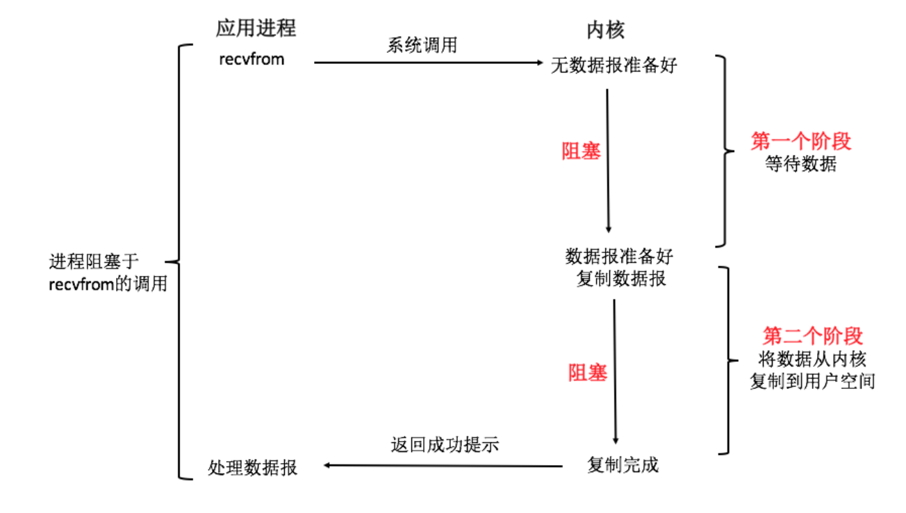
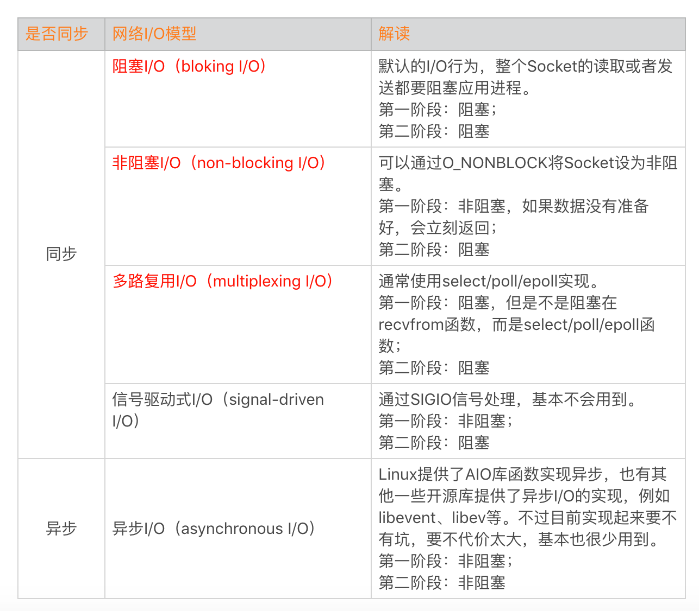
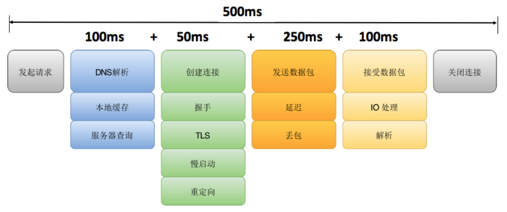
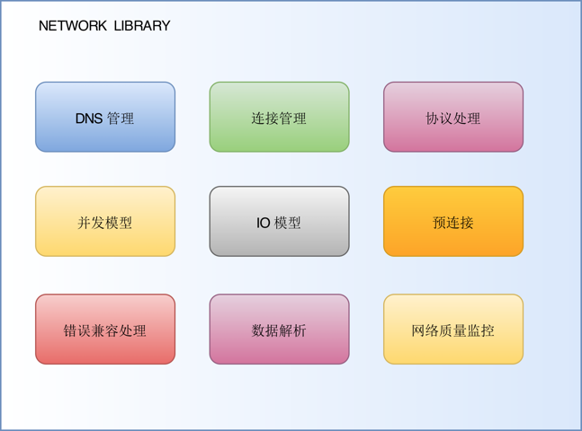
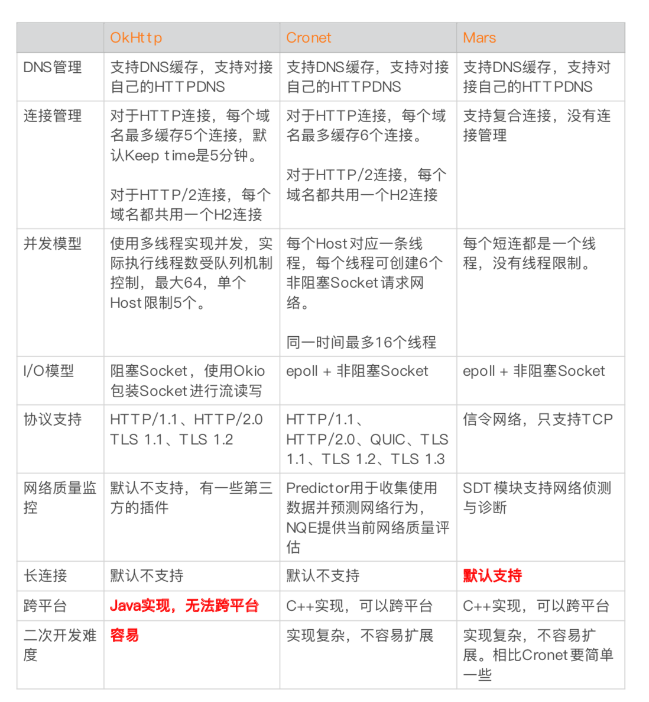

# IO模型
如下图以 Socket 读取数据 recvfrom 调用为例，它整个 I/O 流程分为两个阶段：
* 等待 Socket 数据准备好。
* 将数据从内核拷贝到应用进程中 。

网络IO的本质是socket的读取，socket在linux系统被抽象为流，IO可以理解为对流的操作。刚才说了，对于一次IO访问（以read举例），数据会先被拷贝到操作系统内核的缓冲区中，然后才会从操作系统内核的缓冲区拷贝到应用程序的地址空间。所以说，当一个read操作发生时，它会经历两个阶段：
第一阶段：等待数据准备 (Waiting for the data to be ready)。
第二阶段：将数据从内核拷贝到进程中 (Copying the data from the kernel to the process)。
对于socket流而言，
第一步：通常涉及等待网络上的数据分组到达，然后被复制到内核的某个缓冲区。
第二步：把数据从内核缓冲区复制到应用进程缓冲区。

# 常见的IO模型
阻塞、非阻塞、IO多路复用，异步

* 同步阻塞
当用户进程调用了recv()/recvfrom()这个系统调用，kernel就开始了IO的第一个阶段：准备数据
（对于网络IO来说，很多时候数据在一开始还没有到达。比如，还没有收到一个完整的UDP包。这个时候kernel就要等待足够的数据到来）。这个过程需要等待，也就是说数据被拷贝到操作系统内核的缓冲区中是需要一个过程的。而在用户进程这边，整个进程会被阻塞（当然，是进程自己选择的阻塞）。第二个阶段：当kernel一直等到数据准备好了，它就会将数据从kernel中拷贝到用户内存，然后kernel返回结果，用户进程才解除block的状态，重新运行起来。所以，blocking IO的特点就是在IO执行的两个阶段都被block了。

* 同步非阻塞
同步非阻塞就是 “每隔一会儿瞄一眼进度条” 的轮询（polling）方式。在这种模型中，设备是以非阻塞的形式打开的。这意味着 IO 操作不会立即完成，read 操作可能会返回一个错误代码，说明这个命令不能立即满足（EAGAIN 或 EWOULDBLOCK）。在网络IO时候，非阻塞IO也会进行recvform系统调用，检查数据是否准备好，与阻塞IO不一样，"非阻塞将大的整片时间的阻塞分成N多的小的阻塞, 所以进程不断地有机会 '被' CPU光顾"。
也就是说非阻塞的recvform系统调用调用之后，进程并没有被阻塞，内核马上返回给进程，如果数据还没准备好，此时会返回一个error。进程在返回之后，可以干点别的事情，然后再发起recvform系统调用。重复上面的过程，循环往复的进行recvform系统调用。这个过程通常被称之为轮询。轮询检查内核数据，直到数据准备好，再拷贝数据到进程，进行数据处理。需要注意，拷贝数据整个过程，进程仍然是属于阻塞的状态。

* IO多路复用
IO多路复用有两个特别的系统调用select、poll、epoll函数。select调用是内核级别的，select轮询相对非阻塞的轮询的区别在于---前者可以等待多个socket，能实现同时对多个IO端口进行监听，当其中任何一个socket的数据准好了，就能返回进行可读，然后进程再进行recvform系统调用，将数据由内核拷贝到用户进程，当然这个过程是阻塞的。select或poll调用之后，会阻塞进程，与blocking IO阻塞不同在于，此时的select不是等到socket数据全部到达再处理, 而是有了一部分数据就会调用用户进程来处理。如何知道有一部分数据到达了呢？监视的事情交给了内核，内核负责数据到达的处理。也可以理解为"非阻塞"吧。I/O复用模型会用到select、poll、epoll函数，这几个函数也会使进程阻塞，但是和阻塞I/O所不同的的，这两个函数可以同时阻塞多个I/O操作。而且可以同时对多个读操作，多个写操作的I/O函数进行检测，直到有数据可读或可写时（注意不是全部数据可读或可写），才真正调用I/O操作函数。

# 文件描述符
文件描述符在形式上是一个非负整数。实际上，它是一个索引值，指向内核为每一个进程所维护的该进程打开文件的记录表。当程序打开一个现有文件或者创建一个新文件时，内核向进程返回一个文件描述符。在程序设计中，一些涉及底层的程序编写往往会围绕着文件描述符展开。但是文件描述符这一概念往往只适用于UNIX、Linux这样的操作系统。
## 网络优化的三个方向
速度，弱网，安全

* HTTPDNS代替LOCALDNS,需要和运维系统打通
* 创建连接要经过TCP三次握手、TLS密钥协商,连接建立的代价是非常大的。这里我们主要的优化思路是复用连接,这样不用每次请求都重新建立连接。在前面我就讲过连接管理,网络库并不会立刻把连接释放,而是放到连接池中。这时如果有另个请求的域名和端口是一样的,就直接拿岀连接池中的连接进行发送和接收数据,少了建立连接的耗时。
这里我们利用HTTP协议里的keep-ave,而HTP/2.0的多路复用则可以进一步的提升连接复用率。它复用的这条连接支持同时处理多条请求,所有请求都可以并发在这条连接上进行。
* 压缩

# Https的优化有下面几个思路

* 连接复用率。通过多个域名共用同一个HTTP/2连接、长连接等方式提升连接复用率。
* 减少握手次数。TLS1.3可以实现0-RTT协商,事实上在TLS1.3 release之前,微信的mmts、 Facebook的zz、阿里的 SlightSSL都已在企业内部大规模部署。
* 性能提升。使用ecc证书代替RSA,服务端签名的性能可以提升4~10倍,但是客户端校验
性能降低了约20倍,从10微秒级降低到100微秒级。另外一方面可以通过 Session Ticket
会话复用,节省一个RTT耗时。
使用 Https之后,整个通道是不是就一定高枕无忧呢?如果客户端设置了代理,TLS加密的数据可以被解开并可能被利用。这个时候我们可以在客户端将“证书锁定”( CertificatePinning),为了老版本兼容和证书替换的灵活性,建议锁定根证书。

# 网络库的核心内容

