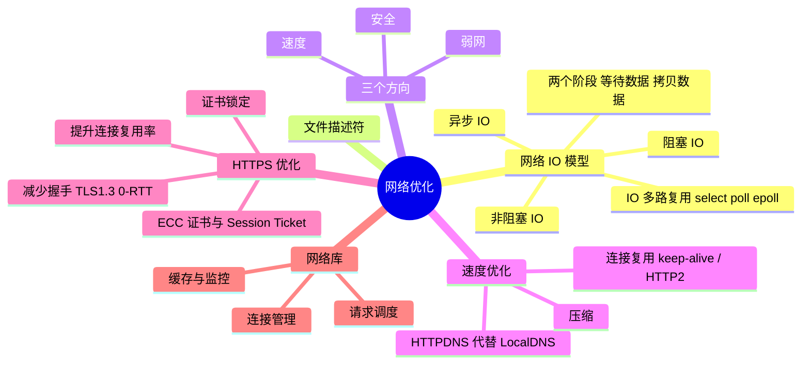
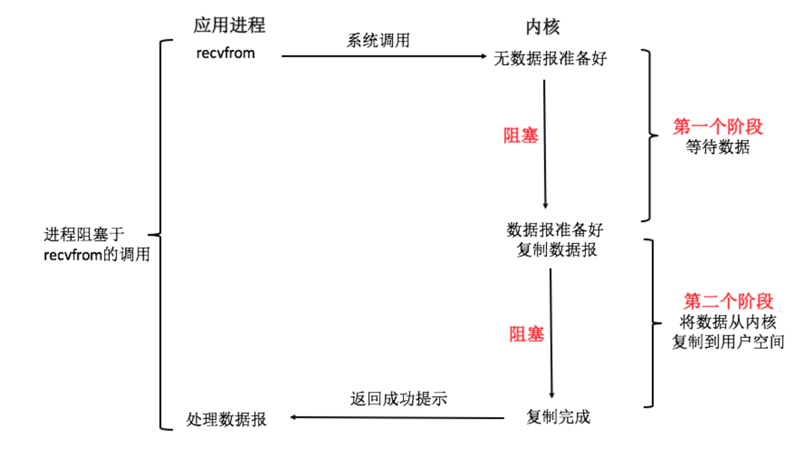
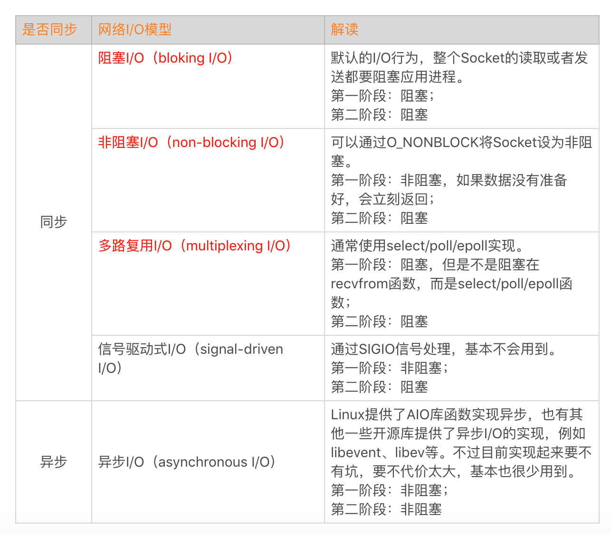
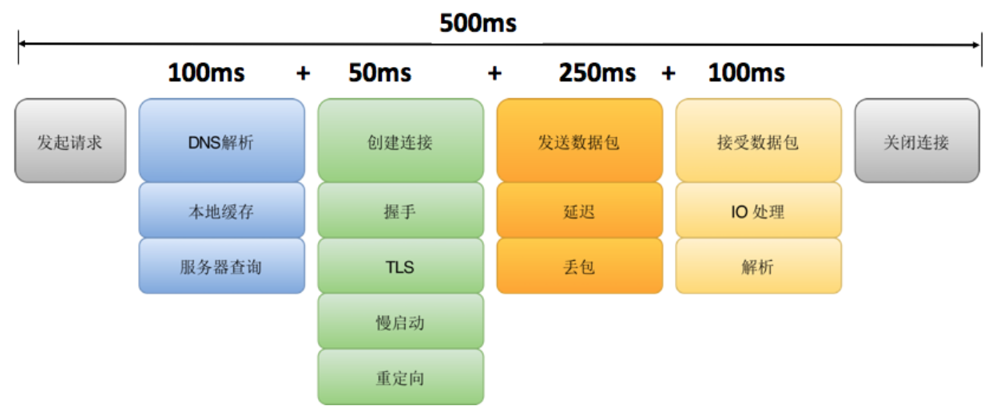
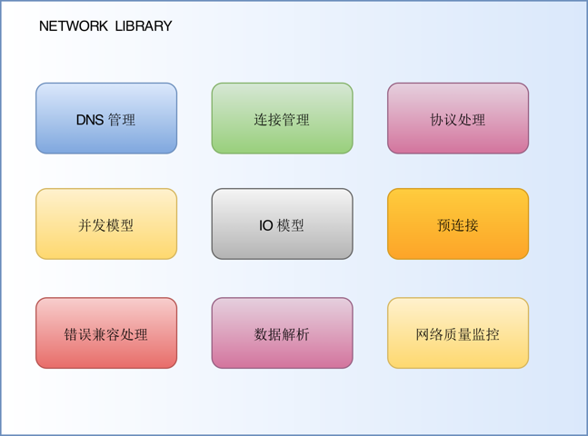
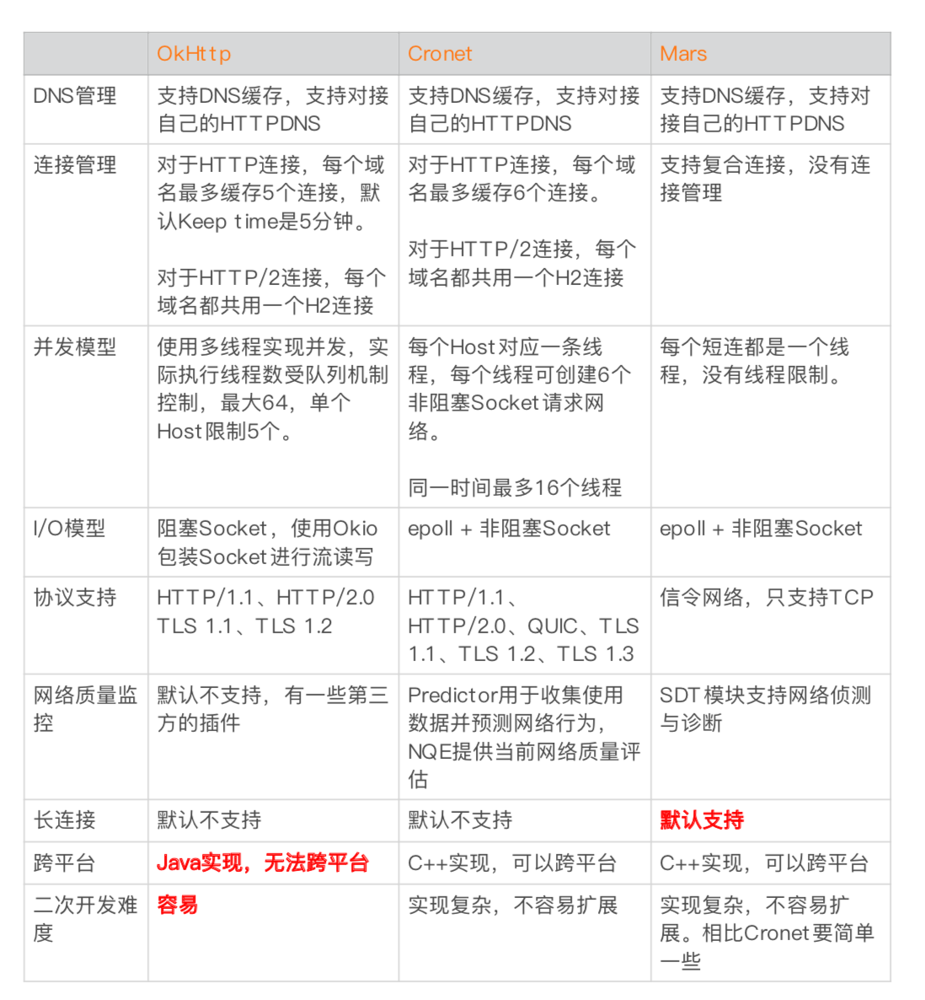

# 网络优化

```mermaid
mindmap
  root((网络优化))
    网络 IO 模型
      两个阶段 等待数据 拷贝数据
      阻塞 IO
      非阻塞 IO
      IO 多路复用 select poll epoll
      异步 IO
    文件描述符
    三个方向
      速度
      弱网
      安全
    速度优化
      HTTPDNS 代替 LocalDNS
      连接复用 keep-alive / HTTP2
      压缩
    HTTPS 优化
      提升连接复用率
      减少握手 TLS1.3 0-RTT
      ECC 证书与 Session Ticket
      证书锁定
    网络库
      连接管理
      请求调度
      缓存与监控
```

---

## 一、网络 IO 的两个阶段

如下图以 Socket 读取数据 `recvfrom` 调用为例，它整个 I/O 流程分为两个阶段：

1. 等待 Socket 数据准备好；
2. 将数据从内核拷贝到应用进程中。

网络 IO 的本质是 socket 的读取，socket 在 Linux 系统被抽象为流，IO 可以理解为对流的操作。对于一次 IO 访问（以 read 举例），数据会先被拷贝到操作系统内核的缓冲区中，然后才会从内核缓冲区拷贝到应用程序的地址空间：

- **第一阶段**：等待数据准备（Waiting for the data to be ready）；
- **第二阶段**：将数据从内核拷贝到进程中（Copying the data from the kernel to the process）。

对于 socket 流而言：第一步通常涉及等待网络上的数据分组到达，然后被复制到内核的某个缓冲区；第二步把数据从内核缓冲区复制到应用进程缓冲区。

---

## 二、常见的 IO 模型

常见的有阻塞、非阻塞、IO 多路复用、异步四种。

### 1. 同步阻塞

当用户进程调用了 `recv()/recvfrom()` 这个系统调用，kernel 就开始了 IO 的第一个阶段：准备数据（对于网络 IO 来说，很多时候数据一开始还没有到达，比如还没有收到一个完整的 UDP 包，这个时候 kernel 就要等待足够的数据到来）。这个过程需要等待，也就是说数据被拷贝到操作系统内核的缓冲区中是需要一个过程的；而在用户进程这边，整个进程会被阻塞（当然是进程自己选择的阻塞）。第二个阶段：当 kernel 一直等到数据准备好了，它就会将数据从 kernel 中拷贝到用户内存，然后 kernel 返回结果，用户进程才解除 block 的状态，重新运行起来。所以 **blocking IO 的特点就是在 IO 执行的两个阶段都被 block 了**。

### 2. 同步非阻塞

同步非阻塞就是"每隔一会儿瞄一眼进度条"的轮询（polling）方式。在这种模型中，设备是以非阻塞的形式打开的，这意味着 IO 操作不会立即完成，read 操作可能会返回一个错误代码，说明这个命令不能立即满足（EAGAIN 或 EWOULDBLOCK）。

在网络 IO 时候，非阻塞 IO 也会进行 `recvfrom` 系统调用，检查数据是否准备好。与阻塞 IO 不一样，"非阻塞将大的整片时间的阻塞分成 N 多的小的阻塞，所以进程不断地有机会'被' CPU 光顾"。也就是说非阻塞的 `recvfrom` 调用之后，进程并没有被阻塞，内核马上返回给进程：如果数据还没准备好，此时会返回一个 error。进程在返回之后，可以干点别的事情，然后再发起 `recvfrom` 系统调用，重复上面的过程，循环往复。这个过程通常被称之为**轮询**：轮询检查内核数据，直到数据准备好，再拷贝数据到进程，进行数据处理。需要注意，**拷贝数据整个过程，进程仍然是属于阻塞的状态**。

### 3. IO 多路复用

IO 多路复用有 select、poll、epoll 这几个特别的系统调用。select 轮询相对非阻塞轮询的区别在于——前者可以等待多个 socket，能实现同时对多个 IO 端口进行监听，当其中任何一个 socket 的数据准备好了，就能返回进行可读，然后进程再进行 `recvfrom` 系统调用，将数据由内核拷贝到用户进程，当然这个过程是阻塞的。

select 或 poll 调用之后会阻塞进程，与 blocking IO 阻塞不同在于：此时的 select 不是等到 socket 数据全部到达再处理，而是有了一部分数据就会调用用户进程来处理。如何知道有一部分数据到达了呢？监视的事情交给了内核，内核负责数据到达的处理，也可以理解为"非阻塞"。这几个函数也会使进程阻塞，但是和阻塞 I/O 不同的是，它们可以同时阻塞多个 I/O 操作，而且可以同时对多个读操作、多个写操作的 I/O 函数进行检测，直到有数据可读或可写时（注意不是全部数据可读或可写），才真正调用 I/O 操作函数。

### 4. 异步 IO

发起读写后立即返回，内核完成"数据就绪 + 数据拷贝"后通过信号或回调通知进程，两个阶段都不阻塞（详见 [NIO 与 IO](../../Java/NIO与IO.md) 的五种 IO 模型一节）。

---

## 三、文件描述符

文件描述符在形式上是一个**非负整数**。实际上，它是一个索引值，指向内核为每一个进程所维护的该进程打开文件的记录表。当程序打开一个现有文件或者创建一个新文件时，内核向进程返回一个文件描述符。在程序设计中，一些涉及底层的程序编写往往会围绕着文件描述符展开。但是文件描述符这一概念往往只适用于 UNIX、Linux 这样的操作系统。

---

## 四、网络优化的三个方向

速度、弱网、安全。

---

## 五、速度优化

### 1. HTTPDNS 代替 LocalDNS

用 HTTPDNS 代替 LocalDNS 可以绕过运营商 LocalDNS 的解析异常与调度不准问题，需要和运维系统打通。

### 2. 连接复用

创建连接要经过 TCP 三次握手、TLS 密钥协商，连接建立的代价是非常大的。这里我们主要的优化思路是**复用连接**，这样不用每次请求都重新建立连接。网络库并不会立刻把连接释放，而是放到连接池中；这时如果有另一个请求的域名和端口是一样的，就直接拿出连接池中的连接进行发送和接收数据，少了建立连接的耗时。这里我们利用 HTTP 协议里的 keep-alive，而 HTTP/2.0 的多路复用则可以进一步提升连接复用率——它复用的这条连接支持同时处理多条请求，所有请求都可以并发在这条连接上进行。

### 3. 压缩

对传输的数据做压缩（如 gzip），减小请求与响应的包体，降低弱网下的传输耗时。

---

## 六、弱网优化

弱网环境下的重点是用更少的往返和更强的容错换取可用性：

- 连接复用与 HTTP/2 多路复用，减少握手与连接建立的次数；
- 压缩数据、精简报文，减小包体；
- 合理的超时、重试与降级策略，避免弱网下无限等待；
- 请求合并与离线缓存，把可预取的数据提前取回。

---

## 七、安全优化：HTTPS

HTTPS 的优化有下面几个思路：

- **提升连接复用率**：通过多个域名共用同一个 HTTP/2 连接、长连接等方式提升连接复用率；
- **减少握手次数**：TLS 1.3 可以实现 0-RTT 协商；事实上在 TLS 1.3 release 之前，微信的 mmtls、Facebook 的 zero、阿里的 SlightSSL 都已在企业内部大规模部署；
- **性能提升**：使用 ECC 证书代替 RSA，服务端签名的性能可以提升 4~10 倍，但是客户端校验性能降低了约 20 倍，从 10 微秒级降低到 100 微秒级；另一方面可以通过 Session Ticket 会话复用，节省一个 RTT 耗时。

使用 HTTPS 之后，整个通道是不是就一定高枕无忧呢？如果客户端设置了代理，TLS 加密的数据可以被解开并可能被利用。这个时候我们可以在客户端做**证书锁定（Certificate Pinning）**；为了老版本兼容和证书替换的灵活性，建议锁定根证书。

---

## 八、网络库的核心内容

---

## 九、30 秒口述版

网络 IO 的本质是对 socket 流的读写，任何一次 IO 都分为**等待数据就绪**和**内核拷贝到用户空间**两个阶段；据此演化出阻塞、非阻塞、多路复用、异步四种模型，前三种在拷贝阶段都是同步的。网络优化分速度、弱网、安全三个方向：速度上用 HTTPDNS 替代 LocalDNS、靠 keep-alive 和 HTTP/2 多路复用降低连接建立开销、压缩包体；弱网上靠超时重试降级、请求合并与缓存兜底；安全上通过 TLS 1.3 0-RTT、ECC 证书、Session Ticket 降低握手与校验开销，并用证书锁定防止代理场景下的中间人攻击。
