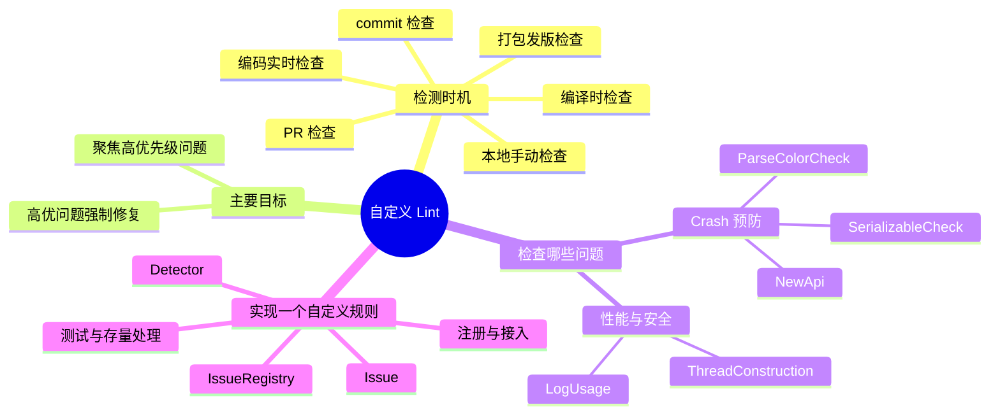

# 自定义 Lint

---

## 一、检测时机

1. 本地手动检查；
2. 编码实时检查（IDE 中实时提示）；
3. 编译时检查；
4. commit 检查；
5. 在 CI 系统中提 Pull Request 时检查；
6. 打包发版时检查。

---

## 二、主要目标

- **重点关注高优先级问题，屏蔽低优先级问题**。如果代码检查报告中夹杂了大量无关紧要的问题，反而影响了关键问题的发现；
- **高优问题的解决要有一定的强制性**。当检查发现高优先级的代码问题时，给开发者明确直接的报错，并通过技术手段约束，强制要求开发者修复。

---

## 三、检查哪些问题

### 1. Crash 预防

- **原生的 NewApi**：用于检查代码中是否调用了 Android 高版本才提供的 API。在低版本设备中调用高版本 API 会导致 Crash；
- **自定义的 SerializableCheck**：实现了 Serializable 接口的类，如果其成员变量引用的对象没有实现 Serializable 接口，序列化时就会 Crash。我们制定了一条代码规范，要求实现了 Serializable 接口的类，其成员变量（包括从父类继承的）所声明的类型都要实现 Serializable 接口；
- **自定义的 ParseColorCheck**：调用 `Color.parseColor()` 方法解析后台下发的颜色时，颜色字符串格式不正确会导致 IllegalArgumentException，我们要求调用这个方法时必须处理该异常。

### 2. 性能 / 安全问题

- **ThreadConstruction**：禁止直接使用 `new Thread()` 创建线程（线程池除外），而需要使用统一的工具类在公用线程池执行后台操作；
- **LogUsage**：禁止直接使用 `android.util.Log`，必须使用统一工具类。工具类中可以控制 Release 包不输出 Log，提高性能，也避免发生安全问题。

---

## 四、实现一个自定义规则

### 1. Lint 的三件套

| 角色 | 作用 |
| --- | --- |
| **Issue** | 一条规则的声明：id、简述、详细说明、类别（Category）、优先级、严重级别（Severity）、以及由哪个 Detector 实现 |
| **Detector** | 规则的具体实现：扫描代码（AST/UAST 节点），命中问题时调用 `context.report(...)` 上报 |
| **IssueRegistry** | 规则的注册表：实现 `getIssues()` 返回本模块的全部 Issue |

### 2. 实现步骤

1. 新建一个 Java/Kotlin library 模块，依赖 `lint-api`（编译期用 `compileOnly`，不需要打进产物）；
2. 继承 `Detector` 并实现 `Detector.UastScanner` 接口，声明关注的节点类型：
   - 重写 `getApplicableUastTypes()` 返回感兴趣的节点（如方法调用、类定义）；
   - 重写 `createUastHandler()` 返回处理回调，在回调里判断命中条件并 `context.report(issue, node, location, message)`；
3. 用 `Issue.create(...)` 定义 Issue，设置 id、severity（如 `Severity.ERROR` 可强制报错）、category 和 implementation；
4. 编写 `IssueRegistry` 子类，重写 `getIssues()` 返回所有 Issue；
5. 在 `META-INF/services/com.android.tools.lint.client.api.IssueRegistry` 文件中写入 IssueRegistry 的全限定类名，完成 SPI 注册；
6. 宿主工程通过 `lintChecks project(':lint-rules')` 引入（或将规则打包成 aar/jar 提供给业务方）。

### 3. 测试与存量处理

- 用 Lint 提供的 `lint()` 测试框架为每条规则写单测，构造命中与不命中的样例代码，断言报告的 Issue 数量与位置；
- 存量代码往往一次性修不完，可以生成 **baseline（基线）** 文件，把当前已有问题记录在案，此后只对新增代码报警，避免"一开规则满屏红"。

---

## 五、30 秒口述版

自定义 Lint 的价值是把团队规范变成可强制的检查：检测时机覆盖本地、编码、编译、commit、PR 和发版。规则挑选上聚焦高优问题并强制修复，比如 Crash 预防（NewApi、SerializableCheck、ParseColorCheck）和性能安全（ThreadConstruction、LogUsage）。实现上是 Issue + Detector + IssueRegistry 三件套：Detector 实现 UastScanner 扫描节点、命中后 report，IssueRegistry 通过 SPI 注册，宿主用 `lintChecks` 接入；配合单测和 baseline 落地存量代码。
