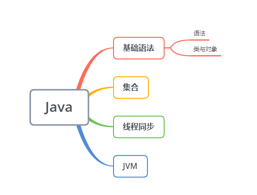
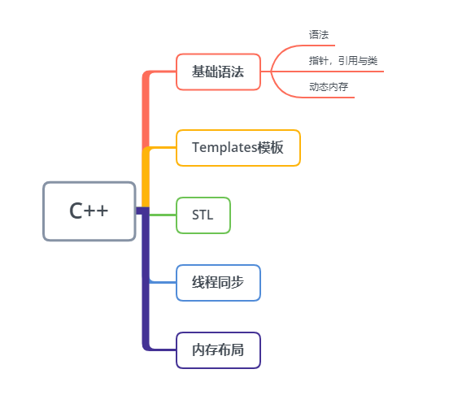
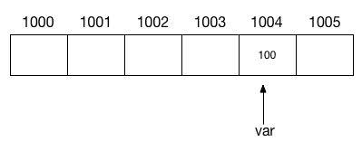
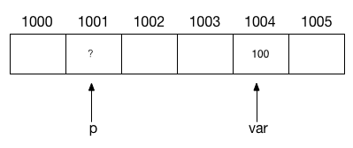

## 与Java对比

### 视C++为一个语言联邦
C++是语言联邦，它综合了多种编程语言的特点，是多重范型编程语言（注意是范型，不是泛型），支持过程形式（procedural），面向对象形式（object-oriented），函数形式（functionnal），泛型形式（generic），元编程形式（meta programming）。

* C：说到底C++仍是以C为基础。区块，语句，预处理器，内置数据类型，数组，指针统统来自C。
* Object-Oreinted C++：这一部分是面向对象设计之古典守则在C++上的最直接实施。类，封装，继承，多态，virtual函数等等...
* Template C++：这是C++泛型编程部分。
* STL。STL是个template程序库：容器（containers），迭代器（iterators），算法（algorithms）以及函数对象（function objects）

### C++11的特性
C++11的特性主要包括下面几个方面：

* 提高运行效率的语言特性：右值引用、泛化常量表达式
* 原有语法的使用性增强：初始化列表、统一的初始化语法、类型推导、范围for循环、Lambda表达式、final和override、构造函数委托
* 语言能力的提升：空指针nullptr、default和delete、长整数、静态assert
* C++标准库的更新：智能指针、正则表达式、哈希表等

## 引用
一般说的引用是指的左值引用

引用：引用是一个对象的别名，引用类型引用（refer to）另外一种类型。如int &refVal = val;。

引用必须初始化。

引用和它的初始值是绑定bind在一起的，而不是拷贝。一旦定义就不能更改绑定为其他的对象

## 指针
int *p; //指向int型对象的指针

是一种 "指向（point to）"另外一种类型的复合类型。

定义指针类型： int *ip1;，从右向左读有助于阅读，ip1是指向int类型的指针。

指针存放某个对象的地址。

1. 声明变量：C语言声明一个变量时，编译器在内存中留出一个唯一的地址单元来存储变量,如下图，变量var初始化为100，编译器将地址为1004的内存单元留给变量，并将地址1004和该变量的名称关联起来。

2. 创建指针：变量var的地址是1004，是一个数字，地址的这个数字可以用另一个变量来保存它，假设这个变量为p，此时变量p未被初始化，系统为它分配了空间，但值还不确定

3. 初始化指针，将变量var的地址存储到变量p中，初始化后（p=&var），p指向var，称为一个指向var的指针。指针是一个变量，它存储了另一个变量的地址。

4. 声明指针：typename *p  其中typename指的是var的变量类型，可以是 short ,char ,float,因为每个类型占用的内存字节不同，short占2个字节，char占1个字节，float占4个字节，指针的值等于它指向变量的第一个字节的地址 。*是间接运算符，说明p是指针变量，与非指针变量区别开来。
### 指针和引用的区别

* 引用本身并非一个对象，引用定义后就不能绑定到其他的对象了；指针并没有此限制，相当于变量一样使用。
* void*指针可以存放任意对象的地址。因无类型，仅操作内存空间，对所存对象无法访问。
* 其他指针类型必须要与所指对象严格匹配。
* int* p1, p2;//*是对p1的修饰，所以p2还是int型
* 解引用指针得到引用
* 给引用赋值，修改的是该引用所关联的对象的值，而不是让引用和另一个对象相关联。

## const限定符
const可理解为只读的变量，在预处理阶段是不存在的，直到运行阶段才会出现，加上volatile可改变

	// 需要加上volatile修饰，运行时才能看到效果
	const volatile int MAX_LEN  = 1024;

	auto ptr = (int*)(&MAX_LEN);
	*ptr = 2048;
	cout << MAX_LEN << endl;      // 输出2048

const对象必须初始化，且不能被改变。const int ival=1;

const的引用,reference to const（对常量的引用）：指向const对象的引用，如 const int ival=1; const int &refVal = ival;，可以读取但不能修改

### 指针和const

* pointer to const（指向常量的指针）：不能用于改变其所指对象的值, 如 const double pi = 3.14; const double *cptr = &pi;。
* const pointer：指针本身是常量，也就是说指针固定指向该对象，（存放在指针中的地址不变，地址所对应的那个对象值可以修改）如 int i = 0; int *const ptr = &i;

### 顶层const

* 顶层const：指针本身是个常量。
* 底层const：指针指向的对象是个常量。拷贝时严格要求相同的底层const资格。

### const修饰成员函数，mutable

	//编译期就会出错
	class CTB {
	public:
		std::size_t length() const;
	private:
		std::size_t textLength;
		mutable std::size_t mTextLength;   // 该成员变量可以在 const 成员函数内被改变
	};
	std::size_t CTB::length() const
	{
		textLength = 2;        // 错误，const 成员函数内无法给成员赋值
		mTextLength = 2;       // 正确
	}

### const &
const & 被称为万能引用，也就是说，它可以引用任何类型，即不管是值、指针、左引用还是右引用，它都能“照单全收”。
## typedef
传统别名：使用typedef来定义类型的同义词。 typedef double wages;

typedef int arrT[10];//表示的类型是含有10个整形的数组。

新标准别名：别名声明（alias declaration）： using SI = Sales_item;

### 指针
对于复合类型（指针等）不能代回原式来进行理解

	typedef char *pstring;  // pstring是char*的别名
	const pstring cstr = 0; // 指向char的常量指针（const pointer），即为(const char *) cstr = 0;

## auto
auto的类型推导跟模板类型推导是一样的。[理解模板类型推导](https://github.com/kelthuzadx/EffectiveModernCppChinese/blob/master/1.DeducingTypes/item1.md)，[理解auto类型推导](https://github.com/kelthuzadx/EffectiveModernCppChinese/blob/master/1.DeducingTypes/item2.md)

	int i=0,&r=i;
	auto a=r;//a是一个整数
	const int ci=i;&cr=ci;
	auto b=ci;//b是一个整数
	auto c=cr;//c是一个整数
	auto d=&i;//d是一个整型指针
	auto e=$ci;//e是一个指向整数常量的指针

auto 的“自动推导”能力只能用在“初始化”的场合。具体来说，就是赋值初始化或者花括号初始化（初始化列表、Initializer list）

* auto 总是推导出“值类型”，绝不会是“引用”；
* auto 可以附加上 const、volatile、*、& 这样的类型修饰符，得到新的类型。
## decltype
[理解decltype](https://github.com/kelthuzadx/EffectiveModernCppChinese/blob/master/1.DeducingTypes/item3.md)

返回改变量的类型（包括顶层const和引用在内）

	const int ci=0;&cj=ci;
	decltype(ci) x=0;//x的类型是const int
	decltype(cj)y=x;//y的类型是const int &,y绑定到变量x

* 使用的表达式不是一个变量，返回表达式结果对象的类型
* 赋值是会产生引用的一类典型表达式
* 引用的类型就是左值的类型。

		int i=42,*p=&i,&r=i;
		decltype(r+0) b;//正确，结果是int
		decltype(*p) c;//错误，解引用指针得到引用，int&必须初始化
		int a = 3, b = 4;
		decltype(a = b) d = a;//正确，b是int&

变量加上括号变成表达式
	
	decltype((i)) d://错误,d是int&,必须初始化
	decltype(i) e;//正确，e是int

## using
using 声明,使用某个命名空间：例如 using std::cin表示使用命名空间std中的名字cin。声明语句一次只引入命名空间的一个成员

using指示（using directive）：使得某个特定的命名空间中所有的名字都可见。using namespace std;

## define
宏定义，在预处理阶段做了简单的替换

	#define MAXNUM 99999
	#define add(x, y) (x + y)

如何取消宏

	//定义宏
	#define [MacroName] [MacroValue]
	//取消宏
	#undef [MacroName]

防止重复包含头文件

由于头文件包含可以嵌套，那么C文件就有可能包含多次同一个头文件，就可能出现重复定义的问题的。通过条件编译开关来避免重复包含（重复定义）

	#ifndef __headerfileXXX__
	#define __headerfileXXX__
	…
	文件内容
	…
	#endif

## 初始化
拷贝初始化（copy initialization）：使用等号=将一个已有的对象拷贝到正在创建的对象。string s1=s;

直接初始化（direct initialization）：通过括号给对象赋值。string s("hello");

列表初始化： vector<string> v{"a", "an", "the"}; （C++11）

## 数组
### 定义和初始化内置数组
初始化：char input_buffer[buffer_size];，长度必须是const表达式，或者不写，让编译器自己推断。

数组不允许直接赋值给另一个数组。

### 数组和指针

使用数组时，编译器一般会把它转换成指针。

指针访问数组：在表达式中使用数组名时，名字会自动转换成指向数组的第一个元素的指针。

### 多维数组

使用范围for语句时，除了最内层的循环外，其他所有循环的控制变量都应该是引用类型。

## 成员运算符号->
解引用 + 成员访问，it->mem等价于 (*it).mem

## 混用解引用和递增运算符
	//iter++指向下一个元素,但是返回未改变的副本
	*iter++等价于*(iter++)，递增优先级较高

	auto iter = vi.begin();
	while (iter!=vi.end()&&*iter>=0)
		cout<<*iter++<<endl;	// 输出当前值，指针向前移1

## sizeof运算符
* 返回一条表达式或一个类型名字所占的字节数。
* 返回的类型是 size_t的常量表达式。

sizeof并不实际计算其运算对象的值。
两种形式：
sizeof (type)，给出类型名，sizeof expr，给出表达式

可用sizeof返回数组的大小

	int ia[10];
	// sizeof(ia)返回整个数组所占空间的大小
	// sizeof(ia)/sizeof(*ia)返回数组的大小
	constexpr size_t sz = sizeof(ia)/sizeof(*ia);
	int arr[sz];

## 显式类型转换（尽量避免）
* static_cast：任何明确定义的类型转换，只要不包含底层const，都可以使用。 double slope = static_cast<double>(j);

* dynamic_cast：支持运行时类型识别。用于将基类的指针或引用安全地转换曾派生类的指针或引用

		dynamic_cast<type*>(e)  // e必须是一个有效的指针
		dynamic_cast<type&>(e)  // e必须是一个左值
		dynamic_cast<type&&>(e) // e不能是左值
		// 以上，type类型必须时一个类类型，并且通常情况下该类型应该含有虚函数。
		// e的类型必须符合三个条件中的任意一个，它们是：
		// 1. e的类型是目标type的公有派生类；
		// 2. e的类型是目标type的共有基类；
		// 3. e的类型就是目标type的类型；
		
		// 指针类型的dynamic_cast
		// 假设Base类至少含有一个虚函数，Derived是Base的共有派生类。
		if (Derived *dp = dynamic_cast<Derived*>(bp)) {
		    // 使用dp指向的Derived对象
		} else {    // bp指向一个Base对象
		    // 使用dp指向的Base对象
		}
		
		// 引用类型的dynamic_cast
		void f(const Base &b) {
		    try {
		        const Derived &d = dynamic_cast<const Derived&>(b);
		        // 使用b引用的Derived对象
		    } catch (bad_cast) {
		        // 处理类型转换失败的情况
		    }
		}

* typeid运算符(typeid operator)，它允许程序向表达式提问：你的对象是什么类型？
	typeid表达式的形式是typeid(e)，其中e可以是任意表达式或类型的名字，它操作的结果是一个常量对象的引用。它可以作用于任意类型的表达式。

		Derived *dp = new Derived;
		Base *bp = dp;
		
		if (typeid(*bp) == typeid(*dp)) {
		    // bp和dp指向同一类型的对象
		}
		
		if (typeid(*bp) == typeid(Derived)) {
		    // bp实际指向Derived对象
		}

* const_cast：只能改变运算对象的底层const，一般可用于去除const性质。 const char *pc; char *p = const_cast<char*>(pc)

## constexpr函数
指能用于常量表达式的函数。constexpr int new_sz() {return 42;}

函数的返回类型及所有形参类型都要是字面值类型。

## union
联合(union)是一种特殊的类。一个union可以有多个数据成员，但是在任意时刻只有一个数据成员可以有值。它不能含有引用类型的成员和虚函数。