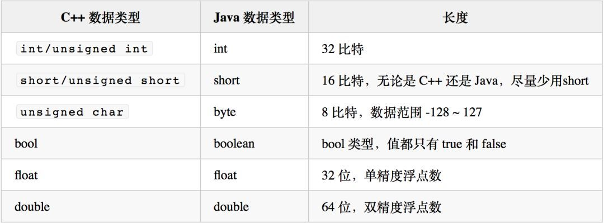
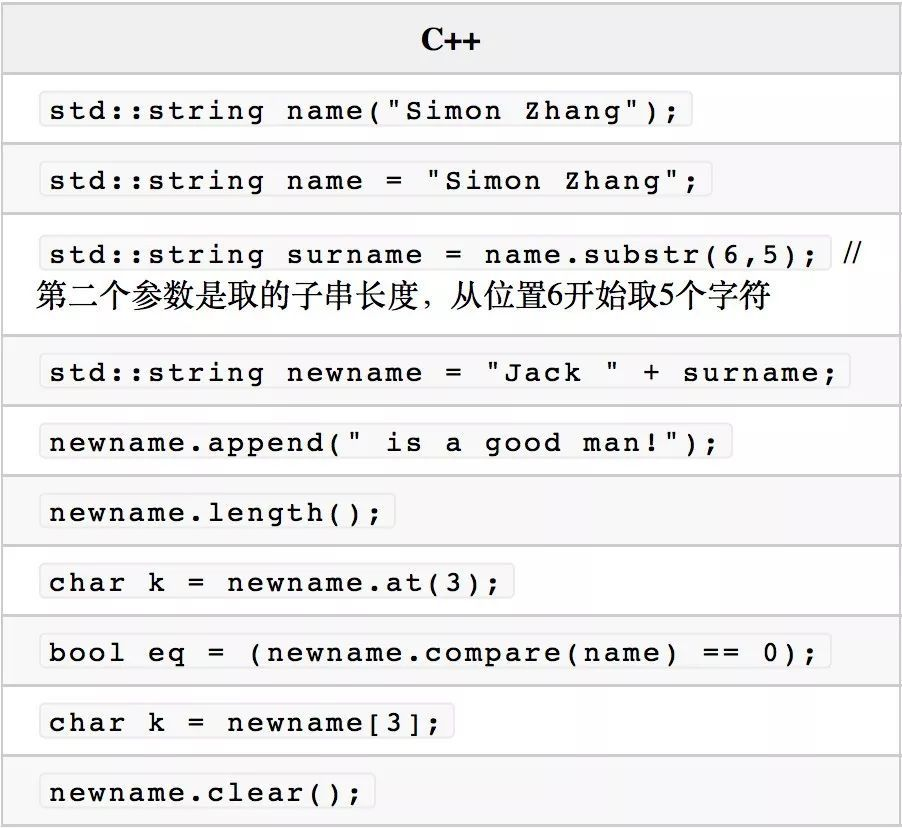
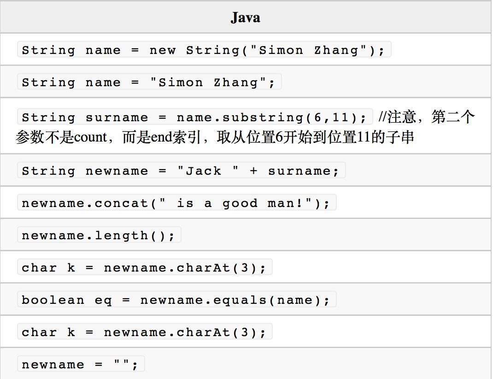

## C++写算法
### 基本数据类型

首先是 char，C++ 的 char 是 8 比特无符号整数，顺便表示了 ASCII 字符；Java 的 char 是 16 比特，天生就可以表示宽字符集的字符。

另一个需要注意的是 long 类型，C++ 的 long 是不可移植类型，在不同的系统上其长度不一样，可能是 32 位，也可能是 64 位，所以 C++ 程序员应尽量避免使用 long。Java 的 long 比较单纯，无论是 32 位的系统还是 64 位的系统，它都表示 64 位整数。

Java 会用 d 或 D 表示一个直接数字是 double 类型的浮点数，比如 200.0d 或（200.0D），但是 C++ 不支持，因为 C++ 默认一个浮点型的直接数字就是 double 类型。

C++ 用字面量符号 f 或 F 表示一个直接数字是 float 类型浮点数，比如 250.1 f（或 250.1F），这一点 Java 也是一样的。

C++ 用字面量符号 l 或 L 表示 long，用 UL 表示 unsigned long。

### 字符串

### 基本语法
C++ 允许全局函数的存在，Java 则不允许，不过 Java 也留了个口子，就是用静态成员函数。

Java 没有指针，对象的传递和返回都是用的引用的方式，并且不需要像 C++ 那样用 “&” 做特殊的语法标记。

### 运算符和赋值

### 条件判断与循环
c++11引入了根据范围循环的语句。一般理解与Java的增强for循环类似
c++11版本

	int numbers[]={1,2,3,4,5};
	for(int x:numbers){
		std::count << x << ";";
	}

Java对应版本

	int[] numbers={1,2,3,4,5};
	for(int x:numbers){
		System.out.print(x);
		System.out.print(",");
	}

c++标准库函数循环

	std::vector<std::string> strArray={"Tom","Jim","Jack"};
	for(std::string& x : strArray){
		std::count << x << std::endl;
	}
	
Java

	String[] strings={"Tom","Jim","Jack"};
	Collection<String> list=Arrays.asList(strings);
	for(Object str:list){
		System.out.println(str);
	}
	
#### 函数
#### 数组
c++ 

	//静态数组，分配在栈上
	int intArray1[5];
	int intArray2[]={10,20,30,40,50};
	int *intArray3=new int[5];
	
	int (*multiArray3)[5]=new int[4][5];
	multiArray3[2][3]=56;
	
	int **multiArray4 =new int *[4];
	for(int i=0;i<4;i++)
	{
		multiArray4[i]=new int[5];
	}

Java

	//对应上面intArray1和intArray3
	int[] intArray1=new int[5];
	int[] intArray2 =new int[]{10,20,30,40,50};
	
	int[][] multiArray3 =new int[4][5];
	multiArray3[2][3]=56;
	int[][] multiArray4=new int[4][];
	for(int i=0;i<4;i++){
		multiArray4[i]=new int[5];
	}
	
#### 枚举
与 C 相比，C++ 强化了类型差异，枚举变量和整数变量之间不能互相赋值，但是使用方法依然是直接使用枚举值，没有限制域。C++11 之后，开始支持强类型枚举

C++11

	enum class Color
	{RED,GREEN,BLUE,YELLOW};
	
	Color c= Color::RED;
	
Java

	enum Color{
		RED,GREEN,BLUE,YELLOW
	}
	
	Color c=Color.RED;
	
	
#### IO
C++ 代码中一般用 std::cin 和 std::cout 进行控制台的输入和输出。

C++
	
	int no;
	std::string name;
	std::cin >> name >> no;
	std::count << "name is " << name << " no. is " << no;
	
	
Java

	Scanner cin=new Scanner(System.in);
	String name =cin.next();
	int no=cin.nextInt();
	System.out.println("name is "+name+" no. is"+ no);
	
C++ 提供了 getline() 函数，getline() 会从缓冲区中取输入流，直到遇到结束符。结束符默认是 '\n'

C++ 

	std::string name;
	std::getline(std::cin,name);//相当于std::getlin(std::cin,name,'\n');
	
Java

	BufferedReader cin=new BufferedReader(new InputStreamReader(System.in));
	String str=cin.readLine();
	

#### 类和封装
C++ 的 struct，Java 没有与之对应的相似物的，但是完全可以用 class 来替换这个概念。

C++ 的函数可以设置参数默认值

C++ 的类成员访问控制采用分节控制，用 public: 或 protected: 作为分节的标志，如果没有分节标志的类成员，则是默认的 private: 控制

C++ 
	
	class Bucket
	{
	public:
		Bucket(int capicity,int water=0){m_capictiy=capicity;m_water=water;}
		bool isFull() const{return (m_capicity==m_water);}
		bool getSpeace() const{ return (m_capicity-m_water);}
	private:
		int m_water;
		int m_capicity;
	};

Java:

	class Bucket{
		private int mWater;
		private int mCapicity;
		public Bucket(int capicity,int water){
			this.mWater=water;
			this.mCapicity=capicity;
		}
		public Bucket(int capicity){
			this.mCapicity=capicity;
			this.mWater=0;
		}
		public boolean isFull(){
			return mCapicity==mWater;
		}
		public int getSpace(){
			return mCapicity-mWater;
		}
	}
	
	
C++ 没有抽象基类的语法，但是又抽象基类的概念，一般当一个类中有一个纯虚函数的时候，这个类是不能被直接实例化的，它就类似于是一个抽象基类.C++ 的函数有很多类型修饰，比如常见的 const，C++11 后新增了 final 和 override.

C++ 的继承体系的语法与 Java 类似，只是语法形式上不同

C++

	class Shape
	{
	public:
		Shape(int color=1){m_color=color;}
		virtual double Area() =0;
		int getColor() const { return m_color;}
		void setColor(int color){m_color=color;}
	private:
		int m_color;
	};
	
	const double PI=std::atan(1.0)*4.0;
	class Circle:public Shape
	{
	public :
		Circle(double radius,int color=1):Shape(color)
		{
			m_radius=radius;
		}
		double Area()
		{
			return PI*m_radius*m_radius;
		}
	private:
		double m_radius;
	}
	
Java
	
	abstract class Shape{
		private int color;
		Shape(){
			color=1;
		}
		Shape(int color){
			this.color=color;
		}
		abstract double area();
		int getColor(){
			return color;
		}
		void setColor(int color){
			this.color=color;
		}
	}
	
	class Circle extends Shape{
		private double radius;
		public Circle(double radius,int color){
			super(color);
			this.radius=radius;
		}
		public Circle(double radius){
			super(1);
			this.radius=radius;
		}
		double area(){
			return Math.PI*Math.pow(radius,2);
		}
	}
	
C++ 有时候也会将一个类声明为 final，意味着它不希望被其他类继承,有时候，是某个不希望被派生类重载