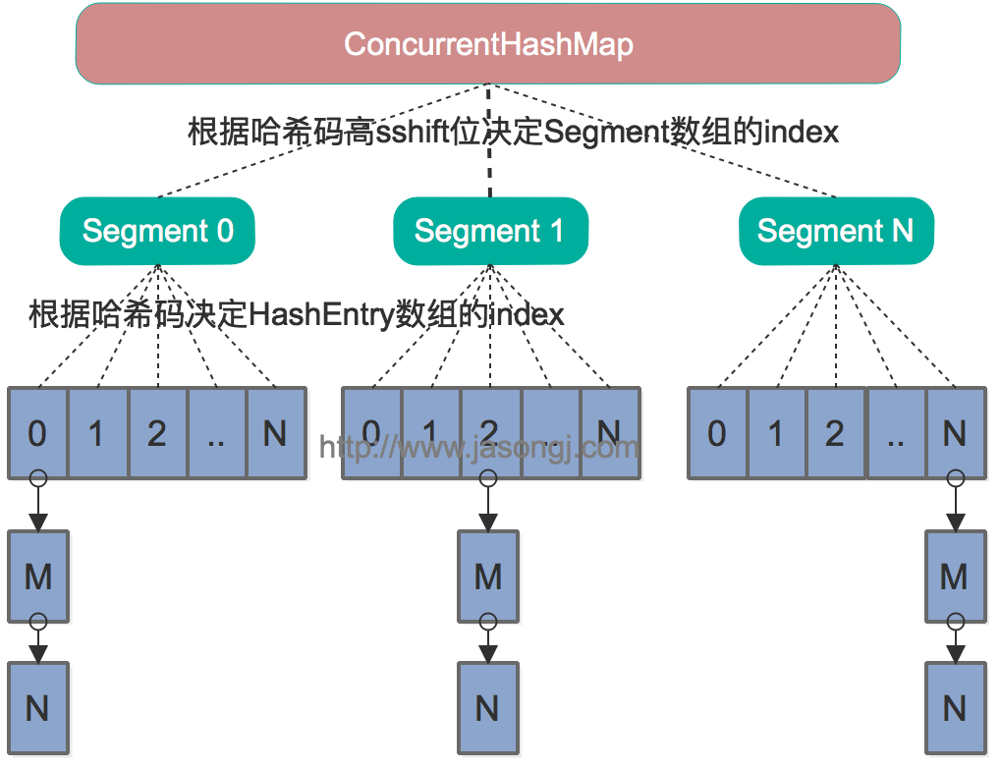
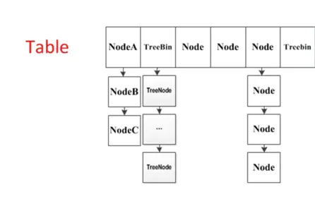

ConcurrentHashMap
--

# 优势

- HashMap在并发执行put操作时会引起死循环，是因为多线程会导致HashMap的Entry链表形成环形数据结构，一旦形成环形数据结构，Entry的next节点永远不为空，就会产生死循环获取Entry。

- HashTable的效率非常低下。因为当一个线程访问HashTable的同步方法，其他线程也访问HashTable的同步方法时，会进入阻塞或轮询状态。对 Hashtable 对象加锁,直接对方法加锁,读写锁共用,只有一把锁，从头锁到尾

--

# 简历

- JDK 5 引入的 ConcurrentHashMap 使用段（Segment）存储键值对，在必要时对段进行加锁，不同段之间的访问不受影响。JDK 5 的 ConcurrentHashMap 中的哈希算法对于比较小的整数，比如三万以下的整数作为 key 时，无法让元素均匀分布在各个段中，导致它退化成了一个 Hashtable。

- 在 JDK 6 中，ConcurrentHashMap 优化了二次 Hash 算法，用了 single-word Wang/Jenkins 哈希算法，这个算法可以让元素均匀分布在各个段中。

- JDK 7 的 ConcurrentHashMap 初始化段的方式跟之前的版本不一样，以前是 ConcurrentHashMap 构造出来后直接实例化 16 个段，而 JDK 7 开始，是需要哪个就创建哪个。懒加载实例化段会涉及可见性问题，所以在 JDK 7 的 ConcurrentHashMap 中使用了 volatile 和 UNSAFE.getObjectVolatile() 来保证可见性。

- 在 JDK 8 中，ConcurrentHashMap 废弃了段这个概念，实现改为基于 HashMap 原理进行并发化。对不必加锁的地方，尽量使用 volatile 进行访问，对于一定要加锁的操作，会选择小的范围加锁。

--

# 特点

- 小锁

    - 分段锁（JDK 5~7）

    - 桶节点锁（JDK 8）

- 短锁,先尝试获取，失败再加锁

- 分离读写锁

    - 读失败再加锁（JDK 5~7）

    - volatile 读 CAS 写（JDK 7~8）

- 弱一致性

    - 添加元素后不一定马上能读到

    - 清空后可能仍有元素

    - 遍历前的段元素变化能读到

    - 遍历后的段元素变化读不到

    - 遍历时元素发生变化不会抛异常

--

# 实现

- JDK1.7,ConcurrentHashMap是由Segment数组结构和HashEntry数组结构组成。Segment是一种可重入锁（ReentrantLock），在ConcurrentHashMap里扮演锁的角色；HashEntry则用于存储键值对数据。一个ConcurrentHashMap里包含一个Segment数组。Segment的结构和HashMap类似，是一种数组和链表结构。一个Segment里包含一个HashEntry数组，每个HashEntry是一个链表结构的元素，每个Segment守护着一个HashEntry数组里的元素，当对HashEntry数组的数据进行修改时，必须首先获得与它对应的Segment锁
	
	
    - get,get操作的高效之处在于整个get过程不需要加锁，除非读到的值是空才会加锁重读。我们知道HashTable容器的get方法是需要加锁的，那么ConcurrentHashMap的get操作是如何做到不加锁的呢？原因是它的get方法里将要使用的共享变量都定义成volatile类型，如用于统计当前Segement大小的count字段和用于存储值的HashEntry的value。定义成volatile的变量，能够在线程之间保持可见性，能够被多线程同时读，并且保证不会读到过期的值，但是只能被单线程写（有一种情况可以被多线程写，就是写入的值不依赖于原值），在get操作里只需要读不需要写共享变量count和value，所以可以不用加锁。

    - put方法首先定位到Segment，然后在Segment里进行插入操作。插入操作需要经历两个步骤，第一步判断是否需要对Segment里的HashEntry数组进行扩容，第二步定位添加元素的位置，然后将其放在HashEntry数组里

- JDK1.8,摒弃了Segment的概念，而是直接用Node数组+链表+红黑树的数据结构来实现，并发控制使用Synchronized和CAS来操作，整个看起来就像是优化过且线程安全的HashMap,Node->TreeNode->TreeBin
	

    - put

         - 如果没有初始化就先调用initTable（）方法来进行初始化过程

         - 如果没有hash冲突就直接CAS插入

         - 如果还在进行扩容操作就先进行扩容

              - 单线程新建nextTable，扩容为原table容量的两倍。

              - 每个线程想增/删元素时，如果访问的桶是ForwardingNode节点，则表明当前正处于扩容状态，协助一起扩容完成后再完成相应的数据更改操作。

              - 扩容时将原table的所有桶倒序分配，每个线程每次最小分16个桶进行处理，防止资源竞争导致的效率下降， 每个桶的迁移是单线程的，但桶范围处理分配可以多线程，在没有迁移完成所有桶之前每个线程需要重复获取迁移桶范围，直至所有桶迁移完成。

              - 一个旧桶内的数据迁移完成但迁移工作没有全部完成时，查询数据委托给ForwardingNode结点查询nextTable完成（这个后面看find()分析）。

              - 迁移过程中sizeCtl用于记录参与扩容线程的数量，全部迁移完成后sizeCtl更新为新table的扩容阈值。

         - 如果存在hash冲突，就加锁来保证线程安全，这里有两种情况，一种是链表形式就直接遍历到尾端插入，一种是红黑树就按照红黑树结构插入，

         - 最后一个如果该链表的数量大于阈值8，就要先转换成黑红树的结构，break再一次进入循环

         - 如果添加成功就调用addCount（）方法统计size，并且检查是否需要扩容

    - get

         - 1,根据key调用spread计算hash值；并根据计算出来的hash值计算出该key在table出现的位置i.

         - 2,检查table是否为空；如果为空，返回null，否则进行3

         - 3,检查table[i]处桶位不为空；如果为空，则返回null，否则进行4

         - 4,先检查table[i]的头结点的key是否满足条件，是则返回头结点的value；否则分别根据树、链表查询。

