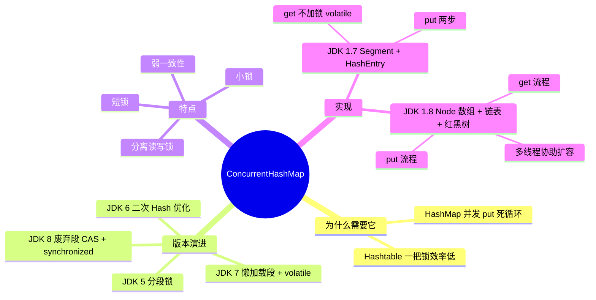
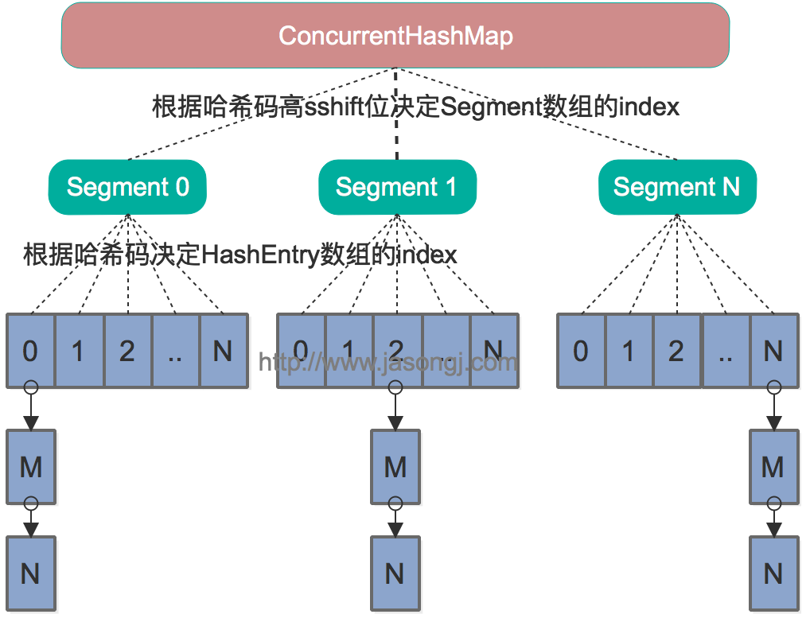
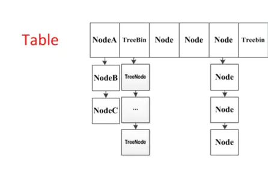

# ConcurrentHashMap

```mermaid
mindmap
  root((ConcurrentHashMap))
    为什么需要它
      HashMap 并发 put 死循环
      Hashtable 一把锁效率低
    版本演进
      JDK 5 分段锁
      JDK 6 二次 Hash 优化
      JDK 7 懒加载段 + volatile
      JDK 8 废弃段 CAS + synchronized
    特点
      小锁
      短锁
      分离读写锁
      弱一致性
    实现
      JDK 1.7 Segment + HashEntry
        get 不加锁 volatile
        put 两步
      JDK 1.8 Node 数组 + 链表 + 红黑树
        put 流程
        get 流程
        多线程协助扩容
```

---

## 一、为什么需要 ConcurrentHashMap

- **HashMap 线程不安全**：在并发执行 put 操作时会引起**死循环**，因为多线程会导致 HashMap 的 Entry 链表形成**环形数据结构**；一旦形成环形结构，Entry 的 next 节点永远不为空，就会产生死循环获取 Entry。
- **Hashtable 效率低下**：当一个线程访问 Hashtable 的同步方法、其他线程也访问同步方法时，会进入阻塞或轮询状态。它是对 Hashtable 对象加锁、直接对方法加锁，**读写共用一把锁，从头锁到尾**。

---

## 二、版本演进（面试常问的"简历"）

| 版本 | 关键变化 |
| --- | --- |
| JDK 5 | 引入 ConcurrentHashMap，使用**段（Segment）**存储键值对，必要时对段加锁，不同段之间的访问不受影响。但当时的哈希算法对于比较小的整数（如三万以下的整数作为 key）无法让元素均匀分布在各个段中，导致它**退化成 Hashtable** |
| JDK 6 | 优化**二次 Hash 算法**，改用 single-word Wang/Jenkins 哈希算法，可以让元素均匀分布在各个段中 |
| JDK 7 | 初始化段的方式改变：以前构造出来就直接实例化 16 个段，JDK 7 开始**需要哪个就创建哪个**（懒加载）。懒加载实例化段会涉及**可见性问题**，所以用 `volatile` 和 `UNSAFE.getObjectVolatile()` 来保证可见性 |
| JDK 8 | **废弃段的概念**，实现改为基于 HashMap 原理进行并发化：不必加锁的地方尽量用 `volatile` 访问，一定要加锁的操作则**选择小的范围加锁** |

---

## 三、特点

- **小锁**
  - 分段锁（JDK 5~7）
  - 桶节点锁（JDK 8）
- **短锁**：先尝试获取，失败再加锁
- **分离读写锁**
  - 读失败再加锁（JDK 5~7）
  - volatile 读、CAS 写（JDK 7~8）
- **弱一致性**
  - 添加元素后不一定马上能读到
  - 清空后可能仍有元素
  - 遍历前的段元素变化能读到
  - 遍历后的段元素变化读不到
  - 遍历时元素发生变化不会抛异常

---

## 四、JDK 1.7 实现：Segment 分段锁

JDK 1.7 的 ConcurrentHashMap 由 **Segment 数组 + HashEntry 数组**组成：

- **Segment** 是一种可重入锁（ReentrantLock），在 ConcurrentHashMap 里扮演锁的角色；
- **HashEntry** 用于存储键值对数据。

一个 ConcurrentHashMap 里包含一个 Segment 数组；Segment 的结构和 HashMap 类似，是一种**数组 + 链表**结构。一个 Segment 里包含一个 HashEntry 数组，每个 HashEntry 是一个链表结构的元素，每个 Segment 守护着一个 HashEntry 数组里的元素——当对 HashEntry 数组的数据进行修改时，必须首先获得与它对应的 Segment 锁。

### 1. get 为什么不需要加锁

get 操作的高效之处在于**整个 get 过程不需要加锁**，除非读到的值是空才会加锁重读。HashTable 容器的 get 是需要加锁的，ConcurrentHashMap 是怎么做到的？

原因是 get 方法里将要使用的共享变量都定义成 **volatile** 类型，如用于统计当前 Segment 大小的 `count` 字段和用于存储值的 `HashEntry.value`。定义成 volatile 的变量能够在线程之间**保持可见性**，能够被多线程同时读，并且保证不会读到过期的值，但是**只能被单线程写**（有一种情况可以被多线程写：写入的值不依赖于原值）。get 操作里只需要读、不需要写共享变量 count 和 value，所以可以不用加锁。

### 2. put 的两个步骤

1. 首先定位到 Segment；
2. 在 Segment 里进行插入：第一步判断是否需要对 Segment 里的 HashEntry 数组**扩容**，第二步**定位添加元素的位置**，然后将其放进 HashEntry 数组里。

---

## 五、JDK 1.8 实现：CAS + synchronized

JDK 1.8 **摒弃了 Segment 的概念**，直接用 **Node 数组 + 链表 + 红黑树**的数据结构实现，并发控制使用 **Synchronized 和 CAS** 来操作，整体看起来就像是优化过且线程安全的 HashMap。节点类型流转：**Node → TreeNode → TreeBin**。

### 1. put 流程

1. 如果没有初始化，就先调用 `initTable()` 方法进行初始化；
2. 如果没有 hash 冲突，就直接 **CAS 插入**；
3. 如果还在进行扩容操作，就**先进行扩容**；
4. 如果存在 hash 冲突，就**加锁**来保证线程安全，这里有两种情况：链表形式就直接遍历到尾端插入，红黑树则按照红黑树结构插入；
5. 最后，如果该链表的数量大于阈值 8，就要转换成**红黑树**结构，break 再次进入循环；
6. 如果添加成功，就调用 `addCount()` 统计 size，并且检查是否需要扩容。

### 2. 扩容：多线程协助

- **单线程**新建 `nextTable`，扩容为原 table 容量的**两倍**；
- 每个线程想增/删元素时，如果访问的桶是 **ForwardingNode** 节点，则表明当前正处于扩容状态，**协助一起扩容**，完成后再完成相应的数据更改操作；
- 扩容时将原 table 的所有桶**倒序分配**，每个线程每次最小分 16 个桶进行处理，防止资源竞争导致效率下降；每个桶的迁移是单线程的，但桶范围处理分配可以多线程，在没有迁移完成所有桶之前，每个线程需要**重复获取迁移桶范围**，直至所有桶迁移完成；
- 一个旧桶内的数据迁移完成、但迁移工作没有全部完成时，查询数据**委托给 ForwardingNode 结点**查询 nextTable 完成；
- 迁移过程中 `sizeCtl` 用于记录**参与扩容线程的数量**，全部迁移完成后 sizeCtl 更新为新 table 的扩容阈值。

### 3. get 流程

1. 根据 key 调用 `spread` 计算 hash 值，并根据计算出的 hash 值计算出该 key 在 table 中出现的位置 i；
2. 检查 table 是否为空：为空返回 null，否则进行第 3 步；
3. 检查 `table[i]` 处桶位不为空：为空则返回 null，否则进行第 4 步；
4. 先检查 `table[i]` 头结点的 key 是否满足条件，是则返回头结点的 value；否则分别根据树、链表查询。

---

## 六、30 秒口述版

ConcurrentHashMap 解决的是 HashMap 并发 put 成环死循环、Hashtable 一把大锁从头锁到尾这两个问题。演进脉络是：JDK 5 引入分段锁、JDK 6 优化二次 Hash 让元素均匀分布、JDK 7 改为懒加载段并用 volatile 保证可见性、JDK 8 彻底废弃段，改为 Node 数组 + 链表 + 红黑树，用 CAS + synchronized 只锁桶头。它的读操作靠 volatile 做到基本无锁，写操作只锁当前桶，扩容时多个线程可以协助迁移，因此兼具线程安全与高并发性能。
