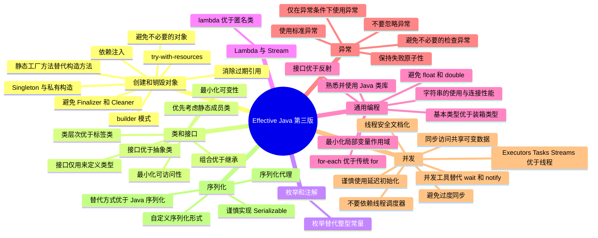

# 《Effective Java 第三版》笔记

---

## 一、第二章 创建和销毁对象

### 1. 考虑使用静态工厂方法替代构造方法

静态工厂方法的常用命名约定：

| 方法名 | 说明 | 示例 |
| --- | --- | --- |
| `from` | A 类型转换方法，它接受单个参数并返回此类型的相应实例 | `Date d = Date.from(instant);` |
| `of` | 一个聚合方法，接受多个参数并返回该类型的实例，并把它们合并在一起 | `Set<Rank> faceCards = EnumSet.of(JACK, QUEEN, KING);` |
| `valueOf` | 比 from 和 to 更为详细的替代方式 | `BigInteger prime = BigInteger.valueOf(Integer.MAX_VALUE);` |
| `instance` 或 `getInstance` | 返回一个由其参数（如果有的话）描述的实例，但不能说它具有和参数相同的值 | `StackWalker luke = StackWalker.getInstance(options);` |
| `create` 或 `newInstance` | 与 instance 或 getInstance 类似，除了该方法保证每个调用返回一个新的实例 | `Object newArray = Array.newInstance(classObject, arrayLen);` |
| `getType` | 与 getInstance 类似，但是如果在工厂方法中不同的类中使用。Type 是工厂方法返回的对象类型 | `FileStore fs = Files.getFileStore(path);` |
| `newType` | 与 newInstance 类似，但是如果在工厂方法中不同的类中使用。Type 是工厂方法返回的对象类型 | `BufferedReader br = Files.newBufferedReader(path);` |
| `type` | getType 和 newType 简洁的替代方式 | `List<Complaint> litany = Collections.list(legacyLitany);` |

### 2. 当构造方法参数过多时使用 builder 模式

### 3. 使用私有构造方法或枚举实现 Singleton 属性

### 4. 使用私有构造方法执行非实例化

### 5. 使用依赖注入取代硬连接资源

### 6. 避免创建不必要的对象

### 7. 消除过期的对象引用

- 数组中的对象
- `WeakHashMap`

### 8. 避免使用 Finalizer 和 Cleaner 机制

### 9. 使用 try-with-resources 语句替代 try-finally 语句

---

## 二、第四章 类和接口

### 15. 使类和成员的可访问性最小化

### 16. 在公共类中使用访问方法而不是公共属性

### 17. 最小化可变性

### 18. 组合优于继承

### 19. 如果使用继承则设计，并文档说明，否则不该使用

### 20. 接口优于抽象类

- 装饰模式

### 21. 为后代设计接口

### 22. 接口仅用来定义类型

### 23. 优先使用类层次而不是标签类

### 24. 优先考虑静态成员类

### 25. 将源文件限制为单个顶级类

---

## 三、第六章 枚举和注解

### 34. 使用枚举类型替代整型常量

---

## 四、第七章 Lambda 表达式和 Stream 流

### 42. lambda 表达式优于匿名类

---

## 五、第九章 通用编程

### 57. 最小化局部变量的作用域

### 58. for-each 循环优于传统 for 循环

### 59. 熟悉并使用 Java 类库

### 60. 需要精确的结果时避免使用 float 和 double 类型

### 61. 基本类型优于装箱的基本类型

### 62. 当有其他更合适的类型时就不用字符串

### 63. 注意字符串连接的性能

### 64. 通过对象的接口引用对象

### 65. 接口优于反射

---

## 六、第十章 异常

### 69. 仅在发生异常的条件下使用异常

### 71. 避免不必要地使用检查异常

### 72. 赞成使用标准异常

### 76. 争取保持失败原子性

### 77. 不要忽略异常

---

## 七、第十一章 并发

### 78. 同步访问共享的可变数据

### 79. 避免过度同步

- 应该在同步区域内做尽可能少的工作
- `CopyOnWriteArrayList`
- `ThreadLocalRandom`
- `StringBuilder`

### 80. Executors、Tasks、Streams 优于线程

### 81. 优先使用并发实用程序替代 wait 和 notify

- `ConcurrentHashMap` 优先于 `Collections.synchronizedMap`
- 倒计时锁存器（`CountDownLatch`）是一次性使用的屏障，允许一个或多个线程等待一个或多个其他线程执行某些操作。

### 82. 线程安全文档化

### 83. 明智谨慎地使用延迟初始化

### 84. 不要依赖线程调度器

- 不要试图通过调用 `Thread.yield` 方法来"修复"这个程序

---

## 八、第十二章 序列化

### 85. 其他替代方式优于 Java 本身序列化

- JSON
- protobuf

### 86. 非常谨慎地实现 Serializable 接口

### 87. 考虑使用自定义序列化形式

考虑哈希表（hash table）的情况。它的物理表示是一系列包含键值（key-value）项的哈希桶。每一项所在桶的位置，是其键的散列代码的方法决定的，通常情况下，不能保证从一个实现到另一个实现是相同的。事实上，它甚至不能保证每次运行都是相同的。因此，接受哈希表的默认序列化形式会构成严重的错误。对哈希表进行序列化和反序列化可能会产生一个不变性严重损坏的对象。

### 90. 考虑序列化代理替代序列化实例

---

## 九、30 秒口述版

《Effective Java》的条目可以归成几条主线：创建对象优先静态工厂、builder 和依赖注入，避免多余对象和过期引用；类与接口遵循"最小化可访问性、最小化可变性、组合优于继承、接口优于抽象类"；通用编程优先使用类库、基本类型和 for-each，注意字符串连接性能；异常只在异常条件下使用，并保持失败原子性；并发上同步共享可变数据但避免过度同步，优先并发工具而非 wait/notify；序列化则能不用就不用。
