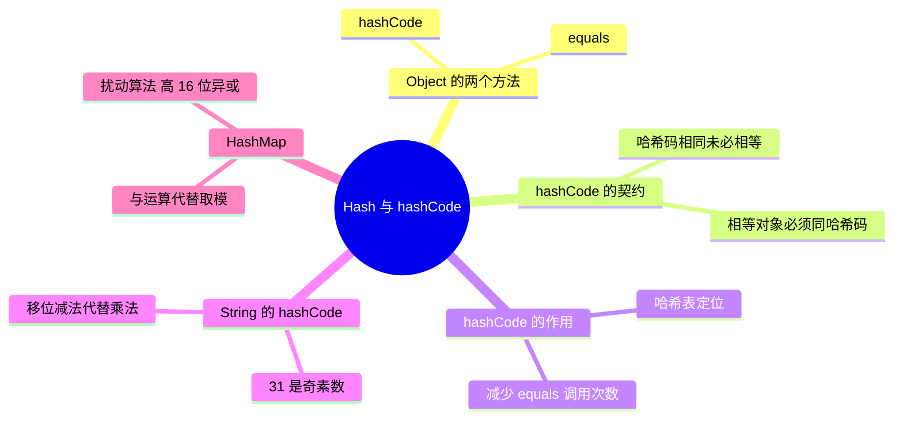

# Hash 与 hashCode



---

## 一、Object 的 equals 与 hashCode

`java.lang.Object` 类中有两个非常重要的方法：`equals`、`hashCode`。

**equals()**：用来判断其他的对象是否和该对象相等，默认是 `==`，判断的是内存值（地址）。但 String、Math、Integer、Double 等封装类在使用 `equals()` 时，已经覆盖了 Object 类的 `equals()` 方法，改为按内容比较。

---

## 二、hashCode 的约定（契约）

**hashCode()**：给对象返回一个 hash code 值。这个方法被用于 hash tables，例如 HashMap。Java 对二者关系的约定是：

1. **在一个 Java 应用的执行期间**，如果一个对象提供给 equals 做比较的信息没有被修改，该对象多次调用 `hashCode()` 必须**始终如一返回同一个 integer**。
2. 如果两个对象根据 `equals(Object)` 是**相等**的，那么调用二者各自的 `hashCode()` 必须产生**同一个 integer 结果**。
3. **并不要求**根据 `equals(Object)` 不相等的两个对象，其 `hashCode()` 必须不同。然而程序员应该意识到，为不同的对象产生不同的 integer 结果，**有可能提高 hash table 的性能**。

---

## 三、hashCode 的作用：为什么需要它

先看 Java 中的集合：一类是 **List**，元素有序、可以重复；另一类是 **Set**，元素无序、不可重复。问题来了——**判断两个元素是否重复依据什么**？这就是 `Object.equals` 方法。

但如果每增加一个元素就逐个检查一次，元素很多时比较次数会非常多：集合中已有 1000 个元素，第 1001 个元素加入时就要调用 **1000 次 equals**，效率显然低下。于是 Java 采用了**哈希表**原理。

- 哈希（Hash）其实是个人名，因为他提出了哈希算法的概念，所以以他的名字命名；哈希算法也称散列算法，是将数据依特定算法直接指定到一个地址上。**初学者可以简单理解为：hashCode 返回的就是对象存储的物理地址（实际可能并不是）。**
- 这样一来，当集合要添加新元素时，先调用元素的 `hashCode`，一下子就能**定位到它应该放置的物理位置**：
  - 该位置没有元素 → 直接存储，不用任何比较；
  - 该位置已有元素 → 再调用 `equals` 与新元素比较：相同就不存，不相同就散列到其它地址（这里就引出**冲突解决**问题）。
- 简而言之：**在集合查找时，hashCode 能大大降低对象比较次数，提高查找效率**，实际调用 equals 的次数几乎只需要一两次。

---

## 四、Java 对象 equals 与 hashCode 的规定

1. **相等（相同）的对象必须具有相等的哈希码（散列码）。**
   - 想象一下：Java 对象 A 和 B 相等（equals 为 true），但哈希码不同，则 A 和 B 存入 HashMap 时计算出的内部数组位置索引可能不同，那么 A 和 B 很有可能被同时存入 HashMap——而相等/相同的元素是不允许同时存入的，HashMap 不允许存放重复元素。
2. **如果两个对象的 hashCode 相同，它们并不一定相同。**
   - 不同对象的 hashCode 可能相同：A 和 B 不相等（equals 为 false）但哈希码相等，存入 HashMap 时会发生**哈希冲突**，也就是 A 和 B 存放在内部数组的位置索引相同；这时 HashMap 会在该位置建立一个**链表**，把 A 和 B 串起来，这种情况不违反使用原则，是允许的。
   - 当然，哈希冲突越少越好，应尽量采用好的哈希算法来避免冲突。

---

## 五、String 的 hashCode 为什么用 31

源码核心是 `h = 31 * h + val[i];`，使用 31 的原因是：

- 31 是一个**奇素数**。如果乘数是偶数，并且乘法溢出的话，信息就会丢失，因为与 2 相乘等价于移位运算（低位补 0）；
- 使用素数的好处并不很明显，但习惯上使用素数来计算散列结果；
- 31 有个很好的性能特性：可以用**移位和减法代替乘法**——`31 * i == (i << 5) - i`，现代 VM 可以自动完成这种优化。

---

## 六、HashMap 的扰动算法

任何一个 Object 类型的 `hashCode()` 得到的 Hash 值是一个 int，Java 中 int 是 32 位（4 * 8）。显然很少有 HashMap 的数组有 40 亿这么长——如果只取低几位的 Hash 值，那么那些**低位相同、高位不同**的 Hash 值就会碰撞。

解决方式：**将 Hash 值的高 16 位右移并与原 Hash 值取异或（^）**，混合高 16 位和低 16 位的值，得到一个更加散列的低 16 位 Hash 值：

```java
(h = k.hashCode()) ^ (h >>> 16)
```

---

## 七、HashMap 为什么用 &（与运算）代替模运算

下标计算公式是 `tab[(n - 1) & hash]`，其中 n 是数组的长度。它和**模运算**的结果是相同的，但：

- 对于现代处理器来说，**除法和求余数（模运算）是最慢的动作**；
- 取模与与运算等价的前提是：**当 n 是 2 的指数时，`a % n == (n - 1) & a` 成立**——这也是 HashMap 容量必须为 2 的幂的原因。

---

## 八、30 秒口述版

equals 默认比较地址、可按需覆写为内容比较；hashCode 用于哈希表定位。二者的契约是：**相等则哈希码必须相等，哈希码相等未必相等**（冲突时用链表/红黑树解决），所以覆写 equals 必须同时覆写 hashCode。hashCode 把"逐个 equals 比较"降为"一次定位 + 少量比较"，是 HashMap 高效查找的根基；String 选 31 是因为它既是奇素数、又能用移位减法优化；HashMap 再用"高 16 位异或"扰动、用 `(n-1) & hash` 代替取模，都是为了一步到位地把 key 散列到数组下标上。
