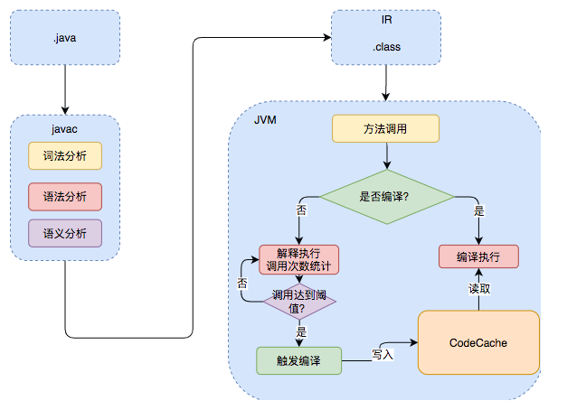

JIT
--

# 常见的编译型语言如C++，
通常会把代码直接编译成CPU所能理解的机器码来运行。而Java为了实现“一次编译，处处运行”的特性，把编译的过程分成两部分，首先它会先由javac编译成通用的中间形式——字节码，然后再由解释器逐条将字节码解释为机器码来执行。所以在性能上，Java通常不如C++这类编译型语言。为了优化Java的性能 ，JVM在解释器之外引入了即时（Just In Time）编译器：当程序运行时，解释器首先发挥作用，代码可以直接执行。随着时间推移，即时编译器逐渐发挥作用，把越来越多的代码编译优化成本地代码，来获取更高的执行效率。解释器这时可以作为编译运行的降级手段，在一些不可靠的编译优化出现问题时，再切换回解释执行，保证程序可以正常运行。即时编译器极大地提高了Java程序的运行速度，而且跟静态编译相比，即时编译器可以选择性地编译热点代码，省去了很多编译时间，也节省很多的空间。

--

# Java的执行过程整体可以分为两个部分，
第一步由javac将源码编译成字节码，在这个过程中会进行词法分析、语法分析、语义分析，编译原理中这部分的编译称为前端编译。接下来无需编译直接逐条将字节码解释执行，在解释执行的过程中，虚拟机同时对程序运行的信息进行收集，在这些信息的基础上，编译器会逐渐发挥作用，它会进行后端编译——把字节码编译成机器码，但不是所有的代码都会被编译，只有被JVM认定为的热点代码，才可能被编译。怎么样才会被认为是热点代码呢？JVM中会设置一个阈值，当方法或者代码块的在一定时间内的调用次数超过这个阈值时就会被编译，存入codeCache中。当下次执行时，再遇到这段代码，就会从codeCache中读取机器码，直接执行，以此来提升程序运行的性能。

