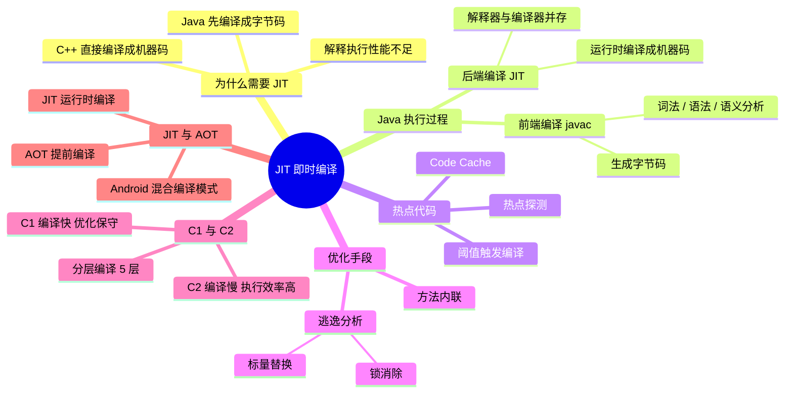
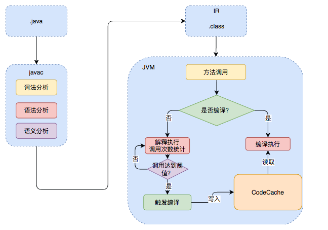

# JIT（即时编译）

```mermaid
mindmap
  root((JIT 即时编译))
    为什么需要 JIT
      C++ 直接编译成机器码
      Java 先编译成字节码
      解释执行性能不足
    Java 执行过程
      前端编译 javac
        词法 / 语法 / 语义分析
        生成字节码
      后端编译 JIT
        运行时编译成机器码
        解释器与编译器并存
    热点代码
      热点探测
      阈值触发编译
      Code Cache
    优化手段
      方法内联
      逃逸分析
        锁消除
        标量替换
    C1 与 C2
      C1 编译快 优化保守
      C2 编译慢 执行效率高
      分层编译 5 层
    JIT 与 AOT
      JIT 运行时编译
      AOT 提前编译
      Android 混合编译模式
```

---

## 一、为什么需要 JIT

常见的编译型语言如 C++，通常会把代码直接编译成 CPU 所能理解的机器码来运行。而 Java 为了实现"一次编译，处处运行"的特性，把编译的过程分成两部分：

1. 先由 `javac` 编译成通用的中间形式——**字节码**；
2. 再由**解释器**逐条将字节码解释为机器码来执行。

所以在性能上，Java 通常不如 C++ 这类编译型语言。为了优化 Java 的性能，JVM 在解释器之外引入了**即时（Just In Time）编译器**：程序运行时，解释器首先发挥作用，代码可以直接执行；随着时间推移，即时编译器逐渐发挥作用，把越来越多的代码编译优化成本地代码，来获取更高的执行效率。

解释器这时可以作为编译运行的**降级手段**——在一些不可靠的编译优化出现问题时，再切换回解释执行，保证程序可以正常运行。

即时编译器极大地提高了 Java 程序的运行速度，而且跟静态编译相比，它可以选择性地只编译**热点代码**，省去了很多编译时间，也节省很多空间。

---

## 二、Java 的执行过程：前端编译与后端编译

Java 的执行过程整体可以分为两个部分：

1. **前端编译**：由 `javac` 将源码编译成字节码，这个过程中会进行词法分析、语法分析、语义分析。编译原理中这部分编译称为前端编译。
2. **后端编译**：字节码接下来无需编译、直接逐条解释执行；在解释执行的过程中，虚拟机同时收集程序运行的信息，在这些信息的基础上，编译器逐渐发挥作用，把字节码编译成机器码——也就是**后端编译（JIT）**。

注意：不是所有的代码都会被编译，只有被 JVM 认定为**热点代码**的才可能被编译。

---

## 三、热点代码与 Code Cache

JVM 中会设置一个**阈值**，当方法或者代码块在一定时间内的调用次数超过这个阈值时，就会被认定为热点代码并触发编译，编译结果存入 **Code Cache**。下次再执行到这段代码时，直接从 Code Cache 中读取机器码执行，以此提升程序运行的性能。

- 热点探测主流实现是基于**计数器**：HotSpot 为每个方法维护方法调用计数器和回边计数器，两者之和超过阈值即触发编译；
- 阈值可以通过 `-XX:CompileThreshold` 调整（开启分层编译后，由各层的阈值参数分别控制）；
- Code Cache 有大小上限，写满之后编译器会停止编译，退回解释执行——所以它也是排查"运行一段时间后性能下降"问题时要看的点。

---

## 四、即时编译器的优化手段

### 1. 方法内联

在编译过程中遇到方法调用时，将目标方法的方法体纳入编译范围之中，并取代原方法调用。方法内联不仅可以消除调用本身带来的性能开销，还可以进一步触发更多的优化，因此可以算是编译优化里**最为重要的一环**。

以 getter/setter 为例：没有内联时，调用需要保存当前方法的执行位置、创建并压入栈帧、访问字段、弹出栈帧、恢复执行；内联之后，上述操作就只剩下字段访问了。

即时编译器不会无限制内联，它会根据方法的调用次数、方法体大小、Code Cache 的空间等决定是否内联——即使方法体是热点代码，如果方法体太大也不会内联。所以平时编码中**尽可能使用小方法体**。对于需要动态绑定的虚方法调用，还要先**去虚化**（转化为直接调用）才能内联，这也是尽量使用 `final`、`private`、`static` 修饰方法的原因。

### 2. 逃逸分析

判断一个对象是否被外部方法引用或外部线程访问的分析技术，即时编译器根据分析结果可以做三项优化：

- **锁消除**：如果能证明锁对象不逃逸，对该锁对象的加锁、解锁没有任何意义，可以直接消除；
- **栈上分配**：如果能证明对象不逃逸，理论上可以分配在栈上、随方法退出自动回收——但由于实现代价大，**HotSpot 并没有采用**；
- **标量替换**：把对象拆散成一个个仅存单个值的局部变量来访问，HotSpot 实际采用的是这一项。

---

## 五、C1、C2 与分层编译

HotSpot 内置了多个即时编译器：**C1**（Client Compiler）和 **C2**（Server Compiler）。引入多个即时编译器，是为了在**编译时间**和**生成代码的执行效率**之间进行取舍：

| 编译器 | 优化风格 | 编译速度 | 生成代码质量 |
| --- | --- | --- | --- |
| C1 | 简单、可靠的优化 | 快 | 一般 |
| C2 | 耗时较长的激进优化，可依据性能监控信息 | 慢 | 高 |

Java 7 引入了**分层编译**，将 JVM 的执行状态分为 5 个层次：

- 第 0 层：解释执行，默认开启性能监控；
- 第 1~3 层：C1 编译，进行简单、可靠的优化；
- 第 4 层：C2 编译，启用编译耗时较长的优化，甚至会根据性能监控信息进行一些不可靠的激进优化。

分层编译的意义在于兼顾**启动速度**和**峰值性能**：应用刚启动时用解释执行和 C1 快速出码，跑热之后交给 C2 生成高质量的机器码。

---

## 六、JIT 与 AOT 的对比

| 维度 | JIT | AOT |
| --- | --- | --- |
| 编译时机 | 运行时，按热点动态编译 | 程序运行前提前编译 |
| 优化依据 | 运行时 profile，可做激进优化 | 静态信息，优化空间有限 |
| 启动速度 | 需要预热，启动阶段慢 | 无需预热，启动快 |
| 典型场景 | 服务端长期运行 | Android 安装时 `dex2oat` 预编译成 oat |

Android 上的演进正好把两者串了起来：早期 Dalvik 用 JIT；Android 5 之后 ART 全面采用 AOT，解决了启动和运行速度问题，但带来安装时间长、优化文件占用额外存储的问题；**Android 7 之后 JIT 回归**，形成 AOT/JIT 混合编译模式——安装时不编译 dex，运行时先解释执行、热点代码由 JIT 编译并生成 profile 文件，手机进入 IDLE 或充电状态时系统再扫描 profile 执行 AOT 编译。这与 HotSpot 的解释器 + 即时编译器混合模式是同一个思路。

---

## 七、小结

JIT 解决的问题是：Java 为了跨平台先编译成字节码，解释执行性能不足，于是在运行时把**热点代码**编译成本地机器码，兼得"跨平台"和"接近编译型语言的性能"。热点探测靠计数器 + 阈值，编译结果放 Code Cache；编译器分 C1/C2，通过分层编译在启动速度和峰值性能之间折中；核心优化手段是方法内联和逃逸分析。与 AOT 相比，JIT 的优势是能依据运行时信息做更激进的优化，代价是预热成本和运行时开销。
