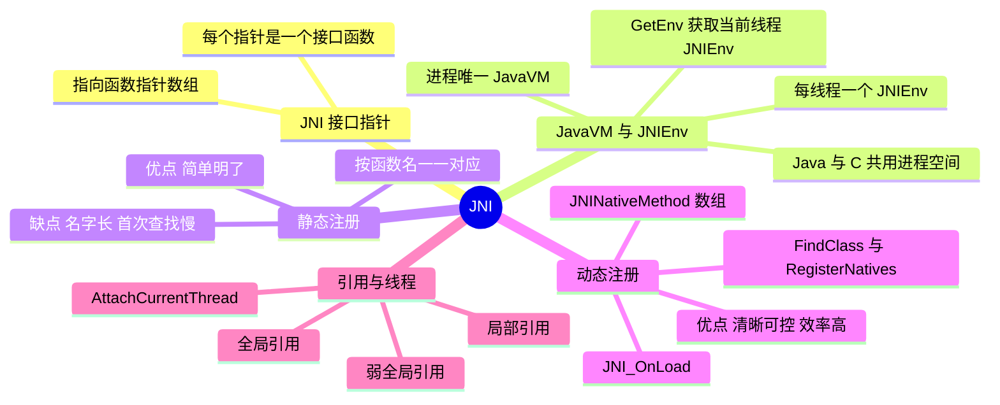

# JNI

```mermaid
mindmap
  root((JNI))
    JNI 接口指针
      指向函数指针数组
      每个指针是一个接口函数
    JavaVM 与 JNIEnv
      进程唯一 JavaVM
      每线程一个 JNIEnv
      GetEnv 获取当前线程 JNIEnv
      Java 与 C 共用进程空间
    静态注册
      按函数名一一对应
      优点 简单明了
      缺点 名字长 首次查找慢
    动态注册
      JNINativeMethod 数组
      JNI_OnLoad
      FindClass 与 RegisterNatives
      优点 清晰可控 效率高
    引用与线程
      局部引用
      全局引用
      弱全局引用
      AttachCurrentThread
```

---

## 一、native 代码与 JNI 接口指针

想要访问 Java 虚拟机需要调用 JNI 方法，而获取 JNI 方法则通过 **JNI interface Pointer**。它实际指向的就是一个都是指针的数组，每个指针指向的都是一个接口函数。

---

## 二、JavaVM 和 JNIEnv 的关系

1. 每个进程只有一个 **JavaVM**（理论上一个进程可以拥有多个 JavaVM 对象，但 Android 只允许一个），每个线程都会有一个 **JNIEnv**，大部分 JNI API 通过 JNIEnv 调用；也就是说，JNI 全局只有一个 JavaVM，而可能有多个 JNIEnv。
2. 一个 JNIEnv 内部包含一个 Pointer，Pointer 指向 Dalvik 的 JavaVM 对象的 Function Table，JNIEnv 内部的函数执行环境来源于 Dalvik 虚拟机。
3. Android 中每当一个 Java 线程第一次要调用本地 C/C++ 代码时，Dalvik 虚拟机实例会为该 Java 线程产生一个 JNIEnv 指针。
4. Java 每条线程在和 C/C++ 互相调用时，JNIEnv 是互相独立、互不干扰的，这样就提升了并发执行时的安全性。
5. 当本地的 C/C++ 代码想要获得当前线程所想要使用的 JNIEnv 时，可以使用 Dalvik VM 对象的 `JavaVM::GetEnv()` 方法，该方法会返回当前线程所在的 JNIEnv。
6. Java 的 dex 字节码和 C/C++ 的 .so 同时运行在 Dalvik VM 之内，共同使用一个进程空间。

---

## 三、静态注册

- 根据**函数名**来建立 Java native 方法与 JNI 函数的一一对应关系。
- **优点**：简单明了。
- **缺点**：
  - 编写不方便，JNI 方法名字必须遵循规则且名字很长；
  - 程序运行效率低，因为初次调用 native 函数时需要根据函数名在 JNI 层中搜索对应的本地函数，然后建立对应关系，这个过程比较耗时。

---

## 四、动态注册

**原理：**

1. 利用 `RegisterNatives` 方法来注册 Java native 方法与 JNI 函数的一一对应关系；
2. 利用结构体 `JNINativeMethod` 数组记录 Java 方法与 JNI 函数的对应关系；
3. 实现 `JNI_OnLoad` 方法，在加载动态库后，执行动态注册；
4. 调用 `FindClass` 方法，获取 Java 对象；
5. 调用 `RegisterNatives` 方法，传入 Java 对象，以及 `JNINativeMethod` 数组，以及注册数目完成注册。

**优点：**

- 流程更加清晰可控；
- 效率更高。

**示例**：Android API 源码 `Bitmap.java`，其中的 native 方法即通过动态注册关联到 native 实现。

---

## 五、两种注册方式对比

| 维度 | 静态注册 | 动态注册 |
| --- | --- | --- |
| 对应关系建立方式 | 按函数名（`Java_类全名_方法名`）自动匹配 | `RegisterNatives` 显式注册 |
| 注册时机 | 首次调用 native 方法时查找并建立 | `JNI_OnLoad` 中，动态库加载后立即完成 |
| 效率 | 初次调用需要按名字搜索，较耗时 | 注册后直接按表查找，效率更高 |
| 可维护性 | 名字长、易写错 | 流程清晰可控，改方法名不用改 C++ 函数名 |
| 适用场景 | 少量、简单的方法 | 方法多、对效率有要求（Android Framework 大量使用） |

---

## 六、JNI 引用与线程（补充）

**三种引用：**

| 引用类型 | 创建方式 | 生命周期 | 能否跨线程 |
| --- | --- | --- | --- |
| 局部引用 Local Reference | native 方法内自动创建（如 `FindClass` 返回值） | native 方法执行期间有效，返回后自动释放 | 不能 |
| 全局引用 Global Reference | `NewGlobalRef` | 手动 `DeleteGlobalRef` 释放，否则一直有效 | 能 |
| 弱全局引用 Weak Global Reference | `NewWeakGlobalRef` | 不阻止 GC，对象可被回收，使用前需判空 | 能 |

**线程绑定：** JNIEnv 是线程私有的，不能跨线程传递。Java 线程进入 native 时会自动绑定 JNIEnv；而 native 自己创建的线程（pthread）要调用 Java 方法，必须先 `AttachCurrentThread` 获取 JNIEnv，用完再 `DetachCurrentThread`，否则会失败或泄漏。

---

## 七、30 秒口述版

JNI 是 Java 与 native 代码互调的桥梁：JNI 全局只有一个 JavaVM，而每个线程各有一个 JNIEnv，大部分 JNI 函数都通过 JNIEnv 的函数表调用，线程间互不干扰。Java native 方法与 C/C++ 函数的绑定有两种方式——静态注册按函数名自动匹配，简单但名字长、首次调用要搜索、效率低；动态注册在 `JNI_OnLoad` 中通过 `JNINativeMethod` 数组和 `RegisterNatives` 显式绑定，清晰可控、效率高，Android Framework 普遍采用。跨 native 层传递对象要注意局部引用不能跨线程，需用全局引用或 Attach 线程。
