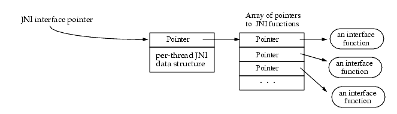

JNI
--

# native代码
想要访问 java虚拟机需要调用JNI方法，而获取JNI方法则通过 JNI interface Pointer。它实际指向的就是一个都是指针的数组，每个指针指向的都是一个接口函数

--

# JavaEnv 和 JavaVM 的关系

- 1）每个进程只有一个 JavaVM（理论上一个进程可以拥有多个 JavaVM 对象，但 Android 只允许一个），每个线程都会有一个 JNIEnv，大部分 JNIAPI 通过 JNIEnv 调用；也就是说，JNI 全局只有一个 JavaVM，而可能有多个 JNIEnv；

- 2）一个 JNIEnv 内部包含一个 Pointer，Pointer 指向 Dalvik 的 JavaVM 对象的 Function Table，JNIEnv 内部的函数执行环境来源于 Dalvik 虚拟机；

- 3）Android 中每当一个Java 线程第一次要调用本地 C/C++ 代码时，Dalvik 虚拟机实例会为该 Java 线程产生一个 JNIEnv 指针；

- 4）Java 每条线程在和 C/C++ 互相调用时，JNIEnv 是互相独立，互不干扰的，这样就提升了并发执行时的安全性；

- 5）当本地的 C/C++ 代码想要获得当前线程所想要使用的 JNIEnv 时，可以使用 Dalvik VM 对象的 JavaVM jvm->GetEnv()方法，该方法会返回当前线程所在的 JNIEnv；

- 6）Java 的 dex 字节码和 C/C++ 的 .so 同时运行 Dalvik VM 之内，共同使用一个进程空间；

--

# 静态注册:

- 根据函数名来建立java native方法与JNI函数的一一对应关系。

- 优点：简单明了

- 缺点：

    - 编写不方便，JNI方法名字必须遵循规则且名字很长；

    - 程序运行效率低，因为初次调用native函数时需要根据根据函数名在JNI层中搜索对应的本地函数，然后建立对应关系，这个过程比较耗时；

--

# 动态注册:

- 原理：

    - 利用RegisterNatives方法来注册java native方法与JNI函数的一一对应关系；

    - 利用结构体 JNINativeMethod 数组记录 java 方法与 JNI 函数的对应关系；

    - 实现 JNI_OnLoad 方法，在加载动态库后，执行动态注册；

    - 调用 FindClass 方法，获取 java 对象；

    - 调用 RegisterNatives 方法，传入 java 对象，以及 JNINativeMethod 数组，以及注册数目完成注册；

- 优点：

    - 流程更加清晰可控；

    - 效率更高；

- Android API源码Bitmap.java

