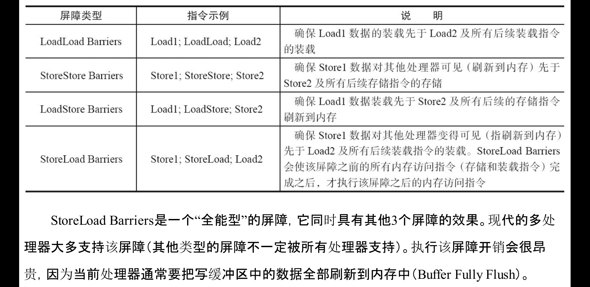
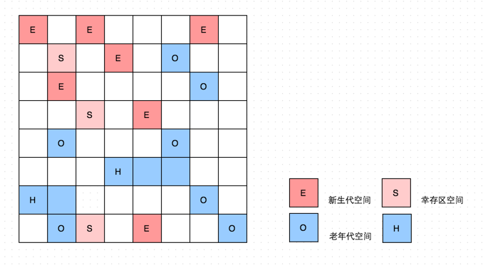
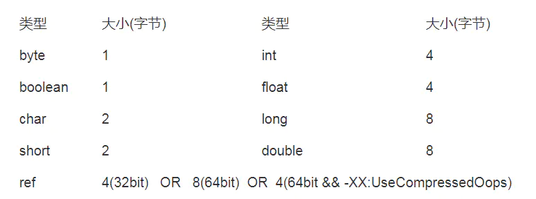

JVM
--

# 内存


- 内存区域

    - 线程私有

         - 虚拟机栈是描述 Java 方法执行的内存区域，它是线程私有的。栈中的元素用于支持虚拟机进行方法调用 每个方法从开始调用到执行完成的过程 就是栈帧从入栈到出栈的过程。在活动线程中 只有位于栈顶的帧才是效的 称为当前栈帧。正在执行的方法称为当前方法 校栈帧是方法运行的基本结构。

              - 局部变量表

              - 操作栈

              - 动态链接

              - 方法返回地址

         - 本地方法栈

         - 程序计数器

    - 线程共享

         - 堆，分成两大块 新生代和老年代。对象产生之初在新生代 步入暮年时进入老年但是老年代也接纳在新生代无法容纳的超大对象。新生代＝ Eden 区＋Survivor 区。绝大部分对象在 Eden 区生成 Eden 区装填满的时候 会触发 Young Garbage Collection YGC 。垃圾回收的时候 Eden 区实现清除策略 没有被引用的对象则直接回收。依然存活的对象会被移送到 Survivor 这个区真是名副其实的存在。 Survivor 区分为 s0,s1 两块内存空间 送到哪块空间呢？每次 YGC候， 将存活的对象复制到未使用的那块空间，然后将当前正在使用的空间完全清除 交换两块空间的使用状态。如果 YGC 要移送的对象大于 Survivor 区容量的上限 ， 直接移交给老年代。假如一些没有进取心的对象以为可以一直在新生代的Survivor 区交换来交换去，那就错了。每个对象都有 个计数器，每次 YGC 都会XX:MaxTenuringThreshold 参数能配置计数器的值到达某个阐值的时候 对象从新生 晋升至老年代。如果该参数配置为 ，那么从新生代的 Eden 区直接移至老年代。认值 15 可以在 Survivor 区交换 14 次之后 晋升至老年代。

         - 方法区,是用于存储已被虚拟机加载的类信息、常量、静态变量、即使编译器编译后的代码等数据。JVM 对方法区的限制比较宽松，除了和 Java 堆一样不需要连续的内存和可以选择固定大小或者可扩展外，还可以选择不实现垃圾回收。相对而言，垃圾回收在这个区域是比较少出现的。运行时常量池是方法区的一部分，它用来存储编译期生成的各种字面量和符号引用。运行时常量池相比 Class 文件常量池一个重要的特点是具备动态性，也就是在运行期间也可能将新的常量放入池中，比如 String 的 intern 方法。


- 内存模型

    - JMM 内存模型是用来屏蔽掉各种硬件和操作系统的内存访问差异，以实现让 Java 程序在各个平台下都能达到一致的内存访问效果。

    - Java 内存模型规定了所有的共享变量都是存储在主内存，每个线程还有自己的工作内存，线程的工作内存保存了该线程使用到的共享变量的主内存副本拷贝，线程对变量的操作都必须在工作内存中进行，而不能直接读写主内存中的变量，不同的线程之间也无法直接访问对方工作内存中的数据，线程间变量值的传递均需要主内存来完成。我们知道 CPU 执行的速度是远超于内存访问速度，为了中和这种速度差异，在 CPU 和内存之间会加入多个 CPU 缓存，比如 L1、L2、L3。CPU 在处理数据时会先把内存中的数据读到自己的 CPU 缓存中，然后在缓存中进行操作数据，最后再把数据同步到内存中。这里，就可以把 CPU 的缓存看成是线程的工作内存，而把内存看成是主内存，虽然这个说法并不严谨，但是易于理解。

    - 指令重排，每个处理器上的写缓冲区，仅仅对它所在的处理器可见。这个特性会对内存操作的执行顺序产生重要的影响：处理器对内存的读/写操作的执行顺序，不一定与内存实际发生的读/写操作顺序一致

    - happen-before

         - 程序顺序规则：一个线程中的每个操作，happens-before于该线程中的任意后续操作。

         - 监视器锁规则：对一个锁的解锁，happens-before于随后对这个锁的加锁。

         - volatile变量规则：对一个volatile域的写，happens-before于任意后续对这个volatile域的读。

         - 传递性：如果A happens-before B，且B happens-before C，那么A happens-before C。

         - 注意 两个操作之间具有happens-before关系，并不意味着前一个操作必须要在后一个操作之前执行！happens-before仅仅要求前一个操作（执行的结果）对后一个操作可见，且前一个操作按顺序排在第二个操作之前（the first is visible to and ordered before the second）。

    - 数据通过总线在处理器和内存之间传递。每次处理器和内存之间的数据传递都是通过一系列步骤来完成的，这一系列步骤称之为总线事务（Bus Transaction）。总线事务包括读事务（Read Transaction）和写事务（WriteTransaction）。读事务从内存传送数据到处理器，写事务从处理器传送数据到内存，每个事务会读/写内存中一个或多个物理上连续的字。这里的关键是，总线会同步试图并发使用总线的事务。在一个处理器执行总线事务期间，总线会禁止其他的处理器和I/O设备执行内存的读/写。

    - jvm内存屏障
    
	

    - 内存语义

         - volatile

              - 线程A写一个volatile变量，实质上是线程A向接下来将要读这个volatile变量的某个线程发出了（其对共享变量所做修改的）消息。

              - 线程B读一个volatile变量，实质上是线程B接收了之前某个线程发出的（在写这个volatile变量之前对共享变量所做修改的）消息。

              - 线程A写一个volatile变量，随后线程B读这个volatile变量，这个过程实质上是线程A通过主内存向线程B发送消息。

         - 锁的内存语义

              - 线程A释放一个锁，实质上是线程A向接下来将要获取这个锁的某个线程发出了（线程A对共享变量所做修改的）消息。

              - 线程B获取一个锁，实质上是线程B接收了之前某个线程发出的（在释放这个锁之前对共享变量所做修改的）消息。

              - 线程A释放锁，随后线程B获取这个锁，这个过程实质上是线程A通过主内存向线程B发送消息


- 内存分配回收策略

    - 对象优先在 Eden 区分配,准确的来说，是优先在 Eden 区的 TLAB 上分配，如果 Eden 区没有足够的空间进行分配时，就会触发一次 Minor GC。

    - 大对象直接进入老年代,所谓的大对象是指需要连续大量内存空间的 Java 对象，比如数组，一般来说，超过 3M 的对象会直接在老年代进行分配。

    - 长期存活的对象进入老年代,既然虚拟机采用了分代收集的思想来管理内存，那么内存回收就必须得识别哪些对象应放在新生代还是老年代。为了做到这一点，虚拟机给每个对象定义了一个对象年龄计数器。如果对象在 Eden 出生并经过一次 Minor GC 后仍然存活，并且能被 Survivor 容纳的话，将会被移到 Survivor 空间中，并且对象年龄设置为 1.对象每在 Survivor 区熬过一次 Minor GC，年龄就会增加 1。当年龄增加到一定程度，默认是 15，就将会晋升到老年代中。

    - Minor GC 是指发生在新生代的垃圾回收动作，因为 Java 对象大多都是朝生夕死的，所以 Minor GC 比较频繁，回收速度也比较快。

    - Full GC/Major GC 指发生在老年代的 GC，出现 Full GC 经常会伴随着至少一次的 Minor GC，Full GC 一般会比 Minor GC 慢十倍以上。

- 内存回收GC

    - 引用计数及可达性分析

         - 引用计数法就是给对象添加一个引用计数器，每当有一个地方引用时就加一，引用失效时就减一。引用计数实现简单，判断效率也很高，但是 JVM 并没有采用引用计数来管理内存，其中最主要的原因是它很难解决对象之间的相互循环引用问题。

         - 可达性分析的思路是通过一系列称为 GC Roots 的对象作为起始点，从这些起始点出发向下搜索，当有一个对象到 GC Roots 没有任何引用链时，即不可达，则说明此对象是不可用的。在 Java 中，可作为 GC Roots 的对象有虚拟机栈和本地方法栈中引用的对象、方法区中类静态属性引用的对象、方法区中常量引用的对象等。

         - 但这也并不是说引用计数一无是处，在 Android 的 Framework Native 层用的智能指针。智能指针就是一种能够自动维护对象引用计数的技术，它是一个对象而不是一个指针，但是它引用了一个实际使用的对象。简单来说，就是在智能指针构造时，增加它所引用的对象的引用计数；而在智能指针析构时，就减少它所引用对象的引用对象。但是它是怎样解决相互引用问题的呢？其实是通过强弱引用来实现，也就是将对象的引用计数分为强引用计数和弱引用计数两种，其中，对象的生命周期只受强引用计数控制。比如在解决对象 A 和 B 相互引用时，把 A 看成父 B 看成子，对象 A 通过强引用计数来引用 B，B 通过弱引用计数来引用 A。在 A 不再使用时，由于 B 是通过弱引用来引用它的，因此 A 的生命周期是不受 B 影响的，所以 A 可以安全的释放，在释放 A 时，同时也会释放它对 B 的强引用，这时 B 也可以被安全的回收了。在 Android 中，是使用 sp 来表示强引用，wp 表示弱引用。

         - Java 中的引用可以分为四类，强引用、软引用、弱引用和虚引用。强引用在程序中普遍存在，类似 new 的这种操作，只要有强引用存在，即使 OOM JVM 也不会回收该对象。软引用是在内存不够用时，才会去回收，JDK 提供了 SoftReference 类来实现软引用。弱引用是在 GC 时不管内存够不够用都会去回收的，可以使用 WeakReference 类来实现弱引用。虚引用对对象的生命周期没有影响，只是为了能在对象回收时收到一个系统通知，可以使用 PhantomReference 类来实现虚引用。

    - 垃圾回收算法

         - 标记清除是先通过 GC Roots 标记所存活的对象，然后再统一清除未被标记的对象，它的主要问题是会产生内存碎片。老年代使用的 CMS 收集器就是基于标记清除算法。

         - 复制算法是把内存空间划分为两块，每次分配对象只在一块内存上进行分配，在这一块内存使用完时，就直接把存活的对象复制到另外一块上，然后把已使用的那块空间一次清理掉，但是这种算法的代价就是内存的使用量缩小了一半。现代虚拟机都采用复制算法回收新生代，不过是把内存划分为了一个 Eden 区和两个 Survivor 区，比例是 8:1:1，每次使用 Eden 和其中一块 Survivor 区，也就是只有 10% 的内存会浪费掉。如果 Survivor 空间不够用，需要依赖其他内存比如老年代进行分配担保。复制算法在对象存活率比较高时效率是比较低下的，所以老年代一般不使用复制算法。

         - 标记整理算法即是在标记清除之后，把所有存活的对象都向一端移动，然后清理掉边界以外的内存区域。

    - Garbage First（G1）收集器是垃圾收集器技术发展历史上的里程碑式的成果，它开创了收集器面向局部收集的设计思路和基于 Region 的内存布局形式。它和 CMS 同样是一款主要面向服务端应用的垃圾收集器，不过在 JDK9 之后，CMS 就被标记为废弃了，G1 作为默认的垃圾收集器，在 JDK 14 已经正式移除 CMS 了。在 G1 收集器出现之前的所有其他收集器，包括 CMS 在内，垃圾收集的目标范围要么是整个新生代（Minor GC），要么就是整个老年代（Major GC），在要么就是整个 Java 堆（Full GC）。而 G1 是基于 Region 堆内存布局，虽然 G1 也仍是遵循分代收集理论设计的，但其堆内存的布局与其他收集器有非常明显的差异：G1 不再坚持固定大小以及固定数量的分代区域划分，而是把连续的 Java 堆划分为多个大小相等的独立区域（Region），每一个 Region 都可以根据需要，扮演新生代的 Eden 空间、Survivor 空间或者老年代。收集器根据 Region 的不同角色采用不同的策略去处理。G1 会根据用户设定允许的收集停顿时间去优先处理回收价值收益最大的那些 Region 区，也就是垃圾最多的 Region 区，这就是 Garbage First 名字的由来。
    
	

         - 两种GC模式，Young GC和Mixed GC，两种都是完全Stop The World的。

              - Young GC：选定所有年轻代里的Region。通过控制年轻代的region个数，即年轻代内存大小，来控制young GC的时间开销。

              - Mixed GC：选定所有年轻代里的Region，外加根据global concurrent marking统计得出收集收益高的若干老年代Region。在用户指定的开销目标范围内尽可能选择收益高的老年代Region。Mixed GC不是full GC，它只能回收部分老年代的Region，如果mixed GC实在无法跟上程序分配内存的速度，导致老年代填满无法继续进行Mixed GC，就会使用serial old GC（full GC）来收集整个GC heap。所以我们可以知道，G1是不提供full GC的。

         - global concurrent marking，它的执行过程类似CMS，但是不同的是，在G1 GC中，它主要是为Mixed GC提供标记服务的，并不是一次GC过程的一个必须环节。

              - 1.初始标记，仅仅只是标记一下 GC Roots 能直接关联到的对象，这个阶段需要停顿线程，但耗时很短。

              - 2.并发标记，从 GC Root 开始对堆中对象进行可达性分析，递归扫描整个堆里的对象图，找出要回收的对象，这阶段耗时较长，但是可与用户程序并发执行。

              - 3.最终标记，对用户线程做另一个短暂的暂停，用于处理在并发标记阶段新产生的对象引用链变化。

              - 4.筛选回收，负责更新 Region 的统计数据，对各个 Region 的回收价值和成本进行排序，根据用户所期望的停顿时间来制定回收计划。

- Java 对象的创建、内存布局和访问定位

    - 对象创建，在虚拟机遇到一条 new 指令时，首先将去检查这个指令的参数是否能在常量池中定位到一个类的符号引用，并且检查这个符号引用代表的类是否已经被加载过了，如果没有就走类加载流程。在类加载检查通过之后，虚拟机就会为新生对象分配内存，对象所需内存在类加载完成之后就确定了。为对象分配内存空间就等同于把一块确定大小的内存从 Java 堆中划分出来。分配方式有指针碰撞和空闲列表两种，选择哪种分配方式由 Java 堆是否规整决定，而 Java 堆是否规整又由所采用的垃圾收集器是否具有压缩整理功能决定。对象创建在虚拟机是非常频繁的行为，即使是仅仅修改了一个指针指向的位置，在并发情况下也不是线程安全的。解决方案有两种，一种是采用 CAS 配上失败重试，另一种是使用线程私有的分配缓冲区 TLAB。

    - 对象的内存布局，在 HotSpot 虚拟机中，对象在内存中存储的布局可以分为三块区域：对象头、实例数据和对其填充。可以使用 OpenJDK 开源的 JOL 工具查看对象的内存布局，直接 new Object 所占用的大小为 16 字节，即 12 个字节的对象头 + 4 个字节的对其填充。JOL 对分析集合源码扩容、HashMap 的 hash 冲突等非常有用。

         - 对象头：Instance Header，Java对象最复杂的一部分，采用C++定义了头的协议格式，存储了Java对象hash、GC年龄、锁标记、class指针、数组长度等信息

         - 实例数据：Instance Data，这部分数据才是真正具有业务意义的数据，实际上就是当前对象中的实例字段。在VM中，对象的字段是由基本数据类型和引用类型组成的。其中ref表示引用类型，引用类型实际上是一个地址指针，32bit机器上，占用4字节，64bit机器上，在jdk1.6之后，如果开启了指针压缩(默认开启: -XX:UseCompressedOops，仅支持64位机器)，则占用4字节。
	

         - 对齐填充：Padding，VM要求对象大小须是8的整体数，该部分是为了让整体对象在内存中的地址空间大小达到8的整数倍而额外占用的字节数。

    - 对象的访问定位，Java 程序需要通过栈上的 reference 数据来操作堆上的具体对象，由于 reference 类型在 Java 虚拟机规范中只规定了一个指向对象的引用，并没有规定这个引用应该通过什么方式去定位和访问堆中的对象，所以对象访问方式也是取决于虚拟机实现而定。目前主流的方式有使用句柄和直接指针两种。使用句柄，就是相当于加了一个中间层，在对象移动时只会改变句柄中的实例数据的指针，reference 本身不需要改变。HotSpot 使用的是第二种，使用直接指针的方式访问的最大好处就是速度很快。


--

# 类加载，编译器优化，虚拟机


- 类加载机制，虚拟机把描述类的数据从 Class 文件加载到内存，并对数据进行校验、解析和初始化，最终形成可以被虚拟机直接使用的 Java 对象，这就是虚拟机的类加载机制。

    - 加载阶段，就是通过一个类的全限定名来获取定义此类的二进制字节流，将这个字节流所代表的静态存储结构转化为方法区的运行时数据结构。加载阶段是开发人员可控性最强的阶段，因为开发人员可以自定义类加载器。对于数组而言，情况有所不同，数组类本身不通过类加载器创建，它是由 Java 虚拟机直接创建。

    - 验证是链接阶段的第一步，这一阶段的目的是为了确保 Class 文件的字节流中包含的信息符合当前虚拟机的要求，并且不会危害虚拟机自身的安全。它包括文件格式校验、元数据校验、字节码校验等。

    - 准备阶段是正式为类变量分配内存并设置类变量初始值的阶段，这些变量所使用的内存都将在方法区中进行分配。需要注意的是，这时候进行内存分配的仅仅包含类变量，不包括实例变量，实例变量将会在对象实例化时随着对象一起分配在 Java 堆上。其次，这里所说的变量初始值是该数据类型的零值。

    - 解析阶段是虚拟机将常量池内的符号引用替换为直接引用的过程。符号引用以一组符号来描述所引用的目标，直接引用可以是直接指向目标的指针。

    - 初始化阶段是执行类构造器 <clinit>() 方法的过程。<clinit>() 方法是由编译器自动收集类中的所有类变量的赋值动作和静态语句块中的语句合并产生的，编译器收集的顺序是由语句在源文件中出现的顺序所决定的。虚拟机会保证一个类的 <clinit>() 方法在多线程环境中被正确的加锁同步，如果多个线程同时去初始化一个类，那么只会有一个线程去执行这个类的 <clinit>() 方法，其他线程都需要阻塞等待，这也是静态内部类能实现单例的主要原因之一。

- 双亲委派模型

     1.首先从已加载类中查找，如果能够找到则直接返回，找不到则调用 parent classloader 的 loadClass 进行查找；

     2.如果 parent clasloader 能找到相关类则直接返回，否则调用 findClass 去进行类加载；

     ```
          protected Class<?> loadClass(String name, boolean resolve)
     throws ClassNotFoundException
     {
          Class<?> c = findLoadedClass(name);
          if (c == null) {
               try {
                    if (parent != null) {
                         c = parent.loadClass(name, false);
                    } else {
                         c = findBootstrapClassOrNull(name);
                    }
               } catch (ClassNotFoundException e) {
               }

               if (c == null) {
                    c = findClass(name);
               }
          }
          return c;
     }
     ```


- 编译器优化

    - 前端编译:javac,常量折叠、自动装拆箱、条件编译等，其次还有 JDK9 使用 StringContactFactory 对 "+" 的重载提供的统一入口等

    - 后端编译是运行时优化和即时编译器（JIT）优化。

         - 运行时优化主要是解释执行和动态编译通用的一些机制，比如说锁机制（如偏斜锁）、内存分配机制（如 TLAB）等，模版解释器、内联缓存（inline cache，用于优化虚方法调用的动态绑定）。

         - JVM 的即时编译器优化是指将热点代码以方法为单位转化成机器码，直接运行在底层硬件之上

              - 方法内联，它指的是在编译的过程中遇到方法调用时，将目标方法的方法体纳入编译范围之中，并取代原方法调用的优化手段。方法内联不仅可以消除调用本身带来的性能开销，还可以进一步触发更多的优化。因此，它可以算是编译优化里最为重要的一环。以 getter/setter 为例，如果没有方法内联，在调用 getter/setter 时，程序需要保存当前方法的执行位置，创建并压入用于 getter/setter 的栈桢、访问字段、弹出栈桢，最后再恢复当前方法的执行。而当内联了对 getter/setter 的方法调用后，上述操作就只剩下字段访问了。但是即时编译器不会无限制的进行方法内联，它会根据方法的调用次数、方法体大小、Code cache 的空间等去决定是否要进行内联。比如即使是热点代码，如果方法体太大，也不会进行内联，因为会占用更多内存空间。所以平时编码中，尽可能使用小方法体。对于需要动态绑定的虚方法调用来说，即时编译器则需要先对虚方法调用进行去虚化，即转化为一个或多个直接调用，然后才能进行方法内联。说到这，你应该就明白 final/static 的好处了。所以尽量使用 final、private、static 关键字修饰方法，虚方法因为继承，会需要额外的类型检查才能知道实际上调用的是哪个方法。

              - 逃逸分析，是判断一个对象是否被外部方法引用或外部线程访问的分析技术，即时编译器可以根据逃逸分析的结果进行诸如锁消除、栈上分配以及标量替换的优化。我们先看一下锁消除，如果即时编译器能够证明锁对象不逃逸，那么对该锁对象的加锁、解锁操作没有任何意义，因为其他线程并不能获得该锁对象，在这种情况下，即时编译器就可以消除对该不逃逸对象的加锁、解锁操作。比如 synchronized(new Object) 这种操作会被完全优化掉。不过一般不会有人这么写，事实上，逃逸分析的结果更多被用于将新建对象操作转换成栈上分配或者标量替换。我们知道，Java 虚拟机中对象都是在堆上进行分配的，而堆上的内容对任何线程可见，与此同时，JVM 需要对所分配的堆内存进行管理，并且在对象不再被引用时回收其所占据的内存。如果逃逸分析能够证明某些新建的对象不逃逸，那么 JVM 完全可以将其分配至栈上，并且在方法退出时，通过弹出当前方法的栈桢来自动回收所分配的内存空间。不过，由于实现起来需要更改大量假设了 “对象只能堆分配” 的代码，因此 HotSpot 虚拟机并没有采用栈上分配，而是使用了标量替换这么一项技术。所谓的标量，就是仅能存储一个值的变量，比如 Java 代码中的局部变量。标量替换这项优化技术，可以看成将原本对对象的字段的访问，替换成一个个的局部变量的访问。

- 虚拟机相关

    - HotSpot 及 JIT
    
         - 从硬件视角来看呢，Java 字节码是无法直接运行的，因此 JVM 需要将字节码翻译成机器码。在 HotSpot 里面，翻译过程有两种，一种是解释执行，即逐条将字节码翻译成机器码并执行，第二种是即时编译执行，即以方法为单位整体编译为机器码后再执行。前者的优势在于无需等待编译，而后者的优势在于实际运行速度更快。HotSpot 默认采用混合模式，综合了解释执行和编译执行两者的优点。它会先解释执行字节码，而后将其中反复执行的热点代码，以方法为单位进行编译执行。

         - HotSpot 内置了多个 JIT 即时编译器，C1 和 C2，之所以引入多个即时编译器，是为了在编译时间和生成代码的执行效率之间进行取舍。Java 7 引入了分层编译，分层编译将 JVM 的执行状态分为 5 个层次。第 0 层是解释执行，默认开启性能监控；第 1 层到第 3 层都是称为 C1 编译，将字节码编译成本地代码，进行简单、可靠的优化；第 4 层是 C2 编译，也是将字节码编译成本地代码，但是会启用一些编译耗时较长的优化，甚至会根据性能监控信息进行一些不可靠的激进优化。

    - Dalvik，HotSpot 是基于栈结构的，而 Dalvik 是基于寄存器结构。在官方文档上，已经没有 Dalvik 相关的信息了，Android 5 后，ART 全面取代了 Dalvik。Dalvik 使用 JIT

         - 体系结构。Java 虚拟机是基于栈实现，而 Android 虚拟机是基于寄存器实现。在 ARM 平台，寄存器实现性能会高于栈实现。

         - 格式结构。对于 Class 文件，每个文件都会有自己单独的常量池以及其他一些公共字段。对于 Dex 文件，整个 Dex 中的所有 Class 共用同一个常量池和公共字段，所以整体结构更加紧凑，因此也大大减少了体积。

         - 指令优化。Dalvik 字节码对大量的指令专门做了精简和优化

    - ART 及 AOT，ART 使用 AOT。AOT 和 JIT 的不同之处在于，JIT 是在运行时进行编译，是动态编译，并且每次运行程序的时候都需要对 odex 重新进行编译；而 AOT 是静态编译，应用在安装的时候会启动 dex2oat 过程把 dex 预编译成 oat 文件，每次运行程序的时候不用重新编译。AOT 解决了应用启动和运行速度问题的同时也带来了另外两个问题，一个是应用安装和系统升级之后的应用安装时间比较长，二是优化后的文件会占用额外的存储空间。在 Android 7 之后，JIT 回归，形成了 AOT/JIT 混合编译模式，这种混合编译模式的特点是：应用在安装的时候 dex 不会被编译，应用在运行时 dex 文件先通过解释器执行，热点代码会被识别并被 JIT 编译后存储在 Code cache 中生成 profile 文件，再手机进入 IDLE（空闲）或者 Charging（充电）状态的时候，系统会扫描 App 目录下的 profile 文件并执行 AOT 过程进行编译。这样一说，其实是和 HotSpot 有点内味。


--

# JVM 是如何执行方法调用的？


- 了解 Java 编译器和 JVM 是如何区分方法的。方法重载在编译阶段就能确定下来，而方法重写则需要运行时才能确定。Java 编译器会根据所传入的参数的声明类型来选取重载方法，而 JVM 识别方法依赖于方法描述符，它是由方法的参数类型以及返回类型所构成。JVM 内置了五个与方法调用相关的指令，分别是 invokestatic 调用静态方法、invokespecial 调用私有实例方法、invokevirtual 调用非私有实例方法、invokeinterface 调用接口方法以及 invokedynamic 调用动态方法。对于 invokestatic 以及 invokespecial 而言，JVM 能够直接识别具体的目标方法，而对于 invokevirtual 和 invokeinterface 而言，在绝大多数情况下，JVM 需要在执行过程中，根据调用者的动态类型来确定具体的目标方法。唯一的例外在于，如果虚拟机能够确定目标方法有且只有一个，比如方法被 final 修饰，那么它就可以不通过动态类型，直接确定目标方法。上面所说的 invokevirtual、invokeinterface 也被称为虚方法调用或者说动态绑定，相比于直接能定位方法的静态绑定而言，虚方法调用更加耗时。JVM 采用了一种空间换时间的策略来实现动态绑定。它为每个类生成一张方法表，用于快速定位目标方法，这个发生在类加载的准备阶段。方法表本质上是一个数组，它有两个特性，首先是子类方法表中包含父类方法表中所有的方法，其次是子类方法在方法表中的索引，与它所重写的父类方法的索引值相同。我们知道，方法调用指令中的符号引用会在执行之前解析为实际引用。对于静态绑定的方法调用而言，实际引用将指向具体的方法，对于动态绑定而言，实际引用则是方法表的索引值。JVM 也提供了内联缓存来加快动态绑定，它能够缓存虚方法调用中调用者的动态类型，以及该类型所对应的目标方法。


--

# JVM 是如何实现反射的？


- 反射呢是 Java 语言中一个相当重要的特性，它允许正在运行的 Java 程序观测，甚至是修改程序的动态行为。表现为两点，一是对于任意一个类，都能知道这个类的所有属性和方法，二是对于任意一个对象，都能调用它的任意属性和方法。反射的使用还是比较简单的，涉及的 API 分为三类，Class、Member（Filed、Method、Constructor）、Array and Enumerated。我们可以直接 new Exception 来查看方法调用的栈轨迹，在调用 Method.invoke() 时，是去调用 DelegatingMethodAccessorImpl 的 invoke，它的实际调用的是 NativeMethodAccessorImpl 的 invoke 方法。前者称为委派实现，后者称为本地实现。既然委派实现的具体实现是一个本地实现，那么为啥还需要委派实现这个中间层呢？其实，Java 反射调用机制还设立了另一种动态生成字节码的实现，成为动态实现，直接使用 invoke 指令来调用目标方法。之所以采用委派实现，是在本地实现和动态实现直接做切换。依据注释信息，动态实现比本地实现相比，其运行效率要快上 20 倍。这是因为动态实现无需经过 Java 到 C++ 再到 Java 的切换，但由于生产字节码比较耗时，仅调用一次的话，反而是本地实现要快上三四倍。考虑到很多反射调用仅会执行一次，JVM 设置了阈值 15，在 15 之下使用本地实现，高于 15 时便开始动态生成字节码采用动态实现。这也被称为 Inflation 机制。在反手说一下反射的性能开销在哪呢？平时我们会调用 Class.forName、Class.getMethod、以及 Method.invoke 这三个操作。其中，Class.forName 会调用本地方法，Class.getMethod 则会遍历该类的公有方法，如果没有匹配到，它还将遍历父类的公有方法，可想而知，这两个操作都非常耗时。下面就是 Method.invoke 调用本身的开销了，首先是 invoke 方法的参数是一个可变长参数，也就是构建一个 Object 数组存参数，这也同时带来了基本数据类型的装箱操作，在 invoke 内部会进行运行时权限检查，这也是一个损耗点。普通方法调用可能有一系列优化手段，比如方法内联、逃逸分析，而这又是反射调用所不能做的，性能差距再一次被放大。优化反射调用，可以尽量避免反射调用虚方法、关闭运行时权限检查、可能需要增大基本数据类型对应的包装类缓存、如果调用次数可知可以关闭 Inflation 机制，以及增加内联缓存记录的类型数目。


--

# JVM 是如何实现泛型的？


- Java 中的泛型不过是一个语法糖，在编译时还会将实际类型给擦除掉，不过会新增一个 checkcast 指令来做编译时检查，如果类型不匹配就抛出 ClassCastException。不过呢，字节码中仍然存在泛型参数的信息，如方法声明里的 T foo(T)，以及方法签名 Signature 中的 "(TT;)TT"，这些信息可以通过反射 Api getGenericXxx 拿到。除此之外，需要注意的是，泛型结合数组会有一些容易忽视的问题。数组是协变且具体化的，数组会在运行时才知道并检查它们的元素类型约束，可能出现编译时正常但运行时抛出 ArrayStoreException，所以尽可能的使用列表，这就是 Effective Java 中推荐的列表优先于数组的建议。这在我们看集合源码时也能发现的到，比如 ArrayList，它里面存数据是一个 Object[]，而不是 E[]，只不过在取的时候进行了强转。还有就是利用通配符来提升 API 的灵活性，简而言之即 PECS 原则，上取下存。典型的案例即 Collections.copy 方法了：Collections.copy(List<? super T> dest, List<? extends T> src);


--

# JVM 是如何实现异常的？


- 在 Java 中，所有的异常都是 Throwable 类或其子类，它有两大子类 Error 和 Exception。 当程序触发 Error 时，它的执行状态已经无法恢复，需要终止线程或者终止虚拟机，常见的比如内存溢出、堆栈溢出等；Exception 又分为两类，一类是受检异常，比如 IOException，一类是运行时异常 RuntimeException，比如空指针、数组越界等。接下来我会从三个方面阐述这个问题。首先是，异常实例的构造十分昂贵。这是由于在构造异常实例时，JVM 需要生成该异常的栈轨迹，该操作逐一访问当前线程的 Java 栈桢，并且记录下各种调试信息，包括栈桢所指向方法的名字、方法所在的类名以及方法在源代码中的位置等信息。其次是，JVM 捕获异常需要异常表。每个方法都有一个异常表，异常表中的每一个条目都代表一个异常处理器，并且由 from、to、target 指针及其异常类型所构成。form-to 其实就是 try 块，而 target 就是 catch 的起始位置。当程序触发异常时，JVM 会检测触发异常的字节码的索引值落到哪个异常表的 from-to 范围内，然后再判断异常类型是否匹配，匹配就开始执行 target 处字节码处理该异常。最后是 finally代码块的编译。我们知道 finally 代码块一定会运行的（除非虚拟机退出了）。那么它是如何实现的呢？其实是一个比较笨的办法，当前 JVM 的做法是，复制 finally 代码块的内容，分别放在所有可能的执行路径的出口中。


--

# JVM 是如何实现注解的？


- 其实也没啥银弹，主要就是要知道注解信息是存放在哪的？在 Java 字节码中呢是通过 RuntimeInvisibleAnnotations 结构来存储的，它是一个 Annotations 数组，毕竟类、方法、属性是可以加多个注解的嘛。在数组中的每一个元素又是一个 ElementValuePair 数组，这个里面存储的就是注解的参数信息。运行时注解可以通过反射去拿这些信息，编译时注解可通过 APT 去拿

