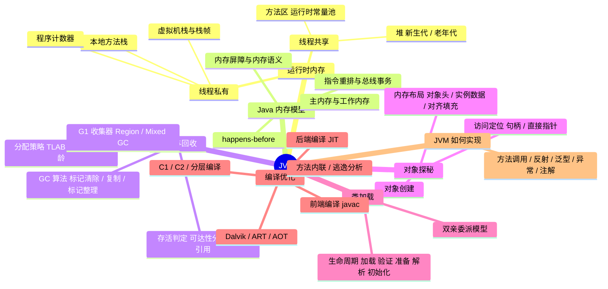
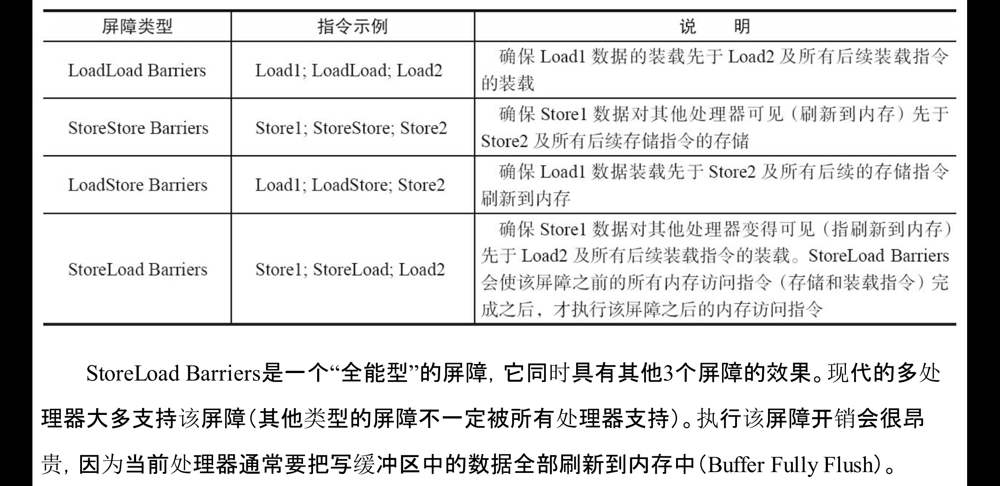
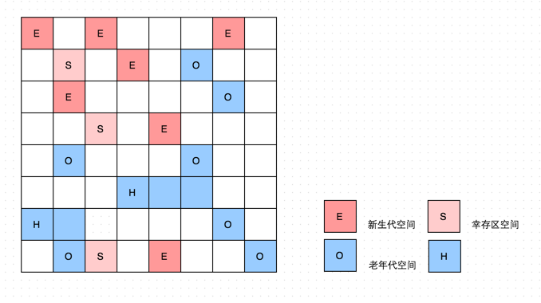
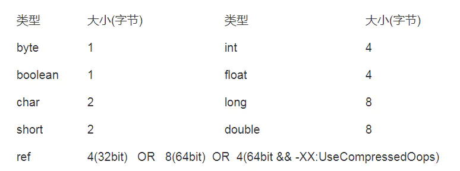

# JVM


```mermaid
mindmap
  root((JVM))
    运行时内存
      线程私有
        虚拟机栈与栈帧
        本地方法栈
        程序计数器
      线程共享
        堆 新生代 / 老年代
        方法区 运行时常量池
    Java 内存模型
      主内存与工作内存
      指令重排与总线事务
      happens-before
      内存屏障与内存语义
    分配与回收
      分配策略 TLAB / 大对象 / 年龄
      存活判定 可达性分析 / 四种引用
      GC 算法 标记清除 / 复制 / 标记整理
      G1 收集器 Region / Mixed GC
    对象探秘
      对象创建
      内存布局 对象头 / 实例数据 / 对齐填充
      访问定位 句柄 / 直接指针
    类加载
      生命周期 加载 验证 准备 解析 初始化
      双亲委派模型
    编译优化
      前端编译 javac
      后端编译 JIT
      方法内联 / 逃逸分析
      C1 / C2 / 分层编译
      Dalvik / ART / AOT
    JVM 如何实现
      方法调用 / 反射 / 泛型 / 异常 / 注解
```

---

## 一、运行时内存区域

### 1. 线程私有

**虚拟机栈**：描述 Java 方法执行的内存区域，线程私有。栈中的元素用于支持虚拟机进行方法调用，每个方法从开始调用到执行完成的过程，就是栈帧从入栈到出栈的过程。在活动线程中，只有位于栈顶的帧才是有效的，称为**当前栈帧**；正在执行的方法称为**当前方法**，该栈帧是方法运行的基本结构。

栈帧由四部分组成：

1. 局部变量表
2. 操作栈
3. 动态链接
4. 方法返回地址

**本地方法栈**：为 native 方法服务。

**程序计数器**：记录当前线程所执行字节码的行号。

### 2. 线程共享

#### 堆

分成两大块：新生代和老年代。对象产生之初在新生代，步入暮年时进入老年代，但是老年代也接纳在新生代无法容纳的超大对象。

- 新生代 = Eden 区 + Survivor 区，Survivor 区又分为 S0、S1 两块内存空间。
- 绝大部分对象在 Eden 区生成，Eden 区装填满的时候会触发 **Young GC（YGC）**。垃圾回收的时候 Eden 区实现清除策略，没有被引用的对象则直接回收。
- 依然存活的对象会被移送到 Survivor：每次 YGC 时，将存活的对象复制到**未使用**的那块空间，然后将当前正在使用的空间完全清除，交换两块空间的使用状态。如果 YGC 要移送的对象大于 Survivor 区容量的上限，直接移交给老年代。
- 每个对象都有一个计数器（年龄），每次 YGC 都会增加。`-XX:MaxTenuringThreshold` 参数配置计数器的值到达某个阈值时，对象从新生代晋升至老年代；如果该参数配置为 0，那么对象从 Eden 区直接移至老年代。**默认值 15**，即可以在 Survivor 区交换 14 次之后晋升至老年代。

#### 方法区

用于存储已被虚拟机加载的类信息、常量、静态变量、即时编译器编译后的代码等数据。JVM 对方法区的限制比较宽松：除了和 Java 堆一样不需要连续的内存、可以选择固定大小或者可扩展外，还可以选择不实现垃圾回收——相对而言，垃圾回收在这个区域是比较少出现的。

**运行时常量池**是方法区的一部分，用来存储编译期生成的各种字面量和符号引用。相比 Class 文件常量池，它的一个重要特点是**具备动态性**，也就是运行期间也可能将新的常量放入池中，比如 String 的 `intern()` 方法。

---

## 二、Java 内存模型（JMM）

### 1. 主内存与工作内存

JMM 用来屏蔽各种硬件和操作系统的内存访问差异，以实现让 Java 程序在各个平台下都能达到一致的内存访问效果。

- 所有的**共享变量**都存储在主内存；
- 每个线程还有自己的**工作内存**，保存了该线程使用到的共享变量的主内存副本拷贝；
- 线程对变量的所有操作都必须在工作内存中进行，不能直接读写主内存中的变量；
- 不同线程之间也无法直接访问对方工作内存中的数据，线程间变量值的传递均需要主内存来完成。

CPU 执行的速度远超内存访问速度，为了中和这种差异，CPU 和内存之间会加入多级缓存（L1、L2、L3）：CPU 先把内存中的数据读到 CPU 缓存中，在缓存中操作，最后再同步回内存。可以把 CPU 缓存看成线程的工作内存、把内存看成主内存——这个说法并不严谨，但易于理解。

### 2. 指令重排与总线事务

- **指令重排**：每个处理器上的写缓冲区，仅仅对它所在的处理器可见。这个特性会对内存操作的执行顺序产生重要影响——处理器对内存的读/写操作的执行顺序，不一定与内存实际发生的读/写操作顺序一致。
- **总线事务**：数据通过总线在处理器和内存之间传递，每次传递由一系列步骤完成，称为总线事务（Bus Transaction），包括读事务和写事务。读事务从内存传送数据到处理器，写事务从处理器传送数据到内存。关键在于：**总线会同步试图并发使用总线的事务**，一个处理器执行总线事务期间，总线会禁止其他处理器和 I/O 设备执行内存的读/写。

### 3. happens-before 规则

1. **程序顺序规则**：一个线程中的每个操作，happens-before 于该线程中的任意后续操作。
2. **监视器锁规则**：对一个锁的解锁，happens-before 于随后对这个锁的加锁。
3. **volatile 变量规则**：对一个 volatile 域的写，happens-before 于任意后续对这个 volatile 域的读。
4. **传递性**：如果 A happens-before B，且 B happens-before C，那么 A happens-before C。

> 注意：两个操作之间具有 happens-before 关系，**并不意味着前一个操作必须要在后一个操作之前执行**！happens-before 仅仅要求前一个操作（执行的结果）对后一个操作可见，且前一个操作按顺序排在第二个操作之前（the first is visible to and ordered before the second）。

### 4. 内存屏障与内存语义



**volatile 的内存语义**（本质是线程间发消息）：

- 线程 A 写一个 volatile 变量，实质上是线程 A 向接下来将要读这个 volatile 变量的某个线程发出了（其对共享变量所做修改的）消息；
- 线程 B 读一个 volatile 变量，实质上是线程 B 接收了之前某个线程发出的（在写这个 volatile 变量之前对共享变量所做修改的）消息；
- 线程 A 写 volatile 变量、随后线程 B 读 volatile 变量，这个过程实质上是线程 A 通过主内存向线程 B 发送消息。

**锁的内存语义**（同理）：

- 线程 A 释放一个锁，实质上是线程 A 向接下来将要获取这个锁的某个线程发出了（线程 A 对共享变量所做修改的）消息；
- 线程 B 获取一个锁，实质上是线程 B 接收了之前某个线程发出的（在释放这个锁之前对共享变量所做修改的）消息；
- 线程 A 释放锁、随后线程 B 获取这个锁，这个过程实质上是线程 A 通过主内存向线程 B 发送消息。

---

## 三、内存分配与回收

### 1. 内存分配策略

1. **对象优先在 Eden 区分配**：准确地说，是优先在 Eden 区的 TLAB 上分配；如果 Eden 区没有足够空间，就会触发一次 Minor GC。
2. **大对象直接进入老年代**：大对象指需要连续大量内存空间的 Java 对象，比如数组，一般来说超过 3M 的对象会直接在老年代分配。
3. **长期存活的对象进入老年代**：虚拟机给每个对象定义了一个对象年龄计数器——对象在 Eden 出生并经过一次 Minor GC 后仍然存活、且能被 Survivor 容纳，就会被移到 Survivor 空间，年龄设为 1；之后每在 Survivor 区熬过一次 Minor GC，年龄加 1；当年龄增加到一定程度（默认 15），就晋升到老年代。
4. **Minor GC** 指发生在新生代的垃圾回收，Java 对象大多朝生夕死，所以 Minor GC 比较频繁、回收速度也比较快。
5. **Full GC / Major GC** 指发生在老年代的 GC，出现 Full GC 经常会伴随至少一次 Minor GC，一般比 Minor GC 慢十倍以上。

### 2. 对象存活判定

**引用计数法**：给对象添加一个引用计数器，每当有一个地方引用就加一，引用失效就减一。实现简单、判断效率高，但 JVM 并没有采用它来管理内存，最主要的原因是**很难解决对象之间相互循环引用**的问题。

**可达性分析**：通过一系列称为 **GC Roots** 的对象作为起始点向下搜索，当一个对象到 GC Roots 没有任何引用链时（不可达），说明此对象不可用。Java 中可作为 GC Roots 的对象有：

- 虚拟机栈和本地方法栈中引用的对象；
- 方法区中类静态属性引用的对象；
- 方法区中常量引用的对象等。

引用计数并非一无是处——Android Framework 的 Native 层用的**智能指针**就是自动维护对象引用计数的技术。它通过**强弱引用**解决相互引用问题：将对象的引用计数分为强引用计数和弱引用计数，对象生命周期**只受强引用计数控制**。比如 A 和 B 相互引用，把 A 看成父、B 看成子：A 通过强引用计数引用 B，B 通过弱引用计数引用 A；A 不再使用时，由于 B 是通过弱引用引用它的，A 的生命周期不受 B 影响，可以安全释放；释放 A 时同时释放它对 B 的强引用，这时 B 也可以被安全回收。Android 中用 `sp` 表示强引用、`wp` 表示弱引用。

**Java 中的四种引用**：

| 引用类型 | 回收时机 | 实现类 |
| --- | --- | --- |
| 强引用 | 只要存在就永远不回收，OOM 也不回收 | `new` 出来的普通引用 |
| 软引用 | 内存不够用时才回收 | `SoftReference` |
| 弱引用 | GC 时不管内存够不够都回收 | `WeakReference` |
| 虚引用 | 对生命周期没有影响，只为对象回收时收到系统通知 | `PhantomReference` |

### 3. 垃圾回收算法

1. **标记清除**：先通过 GC Roots 标记存活对象，再统一清除未被标记的对象，主要问题是会产生**内存碎片**。老年代使用的 CMS 收集器就是基于标记清除算法。
2. **复制算法**：把内存空间划分为两块，每次只在一块上分配对象，用完时把存活对象复制到另一块，然后把已使用的那块空间一次清理掉；代价是内存使用量缩小一半。现代虚拟机都用复制算法回收新生代，不过内存被划分为一个 Eden 区和两个 Survivor 区，比例 **8:1:1**，每次使用 Eden 和其中一块 Survivor，也就是只有 10% 的内存被浪费；如果 Survivor 空间不够用，需要依赖其他内存（比如老年代）进行**分配担保**。对象存活率比较高时复制算法效率低下，所以老年代一般不用。
3. **标记整理**：在标记清除之后，把所有存活的对象都向一端移动，然后清理掉边界以外的内存区域。

### 4. G1 收集器

G1 是垃圾收集器技术发展历史上的里程碑，它开创了**面向局部收集**的设计思路和**基于 Region 的内存布局**形式。它和 CMS 一样主要面向服务端应用；JDK 9 之后 CMS 被标记为废弃，G1 成为默认收集器，JDK 14 正式移除 CMS。

在 G1 之前的所有收集器（包括 CMS），收集目标要么是整个新生代（Minor GC），要么是整个老年代（Major GC），要么是整个 Java 堆（Full GC）。G1 虽然仍遵循分代收集理论，但堆内存布局差异明显：它不再坚持固定大小、固定数量的分代区域划分，而是把连续的 Java 堆划分为多个**大小相等的独立 Region**，每个 Region 都可以根据需要扮演新生代的 Eden、Survivor 或老年代，收集器根据 Region 的不同角色采用不同策略处理。

G1 会根据用户设定的**允许收集停顿时间**，优先处理回收价值收益最大的那些 Region（也就是垃圾最多的 Region）——这就是 Garbage First 名字的由来。



**两种 GC 模式**（都是完全 Stop The World 的）：

- **Young GC**：选定所有年轻代里的 Region，通过控制年轻代的 Region 个数（即年轻代内存大小）来控制 Young GC 的时间开销。
- **Mixed GC**：选定所有年轻代里的 Region，外加根据 global concurrent marking 统计得出的收集收益高的若干老年代 Region，在用户指定的开销目标范围内尽可能选择收益高的老年代 Region。**Mixed GC 不是 Full GC**，它只能回收部分老年代的 Region；如果 Mixed GC 实在跟不上程序分配内存的速度，导致老年代填满、无法继续 Mixed GC，就会退化成 Serial Old GC（Full GC）来收集整个 GC Heap。所以 G1 自身不提供 Full GC。

**global concurrent marking** 的执行过程类似 CMS，但在 G1 中它主要是为 Mixed GC 提供标记服务，并不是一次 GC 过程的必须环节：

1. **初始标记**：仅仅标记 GC Roots 能直接关联到的对象，需要停顿线程，但耗时很短。
2. **并发标记**：从 GC Root 开始对堆中对象进行可达性分析，递归扫描整个堆里的对象图，找出要回收的对象，耗时较长，但可与用户程序并发执行。
3. **最终标记**：对用户线程做另一个短暂的暂停，用于处理并发标记阶段新产生的对象引用链变化。
4. **筛选回收**：负责更新 Region 的统计数据，对各个 Region 的回收价值和成本进行排序，根据用户期望的停顿时间制定回收计划。

---

## 四、对象的创建、内存布局与访问定位

### 1. 对象创建

虚拟机遇到一条 `new` 指令时：

1. 首先检查该指令的参数能否在常量池中定位到一个类的符号引用，并且检查这个符号引用代表的类是否已经被加载过，如果没有就走类加载流程；
2. 类加载检查通过后，虚拟机为新生对象分配内存——对象所需内存在类加载完成之后就确定了，分配内存等同于把一块确定大小的内存从 Java 堆中划分出来；
3. 分配方式有**指针碰撞**和**空闲列表**两种，选择哪种由 Java 堆是否规整决定，而堆是否规整又由所采用的垃圾收集器是否具有压缩整理功能决定；
4. 对象创建在虚拟机中非常频繁，即使仅仅修改一个指针指向的位置，在并发情况下也不是线程安全的。解决方案有两种：**CAS 配上失败重试**，或者使用线程私有的分配缓冲区 **TLAB**。

### 2. 对象的内存布局

在 HotSpot 中，对象在内存中存储的布局分为三块区域：**对象头、实例数据和对齐填充**。可以使用 OpenJDK 开源的 **JOL** 工具查看对象的内存布局——直接 `new Object()` 所占用的大小为 16 字节，即 12 个字节的对象头 + 4 个字节的对齐填充。JOL 对分析集合源码扩容、HashMap 的 hash 冲突等非常有用。

- **对象头（Instance Header）**：Java 对象最复杂的一部分，采用 C++ 定义了头的协议格式，存储了 Java 对象 hash、GC 年龄、锁标记、class 指针、数组长度等信息。
- **实例数据（Instance Data）**：真正具有业务意义的数据，就是当前对象中的实例字段。其中 `ref` 表示引用类型，实际上是一个地址指针：32bit 机器上占 4 字节；64bit 机器上，JDK 1.6 之后如果开启了指针压缩（默认开启：`-XX:+UseCompressedOops`，仅支持 64 位机器），也占 4 字节。



- **对齐填充（Padding）**：VM 要求对象大小必须是 8 的整数倍，该部分是为了让整体对象在内存中的地址空间大小达到 8 的整数倍而额外占用的字节数。

### 3. 对象的访问定位

Java 程序需要通过栈上的 `reference` 数据来操作堆上的具体对象。由于 `reference` 类型在 Java 虚拟机规范中只规定了一个指向对象的引用，并没有规定这个引用应该通过什么方式去定位和访问堆中的对象，所以对象访问方式取决于虚拟机实现。目前主流方式有两种：

- **使用句柄**：相当于加了一个中间层，对象移动时只会改变句柄中的实例数据指针，`reference` 本身不需要改变；
- **使用直接指针**：HotSpot 使用这种方式，最大好处就是**速度很快**。

---

## 五、类加载机制与双亲委派

### 1. 类加载机制

虚拟机把描述类的数据从 Class 文件加载到内存，并对数据进行校验、解析和初始化，最终形成可以被虚拟机直接使用的 Java 对象，这就是虚拟机的类加载机制。

1. **加载**：通过一个类的全限定名来获取定义此类的二进制字节流，将这个字节流所代表的静态存储结构转化为方法区的运行时数据结构。加载阶段是开发人员可控性最强的阶段，因为可以自定义类加载器。**对于数组而言情况不同**：数组类本身不通过类加载器创建，它是由 Java 虚拟机直接创建的。
2. **验证**：链接阶段的第一步，目的是确保 Class 文件的字节流中包含的信息符合当前虚拟机的要求，并且不会危害虚拟机自身的安全。包括文件格式校验、元数据校验、字节码校验等。
3. **准备**：正式为**类变量**分配内存并设置类变量初始值的阶段，这些变量所使用的内存都将在方法区中分配。注意两点：内存分配的仅仅包含类变量，**不包括实例变量**（实例变量会在对象实例化时随对象一起分配在 Java 堆上）；这里所说的初始值是该数据类型的**零值**。
4. **解析**：虚拟机将常量池内的**符号引用**替换为**直接引用**的过程。符号引用以一组符号来描述所引用的目标，直接引用可以是直接指向目标的指针。
5. **初始化**：执行类构造器 `<clinit>()` 方法的过程。`<clinit>()` 方法由编译器自动收集类中所有类变量的赋值动作和静态语句块中的语句合并产生，收集顺序由语句在源文件中出现的顺序决定。虚拟机会保证一个类的 `<clinit>()` 方法在多线程环境中被正确地加锁同步——如果多个线程同时去初始化一个类，只会有一个线程去执行这个类的 `<clinit>()` 方法，其他线程都需要阻塞等待，**这也是静态内部类能实现单例的主要原因之一**。

### 2. 双亲委派模型

流程：

1. 首先从已加载类中查找，如果能够找到则直接返回，找不到则调用 parent classloader 的 `loadClass` 进行查找；
2. 如果 parent classloader 能找到相关类则直接返回，否则调用 `findClass` 去进行类加载。

```java
protected Class<?> loadClass(String name, boolean resolve)
    throws ClassNotFoundException
{
    Class<?> c = findLoadedClass(name);
    if (c == null) {
        try {
            if (parent != null) {
                c = parent.loadClass(name, false);
            } else {
                c = findBootstrapClassOrNull(name);
            }
        } catch (ClassNotFoundException e) {
        }

        if (c == null) {
            c = findClass(name);
        }
    }
    return c;
}
```

---

## 六、编译优化与虚拟机

### 1. 前端编译

`javac` 的优化：常量折叠、自动装拆箱、条件编译等；此外 JDK 9 使用 `StringConcatFactory` 为字符串 `+` 的重载提供了统一入口。

### 2. 后端编译

后端编译是运行时优化和即时编译器（JIT）优化：

- **运行时优化**：主要是解释执行和动态编译通用的一些机制，比如锁机制（如偏向锁）、内存分配机制（如 TLAB）等，以及模板解释器、内联缓存（inline cache，用于优化虚方法调用的动态绑定）。
- **即时编译器优化**：将热点代码以方法为单位转化成机器码，直接运行在底层硬件之上。

### 3. 方法内联

指在编译过程中遇到方法调用时，将目标方法的方法体纳入编译范围之中，并取代原方法调用。方法内联不仅可以消除调用本身带来的性能开销，还可以进一步触发更多的优化，因此可以算是编译优化里**最为重要的一环**。

以 getter/setter 为例：没有内联时，调用需要保存当前方法的执行位置、创建并压入栈帧、访问字段、弹出栈帧、恢复当前方法的执行；内联之后，上述操作就只剩下字段访问了。

即时编译器不会无限制地进行方法内联，它会根据方法的调用次数、方法体大小、Code Cache 的空间等决定是否内联——即使是热点代码，如果方法体太大也不会内联，因为会占用更多内存空间。所以平时编码中**尽可能使用小方法体**。

对于需要动态绑定的虚方法调用，即时编译器需要先**去虚化**（转化为一个或多个直接调用），然后才能进行方法内联。所以尽量使用 `final`、`private`、`static` 关键字修饰方法——虚方法因为继承，会需要额外的类型检查才能知道实际上调用的是哪个方法。

### 4. 逃逸分析

逃逸分析是判断一个对象是否被外部方法引用或外部线程访问的分析技术，即时编译器可以根据其结果进行**锁消除、栈上分配以及标量替换**等优化：

- **锁消除**：如果即时编译器能证明锁对象不逃逸，那么对该锁对象的加锁、解锁操作没有任何意义（其他线程并不能获得该锁对象），就可以消除。比如 `synchronized(new Object())` 这种操作会被完全优化掉。
- **栈上分配与标量替换**：如果逃逸分析能证明某些新建对象不逃逸，JVM 完全可以将其分配至栈上，在方法退出时通过弹出栈帧自动回收内存。不过由于实现起来需要更改大量假设了"对象只能堆分配"的代码，**HotSpot 并没有采用栈上分配**，而是使用了**标量替换**——所谓标量，就是仅能存储一个值的变量（比如 Java 代码中的局部变量），标量替换可以看成将原本对对象字段的访问替换成一个个局部变量的访问。

### 5. HotSpot 的解释执行与编译执行

从硬件视角来看，Java 字节码无法直接运行，因此 JVM 需要将字节码翻译成机器码。HotSpot 中翻译过程有两种：

- **解释执行**：逐条将字节码翻译成机器码并执行，优势在于无需等待编译；
- **即时编译执行**：以方法为单位整体编译为机器码后再执行，优势在于实际运行速度更快。

HotSpot 默认采用**混合模式**，综合两者优点：先解释执行字节码，而后将其中反复执行的热点代码以方法为单位进行编译执行。

HotSpot 内置了多个即时编译器 C1 和 C2，引入多个编译器是为了在**编译时间**和**生成代码的执行效率**之间进行取舍。Java 7 引入了**分层编译**，将 JVM 的执行状态分为 5 个层次：

- 第 0 层：解释执行，默认开启性能监控；
- 第 1~3 层：C1 编译，将字节码编译成本地代码，进行简单、可靠的优化；
- 第 4 层：C2 编译，同样编译成本地代码，但会启用一些编译耗时较长的优化，甚至会根据性能监控信息进行一些不可靠的激进优化。

### 6. Dalvik、ART 与 AOT（Android 关联）

- **Dalvik**：HotSpot 基于栈结构，而 Dalvik 基于**寄存器结构**。官方文档上已经没有 Dalvik 相关信息了——Android 5 之后 ART 全面取代 Dalvik，Dalvik 使用 JIT。
  - **体系结构**：Java 虚拟机基于栈实现，Android 虚拟机基于寄存器实现，在 ARM 平台上寄存器实现性能会高于栈实现。
  - **格式结构**：Class 文件每个文件都有自己单独的常量池以及其他公共字段；Dex 文件中所有 Class 共用同一个常量池和公共字段，整体结构更加紧凑，大大减少了体积。
  - **指令优化**：Dalvik 字节码对大量指令专门做了精简和优化。
- **ART 与 AOT**：JIT 是在运行时进行编译（动态编译），每次运行程序都需要重新编译；而 AOT 是静态编译，应用在**安装时**启动 `dex2oat` 过程把 dex 预编译成 oat 文件，每次运行程序时不用重新编译。AOT 解决了应用启动和运行速度问题，同时带来另外两个问题：应用安装和系统升级之后的安装时间比较长；优化后的文件会占用额外的存储空间。
- **Android 7 之后 JIT 回归**，形成 **AOT/JIT 混合编译模式**：应用安装时 dex 不会被编译；运行时 dex 先通过解释器执行，热点代码会被识别并被 JIT 编译后存储在 Code Cache 中、生成 profile 文件；手机进入 IDLE（空闲）或者 Charging（充电）状态时，系统扫描 App 目录下的 profile 文件并执行 AOT 过程进行编译。这样一说，其实是和 HotSpot 有点内味。

---

## 七、JVM 是如何实现的

### 1. 方法调用

Java 编译器和 JVM 区分方法的方式不同：**方法重载在编译阶段就能确定，方法重写则需要运行时才能确定**。Java 编译器根据传入参数的声明类型来选取重载方法，而 JVM 识别方法依赖于**方法描述符**（由参数类型以及返回类型构成）。

JVM 内置了五个与方法调用相关的指令：

| 指令 | 用途 |
| --- | --- |
| `invokestatic` | 调用静态方法 |
| `invokespecial` | 调用私有实例方法 |
| `invokevirtual` | 调用非私有实例方法 |
| `invokeinterface` | 调用接口方法 |
| `invokedynamic` | 调用动态方法 |

对于 `invokestatic` 和 `invokespecial`，JVM 能直接识别具体的目标方法；而对于 `invokevirtual` 和 `invokeinterface`，绝大多数情况下需要在执行过程中根据调用者的**动态类型**确定目标方法。唯一的例外：如果虚拟机能够确定目标方法有且只有一个（比如方法被 final 修饰），就可以不通过动态类型，直接确定目标方法。

`invokevirtual`、`invokeinterface` 也被称为**虚方法调用**（动态绑定），相比能直接定位方法的静态绑定更加耗时。JVM 采用**空间换时间**的策略实现动态绑定：为每个类生成一张**方法表**用于快速定位目标方法，这个过程发生在类加载的准备阶段。方法表本质上是一个数组，有两个特性：

1. 子类方法表中包含父类方法表中的所有方法；
2. 子类方法在方法表中的索引，与它所重写的父类方法的索引值相同。

方法调用指令中的符号引用会在执行之前解析为实际引用：对于静态绑定，实际引用将指向具体的方法；对于动态绑定，实际引用则是方法表的索引值。JVM 也提供了**内联缓存**来加快动态绑定——它能够缓存虚方法调用中调用者的动态类型，以及该类型所对应的目标方法。

### 2. 反射

反射允许正在运行的 Java 程序观测甚至修改程序的动态行为，表现为两点：对于任意一个类，都能知道这个类的所有属性和方法；对于任意一个对象，都能调用它的任意属性和方法。

涉及的 API 分为三类：Class、Member（Field、Method、Constructor）、Array and Enumerated。

调用 `Method.invoke()` 时，是去调用 `DelegatingMethodAccessorImpl` 的 invoke，它实际调用的是 `NativeMethodAccessorImpl` 的 invoke——前者称为**委派实现**，后者称为**本地实现**。既然委派实现的具体实现是一个本地实现，为什么还需要委派这个中间层？因为 Java 反射调用机制还设立了另一种**动态生成字节码的实现**（动态实现），直接使用 invoke 指令来调用目标方法。之所以采用委派实现，是在本地实现和动态实现之间做切换：

- 动态实现比本地实现运行效率快 20 倍（无需经过 Java 到 C++ 再到 Java 的切换），但由于生产字节码比较耗时，仅调用一次的话反而是本地实现快三四倍；
- 考虑到很多反射调用仅执行一次，JVM 设置了阈值 **15**：在 15 之下使用本地实现，高于 15 时便动态生成字节码采用动态实现。这也被称为 **Inflation 机制**。

反射的性能开销主要在三处：

1. `Class.forName` 会调用本地方法，`Class.getMethod` 会遍历该类的公有方法（没有匹配到还要遍历父类的公有方法），这两个操作都非常耗时；
2. `Method.invoke` 本身：参数是可变长参数，需要构建一个 Object 数组存参数，同时带来基本数据类型的装箱操作；invoke 内部还会进行运行时权限检查；
3. 普通方法调用有一系列优化手段（方法内联、逃逸分析），而这又是反射调用所不能做的，性能差距再一次被放大。

优化反射调用：尽量避免反射调用虚方法、关闭运行时权限检查、可能需要增大基本数据类型对应的包装类缓存、如果调用次数可知可以关闭 Inflation 机制、增加内联缓存记录的类型数目。

### 3. 泛型

Java 中的泛型只是一个**语法糖**，编译时会将实际类型擦除掉，不过会新增一个 `checkcast` 指令来做编译时检查，如果类型不匹配就抛出 `ClassCastException`。不过字节码中仍然存在泛型参数的信息，如方法声明里的 `T foo(T)`，以及方法签名 Signature 中的 `(TT;)TT`，这些信息可以通过反射 API `getGenericXxx` 拿到。

泛型结合数组会有一些容易忽视的问题：数组是**协变且具体化**的，数组会在运行时才知道并检查它们的元素类型约束，可能出现编译时正常但运行时抛出 `ArrayStoreException`，所以尽可能使用列表——这就是 Effective Java 中推荐的**列表优先于数组**。看集合源码时也能发现这一点，比如 `ArrayList` 里面存数据是一个 `Object[]` 而不是 `E[]`，只不过在取的时候进行了强转。

利用通配符可以提升 API 的灵活性，简而言之即 **PECS 原则**（上取下存），典型案例就是 `Collections.copy`：

```java
Collections.copy(List<? super T> dest, List<? extends T> src);
```

### 4. 异常

Java 中所有异常都是 `Throwable` 类或其子类，它有两大大子类 `Error` 和 `Exception`：触发 `Error` 时执行状态已经无法恢复，需要终止线程或者终止虚拟机，常见的比如内存溢出、堆栈溢出；`Exception` 又分两类——受检异常（比如 `IOException`）和运行时异常 `RuntimeException`（比如空指针、数组越界）。从三个方面看异常的 JVM 实现：

1. **异常实例的构造十分昂贵**：构造异常实例时，JVM 需要生成该异常的栈轨迹，该操作逐一访问当前线程的 Java 栈帧，并记录各种调试信息，包括栈帧所指向方法的名字、方法所在的类名以及方法在源代码中的位置等。
2. **捕获异常需要异常表**：每个方法都有一个异常表，表中每个条目代表一个异常处理器，由 from、to、target 指针及其异常类型构成——from-to 就是 try 块，target 就是 catch 的起始位置。程序触发异常时，JVM 检测触发异常的字节码的索引值落到哪个异常表的 from-to 范围内，再判断异常类型是否匹配，匹配就开始执行 target 处字节码处理该异常。
3. **finally 代码块的编译**：`finally` 代码块一定会运行（除非虚拟机退出），实现办法比较笨——JVM 复制 finally 代码块的内容，分别放在所有可能的执行路径的出口中。

### 5. 注解

注解信息存放在字节码中的 `RuntimeInvisibleAnnotations` 结构里，它是一个 Annotations 数组（类、方法、属性都可以加多个注解），数组中的每个元素又是一个 `ElementValuePair` 数组，存储注解的参数信息。运行时注解可以通过反射拿到这些信息，编译时注解可以通过 APT 拿到。（详见 [Java 注解](./java_base5.md)）

---

## 八、30 秒口述版

JVM 的内存分为线程私有的虚拟机栈、本地方法栈、程序计数器，和线程共享的堆、方法区。堆按分代划分，对象优先在 Eden 分配，经历 Minor GC 后在 Survivor 之间复制、年龄达到阈值晋升老年代，回收靠可达性分析而不是引用计数。GC 算法有标记清除、复制、标记整理，G1 用 Region 布局和 Mixed GC 实现可预测停顿。类加载走双亲委派，初始化阶段由虚拟机保证 `<clinit>()` 的线程安全。运行时靠解释器 + C1/C2 分层编译在启动速度和峰值性能之间取舍，热点代码经方法内联、逃逸分析等优化后编译成机器码。
