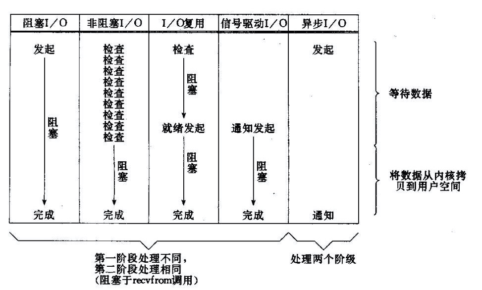
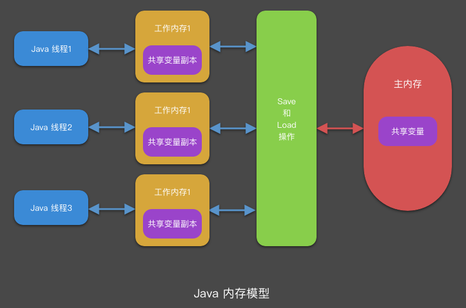
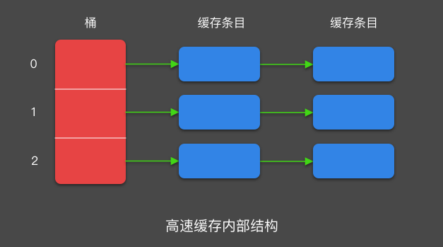
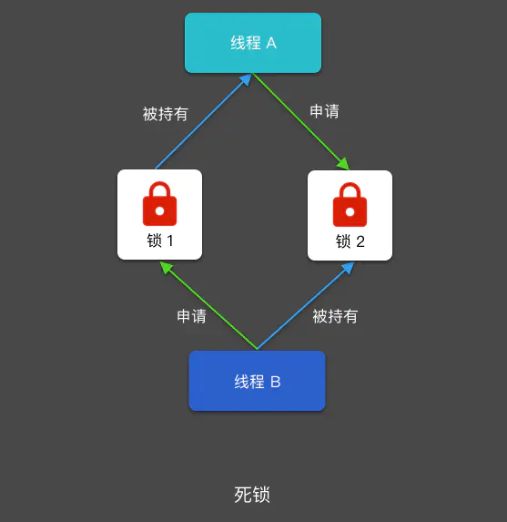

title: Java
--

# 类与对象

- 对象

    - haseCode()与equals()的区别

         - Object.hashCode（） 生成晗希值，由于不可避免地会存在晗希值冲突的情况 因hashCode 相同时 还需要再调用 equals 进行次值的比较，但是 hashCode将直接判定 Objects 不同 跳过 equals 这加快了冲突处理效率。

         - 如对象的 equals 的结果是相等的 两个对象的 hashCode 的返回约问饥必须是相同的。

         - 任何时候equals 郁必须同时覆写 hashCode

    - String，是final class，所有属性也都是 final 的。也由于它的不可变性，类似拼接、裁剪字符串等动作，都会产生新的 String 对象。由于字符串操作的普遍性，所以相关操作的效率往往对应用性能有明显影响。

         - StringBuilder

         - StringBuffer

    - clone （） 方法 它分为浅拷贝、一般深拷贝和彻底深拷 。浅拷贝只复制当前对象的所有基本数据类型，以及相应的引用变量，但没有复制引用变量指向的实际对象，而彻底深拷贝是在成功 clone 个对象之后，此对象与母对象在任何引用路径上都不存在共享的实例对象 ，但是引用路径递归越深，贝iJ 越接近 NM对象 且发现彻底深拷贝实现难度越大。介于浅拷贝和彻底深拷贝之间的都是 般深拷贝。归根结底 慎用 Object clone （） 方法来拷贝对象，因为对象的 clone （） 方法默认是浅拷贝，若想 实现深拷贝，贝！ 需要覆写 clone （） 方法实现引用对象的深度遍历式拷贝。

    - finalize()方法在 JDK9 之后直接被标记为过时方法。而 wait（）和 notify（） 同步方式事实上已经被同步信号、锁、阻塞集合等取代。

- 抽象，封装，继承，多态

    - 设计模式七大原则之一的迪米特法则就是对于封装的具体要求，即 模块使用模块的某个接口行为，对 模块中除此行为之外的其他信息知道得尽可能少。

    - 人人都说继承是 is-a 关系，那么如何衡量当前的继承关系是否满足 is-a 关系呢？判断标准即是否符合里氏代换原则（ Liskov Substitution Principle, LSP ）。 SP 是指任何父类能够出现的地方，子类都能够出现。从字面上很难深入理解，先打个比方警察在枪战片中经常说放下武器，把手举起来！而对面的匪徒们有的使用手枪，有的使用匕首 这些都是武器的子类。父类出现的地方 即“放下武器” 那么，放下手枪，是对的，放下匕首，也是对的

    - 谨慎使用继承 认清继承滥用的危害性 即方法污染和方法爆炸，提倡组合优先原则来扩展类的能力，即优先采用组合或聚合的类关系来复用其他类的能力，而不是继承。

- 类关系

    - 继承 extends (is-a)

    - 实现 implements (can do)

    - 组合 类是成员变量 (contain)

         - 类关系中的组合是一种完全绑定的关系，所有成员共同完成一件使命 它们的生命周期是一样的。组合体现的是非常强的整体与部分的关系， 同生共部分不能在整体之间共享。

    - 聚合 类是成员变量（has)

         - 聚合是 种可以拆分的整体与部分的关系 是非常松散的暂时组合 部分可以被拆出来给另一个整体。

    - 依赖 import (use-a)

         - 依赖 除组合和聚合外的类与类之间的关系 这个类只要 import 那就是依赖关系

- 序列化

    - 实现serializable 接口的类一定要显式地定义seria!Version UID 属性值。修改类时需要根据兼容性决定是否修改 serialVersionUID

         - 如果是兼容升级，请不要修改 seria!VersionUID 字段 避免反序列化失败。

         - 如果是不兼容升级，需要修改 serialVersionUID 值，避免反序列化混乱。

    - 效率低

         - Serializable在序列化过程中会创建大量的临时变量，这样就会造成大量的GC。

         - Serializable使用了大量反射，而反射操作耗时。

         - Serializable使用了大量的IO操作，也影响了耗时。可用于持久化，对比android的Parcelable，Parcelable在内存中效率比较快

- 值传递，无论是对于基本数据类型，还是引用变量， java中的参数传递都是值复制的传递过程。对于引用变量，复制指向对象的首地址，双方都可以通过自己的引用变量修改指向对象的相关属性。

- 构造函数，在创建类对象时，会先执行父类和子类的静态代码块 然后再执行父类和子类的构造方法。并不是执行完父类的静态代码块和构造方法后，再去执行子类。静态代码块只运行一次，在第二次对象实例化时，不会运行。

- 引用

    - 作为个引用变量，不管它是指向包装类 集合类、字符串类还是自定义类， refvar 均占4B 空间。注意它与真正对象 refobj 之间的区别。无论 refobj 是多么小的对象，最小占用的存储空间是 12B 用于存储基本信息 称为对象头） 但由于存储空间分配必须是 8B 的倍数 所以初始分配的空间至少是 16B

    - Java中有如下四种类型的引用：

         - 强引用(Strong Reference)

         - 软引用(SoftReference)

         - 弱引用(WeakReference)

         - 虚引用(PhantomReference)

- 泛型,是JDK1.5版本开始引入的一个概念，它可以将Java类型抽象，提供了编译时类型安全检测机制，该机制允许程序员在编译时检测到非法的数据类型。

    - 泛型擦除,Java中泛型类型是作为第二类类型处理的，只有在静态类型检查期间才出现，在此之后，程序中的所有泛型类型都将被擦除，替换为他们的非泛型边界。例如List这样的将被擦除为List，而普通的类型变量在未指定边界的情况下将被擦除成Object。

    - 边界

         - extend，生产者，能get,put受限

         - super, 消费者，能put,get受限

- 枚举,跟表示一组常量的最大的区别就是拥有类的属性。

- NIO,IO

    - IO,面相流，阻塞

    - NIO,面相缓存，不阻塞，selector可单线程使用多通道channel

    - 同步异步，阻塞与非阻塞

         - 同步/异步关注的是消息通知的机制，而阻塞/非阻塞关注的是程序（线程）等待消息通知时的状态。

         - 同步的实现方式会有两种：同步阻塞、同步非阻塞；同理，异步也会有两种实现：异步阻塞、异步非阻塞

              - 同步阻塞形式，专心排队，什么别的事都不做。实际程序中：就是未对fd 设置O_NONBLOCK标志位的read/write 操作

              - 异步阻塞，异步操作是可以被阻塞住的，只不过它不是在处理消息时阻塞，而是在等待消息通知时被阻塞。比如select 函数，假如传入的最后一个timeout参数为NULL，那么如果所关注的事件没有一个被触发，程序就会一直阻塞在这个select 调用处。

              - 同步非阻塞，程序需要在这两种不同的行为之间来回的切换，效率可想而知是低下的。很多人会写阻塞的read/write 操作，但是别忘了可以对fd设置O_NONBLOCK 标志位，这样就可以将同步操作变成非阻塞的了。

         - 同步阻塞：小明一直盯着下载进度条，到 100% 的时候就完成。

              - 同步体现在：等待下载完成通知；

              - 阻塞体现在：等待下载完成通知过程中，不能做其他任务处理；

         - 同步非阻塞：小明提交下载任务后就去干别的，每过一段时间就去瞄一眼进度条，看到 100% 就完成。

              - 同步体现在：等待下载完成通知；

              - 非阻塞体现在：等待下载完成通知过程中，去干别的任务了，只是时不时会瞄一眼进度条；【小明必须要在两个任务间切换，关注下载进度】

         - 异步阻塞：小明换了个有下载完成通知功能的软件，下载完成就“叮”一声。不过小明仍然一直等待“叮”的声音（看起来很傻，不是吗）。

              - 异步体现在：下载完成“叮”一声通知；

              - 阻塞体现在：等待下载完成“叮”一声通知过程中，不能做其他任务处理；

         - 异步非阻塞：仍然是那个会“叮”一声的下载软件，小明提交下载任务后就去干别的，听到“叮”的一声就知道完成了。

              - 异步体现在：下载完成“叮”一声通知；

              - 非阻塞体现在：等待下载完成“叮”一声通知过程中，去干别的任务了，只需要接收“叮”声通知即可；【软件处理下载任务，小明处理其他任务，不需关注进度，只需接收软件“叮”声通知，即可】

         - 以socket.read()为例子：
			

              - 传统的BIO里面socket.read()，如果TCP RecvBuffer里没有数据，函数会一直阻塞，直到收到数据，返回读到的数据。

              - 对于NIO，如果TCP RecvBuffer有数据，就把数据从网卡读到内存，并且返回给用户；反之则直接返回0，永远不会阻塞。

              - 最新的AIO(Async I/O)里面会更进一步：不但等待就绪是非阻塞的，就连数据从网卡到内存的过程也是异步的。

              - 换句话说，BIO里用户最关心“我要读”，NIO里用户最关心”我可以读了”，在AIO模型里用户更需要关注的是“读完了”。

              - NIO一个重要的特点是：socket主要的读、写、注册和接收函数，在等待就绪阶段都是非阻塞的，真正的I/O操作是同步阻塞的（消耗CPU但性能非常高）。

- 字符集与编码

    - Unicode 只是一个符号集，它只规定了符号的二进制代码，却没有规定这个二进制代码应该如何存储

    - UTF-8 就是在互联网上使用最广的一种 Unicode 的实现方式。UTF-8 最大的一个特点，就是它是一种变长的编码方式。它可以使用1~4个字节表示一个符号，根据不同的符号而变化字节长度。

    - 以汉字严为例，Unicode 码是4E25，需要用两个字节存储，一个字节是4E，另一个字节是25。存储的时候，4E在前，25在后，这就是 Big endian 方式；25在前，4E在后，这是 Little endian 方式。Unicode 规范定义，每一个文件的最前面分别加入一个表示编码顺序的字符，这个字符的名字叫做"零宽度非换行空格"（zero width no-break space），用FEFF表示。这正好是两个字节，而且FF比FE大1。如果一个文本文件的头两个字节是FE FF，就表示该文件采用大头方式；如果头两个字节是FF FE，就表示该文件采用小头方式。

--

# 线程与并发

- 线程

    - 属性

         - 编号

         - 名字

         - 类别

              - 守护线程

              - 用户线程

         - 优先级

    - 方法

         - start

         - run

         - join,等待其他线程执行结束。如果线程 A 调用了线程 B 的 join() 方法，那线程 A 会进入等待状态，直到线程 B 运行结束。

         - Thread.currentThread()

         - Thread.yield(),用于使当前线程放弃对处理器的占用，相当于是降低线程优先级。调用该方法就像是是对线程调度器说：“如果其他线程要处理器资源，那就给它们，否则我继续用”。

         - Thread.sleep(ms)

    - 状态转换

         - new

         - runable,调用线程的 start() 方法后，线程就进入了可运行（RUNNABLE）状态。可运行状态又分为预备（READY）和运行（RUNNING）状态。

              - 预备状态处于预备状态的线程可被线程调度器调度，调度后线程的状态会从预备转换为运行状态，处于预备状态的线程也叫活跃线程。

              - 运行状态运行状态表示线程正在运行，也就是处理器正在执行线程的 run() 方法。当线程的 yield() 方法被调用后，线程的状态可能由运行状态变为预备状态。

         - running

         - blocked

              - 发起阻塞式 I/O 操作

              - 申请其他线程持有的锁

              - 进入一个 synchronized 方法或代码块失败

         - wait

              - 等待状态

                   - Object.wait()

                   - LockSupport.park()

                   - Thread.join()

              - 从等待状态转变为可运行状态，而这种转变又叫唤醒。

                   - Object.notify()

                   - Object.notifyAll()

                   - LockSupport.unpark()

         - dead

    - 实现

         - Thread

         - Runable

         - Call

         - Future

         - FutureTask

    - 阻塞

         - sleep和wait的区别,sleep没有让出锁，wait有让出锁

         - blocked和wait的区别,synchronized会导致线程进入Blocked状态，Object.wait()导致线程进入Waiting状态，Waiting线程被其他线程调用Object.notify()唤醒之后，重新获取对象上的锁的时候也会进入Blocked状态，也就是说只有synchronized会导致线程进入Blocked状态，Waiting状态只能进入Blocked状态，获取锁之后才能恢复执行。

    - setUncaughtExceptionHandler,用来获取线程中产生的异常，Java里有2种异常:检查异常（Checked exceptions）: 这些异常必须强制捕获它们或在一个方法里的throws子句中。 例如， IOException 或者ClassNotFoundException。未检查异常（Unchecked exceptions）: 这些异常不用强制捕获它们。例如， NumberFormatException。在一个线程 对象的 run() 方法里抛出一个检查异常，我们必须捕获并处理他们。因为 run() 方法不接受 throws 子句。当一个非检查异常被抛出，默认的行为是在控制台写下stack trace并退出程序。用setUncaughtExceptionHandler可以捕获

- 线程调度原理

    - Java 内存模型，规定了所有变量都存储在主内存中，每条线程都有自己的工作内存。

	
    - 高速缓存

         - 现代处理器的处理能力要远胜于主内存（DRAM）的访问速率，主内存执行一次内存读/写操作需要的时间，如果给处理器使用，处理器可以执行上百条指令。为了弥补处理器与主内存之间的差距，硬件设计者在主内存与处理器之间加入了高速缓存（Cache）。处理器执行内存读写操作时，不是直接与主内存打交道，而是通过高速缓存进行的。

         - 高速缓存相当于是一个由硬件实现的容量极小的散列表，这个散列表的 key 是一个对象的内存地址，value 可以是内存数据的副本，也可以是准备写入内存的数据。从内部结构来看，高速缓存相当于是一个链式散列表（Chained Hash Table），它包含若干个桶，每个桶包含若干个缓存条目（Cache Entry）。
		

    - Java 线程调度机制，多线程并发运行实际上是指多个线程轮流获取 CPU 使用权，分别执行各自的任务。线程的调度由 JVM 负责，线程的调度是按照特定的机制为多个线程分配 CPU 的使用权。

         - 分时调度模型，分时调度模型是让所有线程轮流获取 CPU 使用权，并且平均分配每个线程占用 CPU 的时间片。

         - 抢占式调度模型，JVM 采用的是抢占式调度模型，也就是先让优先级高的线程占用 CPU，如果线程的优先级都一样，那就随机选择一个线程，并让该线程占用 CPU。也就是如果我们同时启动多个线程，并不能保证它们能轮流获取到均等的时间片。如果我们的程序想干预线程的调度过程，最简单的办法就是给每个线程设定一个优先级。

- 线程安全 核心理念就是要么只读，要么加锁

    - 线程安全

         - 竞态，线程安全问题指的是多个线程之间对一个或多个共享可变对象交错操作时，有可能导致数据异常。竞态不一定导致计算结果的不正确，而是不排除计算结果有时正确有时错误的可能。

         - 原子性

         - 可见性，可见性是指一个线程对共享变量的更新，对于其他读取该变量的线程是否可见。

         - 有序性，有序性是指一个处理器在为一个线程执行的内存访问操作，对于另一个处理器上运行的线程来看是乱序的。

    - 数据单线程可见，Android中Hanlder的looper使用了，static final ThreadLocal<Looper> sThreadLocal = new ThreadLocal<Looper>();
		

         - 构造这样 个对象，将这个对象设置为共享变量，统一设置初始值，但是每个线程对这个值的修改都是互相独立的。这个对象就是ThreadLocal 。注意不能将其翻译为线程本地化或本地结程，英语恰当的名称应该叫作CopyValuelntoEveryThread。

         - ThreadLocal对象通常是由 private static 修饰的，因为都需要复制进入本地线程，所以非 static 作用不大。需要注意的是，ThreadLocal 无法解决共享对象的更新问题

         - 内存泄露，ThreadLocalMap使用ThreadLocal的弱引用作为key，如果一个ThreadLocal没有外部强引用来引用它，那么系统 GC 的时候，这个ThreadLocal势必会被回收，这样一来，ThreadLocalMap中就会出现key为null的Entry，就没有办法访问这些key为null的Entry的value，如果当前线程再迟迟不结束的话，这些key为null的Entry的value就会一直存在一条强引用链：Thread Ref -> Thread -> ThreaLocalMap -> Entry -> value永远无法回收，造成内存泄漏。其实，ThreadLocalMap的设计中已经考虑到这种情况，也加上了一些防护措施：在ThreadLocal的get(),set(),remove()的时候都会清除线程ThreadLocalMap里所有key为null的value。

         - ThreadLocal 并不解决线程间共享数据的问题

         - ThreadLocal 通过隐式的在不同线程内创建独立实例副本避免了实例线程安全的问题

         - 每个线程持有一个 Map 并维护了 ThreadLocal 对象与具体实例的映射，该 Map 由于只被持有它的线程访问，故不存在线程安全以及锁的问题

         - ThreadLocalMap 的 Entry 对 ThreadLocal 的引用为弱引用，避免了 ThreadLocal 对象无法被回收的问题

         - ThreadLocalMap 的 set 方法通过调用 replaceStaleEntry 方法回收键为 null 的 Entry 对象的值（即为具体实例）以及 Entry 对象本身从而防止内存泄漏

    - 数据只读，String,Integer

    - 线程安全类 StringBuffer，并发集合类ConcurrentHashMap

    - 原子类JUC 下有一个 atomic 包，通过 Unsafe 类中的 CAS 指令从硬件层面来实现线程安全，这个包里面有如 AtomicInteger、AtomicBoolean、AtomicReference、AtomicReferenceFIeldUpdater 等，AtomicReference 和 AtomicReferenceFieldUpdater 的作用是差不多的，在用法上 AtomicReference 比 AtomicReferenceFIeldUpdater 更简单。但是在内部实现上，AtomicReference 内部一样是有一个 volatile 变量。使用 AtomicReference 和使用 AtomicReferenceFIeldUpdater 比起来，要多创建一个对象。当要使用 AtomicReference 创建成千上万个对象时，这个开销就会变得很大。这也就是为什么 BufferedInputStream 、Kotlin 协程 和 Kotlin 的 lazy 的实现会选择 AtomicReferenceFieldUpdater 作为原子类型。

    - volatile

         - 每个线程都有独占的内存区域， 如操作枝、本地变量表等。线程本地内存保存7号｜用变量在堆内存中的副本， 线程对变量的所有操作都在本地内存区域中进行， 执行结束后再同步到堆内存中去。这里必然有一个时间差， 在这个时间差内，该线程对副本的操作， 对于其他线程都是不可见的。volatile 的英文本义是“ 挥发、不稳定的” ， 延伸意义为敏感的。当使用volatil e修饰变量时， 意昧着任何对此变量的操作都会在内存中进行， 不会产生副本， 以保证共享变量的可见性，局部阻止了指令重排的发生。

         - “ volatile 是轻量级的同步方式” 这种说法是错误的。它只是轻量级的线程操作可见方式， 并非同步方式， 如果是多写场景， 定会产生线程安全问题。如果是写多读的并发场景， 使用volatile 修饰变量则非常合适。volatile 写多读最典型的应用是CopyOn WriteArrayList。

    - 线程管理类Executors

         - ThreadPoolExecutor

              - corePollSize：核心线程数。

              - maximumPoolSize：最大线程数。

              - keepAliveTime：空闲的线程保留的时间。

              - TimeUnit：空闲线程的保留时间单位。

              - BlockingQueue<Runnable>：阻塞队列

              - ThreadFactory：线程工厂，用来创建线程

              - RejectedExecutionHandler：队列已满，而且任务量大于最大线程的异常处理策略。

         - 典型线程池，JDK8增加Executors.newWorkStealingPool

    - 锁

         - 分类

              - 内部锁，synchronized 会隐式地获取锁，但是它将锁的获取和释放固化了，也就是先获取再释放,不是公平锁

                   - 监视器锁，因为使用 synchronized 实现的线程同步是通过监视器（monitor）来实现的，所以内部锁也叫监视器锁。

                   - 自动获取/释放，线程对同步代码块的锁的申请和释放由 JVM 内部实施，线程在进入同步代码块前会自动获取锁，并在退出同步代码块时自动释放锁，这也是同步代码块被称为内部锁的原因。

                   - 锁定方法/类/对象，synchronized 关键字可以用来修饰方法，锁住特定类和特定对象。

                   - 临界区，同步代码块就是内部锁的临界区，线程在执行临界区代码前必须持有该临界区的内部锁。

                   - 锁句柄，内部锁锁的对象就叫锁句柄，锁句柄通常会用 private 和 final 关键字进行修饰。因为锁句柄变量一旦改变，会导致执行同一个同步代码块的多个线程实际上用的是不同的锁。

                   - 不会泄漏，泄漏指的是锁泄漏，内部锁不会导致锁泄漏，因为 javac 编译器把同步代码块编译为字节码时，对临界区中可能抛出的异常做了特殊处理，这样临界区的代码出了异常也不会妨碍锁的释放。

                   - 非公平锁，内部锁是使用的是非公平策略，是非公平锁，也就是不会增加上下文切换开销。

              - 显示锁，Lock

                   - 可重入，显式锁是可重入锁，也就是一个线程持有了锁后，能再次成功申请这个锁。

                   - 手动获取/释放，显式锁与内部锁区别在于，使用显式锁，我们要自己释放和获取锁，为了避免锁泄漏，我们要在 finally 块中释放锁

                   - 临界区，lock() 与 unlock() 方法之间的代码就是显式锁的临界区

                   - 公平/非公平锁，显式锁允许我们自己选择锁调度策略。，ReentrantLock 有一个构造函数，允许我们传入一个 fair 值，当这个值为 true 时，说明现在创建的这个锁是一个公平锁。由于公平锁的开销比非公平锁大，所以 ReentrantLock 的默认调度策略是非公平策略。

                   - 拥有了锁获取与释放的可操作性、可中断的获取锁以及超时获取锁

              - 读写锁，锁的排他性使得多个线程无法以线程安全的方式在同一时刻读取共享变量，这样不利于提高系统的并发性，这也是读写锁出现的原因。

                   - 读锁共享读写锁允许多个线程同时读取共享变量，读线程访问共享变量时，必须持有对应的读锁，读锁可以被多个线程持有。

                   - 写锁排他，读写锁一次只允许一个线程更新共享变量，写线程访问共享变量时，必须持有对应的写锁，写锁在任一时刻只能被一个线程持有。

                   - 可以降级，读写锁是一个支持降级的可重入锁，也就是一个线程在持有写锁的情况下，可以继续获取对应的读锁。这样我们可以在修改变量后，在其他地方读取该变量，并执行其他操作。

                   - 不能升级，读写锁不支持升级，读线程只有释放了读锁才能申请写锁

                   - 三种保障，读写锁虽然允许多个线程读取共享变量，但是由于写锁的特性，它同样能保障原子性、可见性和有序性。

                   - 适用场景读写锁会带来额外的开销，只有满足下面两个条件，读写锁才是合适的选择读操作比写操作频繁很多读取共享变量的线程持有锁的时间较长

         - AbstractQueuedSynchronizer（以下简称同步器）实现，它使用了一个int成员变量表示同步状态，通过内置的FIFO队列来完成资源获取线程的排队工作同步队列中的节点（Node）用来保存获取同步状态失败的线程引用、等待状态以及前驱和后继节点，节点的属性类型

              - 独占式,同步状态获取acquire，release,在获取同步状态时，同步器维护一个同步队列，获取状态失败的线程都会被加入到队列中并在队列中进行自旋；移出队列（或停止自旋）的条件是前驱节点为头节点且成功获取了同步状态。在释放同步状态时，同步器调用tryRelease(int arg)方法释放同步状态，然后唤醒头节点的后继节点。

                   - 获取同步状态，如果同步状态获取失败，则构造同步节点（独占式Node.EXCLUSIVE，同一时刻只能有一个线程成功获取同步状态）并通过addWaiter(Node node)方法将该节点加入到同步队列的尾部，最后调用acquireQueued(Node node,int arg)方法，使得该节点以“死循环”的方式获取同步状态。

                   - 节点进入同步队列之后，就进入了一个自旋的过程，每个节点（或者说每个线程）都在自省地观察，当条件满足，获取到了同步状态，就可以从这个自旋过程中退出，否则依旧留在这个自旋过程中,自旋就是在“死循环”中尝试获取同步状态，而只有前驱节点是头节点才能够尝试获取同步状态

              - 共享式,多个线程同时获取到同步状态。以文件的读写为例，如果一个程序在对文件进行读操作，那么这一时刻对于该文件的写操作均被阻塞，而读操作能够同时进行。写操作要求对资源的独占式访问，而读操作可以是共享式访问

              - 重入锁，表示该锁能够支持一个线程对资源的重复加锁

                   - ReentrantLock虽然没能像synchronized关键字一样支持隐式的重进入，但是在调用lock()方法时，已经获取到锁的线程，能够再次调用lock()方法获取锁而不被阻塞。

              - 读写锁，排他锁在同一时刻只允许一个线程进行访问，而读写锁在同一时刻可以允许多个读线程访问，但是在写线程访问时，所有的读线程和其他写线程均被阻塞。读写锁维护了一对锁，一个读锁和一个写锁，通过分离读锁和写锁，使得并发性相比一般的排他锁有了很大提升。

                   - ReentrantReadWriteLock

                        - 写锁是一个支持重进入的排它锁。如果当前线程已经获取了写锁，则增加写状态。如果当前线程在获取写锁时，读锁已经被获取（读状态不为0）或者该线程不是已经获取写锁的线程，则当前线程进入等待状态

                        - 读锁是一个支持重进入的共享锁，它能够被多个线程同时获取，在没有其他写线程访问（或者写状态为0）时，读锁总会被成功地获取，而所做的也只是（线程安全的）增加读状态。如果当前线程已经获取了读锁，则增加读状态。如果当前线程在获取读锁时，写锁已被其他线程获取，则进入等待状态。

                        - 锁降级指的是写锁降级成为读锁。如果当前线程拥有写锁，然后将其释放，最后再获取读锁，这种分段完成的过程不能称之为锁降级。锁降级是指把持住（当前拥有的）写锁，再获取到读锁，随后释放（先前拥有的）写锁的过程

              - 公平锁，如果在绝对时间上，先对锁进行获取的请求一定先被满足，那么这个锁是公平的，反之，是不公平的。公平的获取锁，也就是等待时间最长的线程最优先获取锁，也可以说锁获取是顺序的。ReentrantLock默认是非公平锁

                   - ReentrantLock提供了一个构造函数，能够控制锁是否是公平的。

                   - 在一个锁释放之后，其他的线程会需要重新来获取锁。其中经历了持有锁的线程释放锁，其他线程从挂起恢复到RUNNABLE状态，其他线程请求锁，获得锁，线程执行，这一系列步骤。如果这个时候，存在一个线程直接请求锁，可能就避开挂起到恢复RUNNABLE状态的这段消耗，所以性能更优化。

              - 并发包中锁类Lock

                   - ReentrantLock 对于 Lock 接口的实现主要依赖了Sync Sync 继承了 AbstractQueuedSynchronizer ( AQS 它是 JUC 包实现同步的工具。在 AQS 定义了一个 volatile int state 变量作为共享资源 ，如果线程获取资源失败 进入同步 FIFO 队列中等待；如果成功获取资源就执行临界区代码。执行完释放资源时 会通知同步队列中的等待线程来获取资源后出队并执行。

                   - AQS 是抽象类 内置自旋锁实现的同步队列 封装入队和 队的操作 提供独占、共享、中断等特性的方法。 AQS 的子类可以定义不同的资源实现不同性质的方法。比如可重入锁 ReentrantLock 定义 state 时可以获取资源并置为 。若已获得资源 state 不断加 1在释放资源时 state减1 直至为 0; CountDownLatch 初始时定义了资源总量 state count, countDown （） 不断将 state state 时才能获得锁释放后 state 直为 0。

         - 锁优化JDK 1.6 对锁的实现引入了大量的优化，包括自旋锁、适应性自旋锁、锁消除、锁粗化、偏向锁、轻量级锁来减少锁操作的开销。锁主要存在四种状态：依次是无锁状态、偏向锁状态、轻量级锁状态、重量级锁状态。锁可以升级但是不能降级，这种策略是为了提高获取锁和释放锁的效率。

              - 重量级锁，重量级锁就是采用互斥量 Mutex 来控制对互斥资源的访问，在 Java 中被抽象为监视器锁 Monitor，这种同步方式成本非常高，包括内核态到用户态切换，性能差。

              - 自旋锁与自适应自旋，在许多应用中，锁定状态只会持续很短的时间，为了这么一点时间就去挂起、恢复线程，不值得。我们可以让等待线程执行一定次数的循环，在循环中去获取锁，这项技术称为自旋锁，它可以节省系统切换线程的消耗，但仍然占有处理器。在之后又引入自适应的自旋锁，不再通过次数来限制，而是由前一次在同一个锁上的自旋时间及锁的拥有者的状态来决定。

              - 锁消除，虚拟机在运行时，如果发现一段被锁住的代码中不可能存在共享数据，就会将这个锁清除。

              - 锁粗化，当虚拟机检测到有一串零碎的操作都对同一个对象加锁时，会把锁扩展到整个操作序列外部。如 StringBuffer 的 append 操作。

              - 轻量级锁，对绝大部分锁来说，整个同步周期内不存在竞争，如果没有竞争，轻量级锁可以使用 CAS 操作来避免使用互斥量的开销。

              - 偏向锁，偏向锁的核心思想是，如果一个线程获得了锁，那么锁就进入偏向模式，当这个线程再次请求锁时，无需再做任何同步操作，即可获取锁。

         - 使用原则是锁的范围尽可能小，锁的时间尽可能短，即能锁对象，就不要锁类，能锁代码块，就不要锁方法。

- 线程协作

    - join,让一个线程等待另一个线程执行结束后再继续执行。

    - wait/notify/notifyAll

         - 暂停/唤醒,Object.wait() 的作用是让线程暂停（状态改为 WAITING），而 Object.notify() 的作用是唤醒一个被暂停的线程。

         - 所有对象,由于 Object 是所有对象的父类，所以所有对象都可以实现等待和通知。

         - 获取监视器锁,使用 wait()/notify() 方法要先获取共享对象的监视器锁，获取共享对象的监视器锁有两种方式，一是在同步代码块中执行，二是在同步方法（synchronized 修饰的方法）中执行 wait()/notify()。如果没有事先获取监视器锁，那线程就会报出非法监视器状态异常 IllegalMonitorStateException 异常。

         - 捕获中断异常,使用 wait() 方法必须要捕获中断异常 InterruptedException，因为通过 wait() 进入的等待状态是可以被打断的。

         - 唤醒任一线程,notify() 方法唤醒的只是对应对象上的一个任意等待线程，被唤醒的线程不一定是我们想唤醒的线程。

         - 唤醒特定线程,如果我们想对应对象上的特定线程，我们可以使用 notifyAll()，把该对象上的所有等待线程都唤醒。

         - final 修饰,之所以 lock 对象要使用 final 修饰，是因为如果没有用 final 修饰，那么这个对象的值可能被修改，导致等待线程和通知线程同步在不同的内部锁上，从而造成竞态，违背了使用锁的初衷。

         - 循环判断,对保护条件的判断和 wait() 方法的调用要放在循环语句中，以确保目标动作只有在保护条件成立时才能执行。

         - 仅释放对应内部锁,使用 wait() 方法暂停当前线程时，释放的锁是与该 wait() 方法所属对象的内部锁，当前线程持有的其他内部锁和显式锁不会因此被释放

    - Condition,Condition 接口提供的 await()/signal()/signalAll() 相当于是 Object 提供的 wait()/notify()/notifyAll()。wait()/notify() 过于底层，而且还存在两个问题，一是过早唤醒、二是无法区分 Object.wait(ms) 返回是由于等待超时还是被通知线程唤醒。

    - CountDownLatch想要一个特定的操作执行结束，不需要等待整个线程执行结束，这时候就可以使用 CountDownLatch 来实现。

         - 先决操作数mCountDownLatch 内部维护了一个用于计算未完成先决操作数的 count 值，每当 CountDownLatch.countDown() 方法执行一次，这个值就会减 1。未完成先决操作数 count 是在 CountDownLatch 的构造函数中设置的。要注意的是，这个值不能小于 0，否则会报非法参数异常。

         - 一次性,当计数器的值为 0 时，后续再调用 await() 方法不会再让执行线程进入等待状态，所以说 CountDownLatch 是一次性协作。

         - 不用加锁,CountDownLatch 内部封装了对 count 值的等待和通知逻辑，所以在使用 CountDownLatch 实现等待/通知不需要加锁

         - await(),CountDownLatch.await() 可以让线程进入等待状态，当 CountDownLatch 中的 count 值为 0 时，表示需要等待的先决操作已经完成。

         - countDown(),调用 CountDownLatch.countDown() 方法后，count 值就会减 1，并且在 count 值为 0 时，会唤醒对应的等待线程。

    - 信号维度Semaphore,在实际编码中，可能需要处理基于空闲信号的同步情况。比如海关安检的场景，任何国家公民在出国时，都要走海关的查验通道。假设某机场的海关通道共有3 个窗口1 一批需要出关的人排成长队，每个人都是一个结程。当3 个窗口中的任意一个出现空闲时，工作人员指示队列中第一个人出队到该空闲窗口接受查验。

    - CyclicBarrier,多个线程需要互相等待对方代码中的某个地方（集合点），这些线程才能继续执行，这时可以使用 CyclicBarrier（栅栏）。使用 CyclicBarrier.await() 实现等待的线程叫参与方（Party），除了最后一个执行 CyclicBarrier.await() 方法的线程外，其他执行该方法的线程都会被暂停。和 CountDownLatch 不同，CyclicBarrier 是可以重复使用的，也就是等待结束后，可以再次进行一轮等待。比如有若干线程都要写数据，并且只有所有线程都完成写数据操作后，这些线程才能继续做后面的事情

- 线程活跃性，是线程不够活跃，导致任务无法取得进展

    - 死锁，是指两个或两个以上的进程在执行过程中,因争夺资源而造成的一种互相等待的现象,若无外力作用,它们都将无法推进下去
	

         - 互斥条件：一个资源每次只能被一个进程使用。

         - 请求与保持条件：一个进程因请求资源而阻塞时，对已获得的资源保持不放。

         - 不剥夺条件:进程已获得的资源，在末使用完之前，不能强行剥夺。

         - 循环等待条件:若干进程之间形成一种头尾相接的循环等待资源关系。

    - 锁死，等待线程由于唤醒的条件永远无法成立，导致任务一直无法继续执行，那么这个线程是被锁死（Lockout）了。

         - 信号丢失锁死是由于没有对应的通知线程唤醒等待线程，导致等待线程一直处于等待状态的一种活跃性问题。信号丢失锁死的一个典型例子就是等待线程执行 Object.wait()/Condition.await() 前没有判断保护条件，而保护条件已经成立，但是后续没有其他线程更新保护条件并通知等待线程，这也就是为什么要强调 Object.wait()/Condition.await() 要放在循环语句中执行。

         - 嵌套监视器锁死指的是嵌套地使用锁导致线程永远无法被唤醒，在代码上的表现就是两个嵌套的同步代码块。避免嵌套监视器锁死的办法只需要避免嵌套使用内部锁。

    - 活锁（Livelock）是指线程一直处于运行状态，但是任务却一直无法继续执行的一种现象。

    - 线程饥饿（Starvation）是指线程一直无法获得所需资源，导致任务一直无法执行。

--

# 集合

- 集合初始化一定要指定大小容量，避免第一次使用就要扩展

- 集合与数组转化时toArray(),asList()指定容量大小一致的效率最高

- Collections

    - List和Set

    - Map,HashMap

         - String的hashcode 方法使用 31是因为他是一个奇素数。如果乘数是偶数，并且乘法溢出的话，信息就会丢失，因为与2相乘等价于移位运算（低位补0）。使用素数的好处并不很明显，但是习惯上使用素数来计算散列结果。 31 有个很好的性能，即用移位和减法来代替乘法，可以得到更好的性能： 31 * i == (i << 5）- i， 现代的 VM 可以自动完成这种优化。h = 31 * h + val[i];

         - HashMap（扰动算法）：任何一个Object类型的hashCode方法得到的Hash值是一个int型，Java中int型是4*8=32位的。显然很少有HashMap的数组有40亿这么长。如果只是取低几位的Hash值的话，那么那些低位相同，高位不同的Hash值就碰撞了，将Hash值的高16位右移并与原Hash值取异或运算（^），混合高16位和低16位的值，得到一个更加散列的低16位的Hash值。(h = k.hashCode()) ^ (h >>> 16)

         - HashMap 为什么使用 & (与运算)代替模运算？tab[(n - 1) & hash]其中 n 是数组的长度。其实该算法的结果和模运算的结果是相同的。但是，对于现代的处理器来说，除法和求余数（模运算）是最慢的动作。上面情况下和模运算相同呢？a % n == (n-1) & a，当n是2的指数时，等式成立。

         - 原理：通过hash的方法，通过put和get存储和获取对象。存储对象时，我们将K/V传给put方法时，它调用hashCode计算hash从而得到bucket位置，进一步存储，HashMap会根据当前bucket的占用情况自动调整容量(超过Load Facotr则resize为原来的2倍)。获取对象时，我们将K传给get，它调用hashCode计算hash从而得到bucket位置，并进一步调用equals()方法确定键值对。如果发生碰撞的时候，Hashmap通过链表将产生碰撞冲突的元素组织起来，在Java 8中，如果一个bucket中碰撞冲突的元素超过某个限制(默认是8)，则使用红黑树来替换链表，从而提高速度。
		

         - get和put的原理通过对key的hashCode()进行hashing，并计算下标( n-1 & hash)，从而获得buckets的位置。如果产生碰撞，则利用key.equals()方法去链表或树中去查找对应的节点

         - 如果HashMap的大小超过了负载因子(load factor)定义的容量负载因子(默认0.75)，则会重新resize一个原来长度两倍的HashMap，并且重新调用hash方法。

         - HashMap在多线程下扩容引起死循环和1.8后改造，resize在扩容后老数据更新到新hash桶是用头插法可能引起死循环.1.8后不需要像JDK1.7的实现那样重新计算hash，只需要看看原来的hash值新增的那个bit是1还是0就好了，是0的话索引没变，是1的话索引变成“原索引+oldCap”

- 并发集合

    - ConcurrentHashMap

         - 1.7的实现

              - 优势

                   - HashMap在并发执行put操作时会引起死循环，是因为多线程会导致HashMap的Entry链表形成环形数据结构，一旦形成环形数据结构，Entry的next节点永远不为空，就会产生死循环获取Entry。

                   - HashTable的效率非常低下。因为当一个线程访问HashTable的同步方法，其他线程也访问HashTable的同步方法时，会进入阻塞或轮询状态。

              - 实现，ConcurrentHashMap是由Segment数组结构和HashEntry数组结构组成。Segment是一种可重入锁（ReentrantLock），在ConcurrentHashMap里扮演锁的角色；HashEntry则用于存储键值对数据。一个ConcurrentHashMap里包含一个Segment数组。Segment的结构和HashMap类似，是一种数组和链表结构。一个Segment里包含一个HashEntry数组，每个HashEntry是一个链表结构的元素，每个Segment守护着一个HashEntry数组里的元素，当对HashEntry数组的数据进行修改时，必须首先获得与它对应的Segment锁

              - 方法

                   - get,get操作的高效之处在于整个get过程不需要加锁，除非读到的值是空才会加锁重读。我们知道HashTable容器的get方法是需要加锁的，那么ConcurrentHashMap的get操作是如何做到不加锁的呢？原因是它的get方法里将要使用的共享变量都定义成volatile类型，如用于统计当前Segement大小的count字段和用于存储值的HashEntry的value。定义成volatile的变量，能够在线程之间保持可见性，能够被多线程同时读，并且保证不会读到过期的值，但是只能被单线程写（有一种情况可以被多线程写，就是写入的值不依赖于原值），在get操作里只需要读不需要写共享变量count和value，所以可以不用加锁。

                   - put方法首先定位到Segment，然后在Segment里进行插入操作。插入操作需要经历两个步骤，第一步判断是否需要对Segment里的HashEntry数组进行扩容，第二步定位添加元素的位置，然后将其放在HashEntry数组里。

         - 1.8的实现

              - 取消分段锁机制，进一步降低冲突概率

              - 引入红黑树结构，插入时是CAS,不是加锁

              - volatile(保证可见性)、synchronized锁

              - 使用了更加优化的方式统计集合内的元素数量

              - ConcurrentHashMap 在 put 方法上的整体思路和 HashMap 相同，但在线程安全方面写了很多保障的代码，大体思路是：

                   - 1,如果数组为空，初始化，初始化完成之后，走 2

                   - 2,计算当前槽点有没有值，没有值的话，CAS 创建，失败继续创建自旋（for 死循环），直到成功，槽点有值的话，走 3

                   - 3,如果槽点是转移节点（正在扩容），就会一直自旋等待扩容完成之后再新增，不是转移节点走 4

                   - 4,槽点是有值的，先锁定当前槽点，保证其余线程不能操作，如果是链表，新增值到链表的尾部，如果是红黑树，使用红黑树新增的方法新增

                   - 5,新增完成之后 check 需不需要扩容，需要的话去扩容

    - ConcurrentLinkedQueue，用CAS设置不阻塞

    - BlockingQueue阻塞队列

         - ArrayBlockingQueue：一个由数组结构组成的有界阻塞队列。

         - LinkedBlockingQueue：一个由链表结构组成的有界阻塞队列。

         - PriorityBlockingQueue：一个支持优先级排序的无界阻塞队列。

         - DelayQueue：一个使用优先级队列实现的无界阻塞队列。

         - SynchronousQueue：一个不存储元素的阻塞队列。

         - LinkedTransferQueue：一个由链表结构组成的无界阻塞队列。

         - LinkedBlockingDeque：一个由链表结构组成的双向阻塞队列。

    - CopyOnWriteArrayList

         - 读写锁的规则是：读写互斥，写写互斥,而CopyOnWrite则做了一个升级：读取是完全不加锁的，并且写入也不会阻塞读取操作，只有写入和写入之间需要进行同步等待。

         - CopyOnWrite：在写入操作的时候，它会先copy一份到新内存上，然后再修改，修改完成，再把原来的指针指过去，就OK。这个过程就导致了，你在迭代的时候，迭代的内存还是老内存上的值，而不是修改过后的值.

    - HashMap的Key和Value可以是null。而ConcurrentHashMap不可以。

--

# 反射

- 反射机制是 Java 语言提供的一种基础功能，赋予程序在运行时自省（introspect，官方用语）的能力。通过反射我们可以在运行时直接操作类或者对象，比如获取某个对象的类定义，获取类声明的属性和方法，调用方法或者构造对象，甚至可以运行时修改类定义。

- 代理，动态代理

- 反射是可以修改final变量的，但是如果是基本数据类型或者String类型的时候，无法通过对象获取修改后的值，因为常量在 Java 编译过程中使用了内联优化，其值在编译阶段就被编译为常量值

- 提升效率

    - 使用缓存对象

    - setAccessible(true)，之前我们说过当遇到私有变量和方法的时候，会用到setAccessible(true)方法关闭安全检查。这个安全检查其实也是耗时的。所以我们在反射的过程中可以尽量调用setAccessible(true)来关闭安全检查，无论是否是私有的，这样也能提高反射的效率。

--

# 注解，通俗的将可以看做标签来使用

- 编译时注解

- 运行时注解

--

# 异常

- Error

- Exception

    - checked异常

         - 力所能及、坦然处置型。如发生未授权异常 UnAuthorizedException序可跳转至权限申请页面。

    - unchecked异常是运行时异常，它们都继承自 RuntimeException不需要程 进行显式 捕捉和处理

         - 可预测异常（ Predicted Exception ) 常见的可预测异常包括IndexOutOtBoundsException NullPointerException 基于对代码的性能和稳定性要求 此类异常不应该被产生或者抛出 而应该提前做好 界检查、空指针判断等处理。显式的声明或者捕获此类异常会对程序的可读性和运行效率产生很大影响。

         - 需捕捉异常（ Caution Exception ），例如在使用 ubbo 框架进行 RPC 调用时产生的远程服务超时异常 ubboTimeoutException ，此类异常是客户端必须显式处理的异常，不能因服务端的异常导致客户端不可用，此时处理方案可以是重试或者降级处理等。

         - 可透出异常（Ignored Exception），主要是指框架或系统产生的且会自行处理的异常，而程序无须关心。例如针对 pring 框架中抛出的 oSuchRequestHandlingMethodException 异常， Spring 框架会自己完成异常的处理，默认将自身抛出的异常自动映射到合适的状态码，比如启动防护机制跳转到 404 页面。

- 无能为力、引起注意型。针对此类异常，程序无法处理 如字段超长等导致SQLE ception 即使做再多 重试对解决异常也没有任何帮助 一般处理此类异常的做法是完整地保存异常现场，供开发工程师介入解决。

- finally 代码块的职责不在于对变量进行赋值等操作，而是清理资源、释放连接、关闭管道流等操作，此时如果有异常也要做 try-catch

    - 不要在finally赋值

    - 不要在finally return

--

# 单元测试

- AIR 原则

    - A : Automatic （自动化）

    - I : Independent （独立性)

    - R : Repeatable （可重复）

- BCD 原则。

    - B: Border 边界值测试，包括循环边界、特殊取值、特殊时间点、数据顺序等。

    - C: Correct 正确的输入 并得到预期的结果。

    - D: Design 与设计文档相结合，来编写单元测试。

    - E : Error 单元测试的目标是证明程序有错，而不是程序无错。为了发现代码中潜在的错误 我们需要在编写测试用例时有 些强制的错误输入（如非法数据、异常流程、非业务允许输入等）来得到预期的错误结果。

- 测试覆盖率

    - 粗粒度

         - 类

         - 方法

    - 细粒度

         - 行覆盖

         - 分支覆盖

         - 条件判断覆盖

         - 条件组合覆盖

         - 路径覆盖

- 分组测试@Tag

    - 执行很快且很重要”的冒烟测试用例

    - 执行很慢但同样比较重要”的曰常测试用例

    - 数量很多但不太重要”的回归测试用例。

- 数据驱动测试@TestFactory

