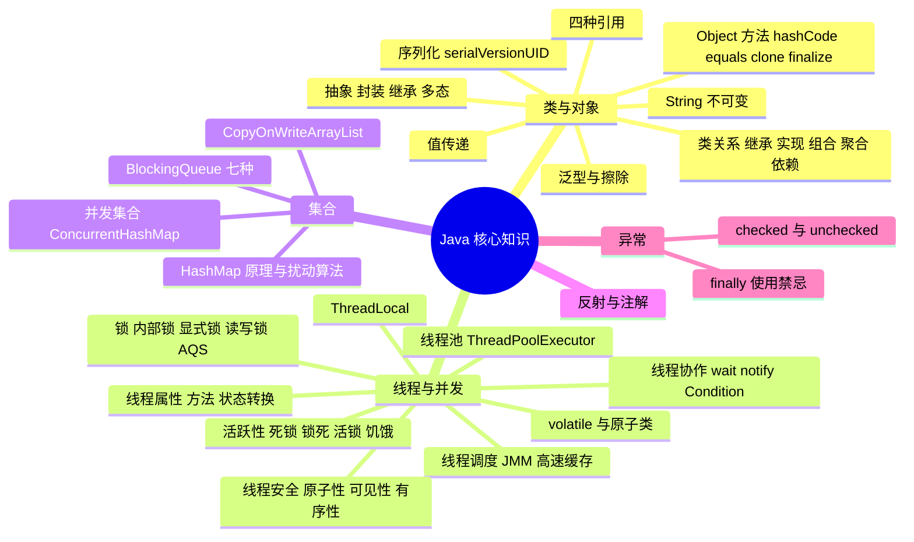
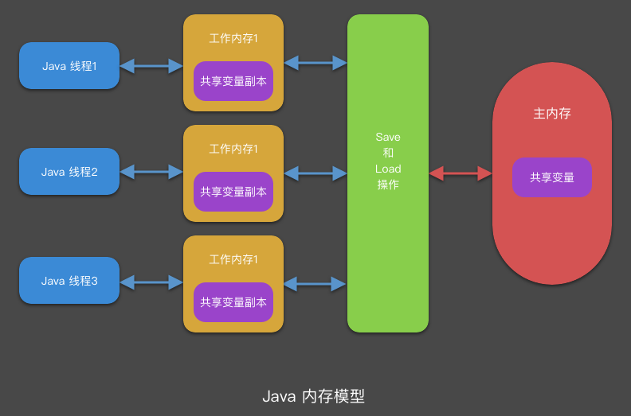
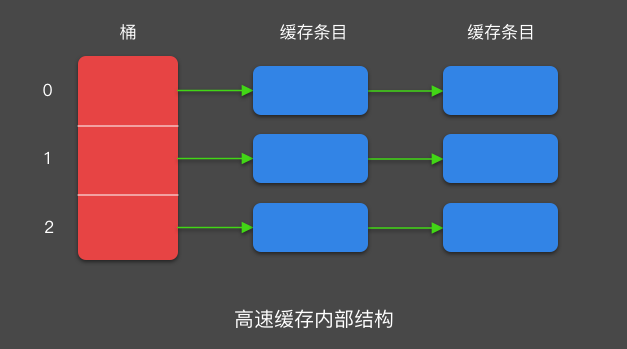
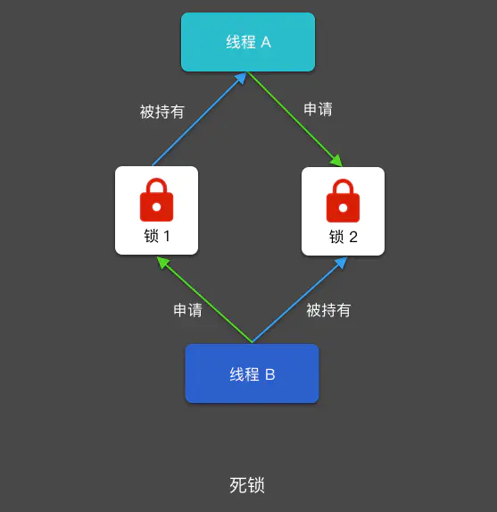

# Java 核心知识总结

> 本文是 Java 知识体系的**总纲**，每一块只保留最核心的结论，细节见各专题文章。

```mermaid
mindmap
  root((Java 核心知识))
    类与对象
      Object 方法 hashCode equals clone finalize
      String 不可变
      抽象 封装 继承 多态
      类关系 继承 实现 组合 聚合 依赖
      序列化 serialVersionUID
      值传递
      四种引用
      泛型与擦除
    线程与并发
      线程属性 方法 状态转换
      线程调度 JMM 高速缓存
      线程安全 原子性 可见性 有序性
      ThreadLocal
      volatile 与原子类
      线程池 ThreadPoolExecutor
      锁 内部锁 显式锁 读写锁 AQS
      线程协作 wait notify Condition
      活跃性 死锁 锁死 活锁 饥饿
    集合
      HashMap 原理与扰动算法
      并发集合 ConcurrentHashMap
      BlockingQueue 七种
      CopyOnWriteArrayList
    反射与注解
    异常
      checked 与 unchecked
      finally 使用禁忌
```

---

## 一、类与对象

> 细节见 [java_base1.md](./java_base1.md)、[java_base4.md](./java_base4.md)（字符集与编码）。

### 1. Object 的核心方法

- **hashCode() 与 equals()**：`hashCode` 生成哈希值，哈希冲突不可避免，所以 `hashCode` 相同时还需要再调用 `equals` 做进一步比较；但 `hashCode` 不同可直接判定对象不同、跳过 `equals`，从而加快冲突处理效率。
- 若两个对象 `equals` 相等，则 `hashCode` 的返回值必须相同。**任何时候覆写 `equals` 都必须同时覆写 `hashCode`。**
- **clone()**：分为浅拷贝、一般深拷贝和彻底深拷贝。
  - 浅拷贝只复制当前对象的基本数据类型和引用变量，不复制引用变量指向的实际对象；
  - 彻底深拷贝指 clone 出的对象与母对象在任何引用路径上都不存在共享的实例对象，但引用路径递归越深越接近母对象，实现难度越大；
  - 介于两者之间的都是一般深拷贝。慎用 `Object.clone()`，它默认是浅拷贝，想实现深拷贝需要覆写并做引用对象的深度遍历式拷贝。
- **finalize()** 在 JDK 9 之后被标记为过时；`wait()` / `notify()` 同步方式事实上已被同步信号、锁、阻塞集合等取代。

### 2. String 的不可变性

- `String` 是 final class，所有属性也都是 final 的。由于不可变性，类似拼接、裁剪字符串等动作都会产生新的 String 对象；字符串操作普遍，因此其效率往往对应用性能有明显影响。
- 变体：[StringBuilder / StringBuffer](./java_base4.md)（详见字符篇）。

### 3. 抽象、封装、继承、多态

- **封装**：设计模式七大原则之一的迪米特法则就是封装的具体要求——一个模块使用另一个模块的某个接口行为时，对此外的其他信息知道得尽可能少。
- **继承**：判断继承关系是否满足 is-a，标准是是否符合里氏代换原则（Liskov Substitution Principle, LSP）——任何父类能够出现的地方，子类都能够出现。
- **谨慎使用继承**：认清继承滥用的危害（方法污染和方法爆炸），提倡**组合优先**——优先用组合或聚合复用其他类的能力，而不是继承。

### 4. 类关系

| 关系 | 关键字 | 语义 |
| --- | --- | --- |
| 继承 | extends | is-a |
| 实现 | implements | can do |
| 组合 | 类是成员变量 | contain，完全绑定，成员共同完成一件使命、生命周期一致，部分不能在整体之间共享 |
| 聚合 | 类是成员变量 | has，可拆分的整体与部分关系，松散的暂时组合，部分可拆出来给另一个整体 |
| 依赖 | import | use-a，除组合和聚合外的类间关系，只要 import 就是依赖 |

### 5. 序列化

- 实现 `Serializable` 接口的类一定要显式定义 `serialVersionUID`，修改类时根据兼容性决定是否修改：
  - **兼容升级**：不要修改 `serialVersionUID`，避免反序列化失败；
  - **不兼容升级**：需要修改 `serialVersionUID`，避免反序列化混乱。
- Serializable 效率较低：过程中会创建大量临时变量造成大量 GC；使用大量反射（耗时）；使用大量 IO。可用于持久化；对比 Android 的 Parcelable，后者在内存中效率更快。

### 6. 值传递、构造函数、引用

- **值传递**：无论基本数据类型还是引用变量，Java 的参数传递都是**值复制**。对于引用变量，复制的是指向对象的首地址，双方都可以通过自己的引用修改对象的相关属性。
- **构造函数与初始化顺序**：创建类对象时，先执行父类和子类的静态代码块，再执行父类和子类的构造方法（并不是执行完父类的静态代码块和构造方法后再执行子类）。静态代码块只运行一次，第二次实例化时不再运行。
- **引用与对象占用**：引用变量（无论指向包装类、集合类、字符串类还是自定义类）在 32 位 HotSpot 上占 4 字节；对象无论多小，对象头至少占 12 字节用于存储基本信息，而存储空间分配必须是 8 字节的倍数，所以初始分配至少 16 字节。
- **四种引用**：强引用（Strong Reference）、软引用（SoftReference）、弱引用（WeakReference）、虚引用（PhantomReference）。

### 7. 泛型

- 泛型是 JDK 1.5 引入的概念，将 Java 类型抽象，提供编译时类型安全检测机制。
- **泛型擦除**：泛型只在静态类型检查期间出现，之后程序中的所有泛型类型都被擦除、替换为非泛型边界。例如 `List<String>` 被擦除为 `List`，未指定边界的类型变量被擦除成 `Object`。
- **边界（PECS）**：`extends` 是生产者，能 get，put 受限；`super` 是消费者，能 put，get 受限。

### 8. 枚举

- 与表示一组常量最大的区别：**枚举拥有类的属性**。

### 9. NIO 与 IO

详见 [NIO 与 IO](./NIO与IO.md)，这里只留三句：

- IO 面向流、阻塞；NIO 面向缓冲、非阻塞，Selector 可用单线程控制多通道；
- 同步/异步关注消息通知机制，阻塞/非阻塞关注等待时的线程状态，两两组合出四种模型；
- BIO 关心"我要读"，NIO 关心"我可以读了"，AIO 关心"读完了"；BIO/NIO/多路复用本质都是同步 IO，只有 AIO 是真正的异步 IO。

### 10. 字符集与编码

- **Unicode 只是符号集**，只规定符号的二进制代码，没有规定这个代码如何存储。
- **UTF-8** 是互联网上使用最广的 Unicode 实现方式，最大特点是**变长编码**，用 1~4 个字节表示一个符号，字节长度随符号变化。
- 以汉字"严"为例：Unicode 码是 `4E25`，需要两个字节存储。存储时 4E 在前、25 在后是 **Big endian**；25 在前、4E 在后是 **Little endian**。Unicode 规范定义在每个文件最前面加入一个表示编码顺序的字符（"零宽度非换行空格"，`FEFF`），正好两个字节且 FF 比 FE 大 1：文件头两字节是 `FE FF` 表示大端，`FF FE` 表示小端。

---

## 二、线程与并发

> 细节见 [线程、线程池、死锁](./线程、线程池、死锁.md)（线程状态、任务体系、死锁与线程池）、[并发编程.md](./并发编程.md)（三大特性与锁）、[Java并发编程艺术.md](./Java并发编程艺术.md)。

### 1. 线程基础

- **属性**：编号、名字、类别（守护线程 / 用户线程）、优先级。
- **常用方法**：
  - `start` / `run`；
  - `join`：等待其他线程执行结束。线程 A 调用线程 B 的 `join()`，A 会进入等待状态，直到 B 运行结束；
  - `Thread.currentThread()`；
  - `Thread.yield()`：使当前线程放弃对处理器的占用，相当于降低线程优先级——对调度器说"如果其他线程要处理器资源就给它们，否则我继续用"；
  - `Thread.sleep(ms)`。
- **状态转换**（详见[《线程、线程池、死锁》](./线程、线程池、死锁.md)）：new → runnable（又分预备 READY 和运行 RUNNING）→ blocked → wait（WAITING，`Object.wait()` / `LockSupport.park()` / `Thread.join()`）→ dead。
  - 处于预备状态的线程可被调度器调度，调度后转为运行状态，也叫活跃线程；运行状态被 `yield()` 后可能回到预备状态。
  - 进入 blocked：发起阻塞式 I/O 操作、申请其他线程持有的锁、进入 synchronized 方法或代码块失败。
  - 从等待状态转变为可运行状态叫**唤醒**：`Object.notify()` / `notifyAll()` / `LockSupport.unpark()`。
- **实现方式**：Thread、Runnable、Callable、Future、FutureTask（本质最终都落回 Runnable）。
- **阻塞辨析**：
  - `sleep` 和 `wait` 的区别：**sleep 没有让出锁，wait 让出锁**；
  - `blocked` 和 `wait` 的区别：只有 synchronized 会导致线程进入 Blocked 状态；`Object.wait()` 导致线程进入 Waiting 状态；Waiting 线程被 notify 唤醒后，重新获取对象锁时也会进入 Blocked 状态，即 Waiting 只能先进入 Blocked，获取锁之后才能恢复执行。
- **setUncaughtExceptionHandler**：用来捕获线程中产生的异常。Java 有两种异常：检查异常（必须强制捕获或写在 throws 子句中，如 IOException、ClassNotFoundException）和未检查异常（不用强制捕获，如 NumberFormatException）。`run()` 方法不接受 throws 子句，所以在线程的 `run()` 里抛出检查异常必须捕获处理；非检查异常抛出时默认打印 stack trace 并退出程序，用 `setUncaughtExceptionHandler` 可以捕获。

### 2. 线程调度原理

- **Java 内存模型**：规定了所有变量都存储在主内存中，每条线程都有自己的工作内存。

  

- **高速缓存**：现代处理器处理能力远胜主内存（DRAM）访问速率——主内存一次读/写的时间，处理器可以执行上百条指令。硬件设计者在主内存与处理器之间加入高速缓存（Cache），处理器读写内存不直接与主内存打交道，而是通过高速缓存。高速缓存相当于一个硬件实现的容量极小的散列表，key 是对象的内存地址，value 可以是内存数据的副本或准备写入内存的数据；内部结构上看相当于一个链式散列表（Chained Hash Table），包含若干桶，每个桶包含若干缓存条目（Cache Entry）。

  

- **线程调度机制**：多线程并发运行实际上是指多个线程轮流获取 CPU 使用权。调度由 JVM 负责：
  - 分时调度模型：所有线程轮流获取 CPU 使用权，平均分配时间片；
  - **抢占式调度模型**：JVM 采用。先让优先级高的线程占用 CPU，优先级相同则随机选择；因此同时启动多个线程并不能保证它们轮流获取均等时间片。想干预调度过程，最简单的办法是给线程设定优先级。

### 3. 线程安全

核心理念：**要么只读，要么加锁**。

- **竞态**：多个线程对一个或多个共享可变对象交错操作时，可能导致数据异常。竞态不一定导致计算结果不正确，而是不排除时对时错的可能。
- **原子性、可见性、有序性**：可见性指一个线程对共享变量的更新对其他读取该变量的线程是否可见；有序性指一个处理器上执行的内存访问操作，在另一个处理器上运行的线程看来是乱序的。

#### ThreadLocal

- Android 中 Handler 的 Looper 就用了：`static final ThreadLocal<Looper> sThreadLocal = new ThreadLocal<Looper>();`
- 构造这样一个对象作为共享变量、统一设置初始值，但**每个线程对这个值的修改都是互相独立的**。恰当的理解是 CopyValueIntoEveryThread，而不是"线程本地化"。
- 通常由 `private static` 修饰（都要复制进本地线程，非 static 作用不大）。注意：**ThreadLocal 无法解决共享对象的更新问题。**
- **内存泄漏**：ThreadLocalMap 用 ThreadLocal 的**弱引用**作为 key。如果一个 ThreadLocal 没有外部强引用，GC 时会回收它，ThreadLocalMap 中就会出现 key 为 null 的 Entry，无法访问其 value；如果当前线程迟迟不结束，就存在强引用链 `Thread Ref → Thread → ThreadLocalMap → Entry → value`，value 永远无法回收，造成内存泄漏。防护措施：`get()`/`set()`/`remove()` 时会清除所有 key 为 null 的 value；`set` 通过 `replaceStaleEntry` 回收 key 为 null 的 Entry 和值。
- 每个线程持有一个 Map 并维护 ThreadLocal 对象与具体实例的映射，该 Map 只被持有它的线程访问，故不存在线程安全和锁的问题。

#### volatile

- 线程都有独占的内存区域（如操作栈、本地变量表），线程本地内存保存了引用变量在堆内存中的副本，线程对变量的操作都在本地内存进行，结束后再同步回堆内存——这个时间差内，该线程对副本的操作对其他线程不可见。
- volatile 修饰变量意味着任何对此变量的操作**都在内存中进行、不产生副本**，保证共享变量的可见性，局部阻止指令重排。
- **"volatile 是轻量级的同步方式"这种说法是错误的**：它只是轻量级的**线程操作可见方式**，并非同步方式。多写场景一定会产生线程安全问题；多写场景的典型应用是 `CopyOnWriteArrayList`。

#### 其他线程安全手段

- **数据只读**：String、Integer 等不可变对象天然线程安全。
- **线程安全类**：StringBuffer、并发集合类 ConcurrentHashMap。
- **原子类**：JUC 的 atomic 包通过 Unsafe 中的 CAS 指令从硬件层面实现线程安全，如 AtomicInteger、AtomicBoolean、AtomicReference、AtomicReferenceFieldUpdater。
  - AtomicReference 用法比 AtomicReferenceFieldUpdater 简单，但内部一样有一个 volatile 变量；使用 AtomicReference 会多创建一个对象，当成千上万地创建时开销很大——这就是 BufferedInputStream、Kotlin 协程、Kotlin 的 lazy 选择 `AtomicReferenceFieldUpdater` 的原因。
- **线程池**：Executors / ThreadPoolExecutor（七大参数：corePoolSize、maximumPoolSize、keepAliveTime、TimeUnit、BlockingQueue、ThreadFactory、RejectedExecutionHandler）。JDK 8 增加 `Executors.newWorkStealingPool`。详见[《线程、线程池、死锁》](./线程、线程池、死锁.md)。

### 4. 锁

#### 内部锁与显式锁

| | 内部锁 synchronized | 显式锁 Lock |
| --- | --- | --- |
| 获取/释放 | 自动，进入同步块获取、退出释放 | 手动，必须在 finally 中释放，避免锁泄漏 |
| 公平性 | 非公平 | `ReentrantLock(fair)` 可选，默认非公平 |
| 能力 | 固化，先获取再释放 | 可操作性、可中断获取、超时获取 |
| 可重入 | 是 | 是 |

- **内部锁**又叫监视器锁（通过 monitor 实现），编译后 javac 对临界区可能抛出的异常做了特殊处理，出了异常也不会妨碍锁释放，**不会导致锁泄漏**。锁句柄（锁对象）通常用 `private` + `final` 修饰，因为句柄变量一旦改变，同一个同步代码块的多个线程实际会用不同的锁。
- **显式锁**：`lock()` 与 `unlock()` 之间是临界区；ReentrantLock 支持重入。

#### 读写锁

- 出现原因：锁的排他性使多个线程无法以线程安全的方式同时读取共享变量，不利于提高并发性。
- **读锁共享**：多个线程可同时持有读锁；**写锁排他**：任一时刻只能被一个线程持有。
- **可以降级**（持有写锁时可继续获取读锁），**不能升级**（读线程只有释放读锁才能申请写锁）。
- 读写锁同样保障原子性、可见性和有序性。
- 适用条件：读操作比写操作频繁很多、读取共享变量的线程持有锁的时间较长——否则额外的开销不划算。
- 实现类是 **ReentrantReadWriteLock**：写锁是可重入的排他锁（当前线程已获取写锁则增加写状态；获取写锁时若读状态不为 0 或该线程不是已获取写锁的线程则等待）；读锁是可重入的共享锁（写状态为 0 时总能获取，只是线程安全地增加读状态；获取读锁时写锁已被其他线程获取则等待）。

#### AQS（AbstractQueuedSynchronizer）

- 用一个 int 成员变量表示同步状态，通过内置 FIFO 队列完成资源获取线程的排队。队列节点（Node）保存获取同步状态失败的线程引用、等待状态以及前驱和后继节点。
- **独占式**：`acquire` / `release`。获取失败则构造独占节点（`Node.EXCLUSIVE`）并通过 `addWaiter` 加入队尾，再以"死循环"方式 `acquireQueued` 自旋获取；只有**前驱节点是头节点**才能尝试获取同步状态。释放时调用 `tryRelease`，然后唤醒头节点的后继节点。
- **共享式**：多个线程可同时获取同步状态。以文件读写为例：读操作可同时进行，写操作要求独占访问。
- AQS 是抽象类，内置自旋实现的同步队列，封装入队出队，提供独占、共享、中断等特性；子类定义不同资源实现不同性质的方法——如 ReentrantLock 定义 state 获取资源并置为 1，重入则 state 加 1，释放减 1 直至 0。
- **公平锁**：绝对时间上先请求的线程一定先被满足则是公平锁，即等待时间最长的线程优先获取，锁获取是顺序的。ReentrantLock 默认非公平：非公平下，一个线程直接请求锁可能避开"挂起→恢复 RUNNABLE"的消耗，性能更优。
- **锁降级**：把持住当前拥有的写锁，再获取到读锁，随后释放先前拥有的写锁——这才是锁降级；先释放写锁再获取读锁的分段过程不算。

#### 锁优化（JDK 1.6）

- 引入了自旋锁、适应性自旋锁、锁消除、锁粗化、偏向锁、轻量级锁来减少锁操作开销。
- 锁的四种状态依次是：无锁 → 偏向锁 → 轻量级锁 → 重量级锁，**可以升级但不能降级**，策略目的是提高获取和释放锁的效率。
  - **重量级锁**：用互斥量 Mutex 控制对互斥资源的访问，抽象为监视器锁 Monitor，成本非常高（内核态与用户态切换）；
  - **自旋锁**：锁状态只持续很短时间的话，挂起/恢复线程不值得，让等待线程循环一定次数尝试获取锁，节省切换消耗但仍占处理器；**自适应自旋**改由前一次在同一锁上的自旋时间及锁拥有者状态决定；
  - **锁消除**：运行时发现被锁住的代码中不可能存在共享数据，就清除该锁；
  - **锁粗化**：检测到一串零碎操作都对同一对象加锁时，把锁扩展到整个操作序列外部（如 StringBuffer 的 append）；
  - **轻量级锁**：绝大部分锁在整个同步周期内不存在竞争，可用 CAS 避免互斥量的开销；
  - **偏向锁**：一个线程获得锁后锁进入偏向模式，该线程再次请求时无需任何同步操作即可获取。
- **使用原则**：锁的范围尽可能小、时间尽可能短——能锁对象就不要锁类，能锁代码块就不要锁方法。

### 5. 线程协作

- **join**：让一个线程等待另一个线程执行结束后再继续。
- **wait / notify / notifyAll**：
  - `Object.wait()` 让线程暂停（WAITING），`Object.notify()` 唤醒一个被暂停的线程；Object 是所有对象的父类，所以所有对象都能实现等待和通知；
  - 使用前必须先获取共享对象的**监视器锁**（在同步代码块或同步方法中执行），否则报 `IllegalMonitorStateException`；
  - `wait()` 必须捕获中断异常 `InterruptedException`（等待状态可被打断）；
  - `notify()` 唤醒的是对应对象上一个**任意**等待线程，不一定是你想唤醒的那个；想唤醒特定线程用 `notifyAll()`；
  - 锁对象要用 **final** 修饰：否则对象值可能被修改，导致等待线程和通知线程同步在不同的内部锁上，造成竞态；
  - 对保护条件的判断和 `wait()` 的调用要放在**循环**中，确保目标动作只在保护条件成立时执行；
  - `wait()` 释放的只是该 wait 方法所属对象的内部锁，线程持有的其他内部锁和显式锁不会因此释放。
- **Condition**：`await()` / `signal()` / `signalAll()` 相当于 Object 的 `wait()` / `notify()` / `notifyAll()`。wait/notify 过于底层，存在两个问题：过早唤醒；无法区分 `Object.wait(ms)` 返回是由于超时还是被唤醒。
- **CountDownLatch**：只需等待特定操作执行结束、不需要等待整个线程结束时使用。
  - 内部维护未完成先决操作数的 count，每次 `countDown()` 减 1，值在构造函数中设置，不能小于 0；
  - **一次性**：计数为 0 后再调用 `await()` 不会再让线程等待；
  - 内部封装了等待/通知逻辑，**不需要加锁**；count 为 0 时会唤醒对应的等待线程。
- **Semaphore（信号维度）**：处理基于空闲信号的同步。比如海关安检：通道有 3 个窗口，出关的人排成长队，每个人是一个线程，任一窗口空闲时，队列第一个人出队到该窗口接受查验。
- **CyclicBarrier（栅栏）**：多个线程需要互相等待对方到达某个集合点才能继续执行。执行 `await()` 的线程叫参与方（Party），除最后一个到达的线程外，其他线程都会被暂停；与 CountDownLatch 不同，**可以重复使用**——等待结束后可再次进行一轮等待。

### 6. 线程活跃性

指线程不够活跃、导致任务无法取得进展。

- **死锁**：两个或以上线程因争夺资源互相等待，若无外力作用都无法推进。四个必要条件：互斥、请求与保持、不剥夺、循环等待。

  

- **锁死（Lockout）**：等待线程的唤醒条件永远无法成立，任务一直无法继续。
  - **信号丢失锁死**：没有对应的通知线程唤醒等待线程。典型例子是等待线程执行 `wait()` / `await()` 前没有判断保护条件，而保护条件已经成立、后续又没有其他线程更新条件并通知——这正是强调 wait/await 要放在循环语句中执行的原因；
  - **嵌套监视器锁死**：嵌套使用锁导致线程永远无法唤醒，代码上表现为两个嵌套的同步代码块；避免办法就是避免嵌套使用内部锁。
- **活锁（Livelock）**：线程一直处于运行状态，但任务一直无法继续执行。
- **线程饥饿（Starvation）**：线程一直无法获得所需资源，导致任务一直无法执行。

---

## 三、集合

> 细节见 [java_base2.md](./java_base2.md)、[Hash.md](./Hash.md)、[ConcurrentHashMap.md](./ConcurrentHashMap.md)。

### 1. 使用建议

- 集合初始化一定要指定大小容量，避免第一次使用就扩展。
- 集合与数组互相转化时，`toArray()`、`asList()` 指定容量大小一致的效率最高。

### 2. HashMap

- **String 的 hashCode 为什么用 31**：31 是奇素数。乘数是偶数且乘法溢出时会丢失信息（与 2 相乘等价于移位、低位补 0）；31 有很好的性能，可用移位和减法代替乘法——`31 * i == (i << 5) - i`，现代 VM 会自动完成这种优化（`h = 31 * h + val[i]`）。
- **扰动算法**：hashCode 是 32 位 int，而 HashMap 数组远没有 40 亿这么长，只取低几位的话，低位相同、高位不同的 Hash 值就会碰撞。于是把 Hash 值高 16 位右移并与原值异或（`(h = k.hashCode()) ^ (h >>> 16)`），混合高低位，得到更散列的低 16 位。
- **为什么用 `&` 代替模运算**：`tab[(n - 1) & hash]`（n 是数组长度），结果和模运算相同——当 n 是 2 的指数时，`a % n == (n-1) & a` 成立；而现代处理器除法和求余最慢。
- **原理**：通过 hash 方法用 put/get 存取对象。put 时调用 hashCode 计算 hash 得到 bucket 位置，HashMap 会根据 bucket 占用情况自动调整容量（超过 Load Factor 默认 0.75 则 resize 为原来 2 倍，并重新调用 hash 方法）；get 时计算 bucket 位置后调用 `equals()` 确定键值对。发生碰撞时用链表组织，Java 8 中一个 bucket 碰撞元素超过限制（默认 8）则用红黑树替换链表以提高速度。
- **多线程扩容死循环**：并发 put 时多线程可能导致 Entry 链表形成环形数据结构，next 节点永远不为空，产生死循环——根源是 JDK 1.7 resize 时用**头插法**把老数据迁移到新桶。1.8 后不需要重新计算 hash，只需看原 hash 值新增的那个 bit 是 1 还是 0：是 0 索引不变，是 1 则变成"原索引 + oldCap"。
- HashMap 的 key 和 value 可以是 null，ConcurrentHashMap 不可以。

### 3. 并发集合

- **ConcurrentHashMap 1.7**：由 Segment 数组 + HashEntry 数组组成。Segment 是一种可重入锁（ReentrantLock），扮演锁的角色；一个 Segment 守护一个 HashEntry 数组，修改数据前必须先获得对应的 Segment 锁。
  - 优势：HashMap 并发 put 会死循环；Hashtable 效率非常低下（一个线程访问同步方法时其他线程进入阻塞或轮询）。
  - **get 不加锁**：共享变量（统计 Segment 大小的 count、存储值的 HashEntry.value）都定义成 volatile。volatile 保证可见性、可多线程同时读且不会读到过期值，但只能被单线程写（写入值不依赖原值时除外）；get 只读不写，所以无需加锁。
  - **put 两步**：先定位 Segment，再在 Segment 里插入——第一步判断是否需要对 HashEntry 数组扩容，第二步定位元素位置放入。
- **ConcurrentHashMap 1.8**：取消分段锁机制，进一步降低冲突概率；引入红黑树；插入用 CAS 而非加锁；配合 volatile（可见性）与 synchronized 锁；用更优化的方式统计元素数量。put 的整体思路：
  1. 数组为空则初始化，完成后走 2；
  2. 计算槽点有没有值：没有则 CAS 创建，失败就自旋（for 死循环）直到成功；有值走 3；
  3. 槽点是转移节点（正在扩容）就自旋等待扩容完成再新增，不是则走 4；
  4. 锁定当前槽点保证其他线程不能操作：链表则新增到尾部，红黑树则用红黑树的新增方法；
  5. 新增完成后检查是否需要扩容。
- **ConcurrentLinkedQueue**：用 CAS 设置、不阻塞。
- **BlockingQueue 七种阻塞队列**：
  - ArrayBlockingQueue：数组结构的**有界**阻塞队列；
  - LinkedBlockingQueue：链表结构的**有界**阻塞队列；
  - PriorityBlockingQueue：支持优先级排序的**无界**阻塞队列；
  - DelayQueue：优先级队列实现的**无界**阻塞队列；
  - SynchronousQueue：**不存储元素**的阻塞队列；
  - LinkedTransferQueue：链表结构的**无界**阻塞队列；
  - LinkedBlockingDeque：链表结构的**双向**阻塞队列。
- **CopyOnWriteArrayList**：读写锁的规则是读写互斥、写写互斥，而 CopyOnWrite 做了升级——**读取完全不加锁**，写入也不阻塞读取，只有写入和写入之间需要同步等待。写入时先 copy 一份到新内存再修改，完成后把指针指过去；因此迭代时看到的仍是老内存上的值，而不是修改后的值。

---

## 四、反射与注解

> 细节见 [代理.md](./代理.md)、[java_base5.md](./java_base5.md)。

### 1. 反射

- 反射机制赋予程序在运行时**自省**（introspect）的能力：可以获取对象的类定义、获取类声明的属性和方法、调用方法或构造对象，甚至可以运行时修改类定义。
- 反射可以修改 final 变量，但如果是基本数据类型或 String 类型，无法通过对象获取修改后的值——因为常量在编译过程中使用了内联优化，其值在编译阶段就被编译为常量值。
- **提升效率**：
  - 使用缓存对象；
  - 尽量调用 `setAccessible(true)` 关闭安全检查——访问私有变量和方法时本来就要用，而安全检查本身也是耗时的，无论是否私有都可以通过它提高效率。
- 动态代理见 [代理.md](./代理.md)。

### 2. 注解

通俗地讲可以看作标签使用：**编译时注解**与**运行时注解**两大类，详见 [java_base5.md](./java_base5.md)。

---

## 五、异常

- **Error** 与 **Exception** 是所有异常体系的顶层。
- **checked 异常**：必须强制捕获或写在 throws 子句中。
  - 力所能及、坦然处置型：如未授权异常 UnauthorizedException，程序可跳转至权限申请页面。
- **unchecked 异常**：运行时异常，都继承自 RuntimeException，不需要显式捕捉和处理。
  - **可预测异常**（Predicted Exception）：常见的如 IndexOutOfBoundsException、NullPointerException。基于对代码性能和稳定性的要求，此类异常不应被产生或抛出，而应提前做好边界检查、空指针判断；显式声明或捕获反而对可读性和运行效率影响很大。
  - **需捕捉异常**（Caution Exception）：如使用 Dubbo 框架做 RPC 调用时产生的远程服务超时异常 DubboTimeoutException，客户端必须显式处理，不能因服务端异常导致客户端不可用，处理方案可以是重试或降级。
  - **可透出异常**（Ignored Exception）：框架或系统产生且会自行处理的异常，程序无须关心。如 Spring 框架抛出的 NoSuchRequestHandlingMethodException，框架会自己完成处理，默认把自身异常映射到合适的状态码，比如启动防护机制跳转到 404 页面。
- **无能为力、引起注意型**：程序无法处理，如字段超长导致 SQLException——即使重试也没有帮助，一般做法是完整保存异常现场，供开发工程师介入解决。
- **finally 使用禁忌**：
  - finally 的职责不是对变量赋值，而是清理资源、释放连接、关闭管道流等，此时如果有异常也要做 try-catch；
  - 不要在 finally 中赋值；
  - 不要在 finally 中 return。

---

## 六、30 秒口述版

Java 基础围绕三条线：**对象语义**（equals/hashCode 契约、不可变、初始化顺序、四种引用、值传递）、**并发**（JMM 三大特性 → volatile/synchronized/AQS 三大机制 → 锁升级与线程池 → 协作工具与活跃性问题）、**集合**（HashMap 的 hash 扰动与 2 的幂扩容、ConcurrentHashMap 从分段锁到 CAS + synchronized 的演进）。面试落点通常在：为什么覆写 equals 必须覆写 hashCode、volatile 为什么不是同步方式、AQS 的 state 与 CLH 队列、HashMap 扩容为什么容量必须是 2 的幂。
