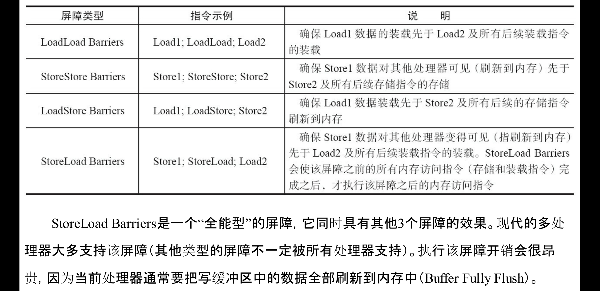
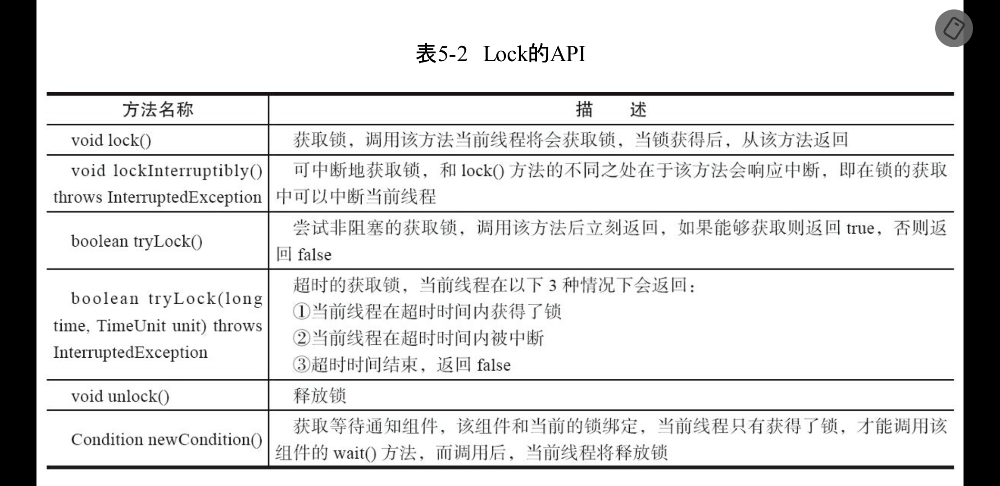
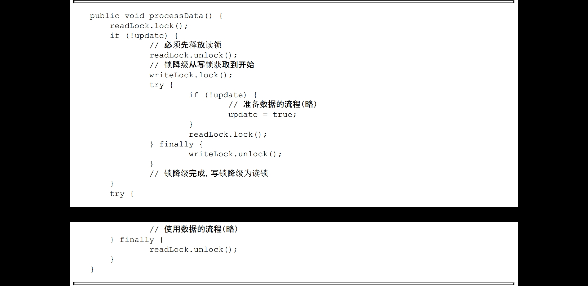
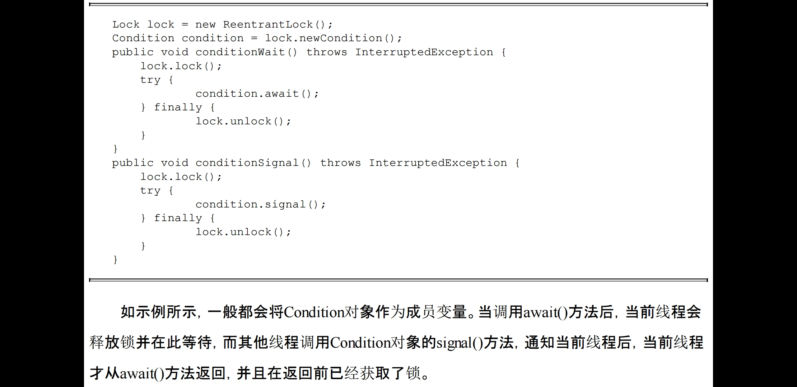

Java并发编程艺术
--

# 并发编程挑战

- 上下文切换

    - 避免上下文切换

         - ·无锁并发编程。多线程竞争锁时，会引起上下文切换，所以多线程处理数据时，可以用一些办法来避免使用锁，如将数据的ID按照Hash算法取模分段，不同的线程处理不同段的数据。

         - CAS算法。Java的Atomic包使用CAS算法来更新数据，而不需要加锁。

         - 使用最少线程。避免创建不需要的线程，比如任务很少，但是创建了很多线程来处理，这样会造成大量线程都处于等待状态。

         - 协程：在单线程里实现多任务的调度，并在单线程里维持多个任务间的切换。

- 锁，死锁

    - 避免一个线程同时获取多个锁。

    - 避免一个线程在锁内同时占用多个资源，尽量保证每个锁只占用一个资源。

    - 尝试使用定时锁，使用lock.tryLock（timeout）来替代使用内部锁机制。

    - 对于数据库锁，加锁和解锁必须在一个数据库连接里，否则会出现解锁失败的情况。

- 资源受限

--

# volatile

- 1）Lock前缀指令会引起处理器缓存回写到内存

- 2）一个处理器的缓存回写到内存会导致其他处理器的缓存无效

- 即使是64位的long型和double型变量，只要它是volatile变量，对该变量的读/写就具有原子性。如果是多个volatile操作或类似于volatile++这种复合操作，这些操作整体上不具有原子性

--

# synchronized

- 对象

    - 对于普通同步方法，锁是当前实例对象。

    - 对于静态同步方法，锁是当前类的Class对象。

    - 对于同步方法块，锁是Synchonized括号里配置的对象。

- JVM基于进入和退出Monitor对象来实现方法同步和代码块同步

- 锁一共有4种状态，级别从低到高依次是：无锁状态、偏向锁状态、轻量级锁状态和重量级锁状态，除了偏向锁，JVM实现锁的方式都用了循环CAS，即当一个线程想进入同步块的时候使用循环CAS的方式来获取锁，当它退出同步块的时候使用循环CAS释放锁。

- CAS比较并交换Compared and Swap

    - 利用了处理器提供的CMPXCHG指令实现的。自旋CAS实现的基本自旋CAS实现的基本思路就是循环进行CAS操作直到成功为止

    - AtomicBoolean（用原子方式更新的boolean值）、AtomicInteger（用原子方式更新的int值）和AtomicLong

- 原子性操作保证

    - 使用总线锁保证原子性，就是使用处理器提供的一个LOCK＃信号，当一个处理器在总线上输出此信号时，其他处理器的请求将被阻塞住，那么该处理器可以独占共享内存。

    - 使用缓存锁保证原子性，处理器不在总线上声言LOCK＃信号，而是修改内部的内存地址，并允许它的缓存一致性机制来保证操作的原子性，因为缓存一致性机制会阻止同时修改由两个以上处理器缓存的内存区域数据，当其他处理器回写已被锁定的缓存行的数据时，会使缓存行无效

--

# 内存模型

- 指令重排，每个处理器上的写缓冲区，仅仅对它所在的处理器可见。这个特性会对内存操作的执行顺序产生重要的影响：处理器对内存的读/写操作的执行顺序，不一定与内存实际发生的读/写操作顺序一致

- jvm内存屏障
	

- happen-before

    - 程序顺序规则：一个线程中的每个操作，happens-before于该线程中的任意后续操作。

    - 监视器锁规则：对一个锁的解锁，happens-before于随后对这个锁的加锁。

    - volatile变量规则：对一个volatile域的写，happens-before于任意后续对这个volatile域的读。

    - 传递性：如果A happens-before B，且B happens-before C，那么A happens-before C。

    - 注意 两个操作之间具有happens-before关系，并不意味着前一个操作必须要在后一个操作之前执行！happens-before仅仅要求前一个操作（执行的结果）对后一个操作可见，且前一个操作按顺序排在第二个操作之前（the first is visible to and ordered before the second）。

- 数据通过总线在处理器和内存之间传递。每次处理器和内存之间的数据传递都是通过一系列步骤来完成的，这一系列步骤称之为总线事务（Bus Transaction）。总线事务包括读事务（Read Transaction）和写事务（WriteTransaction）。读事务从内存传送数据到处理器，写事务从处理器传送数据到内存，每个事务会读/写内存中一个或多个物理上连续的字。这里的关键是，总线会同步试图并发使用总线的事务。在一个处理器执行总线事务期间，总线会禁止其他的处理器和I/O设备执行内存的读/写。

--

# 内存语义

- volatile

    - 线程A写一个volatile变量，实质上是线程A向接下来将要读这个volatile变量的某个线程发出了（其对共享变量所做修改的）消息。

    - 线程B读一个volatile变量，实质上是线程B接收了之前某个线程发出的（在写这个volatile变量之前对共享变量所做修改的）消息。

    - 线程A写一个volatile变量，随后线程B读这个volatile变量，这个过程实质上是线程A通过主内存向线程B发送消息。

- 锁的内存语义

    - 线程A释放一个锁，实质上是线程A向接下来将要获取这个锁的某个线程发出了（线程A对共享变量所做修改的）消息。

    - 线程B获取一个锁，实质上是线程B接收了之前某个线程发出的（在释放这个锁之前对共享变量所做修改的）消息。

    - 线程A释放锁，随后线程B获取这个锁，这个过程实质上是线程A通过主内存向线程B发送消息

--

# concurrent包

- 通用模式

    - 首先，声明共享变量为volatile。

    - 然后，使用CAS的原子条件更新来实现线程之间的同步。

    - 同时，配合以volatile的读/写和CAS所具有的volatile读和写的内存语义来实现线程之间的通信

--

# final域

- 1）在构造函数内对一个final域的写入，与随后把这个被构造对象的引用赋值给一个引用变量，这两个操作之间不能重排序。

- 2）初次读一个包含final域的对象的引用，与随后初次读这个final域，这两个操作之间不能重排序。

--

# happen before

- 1）如果一个操作happens-before另一个操作，那么第一个操作的执行结果将对第二个操作可见，而且第一个操作的执行顺序排在第二个操作之前。

- 2）两个操作之间存在happens-before关系，并不意味着Java平台的具体实现必须要按照happens-before关系指定的顺序来执行。如果重排序之后的执行结果，与按happens-before关系来执行的结果一致，那么这种重排序并不非法（也就是说，JMM允许这种重排序）。

--

# 延迟初始化

- 双层检查时对象必须volatile,因为对象实例化不是原子操作，jmm会重排

- 基于类初始化

    - 初始化

         - 1）T是一个类，而且一个T类型的实例被创建。

         - 2）T是一个类，且T中声明的一个静态方法被调用。

         - 3）T中声明的一个静态字段被赋值。

         - 4）T中声明的一个静态字段被使用，而且这个字段不是一个常量字段。

         - 5）T是一个顶级类（Top Level Class，见Java语言规范的§7.6），而且一个断言语句嵌套在T内部被执行。

    - Java语言规范规定，对于每一个类或接口C，都有一个唯一的初始化锁LC与之对应。从C到LC的映射，由JVM的具体实现去自由实现。JVM在类初始化期间会获取这个初始化锁，并且每个线程至少获取一次锁来确保这个类已经被初始化过了（事实上，Java语言规范允许JVM的具体实现在这里做一些优化，见后文的说明）。

--

# 线程

- 线程五种状态切换

- Daemon线程，在构建Daemon线程时，不能依靠finally块中的内容来确保执行关闭或清理资源

- 中断，中断可以理解为线程的一个标识位属性，它表示一个运行中的线程是否被其他线程进行了中断操作

- 等待，通知机制wait,notify,notifyall，使用前提都是获得锁

- 多线程之间进行通信的基本方式和等待/通知经典范式

- 线程池，可以看到，线程池的本质就是使用了一个线程安全的工作队列连接工作者线程和客户端线程，客户端线程将任务放入工作队列后便返回，而工作者线程则不断地从工作队列上取出工作并执行。当工作队列为空时，所有的工作者线程均等待在工作队列上，当有客户端提交了一个任务之后会通知任意一个工作者线程，随着大量的任务被提交，更多的工作者线程会被唤醒。

--

# 锁

- Lock,拥有了锁获取与释放的可操作性、可中断的获取锁以及超时获取锁，如果对多个锁操作比较方便

    - 队列同步器AbstractQueuedSynchronizer（以下简称同步器），是用来构建锁或者其他同步组件的基础框架，它使用了一个int成员变量表示同步状态，通过内置的FIFO队列来完成资源获取线程的排队工作同步队列中的节点（Node）用来保存获取同步状态失败的线程引用、等待状态以及前驱和后继节点，节点的属性类型

         - 独占式同步状态获取acquire，release,在获取同步状态时，同步器维护一个同步队列，获取状态失败的线程都会被加入到队列中并在队列中进行自旋；移出队列（或停止自旋）的条件是前驱节点为头节点且成功获取了同步状态。在释放同步状态时，同步器调用tryRelease(int arg)方法释放同步状态，然后唤醒头节点的后继节点。

              - 获取同步状态，如果同步状态获取失败，则构造同步节点（独占式Node.EXCLUSIVE，同一时刻只能有一个线程成功获取同步状态）并通过addWaiter(Node node)方法将该节点加入到同步队列的尾部，最后调用acquireQueued(Node node,int arg)方法，使得该节点以“死循环”的方式获取同步状态。

              - 节点进入同步队列之后，就进入了一个自旋的过程，每个节点（或者说每个线程）都在自省地观察，当条件满足，获取到了同步状态，就可以从这个自旋过程中退出，否则依旧留在这个自旋过程中,自旋就是在“死循环”中尝试获取同步状态，而只有前驱节点是头节点才能够尝试获取同步状态

         - 共享式多个线程同时获取到同步状态。以文件的读写为例，如果一个程序在对文件进行读操作，那么这一时刻对于该文件的写操作均被阻塞，而读操作能够同时进行。写操作要求对资源的独占式访问，而读操作可以是共享式访问

- synchronized 会隐式地获取锁，但是它将锁的获取和释放固化了，也就是先获取再释放

- 重入锁，表示该锁能够支持一个线程对资源的重复加锁

    - ReentrantLock虽然没能像synchronized关键字一样支持隐式的重进入，但是在调用lock()方法时，已经获取到锁的线程，能够再次调用lock()方法获取锁而不被阻塞。这里提到一个锁获取的公平性问题，如果在绝对时间上，先对锁进行获取的请求一定先被满足，那么这个锁是公平的，反之，是不公平的。公平的获取锁，也就是等待时间最长的线程最优先获取锁，也可以说锁获取是顺序的。ReentrantLock提供了一个构造函数，能够控制锁是否是公平的。

- 读写锁，排他锁在同一时刻只允许一个线程进行访问，而读写锁在同一时刻可以允许多个读线程访问，但是在写线程访问时，所有的读线程和其他写线程均被阻塞。读写锁维护了一对锁，一个读锁和一个写锁，通过分离读锁和写锁，使得并发性相比一般的排他锁有了很大提升。

    - ReentrantReadWriteLock

         - 写锁是一个支持重进入的排它锁。如果当前线程已经获取了写锁，则增加写状态。如果当前线程在获取写锁时，读锁已经被获取（读状态不为0）或者该线程不是已经获取写锁的线程，则当前线程进入等待状态

         - 读锁是一个支持重进入的共享锁，它能够被多个线程同时获取，在没有其他写线程访问（或者写状态为0）时，读锁总会被成功地获取，而所做的也只是（线程安全的）增加读状态。如果当前线程已经获取了读锁，则增加读状态。如果当前线程在获取读锁时，写锁已被其他线程获取，则进入等待状态。

         - 锁降级指的是写锁降级成为读锁。如果当前线程拥有写锁，然后将其释放，最后再获取读锁，这种分段完成的过程不能称之为锁降级。锁降级是指把持住（当前拥有的）写锁，再获取到读锁，随后释放（先前拥有的）写锁的过程
		

--

# Condition

- 任意一个Java对象，都拥有一组监视器方法（定义在java.lang.Object上），主要包括wait()、wait(long timeout)、notify()以及notifyAll()方法，这些方法与synchronized同步关键字配合，可以实现等待/通知模式。Condition接口也提供了类似Object的监视器方法，与Lock配合可以实现等待/通知模式

--

# 并发容器和框架

- ConcurrentHashMap

- ConcurrentLinkedQueue，用CAS设置不阻塞

- 阻塞队列

    - ArrayBlockingQueue：一个由数组结构组成的有界阻塞队列。

    - LinkedBlockingQueue：一个由链表结构组成的有界阻塞队列。

    - PriorityBlockingQueue：一个支持优先级排序的无界阻塞队列。

    - DelayQueue：一个使用优先级队列实现的无界阻塞队列。

    - SynchronousQueue：一个不存储元素的阻塞队列。

    - LinkedTransferQueue：一个由链表结构组成的无界阻塞队列。

    - LinkedBlockingDeque：一个由链表结构组成的双向阻塞队列。

