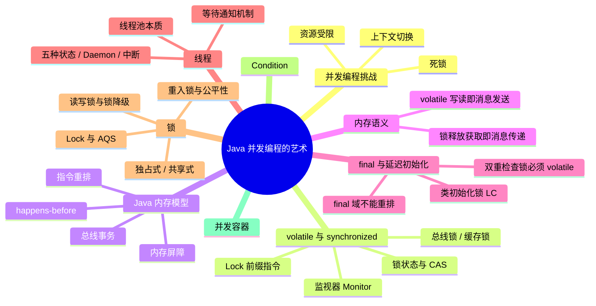
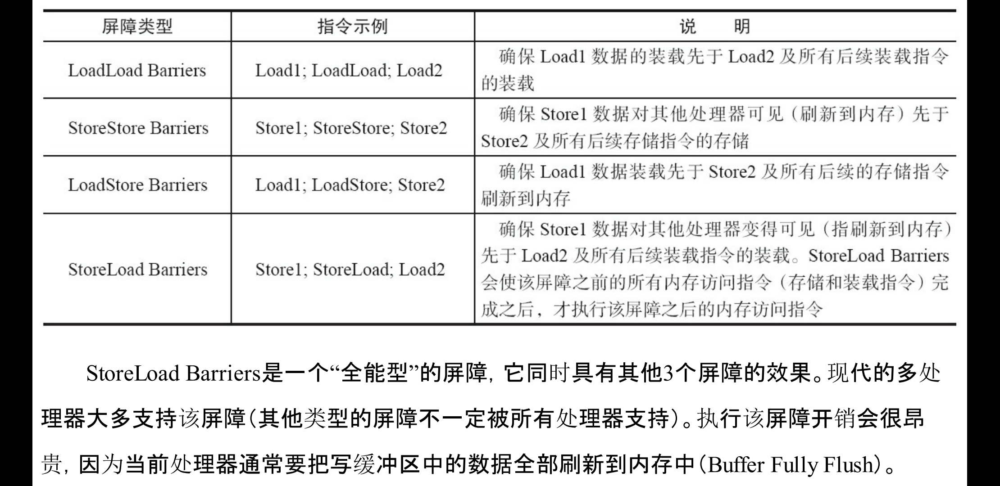
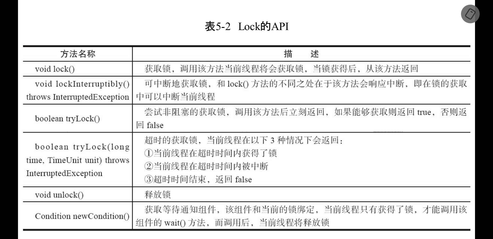
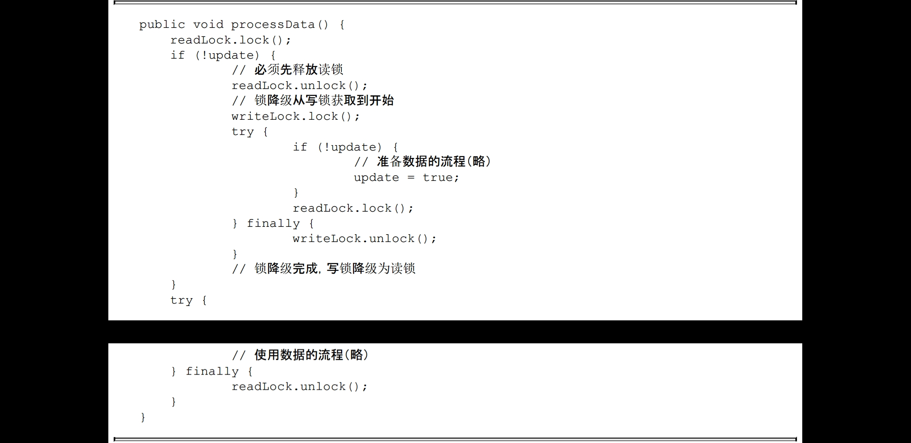
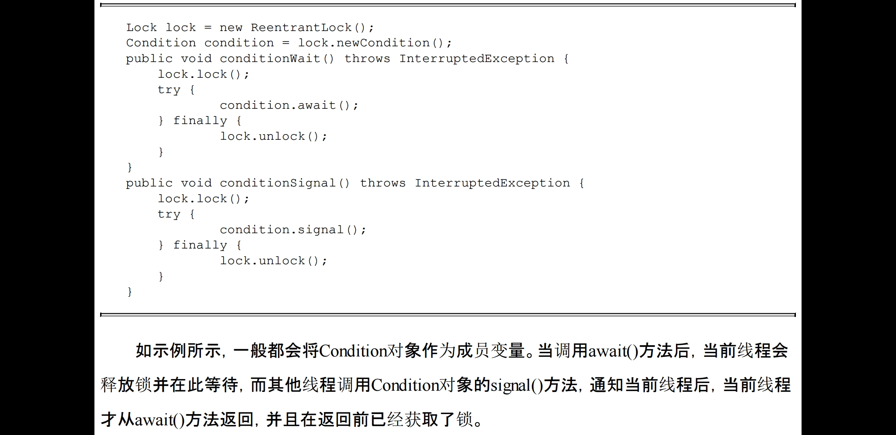

# 《Java 并发编程的艺术》笔记

```mermaid
mindmap
  root((Java 并发编程的艺术))
    并发编程挑战
      上下文切换
      死锁
      资源受限
    volatile 与 synchronized
      Lock 前缀指令
      监视器 Monitor
      锁状态与 CAS
      总线锁 / 缓存锁
    Java 内存模型
      指令重排
      内存屏障
      happens-before
      总线事务
    内存语义
      volatile 写读即消息发送
      锁释放获取即消息传递
    final 与延迟初始化
      final 域不能重排
      双重检查锁必须 volatile
      类初始化锁 LC
    线程
      五种状态 / Daemon / 中断
      等待通知机制
      线程池本质
    锁
      Lock 与 AQS
      独占式 / 共享式
      重入锁与公平性
      读写锁与锁降级
    Condition
    并发容器
```

---

## 一、并发编程挑战

### 1. 上下文切换

避免上下文切换的几种思路：

- **无锁并发编程**：多线程竞争锁时会引起上下文切换，所以多线程处理数据时，可以用一些办法来避免使用锁——如将数据的 ID 按照 Hash 算法取模分段，不同的线程处理不同段的数据。
- **CAS 算法**：Java 的 Atomic 包使用 CAS 算法来更新数据，而不需要加锁。
- **使用最少线程**：避免创建不需要的线程，比如任务很少却创建了很多线程来处理，这样会造成大量线程都处于等待状态。
- **协程**：在单线程里实现多任务的调度，并在单线程里维持多个任务间的切换。

### 2. 死锁

避免死锁的常见做法：

- 避免一个线程同时获取多个锁。
- 避免一个线程在锁内同时占用多个资源，尽量保证每个锁只占用一个资源。
- 尝试使用定时锁，使用 `lock.tryLock(timeout)` 来替代使用内部锁机制。
- 对于数据库锁，加锁和解锁必须在一个数据库连接里，否则会出现解锁失败的情况。

### 3. 资源受限

并发编程的目标是充分利用资源，但资源本身是有限的：**硬件资源限制**如带宽、磁盘读写速度、CPU 核数，**软件资源限制**如数据库连接数、socket 连接数。资源受限时，单靠提高并发度并不能提升性能，反而会因为线程切换和竞争使性能下降——需要先考虑资源复用（如连接池）或把串行操作并行化，而不是继续加线程。

---

## 二、volatile 与 synchronized

### 1. volatile 的实现原理

1. Lock 前缀指令会引起处理器缓存回写到内存。
2. 一个处理器的缓存回写到内存，会导致其他处理器的缓存无效。

原子性边界：即使是 64 位的 long 型和 double 型变量，只要它是 volatile 变量，对该变量的读/写就具有原子性。但如果是多个 volatile 操作或类似于 `volatile++` 这种复合操作，这些操作整体上不具有原子性。

### 2. synchronized 的实现原理

**锁对象是谁：**

- 对于普通同步方法，锁是当前实例对象。
- 对于静态同步方法，锁是当前类的 Class 对象。
- 对于同步方法块，锁是 synchronized 括号里配置的对象。

JVM 基于**进入和退出 Monitor 对象**来实现方法同步和代码块同步。

### 3. 锁的状态与 CAS

- 锁一共有 4 种状态，级别从低到高依次是：**无锁状态、偏向锁状态、轻量级锁状态和重量级锁状态**。除了偏向锁，JVM 实现锁的方式都用了循环 CAS——即当一个线程想进入同步块的时候使用循环 CAS 的方式来获取锁，当它退出同步块的时候使用循环 CAS 释放锁。
- **CAS（Compare and Swap，比较并交换）**：利用处理器提供的 **CMPXCHG 指令**实现。自旋 CAS 的基本思路就是循环进行 CAS 操作直到成功为止。
- 对应的原子类：`AtomicBoolean`（用原子方式更新的 boolean 值）、`AtomicInteger`（用原子方式更新的 int 值）和 `AtomicLong`。

### 4. 原子性操作如何保证

1. **使用总线锁保证原子性**：使用处理器提供的一个 `LOCK#` 信号，当一个处理器在总线上输出此信号时，其他处理器的请求将被阻塞住，那么该处理器可以独占共享内存。
2. **使用缓存锁保证原子性**：处理器不在总线上声言 `LOCK#` 信号，而是修改内部的内存地址，并允许它的缓存一致性机制来保证操作的原子性——因为缓存一致性机制会阻止同时修改由两个以上处理器缓存的内存区域数据，当其他处理器回写已被锁定的缓存行的数据时，会使缓存行无效。

---

## 三、Java 内存模型

### 1. 指令重排与内存屏障

- 指令重排：每个处理器上的**写缓冲区，仅仅对它所在的处理器可见**。这个特性会对内存操作的执行顺序产生重要影响——处理器对内存的读/写操作的执行顺序，不一定与内存实际发生的读/写操作顺序一致。
- JVM 内存屏障：

### 2. happens-before 规则

1. **程序顺序规则**：一个线程中的每个操作，happens-before 于该线程中的任意后续操作。
2. **监视器锁规则**：对一个锁的解锁，happens-before 于随后对这个锁的加锁。
3. **volatile 变量规则**：对一个 volatile 域的写，happens-before 于任意后续对这个 volatile 域的读。
4. **传递性**：如果 A happens-before B，且 B happens-before C，那么 A happens-before C。

两点补充：

- 如果一个操作 happens-before 另一个操作，那么第一个操作的执行结果将对第二个操作可见，而且第一个操作的执行顺序排在第二个操作之前。
- 两个操作之间存在 happens-before 关系，并不意味着 Java 平台的具体实现必须要按照 happens-before 关系指定的顺序来执行。如果重排序之后的执行结果与按 happens-before 关系来执行的结果一致，那么这种重排序并不非法（也就是说，JMM 允许这种重排序）。

> 注意：两个操作之间具有 happens-before 关系，并不意味着前一个操作必须要在后一个操作之前执行！happens-before 仅仅要求前一个操作（执行的结果）对后一个操作可见，且前一个操作按顺序排在第二个操作之前（the first is visible to and ordered before the second）。

### 3. 总线事务

数据通过总线在处理器和内存之间传递。每次处理器和内存之间的数据传递都是通过一系列步骤来完成的，这一系列步骤称之为**总线事务（Bus Transaction）**。总线事务包括读事务（Read Transaction）和写事务（Write Transaction）：

- 读事务从内存传送数据到处理器，写事务从处理器传送数据到内存，每个事务会读/写内存中一个或多个物理上连续的字。
- 关键点：总线会同步试图并发使用总线的事务。在一个处理器执行总线事务期间，总线会禁止其他的处理器和 I/O 设备执行内存的读/写。

---

## 四、内存语义

### 1. volatile 的内存语义

- 线程 A 写一个 volatile 变量，实质上是线程 A 向接下来将要读这个 volatile 变量的某个线程发出了（其对共享变量所做修改的）消息。
- 线程 B 读一个 volatile 变量，实质上是线程 B 接收了之前某个线程发出的（在写这个 volatile 变量之前对共享变量所做修改的）消息。
- 线程 A 写一个 volatile 变量，随后线程 B 读这个 volatile 变量，这个过程实质上是线程 A 通过主内存向线程 B 发送消息。

### 2. 锁的内存语义

- 线程 A 释放一个锁，实质上是线程 A 向接下来将要获取这个锁的某个线程发出了（线程 A 对共享变量所做修改的）消息。
- 线程 B 获取一个锁，实质上是线程 B 接收了之前某个线程发出的（在释放这个锁之前对共享变量所做修改的）消息。
- 线程 A 释放锁，随后线程 B 获取这个锁，这个过程实质上是线程 A 通过主内存向线程 B 发送消息。

### 3. concurrent 包的通用模式

1. 首先，声明共享变量为 volatile。
2. 然后，使用 CAS 的原子条件更新来实现线程之间的同步。
3. 同时，配合以 volatile 的读/写和 CAS 所具有的 volatile 读和写的内存语义，来实现线程之间的通信。

---

## 五、final 域与延迟初始化

### 1. final 域的内存语义

1. 在构造函数内对一个 final 域的写入，与随后把这个被构造对象的引用赋值给一个引用变量，这两个操作之间不能重排序。
2. 初次读一个包含 final 域的对象的引用，与随后初次读这个 final 域，这两个操作之间不能重排序。

### 2. 双重检查锁定

双层检查时对象**必须声明为 volatile**，因为对象实例化不是原子操作，JMM 会重排。

### 3. 基于类初始化的延迟初始化

**类 T 的初始化时机**（以下任一情况发生时）：

1. T 是一个类，而且一个 T 类型的实例被创建。
2. T 是一个类，且 T 中声明的一个静态方法被调用。
3. T 中声明的一个静态字段被赋值。
4. T 中声明的一个静态字段被使用，而且这个字段不是一个常量字段。
5. T 是一个顶级类（Top Level Class，见 Java 语言规范的 §7.6），而且一个断言语句嵌套在 T 内部被执行。

**初始化锁 LC**：Java 语言规范规定，对于每一个类或接口 C，都有一个唯一的初始化锁 LC 与之对应。从 C 到 LC 的映射，由 JVM 的具体实现去自由实现。JVM 在类初始化期间会获取这个初始化锁，并且每个线程至少获取一次锁来确保这个类已经被初始化过了（事实上，Java 语言规范允许 JVM 的具体实现在这里做一些优化，见后文的说明）。

---

## 六、线程

### 1. 状态、Daemon 与中断

- 线程五种状态切换。
- **Daemon 线程**：在构建 Daemon 线程时，不能依靠 finally 块中的内容来确保执行关闭或清理资源。
- **中断**：中断可以理解为线程的一个标识位属性，它表示一个运行中的线程是否被其他线程进行了中断操作。

### 2. 等待/通知机制

- 等待、通知机制 wait、notify、notifyAll，使用前提都是获得锁。
- 多线程之间进行通信的基本方式和等待/通知经典范式。

### 3. 线程池的本质

线程池的本质就是使用了一个**线程安全的工作队列**连接工作者线程和客户端线程：客户端线程将任务放入工作队列后便返回，而工作者线程则不断地从工作队列上取出工作并执行。当工作队列为空时，所有的工作者线程均等待在工作队列上；当有客户端提交了一个任务之后会通知任意一个工作者线程，随着大量的任务被提交，更多的工作者线程会被唤醒。

---

## 七、锁

### 1. Lock 接口

Lock 拥有了锁获取与释放的可操作性、可中断的获取锁以及超时获取锁，对多个锁操作比较方便。

### 2. 队列同步器 AQS

**队列同步器 AbstractQueuedSynchronizer**（以下简称同步器），是用来构建锁或者其他同步组件的基础框架：它使用了一个 int 成员变量表示同步状态，通过内置的 FIFO 队列来完成资源获取线程的排队工作。同步队列中的节点（Node）用来保存获取同步状态失败的线程引用、等待状态以及前驱和后继节点。

**独占式同步状态获取 acquire / release**：在获取同步状态时，同步器维护一个同步队列，获取状态失败的线程都会被加入到队列中并在队列中进行自旋；移出队列（或停止自旋）的条件是前驱节点为头节点且成功获取了同步状态。在释放同步状态时，同步器调用 `tryRelease(int arg)` 方法释放同步状态，然后唤醒头节点的后继节点。

- 获取同步状态，如果同步状态获取失败，则构造同步节点（独占式 `Node.EXCLUSIVE`，同一时刻只能有一个线程成功获取同步状态）并通过 `addWaiter(Node node)` 方法将该节点加入到同步队列的尾部，最后调用 `acquireQueued(Node node, int arg)` 方法，使得该节点以"死循环"的方式获取同步状态。
- 节点进入同步队列之后，就进入了一个自旋的过程：每个节点（或者说每个线程）都在自省地观察，当条件满足、获取到了同步状态，就可以从这个自旋过程中退出，否则依旧留在这个自旋过程中。自旋就是在"死循环"中尝试获取同步状态，而只有前驱节点是头节点才能够尝试获取同步状态。

**共享式**：多个线程同时获取到同步状态。以文件的读写为例，如果一个程序在对文件进行读操作，那么这一时刻对于该文件的写操作均被阻塞，而读操作能够同时进行——写操作要求对资源的独占式访问，而读操作可以是共享式访问。

### 3. 重入锁

- synchronized 会隐式地获取锁，但是它将锁的获取和释放固化了，也就是先获取再释放。
- 重入锁表示该锁能够支持一个线程对资源的重复加锁。ReentrantLock 虽然没能像 synchronized 关键字一样支持隐式的重进入，但是在调用 `lock()` 方法时，已经获取到锁的线程能够再次调用 `lock()` 方法获取锁而不被阻塞。
- 这里提到一个锁获取的**公平性问题**：如果在绝对时间上，先对锁进行获取的请求一定先被满足，那么这个锁是公平的，反之是不公平的。公平的获取锁，也就是等待时间最长的线程最优先获取锁，也可以说锁获取是顺序的。ReentrantLock 提供了一个构造函数，能够控制锁是否是公平的。

### 4. 读写锁 ReentrantReadWriteLock

排他锁在同一时刻只允许一个线程进行访问，而读写锁在同一时刻可以允许多个读线程访问，但是在写线程访问时，所有的读线程和其他写线程均被阻塞。读写锁维护了一对锁，一个读锁和一个写锁，通过分离读锁和写锁，使得并发性相比一般的排他锁有了很大提升。

- **写锁**是一个支持重进入的排它锁。如果当前线程已经获取了写锁，则增加写状态。如果当前线程在获取写锁时，读锁已经被获取（读状态不为 0）或者该线程不是已经获取写锁的线程，则当前线程进入等待状态。
- **读锁**是一个支持重进入的共享锁，它能够被多个线程同时获取。在没有其他写线程访问（或者写状态为 0）时，读锁总会被成功地获取，而所做的也只是（线程安全的）增加读状态。如果当前线程已经获取了读锁，则增加读状态。如果当前线程在获取读锁时，写锁已被其他线程获取，则进入等待状态。
- **锁降级**指的是写锁降级成为读锁。如果当前线程拥有写锁，然后将其释放，最后再获取读锁，这种分段完成的过程不能称之为锁降级。锁降级是指把持住（当前拥有的）写锁，再获取到读锁，随后释放（先前拥有的）写锁的过程。

---

## 八、Condition

任意一个 Java 对象，都拥有一组监视器方法（定义在 java.lang.Object 上），主要包括 `wait()`、`wait(long timeout)`、`notify()` 以及 `notifyAll()` 方法，这些方法与 synchronized 同步关键字配合，可以实现等待/通知模式。Condition 接口也提供了类似 Object 的监视器方法，与 Lock 配合可以实现等待/通知模式。

---

## 九、并发容器和框架

- **ConcurrentHashMap**
- **ConcurrentLinkedQueue**：用 CAS 设置，不阻塞。
- **阻塞队列**：
  - **ArrayBlockingQueue**：一个由数组结构组成的有界阻塞队列。
  - **LinkedBlockingQueue**：一个由链表结构组成的有界阻塞队列。
  - **PriorityBlockingQueue**：一个支持优先级排序的无界阻塞队列。
  - **DelayQueue**：一个使用优先级队列实现的无界阻塞队列。
  - **SynchronousQueue**：一个不存储元素的阻塞队列。
  - **LinkedTransferQueue**：一个由链表结构组成的无界阻塞队列。
  - **LinkedBlockingDeque**：一个由链表结构组成的双向阻塞队列。

---

## 十、30 秒口述版

并发编程要处理三件事：上下文切换、死锁、资源受限。volatile 靠 Lock 前缀指令让缓存回写并失效其他处理器缓存，保证可见性但不保证复合操作的原子性；synchronized 基于 Monitor 的进入退出实现，锁有偏向锁、轻量级锁、重量级锁的状态升级，除了偏向锁都靠循环 CAS。JMM 通过 happens-before 规则和内存屏障约束指令重排，volatile 写读与锁释放获取本质上都是"通过主内存发消息"。AQS 用一个 int 同步状态加 FIFO 队列支撑了 ReentrantLock（公平/非公平）和读写锁（含锁降级），Condition 则配合 Lock 实现等待/通知。
