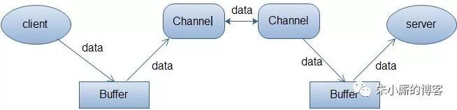

NIO与IO
--

# IO

- 面向流

- 阻塞

--

# NIO(Non-blocking I/O)

- 面向缓存

- 非阻塞

- selector可用单线程控制多通道

--

# 同步异步，阻塞与非阻塞

- 同步/异步关注的是消息通知的机制，而阻塞/非阻塞关注的是程序（线程）等待消息通知时的状态。

- 同步的实现方式会有两种：同步阻塞、同步非阻塞；同理，异步也会有两种实现：异步阻塞、异步非阻塞

    - 同步阻塞形式，专心排队，什么别的事都不做。实际程序中：就是未对fd 设置O_NONBLOCK标志位的read/write 操作

    - 异步阻塞，异步操作是可以被阻塞住的，只不过它不是在处理消息时阻塞，而是在等待消息通知时被阻塞。比如select 函数，假如传入的最后一个timeout参数为NULL，那么如果所关注的事件没有一个被触发，程序就会一直阻塞在这个select 调用处。

    - 同步非阻塞，程序需要在这两种不同的行为之间来回的切换，效率可想而知是低下的。很多人会写阻塞的read/write 操作，但是别忘了可以对fd设置O_NONBLOCK 标志位，这样就可以将同步操作变成非阻塞的了。

- 同步阻塞：小明一直盯着下载进度条，到 100% 的时候就完成。

    - 同步体现在：等待下载完成通知；

    - 阻塞体现在：等待下载完成通知过程中，不能做其他任务处理；

- 同步非阻塞：小明提交下载任务后就去干别的，每过一段时间就去瞄一眼进度条，看到 100% 就完成。

    - 同步体现在：等待下载完成通知；

    - 非阻塞体现在：等待下载完成通知过程中，去干别的任务了，只是时不时会瞄一眼进度条；【小明必须要在两个任务间切换，关注下载进度】

- 异步阻塞：小明换了个有下载完成通知功能的软件，下载完成就“叮”一声。不过小明仍然一直等待“叮”的声音（看起来很傻，不是吗）。

    - 异步体现在：下载完成“叮”一声通知；

    - 阻塞体现在：等待下载完成“叮”一声通知过程中，不能做其他任务处理；

- 异步非阻塞：仍然是那个会“叮”一声的下载软件，小明提交下载任务后就去干别的，听到“叮”的一声就知道完成了。

    - 异步体现在：下载完成“叮”一声通知；

    - 非阻塞体现在：等待下载完成“叮”一声通知过程中，去干别的任务了，只需要接收“叮”声通知即可；【软件处理下载任务，小明处理其他任务，不需关注进度，只需接收软件“叮”声通知，即可】

- 以socket.read()为例子：

    - 传统的BIO里面socket.read()，如果TCP RecvBuffer里没有数据，函数会一直阻塞，直到收到数据，返回读到的数据。

    - 对于NIO，如果TCP RecvBuffer有数据，就把数据从网卡读到内存，并且返回给用户；反之则直接返回0，永远不会阻塞。

    - 最新的AIO(Async I/O)里面会更进一步：不但等待就绪是非阻塞的，就连数据从网卡到内存的过程也是异步的。

    - 换句话说，BIO里用户最关心“我要读”，NIO里用户最关心”我可以读了”，在AIO模型里用户更需要关注的是“读完了”。

    - NIO一个重要的特点是：socket主要的读、写、注册和接收函数，在等待就绪阶段都是非阻塞的，真正的I/O操作是同步阻塞的（消耗CPU但性能非常高）。

--

# BIO模型，
之所以需要多线程，是因为在进行I/O操作的时候，一是没有办法知道到底能不能写、能不能读，只能”傻等”，即使通过各种估算，算出来操作系统没有能力进行读写，也没法在socket.read()和socket.write()函数中返回，这两个函数无法进行有效的中断。所以除了多开线程另起炉灶，没有好的办法利用CPU。NIO的读写函数可以立刻返回，这就给了我们不开线程利用CPU的最好机会：如果一个连接不能读写（socket.read()返回0或者socket.write()返回0），我们可以把这件事记下来，记录的方式通常是在Selector上注册标记位，然后切换到其它就绪的连接（channel）继续进行读写。

- Buffer顾名思义：缓冲区，实际上是一个容器，一个连续数组。Channel提供从文件、网络读取数据的渠道，但是读写的数据都必须经过Buffer。可以把Buffer简单地理解为一组基本数据类型的元素列表，它通过几个变量来保存这个数据的当前位置状态：capacity, position, limit, mark。

- channel.configureBlocking(false)，在非阻塞式信道上调用一个方法总是会立即返回。这种调用的返回值指示了所请求的操作完成的程度。例如，在一个非阻塞式ServerSocketChannel上调用accept()方法，如果有连接请求来了，则返回客户端SocketChannel，否则返回null。

- Service->ServerSocketChannel

    - 对于写操作，就是写不出去的时候对写事件感兴趣；

    - 对于读操作，就是完成连接和系统没有办法承载新读入的数据的时；

    - 对于accept，一般是服务器刚启动的时候；

    - 而对于connect，一般是connect失败需要重连或者直接异步调用connect的时候。

    - 其次，用一个死循环选择就绪的事件，会执行系统调用（Linux 2.6之前是select、poll，2.6之后是epoll，Windows是IOCP），还会阻塞的等待新事件的到来。新事件到来的时候，会在selector上注册标记位，标示可读、可写或者有连接到来。注意，select是阻塞的，无论是通过操作系统的通知（epoll）还是不停的轮询(select，poll)，这个函数是阻塞的。所以你可以放心大胆地在一个while(true)里面调用这个函数而不用担心CPU空转。

- Client->SocketChannel

    - SocketChannel

    - SocketChannel

    - 没有accept,读，写，connect也是对selector注册兴趣

    - 读写都是面向buffer，检查可读可写时读或写
    

