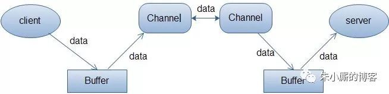
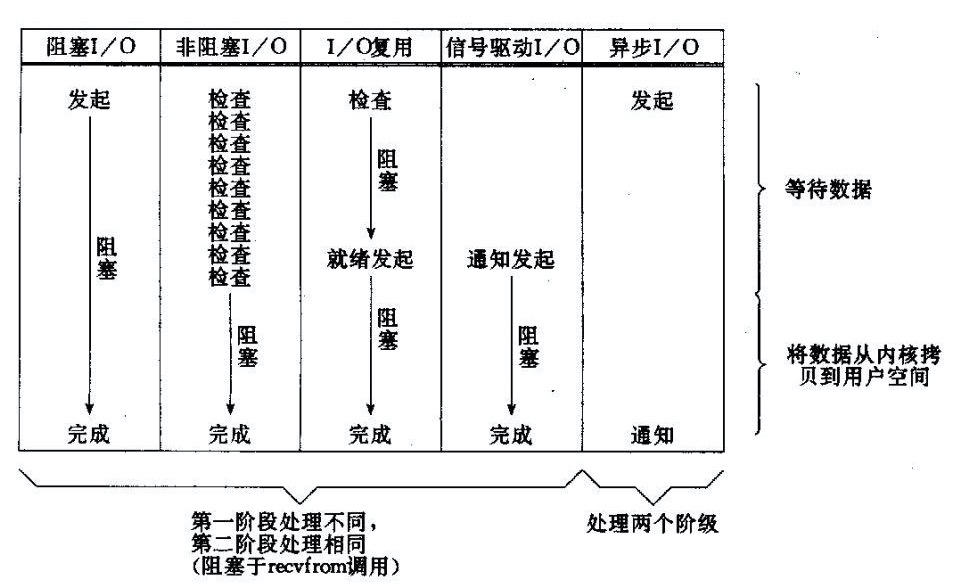

NIO与IO
--

# 同步/异步、阻塞/非阻塞

- 同步/异步关注的是**消息通知的机制**，阻塞/非阻塞关注的是**程序（线程）等待消息通知时的状态**。

- 同步的实现方式会有两种：同步阻塞、同步非阻塞；同理，异步也会有两种实现：异步阻塞、异步非阻塞。

    - 同步阻塞形式，专心排队，什么别的事都不做。实际程序中：就是未对 fd 设置 O_NONBLOCK 标志位的 read/write 操作。

    - 同步非阻塞，程序需要在这两种不同的行为之间来回的切换，效率可想而知是低下的。很多人会写阻塞的 read/write 操作，但是别忘了可以对 fd 设置 O_NONBLOCK 标志位，这样就可以将同步操作变成非阻塞的了。

    - 异步阻塞，异步操作是可以被阻塞住的，只不过它不是在处理消息时阻塞，而是在等待消息通知时被阻塞。比如 select 函数，假如传入的最后一个 timeout 参数为 NULL，那么如果所关注的事件没有一个被触发，程序就会一直阻塞在这个 select 调用处。

- 小明下载的例子：

    - 同步阻塞：小明一直盯着下载进度条，到 100% 的时候就完成。

        - 同步体现在：等待下载完成通知；

        - 阻塞体现在：等待下载完成通知过程中，不能做其他任务处理；

    - 同步非阻塞：小明提交下载任务后就去干别的，每过一段时间就去瞄一眼进度条，看到 100% 就完成。

        - 同步体现在：等待下载完成通知；

        - 非阻塞体现在：等待下载完成通知过程中，去干别的任务了，只是时不时会瞄一眼进度条；【小明必须要在两个任务间切换，关注下载进度】

    - 异步阻塞：小明换了个有下载完成通知功能的软件，下载完成就“叮”一声。不过小明仍然一直等待“叮”的声音（看起来很傻，不是吗）。

        - 异步体现在：下载完成“叮”一声通知；

        - 阻塞体现在：等待下载完成“叮”一声通知过程中，不能做其他任务处理；

    - 异步非阻塞：仍然是那个会“叮”一声的下载软件，小明提交下载任务后就去干别的，听到“叮”的一声就知道完成了。

        - 异步体现在：下载完成“叮”一声通知；

        - 非阻塞体现在：等待下载完成“叮”一声通知过程中，去干别的任务了，只需要接收“叮”声通知即可；【软件处理下载任务，小明处理其他任务，不需关注进度，只需接收软件“叮”声通知，即可】

--

# IO

- 面向流

- 阻塞

# NIO(Non-blocking I/O)

- 面向缓冲

- 非阻塞

- selector可用单线程控制多通道

# BIO、NIO、AIO 的关注点

- 以socket.read()为例子：

    - 传统的BIO里面socket.read()，如果TCP RecvBuffer里没有数据，函数会一直阻塞，直到收到数据，返回读到的数据。

    - 对于NIO，如果TCP RecvBuffer有数据，就把数据从网卡读到内存，并且返回给用户；反之则直接返回0，永远不会阻塞。

    - 最新的AIO(Async I/O)里面会更进一步：不但等待就绪是非阻塞的，就连数据从网卡到内存的过程也是异步的。

    - 换句话说，BIO里用户最关心“我要读”，NIO里用户最关心”我可以读了”，在AIO模型里用户更需要关注的是“读完了”。

    - NIO一个重要的特点是：socket主要的读、写、注册和接收函数，在等待就绪阶段都是非阻塞的，真正的I/O操作是同步阻塞的（消耗CPU但性能非常高）。

- BIO模型之所以需要多线程，是因为在进行I/O操作的时候，一是没有办法知道到底能不能写、能不能读，只能”傻等”，即使通过各种估算，算出来操作系统没有能力进行读写，也没法在socket.read()和socket.write()函数中返回，这两个函数无法进行有效的中断。所以除了多开线程另起炉灶，没有好的办法利用CPU。NIO的读写函数可以立刻返回，这就给了我们不开线程利用CPU的最好机会：如果一个连接不能读写（socket.read()返回0或者socket.write()返回0），我们可以把这件事记下来，记录的方式通常是在Selector上注册标记位，然后切换到其它就绪的连接（channel）继续进行读写。

# NIO 核心组件

- Buffer顾名思义：缓冲区，实际上是一个容器，一个连续数组。Channel提供从文件、网络读取数据的渠道，但是读写的数据都必须经过Buffer。可以把Buffer简单地理解为一组基本数据类型的元素列表，它通过几个变量来保存这个数据的当前位置状态：capacity, position, limit, mark。

- channel.configureBlocking(false)，在非阻塞式信道上调用一个方法总是会立即返回。这种调用的返回值指示了所请求的操作完成的程度。例如，在一个非阻塞式ServerSocketChannel上调用accept()方法，如果有连接请求来了，则返回客户端SocketChannel，否则返回null。

- Service->ServerSocketChannel

    - 对于写操作，就是写不出去的时候对写事件感兴趣；

    - 对于读操作，就是完成连接和系统没有办法承载新读入的数据的时；

    - 对于accept，一般是服务器刚启动的时候；

    - 而对于connect，一般是connect失败需要重连或者直接异步调用connect的时候。

    - 其次，用一个死循环选择就绪的事件，会执行系统调用（Linux 2.6之前是select、poll，2.6之后是epoll，Windows是IOCP），还会阻塞的等待新事件的到来。新事件到来的时候，会在selector上注册标记位，标示可读、可写或者有连接到来。注意，select是阻塞的，无论是通过操作系统的通知（epoll）还是不停的轮询(select，poll)，这个函数是阻塞的。所以你可以放心大胆地在一个while(true)里面调用这个函数而不用担心CPU空转。

- Client->SocketChannel

    - 没有accept,读，写，connect也是对selector注册兴趣

    - 读写都是面向buffer，检查可读可写时读或写
    

# 高频面试题

## 1. BIO、NIO、AIO 的区别？

答：

- **BIO（同步阻塞 IO）**：面向流，一个连接一个线程，`read()/write()` 没数据就一直阻塞。连接一多线程就爆炸：每个线程默认栈 1M，1 万个连接光栈内存就是 10G，加上频繁的上下文切换，系统直接垮掉（C10K 问题）。
- **NIO（同步非阻塞 IO）**：面向缓冲，三大组件 Buffer/Channel/Selector。`read()` 没数据立即返回 0，配合 Selector 多路复用，单线程就能管理成千上万个连接。注意"非阻塞"只是指**等待就绪**阶段，真正的数据拷贝阶段（内核→用户空间）仍然是同步的、由用户线程自己完成。
- **AIO（异步非阻塞 IO，NIO 2.0）**：发起读写立即返回，内核完成"数据就绪 + 拷贝"后通过回调（CompletionHandler）或 Future 通知，全程不阻塞。Windows 上由 IOCP 实现，Linux 上真正用得较少。

## 2. NIO 的三大核心组件？

答：

- **Buffer 缓冲区**：本质是一块连续内存数组，所有读写都必须经过它。四个状态变量：
    - `capacity` 容量（不变）、`position` 当前读写位置、`limit` 读写边界、`mark` 标记位；
    - `flip()`：limit 置为 position，position 归零，写模式 → 读模式；
    - `clear()`：position 归零，limit 置为 capacity，重新写入（数据并未真正清除，只是被"遗忘"）；
    - `rewind()`：position 归零，可重读。
- **Channel 通道**：双向的（流是单向的），可读可写。常见：FileChannel、SocketChannel、ServerSocketChannel、DatagramChannel。通过 `configureBlocking(false)` 设置为非阻塞。
- **Selector 多路复用器**：单线程向 Selector 注册多个 Channel，用 `select()` 监听就绪事件（OP_READ / OP_WRITE / OP_CONNECT / OP_ACCEPT）。select 本身是阻塞的，但一个线程能同时监控多个 Channel，所以不用为每个连接开线程。

## 3. select、poll、epoll 的区别？为什么 epoll 更高效？

答：

- **select**：fd 集合用 bitmap 存储，默认上限 1024（FD_SETSIZE）；每次调用都要把整个集合从用户态拷贝到内核态，内核再**遍历全部 fd** 检查是否就绪，O(n)；返回后用户还要再遍历一遍找出就绪的 fd。
- **poll**：改用链表存储 pollfd，没有 1024 数量限制，但仍然是"整体拷贝 + 全量遍历"，O(n)。
- **epoll**（Linux 2.6 之后）：**事件驱动**，三轮操作彻底改掉了 select/poll 的遍历模型：
    - `epoll_ctl` 把 fd 注册到内核的**红黑树**上，只注册一次、按需增删改，不用每次调用都拷贝全部 fd；
    - fd 就绪时通过**回调**把它挂到就绪链表上；
    - `epoll_wait` 只返回就绪链表里的 fd，没有就绪事件时进程休眠（等事件唤醒），O(1)；
    - 支持水平触发（LT，默认）和边缘触发（ET）。
- 一句话总结：select/poll 是"轮询"（每次都遍历全部 fd），epoll 是"通知"（只返回就绪的），连接数越大差距越明显。
- **Android 关联**：Looper/MessageQueue 的 native 层就是用 **epoll + eventfd** 实现"有消息立即唤醒、没消息休眠"的；NIO 的 Selector 在 Linux 上底层就是 epoll（macOS 是 kqueue，Windows 是 IOCP）。

## 4. 什么是零拷贝？怎么实现的？

答：

- **为什么需要**：传统 IO 读文件再发出去要 4 次拷贝（磁盘→内核缓冲 DMA、内核→用户 CPU、用户→socket 缓冲 CPU、socket→网卡 DMA）+ 4 次用户态/内核态切换，CPU 开销巨大。
- **零拷贝不是"零次拷贝"**，而是**尽量减少 CPU 参与的数据拷贝和上下文切换**，让数据尽量不经过用户空间。
- 两种主流实现：
    - **mmap + write**：把内核缓冲区映射到用户空间，少一次"内核→用户"拷贝（4 次变 3 次）；
    - **sendfile**：数据直接在内核态从文件缓冲区搬到 socket 缓冲区，全程不经过用户空间，配合 DMA scatter-gather 后只剩 2 次 DMA 拷贝，CPU 零参与，是真正意义的零拷贝。
- Java NIO 里：`FileChannel.transferTo/transferFrom` 底层就是 sendfile，`MappedByteBuffer` 底层是 mmap。
- **Android 关联**：Binder 的"一次拷贝"本质就是 mmap 的运用（见 Binder 笔记）；MMAP 在 Android 中还用于图片加载、高性能日志（如 xlog）等场景。

## 5. OkHttp 为什么不用 NIO，而是用 BIO + 线程池？

答：这是经典问题，OkHttp 作者 Jesse Wilson 的解释：

- **移动端用不上 NIO 的优势**：NIO 的价值是单线程管理海量连接（C10K），而移动端同时活跃的连接很少（一个 App 就几个），用 NIO 属于杀鸡用牛刀；
- **简单性**：BIO + 线程池模型代码直观、易调试，每个请求的生命周期清晰可见；NIO 的事件驱动模型要处理注册、取消注册、事件分发，复杂度高得多；
- **NIO 在移动端有历史坑**：早期 Android 版本的 Selector 实现有 bug（select 唤醒异常、需反复重新注册监听事件等），处理这些边界情况得不偿失；
- **并发能力不靠 IO 模型补**：OkHttp 通过连接池复用、以及 HTTP/2 单连接多路复用，弥补了 BIO 的并发短板。
- 反过来，服务端（Netty、Nginx、Redis 的场景）连接数动辄十万百万，才必须上 NIO/epoll。

## 6. 什么是 C10K 问题？怎么解决？

答：

- **C10K** 指单机同时维持 1 万个客户端连接的问题：BIO 一线程一连接，1 万连接 = 1 万线程，栈内存（默认 1M/线程）+ 上下文切换开销直接击穿系统。
- **解决思路**：IO 多路复用（select → poll → epoll）+ 少量线程的事件循环（Reactor 模型），一个线程同时管理成千上万个连接，连接有事件才处理。
- 代表实现：Nginx、Redis、Netty。C10K 解决后又出现 C100K/C1000K，演进方向是多核并行 + 更高效的 epoll 用法（如 ET 模式、多进程监听同一端口 SO_REUSEPORT）。

## 7. Unix 五种 IO 模型分别是什么？

答（《Unix 网络编程》的五种模型，按同步程度递进）：

- **阻塞 IO**：`recvfrom` 一直阻塞，直到数据就绪并拷贝完成（BIO）；
- **非阻塞 IO**：立即返回，没数据返回错误码（EWOULDBLOCK），进程自己轮询，忙等浪费 CPU；
- **IO 多路复用**：阻塞在 select/poll/epoll 上，同时监听多个 fd，就绪后逐个 read（数据拷贝阶段仍是同步的）；
- **信号驱动 IO**：注册 SIGIO 信号，内核在数据**就绪**时发信号通知，进程在信号处理函数里 read；
- **异步 IO**：`aio_read` 立即返回，内核完成"就绪 + 拷贝"后通过信号/回调通知，全程不阻塞。
- **核心结论**：前四种在数据拷贝阶段都需要进程亲自参与，本质都是**同步 IO**；只有第五种是真正的**异步 IO**。面试里常说的 BIO/NIO/多路复用，都属于同步 IO 范畴。

    

## 8. DirectBuffer（直接内存）和 HeapBuffer 的区别？

答：

- **HeapBuffer**：分配在 JVM 堆上，受 GC 管理；但 IO 时数据要先拷贝到堆外临时缓冲区才能交给内核（多一次拷贝）。
- **DirectBuffer**：分配在**堆外（native 内存）**，内核可直接读写，少一次拷贝，是零拷贝的基础；但分配销毁慢、回收依赖 Cleaner 机制（不随 GC 立即可回收）、不受 -Xmx 管控（受 MaxDirectMemorySize 限制），滥用会导致 native OOM。
- **选择**：大块数据、频繁读写、生命周期长的用 Direct（如 Netty 的高性能 IO）；小块数据、频繁创建销毁的用 Heap。
- **Android 关联**：排查 OOM 时不能只看 Java 堆，native 内存（Bitmap 大图、DirectBuffer）也要重点关注。
