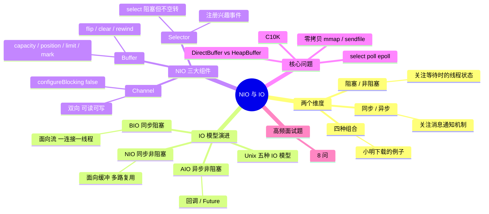
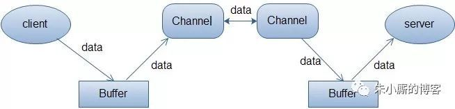
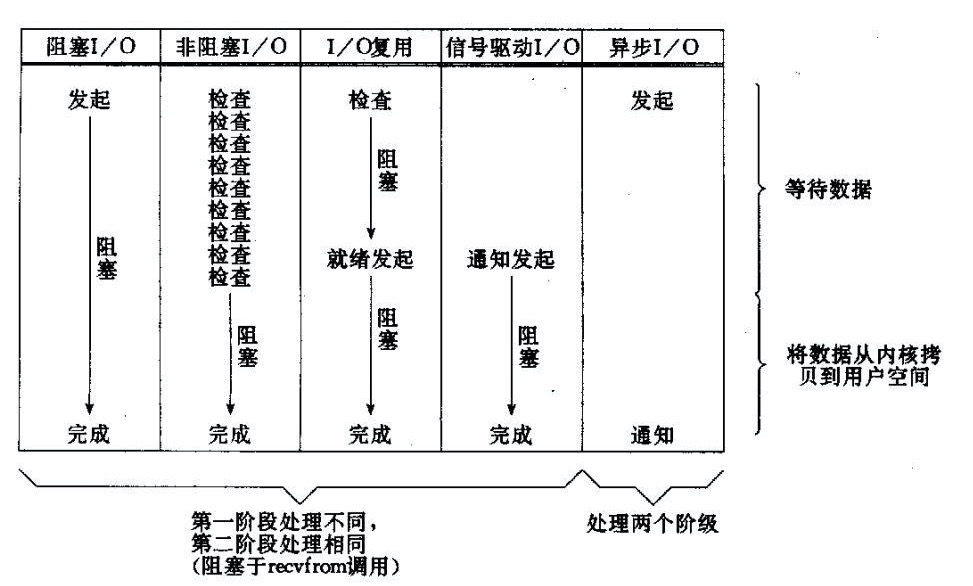

# NIO 与 IO

```mermaid
mindmap
  root((NIO 与 IO))
    两个维度
      同步 / 异步
        关注消息通知机制
      阻塞 / 非阻塞
        关注等待时的线程状态
      四种组合
        小明下载的例子
    IO 模型演进
      BIO 同步阻塞
        面向流 一连接一线程
      NIO 同步非阻塞
        面向缓冲 多路复用
      AIO 异步非阻塞
        回调 / Future
      Unix 五种 IO 模型
    NIO 三大组件
      Buffer
        capacity / position / limit / mark
        flip / clear / rewind
      Channel
        双向 可读可写
        configureBlocking false
      Selector
        注册兴趣事件
        select 阻塞但不空转
    核心问题
      零拷贝 mmap / sendfile
      select poll epoll
      C10K
      DirectBuffer vs HeapBuffer
    高频面试题
      8 问
```

---

## 一、同步/异步、阻塞/非阻塞

- **同步/异步**关注的是**消息通知的机制**，**阻塞/非阻塞**关注的是**程序（线程）等待消息通知时的状态**。
- 同步的实现方式有两种：同步阻塞、同步非阻塞；同理，异步也有两种实现：异步阻塞、异步非阻塞。

| 组合 | 程序行为 | 典型例子 |
| --- | --- | --- |
| 同步阻塞 | 专心排队，什么别的事都不做 | 未对 fd 设置 `O_NONBLOCK` 的 read/write 操作 |
| 同步非阻塞 | 在两种行为之间来回切换，效率低 | 对 fd 设置 `O_NONBLOCK` 后轮询 |
| 异步阻塞 | 阻塞不是在处理消息时，而是在等待消息通知时 | `select` 的 timeout 传 NULL，所关注事件一个都没触发时一直阻塞在 select 调用处 |
| 异步非阻塞 | 提交后去干别的，收到通知再处理 | IOCP / AIO 回调 |

**小明下载的例子**（四种组合的实际体感）：

1. **同步阻塞**：小明一直盯着下载进度条，到 100% 就完成。
   - 同步体现在：等待下载完成通知；
   - 阻塞体现在：等待通知过程中，不能做其他任务处理。
2. **同步非阻塞**：小明提交下载任务后就去干别的，每过一段时间瞄一眼进度条，看到 100% 就完成。
   - 同步体现在：等待下载完成通知；
   - 非阻塞体现在：等待过程中去干别的了，只是时不时瞄一眼；【小明必须在两个任务间切换，关注下载进度】
3. **异步阻塞**：小明换了个有下载完成通知功能的软件，下载完成就"叮"一声，不过小明仍然一直等待"叮"的声音（看起来很傻）。
   - 异步体现在：下载完成"叮"一声通知；
   - 阻塞体现在：等待通知过程中，不能做其他任务处理。
4. **异步非阻塞**：仍然是会"叮"一声的下载软件，小明提交下载任务后就去干别的，听到"叮"就知道完成了。
   - 异步体现在：下载完成"叮"一声通知；
   - 非阻塞体现在：等待通知过程中去干别的了，只需接收"叮"声通知；【软件处理下载任务，小明处理其他任务，不需关注进度】

---

## 二、BIO、NIO、AIO

### 1. 三种模型关注点（以 socket.read() 为例）

1. **BIO**：传统的 `socket.read()` 如果 TCP RecvBuffer 里没有数据，函数会一直阻塞，直到收到数据，返回读到的数据；对应地，IO 面向流、阻塞。
2. **NIO**：如果 TCP RecvBuffer 有数据，就把数据从网卡读到内存并返回给用户；反之直接返回 0，**永远不会阻塞**。IO 面向缓冲、非阻塞，Selector 可用单线程控制多通道。
3. **AIO**：更进一步，不但等待就绪是非阻塞的，连数据从网卡到内存的过程也是异步的。
4. 换句话说：**BIO 里用户最关心"我要读"，NIO 里用户最关心"我可以读了"，AIO 模型里用户更需要关注"读完了"。**
5. NIO 一个重要特点：socket 主要的读、写、注册和接收函数，在**等待就绪阶段**都是非阻塞的，**真正的 I/O 操作是同步阻塞的**（消耗 CPU 但性能非常高）。

三种模型的对照：

| 模型 | 面向 | 阻塞性 | 线程模型 | 代表实现 |
| --- | --- | --- | --- | --- |
| BIO | 流 | 同步阻塞 | 一连接一线程 | `Socket` + 线程池 |
| NIO | 缓冲 | 同步非阻塞 | 多路复用，少量线程管理海量连接 | Selector（Linux 底层 epoll） |
| AIO | 缓冲 | 异步非阻塞 | 内核完成后回调 | IOCP（Windows）、io_uring |

### 2. BIO 为什么需要多线程？NIO 的机会在哪？

- BIO 在进行 I/O 操作时，一是没有办法知道到底能不能写、能不能读，只能"傻等"；即使通过各种估算算出操作系统没有能力读写，也没法在 `socket.read()` 和 `socket.write()` 中返回——这两个函数**无法有效中断**。所以除了多开线程另起炉灶，没有好的办法利用 CPU。
- NIO 的读写函数可以立刻返回，这就给了我们**不开线程利用 CPU** 的最好机会：如果一个连接不能读写（`read()`/`write()` 返回 0），就把这件事记下来——记录方式通常是在 **Selector 上注册标记位**，然后切换到其它就绪的连接（Channel）继续读写。

---

## 三、NIO 三大核心组件

### 1. Buffer 缓冲区

- 本质是一块**连续内存数组**，Channel 从文件、网络读取的数据都必须经过 Buffer。
- 可以理解为一组基本数据类型的元素列表，通过 `capacity`（容量，不变）、`position`（当前读写位置）、`limit`（读写边界）、`mark`（标记位）保存数据的当前位置状态。
- 常用操作：`flip()` 写模式转读模式、`clear()` 重新写入、`rewind()` 重读（详见面试题第 2 问）。

### 2. Channel 通道

- 提供从文件、网络读取数据的渠道，读写的数据都必须经过 Buffer。
- `channel.configureBlocking(false)` 后，在非阻塞式信道上调用方法**总是立即返回**，返回值指示所请求操作的完成程度。例如在非阻塞式 `ServerSocketChannel` 上调用 `accept()`：有连接请求就返回客户端 `SocketChannel`，否则返回 null。

### 3. Selector 多路复用器

**服务端 ServerSocketChannel 关注的时机：**

- 写操作：写不出去的时候对写事件感兴趣；
- 读操作：完成连接、以及系统没有办法承载新读入的数据时；
- accept：一般是服务器刚启动的时候；
- connect：一般是 connect 失败需要重连、或直接异步调用 connect 的时候。

**客户端 SocketChannel：** 没有 accept，读、写、connect 也是对 Selector 注册兴趣；读写都面向 Buffer，检查可读可写时再读或写。

**事件循环：**

- 用一个死循环选择就绪的事件，会执行系统调用（Linux 2.6 之前是 select、poll，2.6 之后是 epoll，Windows 是 IOCP），并阻塞等待新事件到来。
- 新事件到来时，在 Selector 上注册标记位，标示可读、可写或者有连接到来。
- 注意：select 是阻塞的，无论是通过操作系统的通知（epoll）还是不停地轮询（select、poll），这个函数都是阻塞的——所以可以放心大胆地在 `while(true)` 里调用它，而不用担心 CPU 空转。

---

## 四、高频面试题

### 1. BIO、NIO、AIO 的区别？

- **BIO（同步阻塞 IO）**：面向流，一个连接一个线程，`read()/write()` 没数据就一直阻塞。连接一多线程就爆炸：每个线程默认栈 1M，1 万个连接光栈内存就是 10G，加上频繁的上下文切换，系统直接垮掉（C10K 问题）。
- **NIO（同步非阻塞 IO）**：面向缓冲，三大组件 Buffer/Channel/Selector。`read()` 没数据立即返回 0，配合 Selector 多路复用，单线程就能管理成千上万个连接。注意"非阻塞"只是指**等待就绪**阶段，真正的数据拷贝阶段（内核→用户空间）仍然是同步的、由用户线程自己完成。
- **AIO（异步非阻塞 IO，NIO 2.0）**：发起读写立即返回，内核完成"数据就绪 + 拷贝"后通过回调（CompletionHandler）或 Future 通知，全程不阻塞。Windows 上由 IOCP 实现，Linux 上真正用得较少。

### 2. NIO 的三大核心组件？

- **Buffer 缓冲区**：本质是一块连续内存数组，所有读写都必须经过它。四个状态变量：
  - `capacity` 容量（不变）、`position` 当前读写位置、`limit` 读写边界、`mark` 标记位；
  - `flip()`：limit 置为 position，position 归零，写模式 → 读模式；
  - `clear()`：position 归零，limit 置为 capacity，重新写入（数据并未真正清除，只是被"遗忘"）；
  - `rewind()`：position 归零，可重读。
- **Channel 通道**：双向的（流是单向的），可读可写。常见：FileChannel、SocketChannel、ServerSocketChannel、DatagramChannel。通过 `configureBlocking(false)` 设置为非阻塞。
- **Selector 多路复用器**：单线程向 Selector 注册多个 Channel，用 `select()` 监听就绪事件（OP_READ / OP_WRITE / OP_CONNECT / OP_ACCEPT）。select 本身是阻塞的，但一个线程能同时监控多个 Channel，所以不用为每个连接开线程。

### 3. select、poll、epoll 的区别？为什么 epoll 更高效？

- **select**：fd 集合用 bitmap 存储，默认上限 1024（FD_SETSIZE）；每次调用都要把整个集合从用户态拷贝到内核态，内核再**遍历全部 fd** 检查是否就绪，O(n)；返回后用户还要再遍历一遍找出就绪的 fd。
- **poll**：改用链表存储 pollfd，没有 1024 数量限制，但仍然是"整体拷贝 + 全量遍历"，O(n)。
- **epoll**（Linux 2.6 之后）：**事件驱动**，三轮操作彻底改掉了 select/poll 的遍历模型：
  - `epoll_ctl` 把 fd 注册到内核的**红黑树**上，只注册一次、按需增删改，不用每次调用都拷贝全部 fd；
  - fd 就绪时通过**回调**把它挂到就绪链表上；
  - `epoll_wait` 只返回就绪链表里的 fd，没有就绪事件时进程休眠（等事件唤醒），O(1)；
  - 支持水平触发（LT，默认）和边缘触发（ET）。
- 一句话总结：select/poll 是"轮询"（每次都遍历全部 fd），epoll 是"通知"（只返回就绪的），连接数越大差距越明显。
- **Android 关联**：Looper/MessageQueue 的 native 层就是用 **epoll + eventfd** 实现"有消息立即唤醒、没消息休眠"的；NIO 的 Selector 在 Linux 上底层就是 epoll（macOS 是 kqueue，Windows 是 IOCP）。

### 4. 什么是零拷贝？怎么实现的？

- **为什么需要**：传统 IO 读文件再发出去要 4 次拷贝（磁盘→内核缓冲 DMA、内核→用户 CPU、用户→socket 缓冲 CPU、socket→网卡 DMA）+ 4 次用户态/内核态切换，CPU 开销巨大。
- **零拷贝不是"零次拷贝"**，而是**尽量减少 CPU 参与的数据拷贝和上下文切换**，让数据尽量不经过用户空间。
- 两种主流实现：
  - **mmap + write**：把内核缓冲区映射到用户空间，少一次"内核→用户"拷贝（4 次变 3 次）；
  - **sendfile**：数据直接在内核态从文件缓冲区搬到 socket 缓冲区，全程不经过用户空间，配合 DMA scatter-gather 后只剩 2 次 DMA 拷贝，CPU 零参与，是真正意义的零拷贝。
- Java NIO 里：`FileChannel.transferTo/transferFrom` 底层就是 sendfile，`MappedByteBuffer` 底层是 mmap。
- **Android 关联**：Binder 的"一次拷贝"本质就是 mmap 的运用（见 Binder 笔记）；MMAP 在 Android 中还用于图片加载、高性能日志（如 xlog）等场景。

### 5. OkHttp 为什么不用 NIO，而是用 BIO + 线程池？

这是经典问题，OkHttp 作者 Jesse Wilson 的解释：

- **移动端用不上 NIO 的优势**：NIO 的价值是单线程管理海量连接（C10K），而移动端同时活跃的连接很少（一个 App 就几个），用 NIO 属于杀鸡用牛刀；
- **简单性**：BIO + 线程池模型代码直观、易调试，每个请求的生命周期清晰可见；NIO 的事件驱动模型要处理注册、取消注册、事件分发，复杂度高得多；
- **NIO 在移动端有历史坑**：早期 Android 版本的 Selector 实现有 bug（select 唤醒异常、需反复重新注册监听事件等），处理这些边界情况得不偿失；
- **并发能力不靠 IO 模型补**：OkHttp 通过连接池复用、以及 HTTP/2 单连接多路复用，弥补了 BIO 的并发短板。
- 反过来，服务端（Netty、Nginx、Redis 的场景）连接数动辄十万百万，才必须上 NIO/epoll。

### 6. 什么是 C10K 问题？怎么解决？

- **C10K** 指单机同时维持 1 万个客户端连接的问题：BIO 一线程一连接，1 万连接 = 1 万线程，栈内存（默认 1M/线程）+ 上下文切换开销直接击穿系统。
- **解决思路**：IO 多路复用（select → poll → epoll）+ 少量线程的事件循环（Reactor 模型），一个线程同时管理成千上万个连接，连接有事件才处理。
- 代表实现：Nginx、Redis、Netty。C10K 解决后又出现 C100K/C1000K，演进方向是多核并行 + 更高效的 epoll 用法（如 ET 模式、多进程监听同一端口 SO_REUSEPORT）。

### 7. Unix 五种 IO 模型分别是什么？

答（《Unix 网络编程》的五种模型，按同步程度递进）：

- **阻塞 IO**：`recvfrom` 一直阻塞，直到数据就绪并拷贝完成（BIO）；
- **非阻塞 IO**：立即返回，没数据返回错误码（EWOULDBLOCK），进程自己轮询，忙等浪费 CPU；
- **IO 多路复用**：阻塞在 select/poll/epoll 上，同时监听多个 fd，就绪后逐个 read（数据拷贝阶段仍是同步的）；
- **信号驱动 IO**：注册 SIGIO 信号，内核在数据**就绪**时发信号通知，进程在信号处理函数里 read；
- **异步 IO**：`aio_read` 立即返回，内核完成"就绪 + 拷贝"后通过信号/回调通知，全程不阻塞。
- **核心结论**：前四种在数据拷贝阶段都需要进程亲自参与，本质都是**同步 IO**；只有第五种是真正的**异步 IO**。面试里常说的 BIO/NIO/多路复用，都属于同步 IO 范畴。

### 8. DirectBuffer（直接内存）和 HeapBuffer 的区别？

- **HeapBuffer**：分配在 JVM 堆上，受 GC 管理；但 IO 时数据要先拷贝到堆外临时缓冲区才能交给内核（多一次拷贝）。
- **DirectBuffer**：分配在**堆外（native 内存）**，内核可直接读写，少一次拷贝，是零拷贝的基础；但分配销毁慢、回收依赖 Cleaner 机制（不随 GC 立即可回收）、不受 -Xmx 管控（受 MaxDirectMemorySize 限制），滥用会导致 native OOM。
- **选择**：大块数据、频繁读写、生命周期长的用 Direct（如 Netty 的高性能 IO）；小块数据、频繁创建销毁的用 Heap。
- **Android 关联**：排查 OOM 时不能只看 Java 堆，native 内存（Bitmap 大图、DirectBuffer）也要重点关注。

---

## 五、30 秒口述版

同步/异步描述的是消息通知机制，阻塞/非阻塞描述的是等待通知时线程的状态，两两组合出四种模型。IO 演进从 BIO 的"一连接一线程、read 傻等"，到 NIO 的"面向缓冲、read 立即返回 + Selector 多路复用"，再到 AIO 的"内核完成拷贝后回调"。NIO 的非阻塞只发生在**等待就绪**阶段，数据拷贝仍是同步的；底层靠 epoll 把 O(n) 轮询变成 O(1) 事件通知，这也是 Handler 机制 nativePollOnce 的同一套基础设施。
