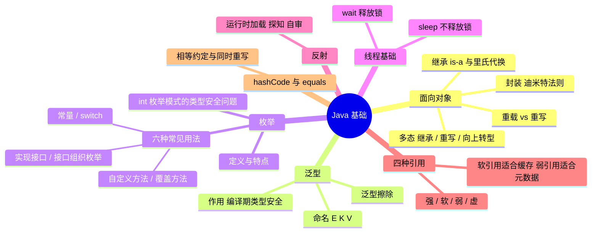

# Java 基础：面向对象、泛型、枚举与引用



---

## 一、对抽象、继承、多态的理解

- **封装**：隐藏模块内部实现，只对外暴露必要的接口行为；模块使用者对该模块的其他信息知道得越少越好（迪米特法则）。
- **继承**：is-a 关系，子类复用并扩展父类。判断继承是否合理的标准是**里氏代换原则**——任何父类出现的地方，子类都应该能够出现。滥用继承会带来方法污染和方法爆炸，扩展类能力时提倡**组合优先**，而不是继承。
- **多态**：父类引用指向子类对象，方法调用在运行期才确定执行哪个实现。发生的三个必要条件：**继承、方法重写、向上转型**。
- **重载 vs 重写**：
  - 重载（Overload）：同一个类中方法名相同、参数列表不同，**编译期**决定调用哪个方法；
  - 重写（Override）：父子类之间方法签名相同，**运行期**动态绑定到子类实现。

---

## 二、泛型的作用及使用场景

Java 泛型是 JDK 1.5 版本开始引入的一个概念，它可以将 Java 类型抽象，提供了**编译时类型安全检测机制**，允许程序员在编译时检测到非法的数据类型。

### 1. 为什么需要泛型

不使用泛型时：

```java
public static void main(String[] args){
    //不使用泛型
    List listA=new ArrayList();
    listA.add(2);
    listA.add("a");
    int temp0=(int)listA.get(0);
    int temp1=(int)listA.get(1);
}
```

当从 list 中取值时，取出来的所有元素都是 Object 类型，需要通过类型转换强行转成自己所需的类型；但由于此时值类型并不匹配，无法将 String 类型转换成 int，因此该方法会抛出 **ClassCastException** 异常。为了避免这种情况的发生、提早发现问题，我们需要在使用时加上泛型：

```java
public static void main(String[] args){
    //使用泛型
    List<Integer> listA= new ArrayList<Integer>();
    listA.add(1);
    //listA.add("a");//提示编译错误
    int temp1=listA.get(0);
}
```

以上的例子就是泛型作用最大的体现。假设没有泛型，当我们需要调用同一个方法返回多种不同类型的结果对象时，由于 return 语句只能返回单个对象，我们只能创建一个对象、用这个对象包含所有需要返回的对象；亦或者是 return 一个父类，所有返回的类型都必须继承自这个父类。但这两种方法都会有一堆问题，而泛型帮我们解决了这些问题，同时，通过泛型我们还可以保证在**编译期**就可以确保类型安全。

### 2. 泛型种类与命名

泛型命名时通常使用单个的大写字母，例如 E（Element，表示元素），Map 中时常使用的 K（Key）、V（Value）等。

### 3. 泛型擦除

Java 中泛型类型是作为第二类类型处理的，只有在静态类型检查期间才出现，在此之后，程序中的所有泛型类型都将被擦除，替换为它们的非泛型边界。例如 `List<Integer>` 这样的将被擦除为 `List`，而普通的类型变量在未指定边界的情况下将被擦除成 Object。通过一个小例子直观感受下什么是泛型的擦除：

```java
public static void main(String[] args){
    List<Integer> list1=new ArrayList<Integer>();
    List<String> list2 =new ArrayList<String>();
    System.out.println(list1.getClass().equals(list2.getClass()));//结果为true
}
```

---

## 三、枚举的特点及使用场景

枚举跟表示一组常量的最大的区别就是**拥有类的属性**。

### 1. 背景：int 枚举模式的类型安全问题

在 Java 语言中还没有引入枚举类型之前，表示枚举类型的常用模式是声明一组 int 常量。通常利用 public final static 方法定义，分别用 1 表示春天，2 表示夏天，3 表示秋天，4 表示冬天：

```java
public class Season {
    public static final int SPRING = 1;
    public static final int SUMMER = 2;
    public static final int AUTUMN = 3;
    public static final int WINTER = 4;
}
```

这种方法称作 **int 枚举模式**。它有什么问题呢？通常我们写出来的代码都会考虑它的安全性、易用性和可读性，首先来考虑类型安全性——这种模式**不是类型安全的**。比如说我们设计一个函数，要求传入春夏秋冬的某个值，但是使用 int 类型，我们无法保证传入的值为合法：

```java
private String getChineseSeason(int season){
    StringBuffer result = new StringBuffer();
    switch(season){
        case Season.SPRING :
            result.append("春天");
            break;
        case Season.SUMMER :
            result.append("夏天");
            break;
        case Season.AUTUMN :
            result.append("秋天");
            break;
        case Season.WINTER :
            result.append("冬天");
            break;
        default :
            result.append("地球没有的季节");
            break;
    }
    return result.toString();
}

public void doSomething(){
    System.out.println(this.getChineseSeason(Season.SPRING));//这是正常的场景

    System.out.println(this.getChineseSeason(5));//这个却是不正常的场景，这就导致了类型不安全问题
}
```

`getChineseSeason(Season.SPRING)` 是我们预期的使用方法，可 `getChineseSeason(5)` 显然就不是了，而且编译很通过，在运行时会出现什么情况，我们就不得而知了。这显然不符合 Java 程序的类型安全。

### 2. 定义

枚举类型（enum type）是指**由一组固定的常量组成合法的类型**。Java 中由关键字 enum 来定义一个枚举类型：

```java
public enum Season {
    SPRING, SUMMER, AUTUMN, WINER;
}
```

### 3. 特点

Java 定义枚举类型的语句很简约，它有以下特点：

1. 使用关键字 enum；
2. 类型名称，比如这里的 Season；
3. 一串允许的值，比如上面定义的春夏秋冬四季；
4. 枚举可以单独定义在一个文件中，也可以嵌在其它 Java 类中；
5. 枚举可以实现一个或多个接口（Interface）；
6. 可以定义新的变量；
7. 可以定义新的方法；
8. 可以定义根据具体枚举值而相异的类。

### 4. 应用场景：用枚举保证类型安全

以在背景中提到的类型安全为例，用枚举类型重写那段代码：

```java
public enum Season {
SPRING(1), SUMMER(2), AUTUMN(3), WINTER(4);

private int code;
private Season(int code){
    this.code = code;
}

public int getCode(){
    return code;
}
}
public class UseSeason {
/**
* 将英文的季节转换成中文季节
 * @param season
 * @return
 */
public String getChineseSeason(Season season){
    StringBuffer result = new StringBuffer();
    switch(season){
        case SPRING :
            result.append("[中文：春天，枚举常量:" + season.name() + "，数据:" + season.getCode() + "]");
            break;
        case AUTUMN :
            result.append("[中文：秋天，枚举常量:" + season.name() + "，数据:" + season.getCode() + "]");
            break;
        case SUMMER :
            result.append("[中文：夏天，枚举常量:" + season.name() + "，数据:" + season.getCode() + "]");
            break;
        case WINTER :
            result.append("[中文：冬天，枚举常量:" + season.name() + "，数据:" + season.getCode() + "]");
            break;
        default :
            result.append("地球没有的季节 " + season.name());
            break;
    }
    return result.toString();
}

public void doSomething(){
    for(Season s : Season.values()){
        System.out.println(getChineseSeason(s));//这是正常的场景
    }
    //System.out.println(getChineseSeason(5));
    //此处已经是编译不通过了，这就保证了类型安全
}

public static void main(String[] arg){
    UseSeason useSeason = new UseSeason();
    useSeason.doSomething();
}
}
```

```text
[中文：春天，枚举常量:SPRING，数据:1] [中文：夏天，枚举常量:SUMMER，数据:2] [中文：秋天，枚举常量:AUTUMN，数据:3] [中文：冬天，枚举常量:WINTER，数据:4]
```

这里有一个问题，为什么我要将域添加到枚举类型中呢？目的是想将**数据与它的常量关联起来**。如 1 代表春天，2 代表夏天。

### 5. 常见用法

#### 用法一：常量

```java
public enum Color {
    RED, GREEN, BLANK, YELLOW
}
```

#### 用法二：switch

```java
enum Signal {
    GREEN, YELLOW, RED
}
public class TrafficLight {
Signal color = Signal.RED;
public void change() {
    switch (color) {
    case RED:
        color = Signal.GREEN;
        break;
    case YELLOW:
        color = Signal.RED;
        break;
    case GREEN:
        color = Signal.YELLOW;
        break;
    }
}
}
```

#### 用法三：向枚举中添加新方法

```java
public enum Color {
RED("红色", 1), GREEN("绿色", 2), BLANK("白色", 3), YELLO("黄色", 4);
// 成员变量
private String name;
private int index;
// 构造方法
private Color(String name, int index) {
    this.name = name;
    this.index = index;
}
// 普通方法
public static String getName(int index) {
    for (Color c : Color.values()) {
        if (c.getIndex() == index) {
            return c.name;
        }
    }
    return null;
}
// get set 方法
public String getName() {
    return name;
}
public void setName(String name) {
    this.name = name;
}
public int getIndex() {
    return index;
}
public void setIndex(int index) {
    this.index = index;
}
}
```

#### 用法四：覆盖枚举的方法

```java
public enum Color {
RED("红色", 1), GREEN("绿色", 2), BLANK("白色", 3), YELLO("黄色", 4);
// 成员变量
private String name;
private int index;
// 构造方法
private Color(String name, int index) {
    this.name = name;
    this.index = index;
}
//覆盖方法
@Override
public String toString() {
    return this.index+"_"+this.name;
}
}
```

#### 用法五：实现接口

```java
public interface Behaviour {
void print();
String getInfo();
}
public enum Color implements Behaviour{
RED("红色", 1), GREEN("绿色", 2), BLANK("白色", 3), YELLO("黄色", 4);
// 成员变量
private String name;
private int index;
// 构造方法
private Color(String name, int index) {
    this.name = name;
    this.index = index;
}
//接口方法
@Override
public String getInfo() {
    return this.name;
}
//接口方法
@Override
public void print() {
    System.out.println(this.index+":"+this.name);
}
}
```

#### 用法六：使用接口组织枚举

```java
public interface Food {
enum Coffee implements Food{
    BLACK_COFFEE,DECAF_COFFEE,LATTE,CAPPUCCINO
}
enum Dessert implements Food{
    FRUIT, CAKE, GELATO
}
}
```

---

## 四、线程 sleep 和 wait 的区别

### 1. sleep() 方法

- `sleep()` 使当前线程进入停滞状态（阻塞当前线程），让出 CPU 的使用，目的是不让当前线程独自霸占该进程所获的 CPU 资源，以留一定时间给其他线程执行的机会。
- `sleep()` 是 **Thread 类的静态方法**，因此它**不能释放对象锁**。所以当在一个 synchronized 块中调用 sleep() 方法时，线程虽然休眠了，但是对象锁没有被释放，其他线程无法访问这个对象（即使睡着也持有对象锁）。
- 在 sleep() 休眠时间期满后，该线程不一定会立即执行，这是因为其它线程可能正在运行而且没有被调度为放弃执行，除非此线程具有更高的优先级。

### 2. wait() 方法

- `wait()` 方法是 **Object 类里的方法**。当一个线程执行到 wait() 方法时，它就进入到一个和该对象相关的**等待池**中，同时**释放了对象锁**（暂时失去对象锁，wait(long timeout) 超时时间到后还需要重新竞争对象锁），其他线程可以访问。
- `wait()` 使用 notify 或者 notifyAll 或者指定睡眠时间来唤醒当前等待池中的线程。
- `wait()` 必须放在 synchronized block 中，否则会在 program runtime 时抛出 `java.lang.IllegalMonitorStateException` 异常。

### 3. 最大区别

- **sleep() 睡眠时，保持对象锁，仍然占有该锁；**
- **wait() 睡眠时，释放对象锁。**

但是 wait() 和 sleep() 都可以通过 `interrupt()` 方法打断线程的暂停状态，从而使线程立刻抛出 InterruptedException（但不建议使用该方法）。

---

## 五、JAVA 反射机制

要让 Java 程序能够运行，就得让 Java 类被 Java 虚拟机加载。Java 类如果不被 Java 虚拟机加载就不能正常运行。正常情况下，我们运行的所有的程序在编译期时候就已经把那个类加载了。

Java 的反射机制是在编译时并不确定是哪个类被加载了，而是在**程序运行的时候才加载、探知、自审**，使用的是在编译期并不知道的类。这样的编译特点就是 Java 反射。

- 典型用途：框架在运行时根据配置/注解动态加载类、调用方法（如依赖注入、序列化框架）；
- 代价：绕过编译期检查，且方法调用等操作通常比直接调用有更大的性能开销。

---

## 六、weak/soft/strong 引用的区别

Java 中有如下四种类型的引用：

* 强引用（Strong Reference）
* 弱引用（WeakReference）
* 软引用（SoftReference）
* 虚引用（PhantomReference）

### 1. 强引用

强引用是我们在编程过程中使用的最简单的引用，如代码 `String s="abc"` 中变量 s 就是字符串对象 "abc" 的一个强引用。任何被强引用指向的对象都不能被垃圾回收器回收，这些对象都是在程序中需要的。

### 2. 弱引用

弱引用使用 `java.lang.ref.WeakReference` 类来表示，你可以使用如下代码创建弱引用：

```java
Counter counter = new Counter(); // strong reference - line 1
WeakReference<Counter> weakCounter = new WeakReference<Counter>(counter); //weak reference
counter = null; // now Counter object is eligible for garbage collection
```

现在只要你给强引用对象 counter 赋空值 null，该对象就可以被垃圾回收器回收。因为该对象此时不再含有其他强引用，即使指向该对象的弱引用 weakCounter 也无法阻止垃圾回收器对该对象的回收。

### 3. 软引用

相反的，如果该对象含有软引用，Counter 对象不会立即被回收，**除非 JVM 需要内存**。Java 中的软引用使用 `java.lang.ref.SoftReference` 类来表示：

```java
Counter prime = new Counter(); // prime holds a strong reference – line 2
SoftReference soft = new SoftReference(prime) ; //soft reference variable has SoftReference to Counter Object created at line 2
prime = null; // now Counter object is eligible for garbage collection but only be collected when JVM absolutely needs memory
```

强引用置空之后，代码的第二行为对象 Counter 创建了一个软引用，该引用同样不能阻止垃圾回收器回收对象，但是可以**延迟回收**，与弱引用中急切回收对象不同。鉴于软引用和弱引用的这一区别，**软引用更适用于缓存机制，而弱引用更适用于存贮元数据**。

另一个使用弱引用的例子是 **WeakHashMap**，它是除 HashMap 和 TreeMap 之外，Map 接口的另一种实现。WeakHashMap 有一个特点：map 中的键值（keys）都被封装成弱引用，也就是说一旦强引用被删除，WeakHashMap 内部的弱引用就无法阻止该对象被垃圾回收器回收。

### 4. 虚引用

虚引用是 `java.lang.ref` package 包中第三种可用的引用，使用 `java.lang.ref.PhantomReference` 类来表示。拥有虚引用的对象**可以在任何时候被垃圾回收器回收**。和弱引用和软引用相似，你可以通过如下代码创建虚引用：

```java
DigitalCounter digit = new DigitalCounter(); // digit reference variable has strong reference – line 3
PhantomReference phantom = new PhantomReference(digit); // phantom reference to object created at line 3
digit = null;
```

一旦移除强引用，第三行的 DigitalCounter 对象可以在任何时候被垃圾回收器回收。因为只有一个虚引用指向该对象，而虚引用无法阻止垃圾回收器回收对象。

---

## 七、Object 的 hashCode() 与 equals() 的区别和作用

- `Object.hashCode()` 生成哈希值。由于不可避免地会存在哈希值冲突的情况，因此 hashCode 相同时还需要再调用 equals 进行值的比较；但是 hashCode 不同时将直接判定对象不同，跳过 equals，这加快了冲突处理效率。
- 重写约定：
  - 两个对象的 equals 结果相等，两个对象的 hashCode 返回值必须是相同的；
  - 两个对象的 hashCode 相同，对象不一定相等（存在哈希冲突）；
  - 两个对象的 hashCode 不同，对象一定不相等。
- 因此，**任何时候重写 equals 都必须同时重写 hashCode**，否则对象放入 HashMap / HashSet 后会出现"存得进去、取不出来"的问题。
