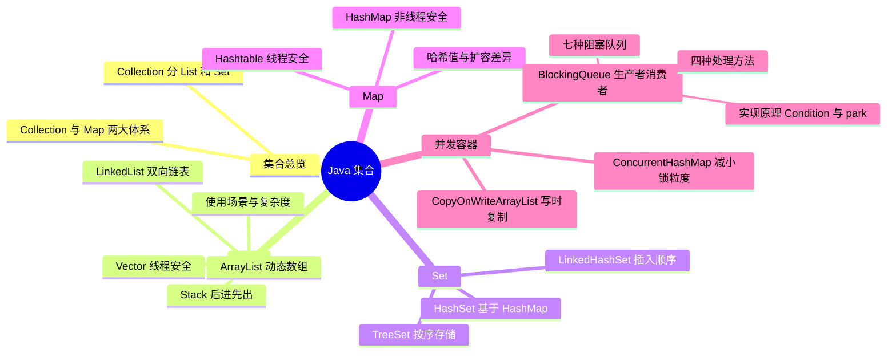

# Java 集合：常用集合类与并发容器



---

## 一、集合总览

两大类：**Collection**、**Map**；其中 Collection 又分为 **List** 和 **Set**。

---

## 二、List 接口与其实现类

List 类似于数组，可以通过索引来访问元素，实现该接口的常用类有 ArrayList、LinkedList、Vector、Stack 等。

### 1. ArrayList

- ArrayList 是**动态数组**，可以根据插入的元素的数量自动扩容，而使用者不需要知道其内部是什么时候进行扩展的，把它当作足够容量的数组来使用即可。
- ArrayList 访问元素的方法 get 是**常数时间**，因为是直接根据下标索引来访问的；而 add 方法的时间复杂度是 **O(n)**，因为需要移动元素，将新元素插入到合适的位置。
- ArrayList 是**非线程安全**的，即它没有同步。不过，可以通过 `Collections.synchronizedList()` 静态方法返回一个同步的实例：

```java
List synList = Collections.synchronizedList(list);
```

**数组扩容**：ArrayList 在插入元素的时候，都会检查当前的数组大小是否足够，如果不够，会扩容到原容量的约 1.5 倍（早期 JDK 6 的实现是 `(oldCapacity * 3) / 2 + 1`，即"当前容量 * 1.5 + 1"这个说法的来源；JDK 7 之后为 `oldCapacity + (oldCapacity >> 1)`，容量为 1 时会直接取所需的最小容量 2），即把原来的元素复制到一个更大的新数组，将旧数组抛弃掉（等待垃圾回收）。这个操作比较耗时，因此建议在创建 ArrayList 的时候，根据要插入的元素的数量来初步估计 Capacity 并初始化：

```java
ArrayList list = new ArrayList(100);
```

这样，在插入小于 100 个元素的时候都是不需要进行扩容的，能够带来性能的提升；当然，如果对这个容量估计大了，可能会带来一些空间的损耗。

### 2. LinkedList

- LinkedList 也实现了 List 接口，其内部实现是使用**双向链表**来保存元素，因此插入与删除元素的性能都表现不错。它还提供了一些其它操作方法，如在头部、尾部插入或者删除元素，因此可以用它来实现栈、队列、双向队列。
- 由于是使用链表保存元素的，所以**随机访问元素的时候速度会比较慢**（需要遍历链表找到目标元素），这一点相比 ArrayList 的随机访问要差——ArrayList 采用数组实现，直接使用下标就可以访问到元素而不需要遍历。因此，在需要频繁随机访问元素的情况下，建议使用 ArrayList。
- 与 ArrayList 一样，LinkedList 也是**非同步**的，如果需要实现多线程访问，则需要自己在外部实现同步方法，当然也可以使用 `Collections.synchronizedList()` 静态方法。

### 3. Vector

Vector 是 ArrayList 的**线程同步版本**，即是说 Vector 是同步的，支持多线程访问。除此之外，还有一点不同：当容量不够时，**Vector 默认扩展一倍容量，而 ArrayList 是约 1.5 倍**。

### 4. Stack

Stack 是一种**后进先出**的数据结构，继承自 Vector 类，提供了 push、pop、peek（获得栈顶元素）等方法。

### 5. List 总结与使用场景

**内部实现与复杂度：**

- ArrayList：内部实现采用动态数组，当容量不够时自动扩容至约 1.5 倍，元素的顺序按照插入的顺序排列，默认初始容量为 10。
  - contains 复杂度为 O(n)，add 复杂度为分摊的常数（即添加 n 个元素需要 O(n) 时间），remove 为 O(n)，get 复杂度为 O(1)；
  - 随机访问效率高，随机插入、删除效率低。ArrayList 是非线程安全的。
- LinkedList：内部使用双向链表实现，随机访问效率低，随机插入、删除效率高，可以当作堆栈、队列、双向队列来使用。LinkedList 也是非线程安全的。
- Vector：跟 ArrayList 类似，内部实现也是动态数组，随机访问效率高。Vector 是线程安全的。
- Stack：是栈，继承于 Vector，其各种操作也是基于 Vector 的各种操作，因此其内部实现也是动态数组，先进后出。Stack 是线程安全的。

**使用场景：**

1. 对于需要快速插入、删除元素，应该使用 LinkedList；
2. 对于需要快速随机访问元素，应该使用 ArrayList；
3. 如果 List 需要被多线程操作，应该使用 Vector；如果只会被单线程操作，应该使用 ArrayList。

---

## 三、Set 接口与其实现类

Set 是**不能包含重合元素**的容器，其实现类有 HashSet，继承于它的接口有 SortedSet 接口等。Set 中提供了加、减、和交等集合操作函数。**Set 不能按照索引随机访问元素**，这是它与 List 的一个重要区别。

### 1. HashSet

- HashSet 实现了 Set 接口，其内部是**采用 HashMap 实现**的。
- 放入 HashSet 的对象最好重写 hashCode、equals 方法，因为默认的这两个方法很可能与你的业务逻辑是不一致的；而且，**要同时重写这两个函数**，如果只重写其中一个，很容易发生意想不到的问题。
- 记住下面几条规则：
  1. 相等对象，hashCode 一定相等；
  2. 不等对象，hashCode 不一定不相等；
  3. 两个对象的 hashCode 相同，不一定相等；
  4. 两个对象的 hashCode 不同，一定不相等。

### 2. TreeSet

TreeSet 同样是 Set 接口的实现类，同样不能存放相同的对象。它与 HashSet 不同的是，**TreeSet 的元素是按照顺序排列的**，因此用 TreeSet 存放的对象需要实现 **Comparable 接口**。

### 3. LinkedHashSet

LinkedHashSet 继承自 HashSet，它与 HashSet 不同的是，**LinkedHashSet 存储元素的顺序是按照元素的插入顺序存储的**。LinkedHashSet 也是非线程安全的。

### 4. Set 总结

- HashSet：内部是使用 HashMap 实现的，key 值是不允许重复的。如果放入的对象是自定义对象，那么最好能够同时重写 hashCode 与 equals 函数，这样就能自定义添加的对象在什么样的情况下是一样的，即能保证在业务逻辑下能添加对象到 HashSet 中，保证业务逻辑的正确性。另外，**HashSet 里的元素不是按照顺序存储的**。HashSet 是非线程安全的。
- TreeSet：存储的元素是按顺序存储的，如果存储的元素是自定义对象，那么需要实现 Comparable 接口。TreeSet 也是非线程安全的。
- LinkedHashSet：继承自 HashSet，与 HashSet 不同的是，存储元素的顺序是按照元素的插入顺序存储的。LinkedHashSet 也是非线程安全的。

---

## 四、Map 接口与其实现类

Map 集合提供了按照"键值对"存储元素的方法，一个键唯一映射一个值。集合中"键值对"整体作为一个实体元素时，类似 List 集合；但是如果分开来看，Map 是一个两列元素的集合：键是一列，值是一列。与 Set 集合一样，Map 也没有提供随机访问的能力，**只能通过键来访问对应的值**。

Map 的每一个元素都是一个 Map.Entry，这个实体的结构是 `< Key, Value >` 样式。

### 1. HashMap

HashMap 实现了 Map 接口，但它是**非线程安全**的。HashMap 允许 key 值为 null，value 也可以为 null。

当程序试图将一个 key-value 对放入 HashMap 中时，程序首先根据该 key 的 `hashCode()` 返回值决定该 Entry 的存储位置：

- 如果两个 Entry 的 key 的 `hashCode()` 返回值相同，那它们的存储位置相同；
- 如果这两个 Entry 的 key 通过 equals 比较返回 true，新添加 Entry 的 value 将覆盖集合中原有 Entry 的 value，但 **key 不会覆盖**；
- 如果这两个 Entry 的 key 通过 equals 比较返回 false，新添加的 Entry 将与集合中原有 Entry 形成 **Entry 链**，而且新添加的 Entry 位于 Entry 链的头部。

看下面 HashMap 添加键值对的源代码：

```java
public V put(K key, V value) {
   if (key == null)
       return putForNullKey(value);
   int hash = hash(key.hashCode());
   int i = indexFor(hash, table.length);
   for (Entry<K,V> e = table[i]; e != null; e = e.next) {
       Object k;
       if (e.hash == hash && ((k = e.key) == key || key.equals(k))) {
           V oldValue = e.value;
           e.value = value;
           e.recordAccess(this);
           return oldValue;
       }
   }
   modCount++;
   addEntry(hash, key, value, i);
   return null;
}
void addEntry(int hash, K key, V value, int bucketIndex) {
   Entry<K,V> e = table[bucketIndex];
   table[bucketIndex] = new Entry<>(hash, key, value, e);
   if (size++ >= threshold)
       resize(2 * table.length);
}
```

HashMap 允许 key、value 值为 null。HashMap 是**非线程安全**的。

### 2. Hashtable

Hashtable 也是 Map 的实现类，继承自 Dictionary 类。它与 HashMap 不同的是，它是**线程安全**的，而且它**不允许 key 为 null，value 也不能为 null**。由于它是线程安全的，在效率上稍差于 HashMap。

### 3. HashMap 与 Hashtable 的差异对比

**哈希值的使用不同**：Hashtable 直接使用对象的 hashCode，如下代码：

```java
int hash = key.hashCode();
int index = (hash & 0x7FFFFFFF) % tab.length;
```

而 HashMap 重新计算 hash 值，如下代码：

```java
int hash = hash(key.hashCode());
int i = indexFor(hash, table.length);
static int hash(int h) {
   // This function ensures that hashCodes that differ only by
   // constant multiples at each bit position have a bounded
   // number of collisions (approximately 8 at default load factor).
   h ^= (h >>> 20) ^ (h >>> 12);
   return h ^ (h >>> 7) ^ (h >>> 4);
}
static int indexFor(int h, int length) {
   return h & (length-1);
}
```

**扩展容量不同**：Hashtable 中 hash 数组默认大小是 11，增加的方式是 old*2+1。HashMap 中 hash 数组的默认大小是 16，而且一定是 2 的指数。

### 4. Map 总结

- HashMap：存储键值对，允许 key、value 为 null，非线程安全；
- Hashtable：HashMap 的线程安全版本，key、value 都不允许为 null。

---

## 五、并发相关的集合类

并发效能的提升是需要从底层 JVM 指令级别开始重新设计、优化、改进同步锁的机制才能实现的。`java.util.concurrent` 的目的就是要实现 Collection 框架对数据结构所执行的并发操作。通过提供一组可靠的、高性能并发构建块，开发人员可以提高并发类的线程安全、可伸缩性、性能、可读性和可靠性。

### 1. JDK 5.0 的并发改进（三组）

* **JVM 级别更改**：大多数现代处理器对并发对某一硬件级别提供支持，通常以 compare-and-swap（CAS）指令形式。CAS 是一种低级别的、细粒度的技术，它允许多个线程更新一个内存位置，同时能够检测其他线程的冲突并进行恢复，是许多高性能并发算法的基础。在 JDK 5.0 之前，Java 语言中用于协调线程之间的访问的惟一原语是同步，同步是更重量级和粗粒度的。公开 CAS 可以开发高度可伸缩的并发 Java 类。这些更改主要由 JDK 库类使用，而不是由开发人员使用。
* **低级实用程序类——锁定和原子类**：使用 CAS 作为并发原语，ReentrantLock 类提供与 synchronized 原语相同的锁定和内存语义，然而这样可以更好地控制锁定（如计时的锁定等待、锁定轮询和可中断的锁定等待）和提供更好的可伸缩性（竞争时的高性能）。大多数开发人员将不再直接使用 ReentrantLock 类，而是使用在 ReentrantLock 类上构建的高级类。
* **高级实用程序类**：这些类实现并发构建块，每个计算机科学文本中都会讲述这些类——信号、互斥、闩锁、屏障、交换程序、线程池和线程安全集合类等。大部分开发人员都可以在应用程序中用这些类，来替换许多（如果不是全部）同步、wait() 和 notify() 的使用，从而提高性能、可读性和正确性。

### 2. Hashtable 与 synchronizedMap 的不足

Hashtable 提供了一种易于使用的、线程安全的、关联的 map 功能，这当然也是方便的。然而，**线程安全性是凭代价换来的——Hashtable 的所有方法都是同步的**，此时无竞争的同步会导致可观的性能代价。

Hashtable 的后继者 HashMap 是作为 JDK 1.2 中的集合框架的一部分出现的，它通过提供一个不同步的基类和一个同步的包装器 `Collections.synchronizedMap`，解决了线程安全性问题。通过将基本的功能从线程安全性中分离开来，`Collections.synchronizedMap` 允许需要同步的用户可以拥有同步，而不需要同步的用户则不必为同步付出代价。

Hashtable 和 synchronizedMap 所采取的获得同步的简单方法（同步 Hashtable 中或者同步的 Map 包装器对象中的每个方法）有两个主要的不足：

1. 这种方法**对于可伸缩性是一种障碍**，因为一次只能有一个线程可以访问 hash 表；
2. 这样仍**不足以提供真正的线程安全性**，许多公用的混合操作仍然需要额外的同步。虽然诸如 get() 和 put() 之类的简单操作可以在不需要额外同步的情况下安全地完成，但还是有一些公用的操作序列，例如迭代或者 put-if-absent（空则放入），需要外部的同步，以避免数据争用。

### 3. 减小锁粒度

提高 HashMap 的并发性同时还提供线程安全性的一种方法是**废除对整个表使用一个锁的方式，而采用对 hash 表的每个 bucket 都使用一个锁的方式**（或者，更常见的是，使用一个锁池，每个锁负责保护几个 bucket）。这意味着多个线程可以同时地访问一个 Map 的不同部分，而不必争用单个的集合范围的锁。这种方法能够直接提高插入、检索以及移除操作的可伸缩性。

不幸的是，这种并发性是以一定的代价换来的——这使得对整个集合进行操作的一些方法（例如 size() 或 isEmpty()）的实现更加困难，因为这些方法要求一次获得许多的锁，并且还存在返回不正确结果的风险。然而，对于某些情况，例如实现 cache，这样做是一个很好的折衷——因为检索和插入操作比较频繁，而 size() 和 isEmpty() 操作则少得多。

### 4. ConcurrentHashMap

util.concurrent 包中的 ConcurrentHashMap 类（也将出现在 JDK 1.5 中的 java.util.concurrent 包中）是对 Map 的线程安全的实现，比起 synchronizedMap 来，它提供了好得多的并发性：

- 多个读操作几乎总可以并发地执行；
- 同时进行的读和写操作通常也能并发地执行；
- 同时进行的写操作仍然可以不时地并发进行（相关的类也提供了类似的多个读线程的并发性，但是只允许有一个活动的写线程）。

ConcurrentHashMap 被设计用来优化检索操作；实际上，成功的 get() 操作完成之后通常根本不会有锁着的资源。要在不使用锁的情况下取得线程安全性需要一定的技巧性，并且需要对 Java 内存模型（Java Memory Model）的细节有深入的理解。

### 5. CopyOnWriteArrayList

在那些**遍历操作大大地多于插入或移除操作**的并发应用程序中，一般用 CopyOnWriteArrayList 类替代 ArrayList。如果是用于存放一个侦听器（listener）列表，例如在 AWT 或 Swing 应用程序中，或者在常见的 JavaBean 中，那么这种情况很常见（相关的 CopyOnWriteArraySet 使用一个 CopyOnWriteArrayList 来实现 Set 接口）。

如果您正在使用一个普通的 ArrayList 来存放一个侦听器列表，那么只要该列表是可变的，而且可能要被多个线程访问，您就必须要么在对其进行迭代操作期间、要么在迭代前进行的克隆操作期间，锁定整个列表，这两种做法的开销都很大。当对列表执行会引起列表发生变化的操作时，**CopyOnWriteArrayList 会复制出一个全新的列表副本（写时复制）**，因此它的迭代器肯定能够返回在迭代器被创建时列表的状态，而不会抛出 ConcurrentModificationException。在对列表进行迭代之前不必克隆列表或者在迭代期间锁定列表，因为迭代器所看到的列表的副本是不变的。换句话说，CopyOnWriteArrayList 含有对一个不可变数组的一个可变的引用，因此，只要保留好那个引用，您就可以获得不可变的线程安全性的好处，而且不用锁定列表。

### 6. BlockingQueue 概述与四种处理方法

阻塞队列（BlockingQueue）是一个支持两个附加操作的队列。这两个附加的操作是：**在队列为空时，获取元素的线程会等待队列变为非空；当队列满时，存储元素的线程会等待队列可用**。阻塞队列常用于生产者和消费者的场景，生产者是往队列里添加元素的线程，消费者是从队列里拿元素的线程——阻塞队列就是生产者存放元素的容器，而消费者也只从容器里拿元素。

阻塞队列提供了四种处理方法：

| 方法处理方式 | 抛出异常 | 返回特殊值 | 一直阻塞 | 超时退出 |
| --- | --- | --- | --- | --- |
| 插入方法 | add(e) | offer(e) | put(e) | offer(e,time,unit) |
| 移除方法 | remove() | poll() | take() | poll(time,unit) |
| 检查方法 | element() | peek() | 不可用 | 不可用 |

- **抛出异常**：指当阻塞队列满时，再往队列里插入元素会抛出 IllegalStateException("Queue full") 异常；当队列为空时，从队列里获取元素时会抛出 NoSuchElementException 异常。
- **返回特殊值**：插入方法会返回是否成功，成功则返回 true；移除方法则是从队列里拿出一个元素，如果没有则返回 null。
- **一直阻塞**：当阻塞队列满时，如果生产者线程往队列里 put 元素，队列会一直阻塞生产者线程，直到拿到数据，或者响应中断退出；当队列空时，消费者线程试图从队列里 take 元素，队列也会阻塞消费者线程，直到队列可用。
- **超时退出**：当阻塞队列满时，队列会阻塞生产者线程一段时间，如果超过一定的时间，生产者线程就会退出。

### 7. 七种阻塞队列及常见实现

JDK 7 提供了 7 个阻塞队列，分别是：

* **ArrayBlockingQueue**：一个由数组结构组成的有界阻塞队列。
* **LinkedBlockingQueue**：一个由链表结构组成的有界阻塞队列。
* **PriorityBlockingQueue**：一个支持优先级排序的无界阻塞队列。
* **DelayQueue**：一个使用优先级队列实现的无界阻塞队列。
* **SynchronousQueue**：一个不存储元素的阻塞队列。
* **LinkedTransferQueue**：一个由链表结构组成的无界阻塞队列。
* **LinkedBlockingDeque**：一个由链表结构组成的双向阻塞队列。

**ArrayBlockingQueue**：用数组实现的有界阻塞队列，按照先进先出（FIFO）的原则对元素进行排序。默认情况下**不保证访问者公平的访问队列**——所谓公平访问队列，是指阻塞的所有生产者线程或消费者线程在队列可用时，可以按照阻塞的先后顺序访问队列，即先阻塞的生产者线程可以先往队列里插入元素，先阻塞的消费者线程可以先从队列里获取元素。

**LinkedBlockingQueue**：用链表实现的有界阻塞队列，默认和最大长度为 Integer.MAX_VALUE，按照先进先出的原则对元素进行排序。

**LinkedBlockingDeque**：由链表结构组成的双向阻塞队列。所谓双向队列，指的是你可以从队列的两端插入和移出元素。双端队列因为多了一个操作队列的入口，在多线程同时入队时，也就减少了一半的竞争。相比其他的阻塞队列，LinkedBlockingDeque 多了 addFirst、addLast、offerFirst、offerLast、peekFirst、peekLast 等方法：

- 以 First 单词结尾的方法，表示插入、获取（peek）或移除双端队列的第一个元素；
- 以 Last 单词结尾的方法，表示插入、获取或移除双端队列的最后一个元素；
- 另外插入方法 add 等同于 addLast，移除方法 remove 等效于 removeFirst，但是 take 方法却等同于 takeFirst（不知道是不是 JDK 的 bug，使用时还是用带有 First 和 Last 后缀的方法更清楚）。

在初始化 LinkedBlockingDeque 时可以初始化队列的容量，用来防止其在扩容时过度膨胀。另外，双向阻塞队列可以运用在"工作窃取"模式中。

**PriorityBlockingQueue**：一个支持优先级的无界队列。默认情况下元素采取自然顺序排列，也可以通过比较器 comparator 来指定元素的排序规则，元素按照升序排列。

### 8. DelayQueue：Delayed 接口与延时队列实现

DelayQueue 是一个支持延时获取元素的**无界阻塞队列**。队列使用 PriorityQueue 来实现，队列中的元素必须实现 **Delayed 接口**，在创建元素时可以指定多久才能从队列中获取当前元素，只有在延迟期满时才能从队列中提取元素。

应用场景：

1. **缓存系统的设计**：可以用 DelayQueue 保存缓存元素的有效期，使用一个线程循环查询 DelayQueue，一旦能从 DelayQueue 中获取元素时，表示缓存有效期到了。
2. **定时任务调度**：使用 DelayQueue 保存当天将会执行的任务和执行时间，一旦从 DelayQueue 中获取到任务就开始执行，比如 TimerQueue 就是使用 DelayQueue 实现的。

队列中的 Delayed 必须实现 compareTo 来指定元素的顺序，比如让延时时间最长的放在队列的末尾，实现代码如下：

```java
public int compareTo(Delayed other) {
    if (other == this) // compare zero ONLY if same object
         return 0;
     if (other instanceof ScheduledFutureTask) {
         ScheduledFutureTask x = (ScheduledFutureTask)other;
         long diff = time - x.time;
         if (diff < 0)
             return -1;
         else if (diff > 0)
             return 1;
	else if (sequenceNumber < x.sequenceNumber)
             return -1;
         else
             return 1;
     }
     long d = (getDelay(TimeUnit.NANOSECONDS) -
               other.getDelay(TimeUnit.NANOSECONDS));
     return (d == 0) ? 0 : ((d < 0) ? -1 : 1);
 }
```

**如何实现 Delayed 接口**：可以参考 ScheduledThreadPoolExecutor 里 ScheduledFutureTask 类，这个类实现了 Delayed 接口。首先在对象创建的时候，使用 time 记录当前对象什么时候可以使用：

```java
ScheduledFutureTask(Runnable r, V result, long ns, long period) {
    super(r, result);
    this.time = ns;
    this.period = period;
    this.sequenceNumber = sequencer.getAndIncrement();
}
```

然后使用 getDelay 可以查询当前元素还需要延时多久：

```java
public long getDelay(TimeUnit unit) {
    return unit.convert(time - now(), TimeUnit.NANOSECONDS);
}
```

通过构造函数可以看出延迟时间参数 ns 的单位是纳秒，自己设计的时候最好使用纳秒，因为 getDelay 时可以指定任意单位，一旦以纳秒作为单位、而延时的时间又精确不到纳秒就麻烦了。使用时请注意：当 time 小于当前时间时，getDelay 会返回负数。

**如何实现延时队列**：实现很简单，当消费者从队列里获取元素时，如果元素没有达到延时时间，就阻塞当前线程：

```java
long delay = first.getDelay(TimeUnit.NANOSECONDS);
            if (delay <= 0)
                return q.poll();
            else if (leader != null)
                available.await();
```

### 9. 阻塞队列的实现原理：Condition 与 park

如果队列是空的，消费者会一直等待，当生产者添加元素时候，消费者是如何知道当前队列有元素的呢？如果让你来设计阻塞队列你会如何设计，让生产者和消费者能够高效率的进行通讯呢？先来看看 JDK 是如何实现的。

**使用通知模式实现**。所谓通知模式，就是当生产者往满的队列里添加元素时会阻塞住生产者，当消费者消费了一个队列中的元素后，会通知生产者当前队列可用。通过查看 JDK 源码发现 ArrayBlockingQueue 使用了 **Condition** 来实现：

```java
private final Condition notFull;
private final Condition notEmpty;

public ArrayBlockingQueue(int capacity, boolean fair) {
	//省略其他代码
	notEmpty = lock.newCondition();
	notFull = lock.newCondition();
}

public void put(E e) throws InterruptedException {
	checkNotNull(e);
	final ReentrantLock lock = this.lock;
	lock.lockInterruptibly();
	try {
    	while (count == items.length)
        	notFull.await();
    	insert(e);
	} finally {
    	lock.unlock();
	}
}

public E take() throws InterruptedException {
	final ReentrantLock lock = this.lock;
	lock.lockInterruptibly();
	try {
    	while (count == 0)
        	notEmpty.await();
    	return extract();
          	} finally {
    	lock.unlock();
		}
    }

    private void insert(E x) {
	items[putIndex] = x;
	putIndex = inc(putIndex);
	++count;
	notEmpty.signal();
}
```

当我们往队列里插入一个元素、如果队列不可用时，阻塞生产者主要通过 `LockSupport.park(this)` 来实现：

```java
public final void await() throws InterruptedException {
    if (Thread.interrupted())
        throw new InterruptedException();
    Node node = addConditionWaiter();
    int savedState = fullyRelease(node);
    int interruptMode = 0;
    while (!isOnSyncQueue(node)) {
        LockSupport.park(this);
        if ((interruptMode = checkInterruptWhileWaiting(node)) != 0)
            break;
    }
    if (acquireQueued(node, savedState) && interruptMode != THROW_IE)
        interruptMode = REINTERRUPT;
    if (node.nextWaiter != null) // clean up if cancelled
        unlinkCancelledWaiters();
    if (interruptMode != 0)

                reportInterruptAfterWait(interruptMode);
}
```

继续进入源码，发现调用 setBlocker 先保存下将要阻塞的线程，然后调用 unsafe.park 阻塞当前线程：

```java
public static void park(Object blocker) {
    Thread t = Thread.currentThread();
    setBlocker(t, blocker);
    unsafe.park(false, 0L);
    setBlocker(t, null);
}
```

unsafe.park 是个 native 方法。这个方法会阻塞当前线程，只有以下四种情况中的一种发生时，该方法才会返回：

1. 与 park 对应的 unpark 执行或已经执行时（注意：已经执行是指 unpark 先执行，然后再执行的 park）；
2. 线程被中断时；
3. 如果参数中的 time 不是零，等待了指定的毫秒数时；
4. 发生异常现象时（这些异常事先无法确定）。

继续看一下 JVM 是如何实现 park 方法的：park 在不同的操作系统使用不同的方式实现，在 linux 下使用的是系统方法 `pthread_cond_wait` 实现，实现代码在 JVM 源码路径 `src/os/linux/vm/os_linux.cpp` 里的 `os::PlatformEvent::park` 方法：

```java
   	void os::PlatformEvent::park() {
        int v ;
	    for (;;) {
	            v = _Event ;
	    	if (Atomic::cmpxchg (v-1, &_Event, v) == v) break ;
	    }
	    guarantee (v >= 0, "invariant") ;
	    if (v == 0) {
	    	// Do this the hard way by blocking ...
	    	int status = pthread_mutex_lock(_mutex);
	    	assert_status(status == 0, status, "mutex_lock");
	    	guarantee (_nParked == 0, "invariant") ;
	    	++ _nParked ;
	    	while (_Event < 0) {
	    	status = pthread_cond_wait(_cond, _mutex);
	    	// for some reason, under 2.7 lwp_cond_wait() may return ETIME ...
	    	// Treat this the same as if the wait was interrupted
	    	if (status == ETIME) { status = EINTR; }
	    	assert_status(status == 0 || status == EINTR, status, "cond_wait");
	    	}
	    	-- _nParked ;

	    	// In theory we could move the ST of 0 into _Event past the unlock(),
	    	// but then we'd need a MEMBAR after the ST.
	    	_Event = 0 ;
	    	status = pthread_mutex_unlock(_mutex);
	    	assert_status(status == 0, status, "mutex_unlock");
	    }
	    guarantee (_Event >= 0, "invariant") ;
	    }
	}
```

`pthread_cond_wait` 是一个多线程的条件变量函数，cond 是 condition 的缩写，字面意思可以理解为线程在等待一个条件发生，这个条件是一个全局变量。这个方法接收两个参数，一个共享变量 `_cond`，一个互斥量 `_mutex`。而 unpark 方法在 linux 下是使用 `pthread_cond_signal` 实现的，park 在 windows 下则是使用 `WaitForSingleObject` 实现的。

---

## 六、部分常用集合类的内部实现方式

| 集合类 | 内部实现 | 线程安全 |
| --- | --- | --- |
| ArrayList | 动态数组，容量不足时扩容 | 否 |
| LinkedList | 双向链表 | 否 |
| Vector | 动态数组，方法同步 | 是 |
| Stack | 继承 Vector，后进先出 | 是 |
| HashSet | 基于 HashMap | 否 |
| TreeSet | 有序存储，元素需实现 Comparable | 否 |
| LinkedHashSet | 继承 HashSet，按插入顺序存储 | 否 |
| HashMap | 哈希表，数组 + Entry 链 | 否 |
| Hashtable | 哈希表，方法同步 | 是 |
| ConcurrentHashMap | 减小锁粒度（按 bucket / 锁池加锁） | 是 |
| CopyOnWriteArrayList | 写时复制，迭代器看到的是不变的副本 | 是 |
| ArrayBlockingQueue 等 | 数组/链表 + Condition 通知 | 是 |

**一句话选型**：单线程场景优先 ArrayList / HashMap；需要按顺序存放元素用 TreeSet；高并发、读多写少用 CopyOnWriteArrayList；并发 Map 用 ConcurrentHashMap；生产者-消费者用 BlockingQueue。
