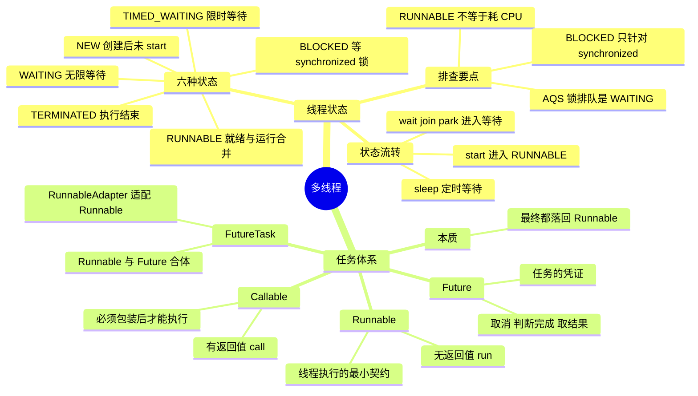

# 多线程：线程状态与任务体系



---

## 一、线程的状态与流转

### 1. 六种状态

`java.lang.Thread` 内部用一个 State 枚举定义了线程的 6 种状态，可以通过 `thread.getState()` 获取，jstack 打出来的线程栈里也是这 6 种：

```java
public enum State {
    NEW, RUNNABLE, BLOCKED, WAITING, TIMED_WAITING, TERMINATED;
}
```

- **NEW**：线程对象已经创建，但还没有调用 `start()`。此时它只是一个普通的 Java 对象，还没有和操作系统线程关联。
- **RUNNABLE**：调用 `start()` 之后的状态。注意它是 JVM 层面的概念，把操作系统里的「就绪」和「运行中」合并在一起了——线程在等 CPU 时间片的时候，状态同样是 RUNNABLE。
- **BLOCKED**：等待 synchronized 的监视器锁时进入，抢到锁就回到 RUNNABLE。
- **WAITING**：无限期等待，必须靠其他线程显式唤醒。由 `Object.wait()`、`Thread.join()`、`LockSupport.park()` 进入。
- **TIMED_WAITING**：限时等待，时间到了自己会醒。由 `Thread.sleep(ms)`、`Object.wait(timeout)`、`Thread.join(timeout)`、`LockSupport.parkNanos()/parkUntil()` 进入。
- **TERMINATED**：`run()` 方法执行完毕（正常返回或者抛出异常）后进入。线程一旦终止就不能再启动，再次调用 `start()` 会抛 `IllegalThreadStateException`。

### 2. 状态流转图

```text
                            new Thread()
                                 │
                                 ▼
                               ┌─────┐
                               │ NEW │
                               └─────┘
                                 │ start()
                                 ▼
                          ┌────────────┐   run() 结束或抛异常   ┌────────────┐
                          │  RUNNABLE  │─────────────────────▶ │ TERMINATED │
                          └────────────┘                       └────────────┘
                             ▲     │
    抢到锁 / 被唤醒 / 超时了 ─┘     └─┬── 等 synchronized 锁 ──────────▶ BLOCKED
                                     ├── wait() / join() / park() ───▶ WAITING
                                     └── sleep(ms) / wait(ms) /
                                         join(ms) / parkNanos() ─────▶ TIMED_WAITING
```

BLOCKED、WAITING、TIMED_WAITING 这三个状态拿到锁或者被唤醒之后，都会回到 RUNNABLE。

### 3. 常用方法与状态变化

- `start()`：NEW → RUNNABLE，由 JVM 创建操作系统线程并回调 `run()`。直接调用 `run()` 只是普通的方法调用，不会开新线程，状态也不变。
- `Thread.sleep(ms)`：RUNNABLE → TIMED_WAITING，**不会释放已经持有的锁**。
- `Object.wait()` / `wait(ms)`：必须在 synchronized 块里调用，否则抛 `IllegalMonitorStateException`；调用时**会释放锁**，进入 WAITING / TIMED_WAITING。
- `Thread.join()` / `join(ms)`：在本线程里等待目标线程结束，本线程进入 WAITING / TIMED_WAITING（join 内部就是靠 wait 实现的）。
- `Object.notify()` / `notifyAll()`：唤醒在该对象监视器上等待的线程，被唤醒的线程先进入 BLOCKED 重新竞争锁，抢到之后才回到 RUNNABLE。
- `LockSupport.park()` / `unpark(thread)`：AQS 底层用的就是它。park 进入 WAITING，unpark 唤醒；和 wait/notify 不同，它不要求持有锁，也不抛 `InterruptedException`，被中断只是让 park 返回，需要自己检查中断标志。
- `Thread.yield()`：让出 CPU 给同优先级的线程，但线程仍然是 RUNNABLE。

### 4. 容易踩的坑

- **RUNNABLE 不等于「正在消耗 CPU」**。阻塞式 IO（比如读一个 socket）时，线程也一直显示 RUNNABLE，因为它不认为自己是在等锁或者等唤醒。所以线上看到一堆 RUNNABLE 的线程，还要结合 CPU 使用率一起判断。
- **BLOCKED 只针对 synchronized**。ReentrantLock 这类基于 AQS 的锁，排队时用的是 `LockSupport.park()`，线程状态是 WAITING / TIMED_WAITING，所以 jstack 里看不到 ReentrantLock 引起的 BLOCKED——排查死锁时要留意这两种完全不同的「卡住」形态。
- **wait 会释放锁，sleep 不会**；wait 必须在 synchronized 里调用，sleep 没有这个限制。
- BLOCKED、WAITING、TIMED_WAITING 都是被挂起的，**不占用 CPU**，这也是它们和自旋等待的区别。
- `interrupt()` 对处于等待态的线程会抛 `InterruptedException`（park 不抛，只是返回），对处于 BLOCKED 的线程不会让它退出阻塞——中断标志被设置，线程要等到抢到锁之后才有机会看到。

---

## 二、任务体系：Runnable、Callable、Future、FutureTask

### 1. Runnable

Runnable 应该是我们最熟悉的接口，它只有一个 `run()` 函数，用于将耗时操作写在其中，该函数**没有返回值**。然后使用某个线程去执行该 Runnable 即可实现多线程，Thread 类在调用 `start()` 函数后执行的就是 Runnable 的 `run()` 函数。Runnable 的声明如下：

```java
public interface Runnable {
/**
 * When an object implementing interface <code>Runnable</code> is used
 * to create a thread, starting the thread causes the object's
 * <code>run</code> method to be called in that separately executing
 * thread.
 * <p>
 *
 * @see     java.lang.Thread#run()
*/
  public abstract void run();
}
```

### 2. Callable

Callable 与 Runnable 的功能大致相似，Callable 中有一个 `call()` 函数，但是 `call()` 函数**有返回值**，而 Runnable 的 `run()` 函数不能将结果返回给客户程序。Callable 的声明如下：

```java
public interface Callable<V> {
/**
 * Computes a result, or throws an exception if unable to do so.
 *
 * @return computed result
 * @throws Exception if unable to compute a result
 */
V call() throws Exception;
}
```

可以看到，这是一个泛型接口，`call()` 函数返回的类型就是客户程序传递进来的 V 类型。

### 3. Future

Executor 就是 Runnable 和 Callable 的调度容器，Future 就是对于具体的 Runnable 或者 Callable 任务的执行结果进行**取消、查询是否完成、获取结果、设置结果**操作。`get` 方法会阻塞，直到任务返回结果。Future 声明如下：

```java
/**
* @see FutureTask
* @see Executor
* @since 1.5
* @author Doug Lea
* @param <V> The result type returned by this Future's <tt>get</tt> method
*/
public interface Future<V> {

  /**
   * Attempts to cancel execution of this task.  This attempt will
   * fail if the task has already completed, has already been cancelled,
   * or could not be cancelled for some other reason. If successful,
   * and this task has not started when <tt>cancel</tt> is called,
   * this task should never run.  If the task has already started,
   * then the <tt>mayInterruptIfRunning</tt> parameter determines
   * whether the thread executing this task should be interrupted in
   * an attempt to stop the task.     *
   */
  boolean cancel(boolean mayInterruptIfRunning);

  /**
   * Returns <tt>true</tt> if this task was cancelled before it completed
   * normally.
   */
  boolean isCancelled();

  /**
   * Returns <tt>true</tt> if this task completed.
   *
   */
  boolean isDone();

  /**
   * Waits if necessary for the computation to complete, and then
   * retrieves its result.
   *
   * @return the computed result
   */
  V get() throws InterruptedException, ExecutionException;

  /**
   * Waits if necessary for at most the given time for the computation
   * to complete, and then retrieves its result, if available.
   *
   * @param timeout the maximum time to wait
   * @param unit the time unit of the timeout argument
   * @return the computed result
   */
  V get(long timeout, TimeUnit unit)
      throws InterruptedException, ExecutionException, TimeoutException;
    }
```

### 4. FutureTask

FutureTask 则是一个 RunnableFuture，而 RunnableFuture 实现了 Runnable 又实现了 Future 这两个接口：

```java
public class FutureTask<V> implements RunnableFuture<V>
```

RunnableFuture：

```java
public interface RunnableFuture<V> extends Runnable, Future<V> {
/**
 * Sets this Future to the result of its computation
 * unless it has been cancelled.
 */
void run();
}
```

另外它还可以包装 Runnable 和 Callable，由构造函数注入依赖：

```java
public FutureTask(Callable<V> callable) {
    if (callable == null)
        throw new NullPointerException();
    this.callable = callable;
    this.state = NEW;       // ensure visibility of callable
}

public FutureTask(Runnable runnable, V result) {
    this.callable = Executors.callable(runnable, result);
    this.state = NEW;       // ensure visibility of callable
}
```

可以看到，Runnable 注入会被 `Executors.callable()` 函数转换为 Callable 类型，即 **FutureTask 最终都是执行 Callable 类型的任务**。该适配函数的实现如下：

```java
public static <T> Callable<T> callable(Runnable task, T result) {
    if (task == null)
        throw new NullPointerException();
    return new RunnableAdapter<T>(task, result);
}
```

RunnableAdapter 适配器：

```java
/**
 * A callable that runs given task and returns given result
 */
static final class RunnableAdapter<T> implements Callable<T> {
    final Runnable task;
    final T result;
    RunnableAdapter(Runnable task, T result) {
        this.task = task;
        this.result = result;
    }
    public T call() {
        task.run();
        return result;
    }
}
```

由于 FutureTask 实现了 Runnable，因此它既可以通过 Thread 包装来直接执行，也可以提交给 ExecutorService 来执行。并且还可以直接通过 `get()` 函数获取执行结果，该函数会阻塞，直到结果返回。因此 FutureTask 既是 Future、Runnable，又是包装了 Callable（如果是 Runnable 最终也会被转换为 Callable），它是这两者的合体。

### 5. 本质：最终都是 Runnable

线程这一层只认 Runnable，`start()` 之后 JVM 回调的入口一定是 `run()`。Callable、Future、FutureTask 都是在 Runnable 之上加出来的能力，最终还是要落回 Runnable 才能被执行：

- **Thread 本身就实现了 Runnable**：`public class Thread implements Runnable`，它内部持有构造时传入的 target，`start()` 由 JVM 创建新的操作系统线程，回来执行的还是 `Thread.run()`，而 `Thread.run()` 里只有一句 `target.run()`。
- **Callable 不是 Runnable**，它只是「有返回值的任务」这层抽象，自己无法直接被线程执行，必须适配：提交给线程池时会被 `Executors.callable()` 或 FutureTask 包装，FutureTask 里的 RunnableAdapter 就是把 Runnable 转成 Callable 的那层适配器。
- **FutureTask 实现了 RunnableFuture**，而 RunnableFuture 同时继承 Runnable 和 Future，所以它既能被 Thread 或线程池当成一个 Runnable 执行，又能通过 `get()` 拿结果。
- **线程池执行的任务同样必须是 Runnable**：`ThreadPoolExecutor.execute()` 只收 Runnable，`submit(Callable)` 内部是用 `newTaskFor(task)` 把 Callable 包成 FutureTask——还是 Runnable；连线程池里真正干活的工作线程 Worker 本身也实现了 Runnable。

```java
public class Thread implements Runnable {
    private Runnable target;

    @Override
    public void run() {
        if (target != null) {
            target.run();
        }
    }
}
```

### 6. 四个概念的分工

- **Runnable**：无返回值的任务，可以直接交给 Thread 或者线程池执行，是「可被线程执行」的最小契约。
- **Callable**：有返回值、能抛异常的任务，但必须先包装成 FutureTask 才能交给线程。
- **Future**：不是任务，是任务的「凭证」，用来取消、判断是否完成、获取结果。
- **FutureTask**：Runnable + Future 的合体，既能当任务执行，又能当凭证取结果。

### 7. 完整示例

```java
package com.effective.java.concurrent.task;

import java.util.concurrent.Callable;
import java.util.concurrent.ExecutionException;
import java.util.concurrent.ExecutorService;
import java.util.concurrent.Executors;
import java.util.concurrent.Future;
import java.util.concurrent.FutureTask;

/**
*
* @author mrsimple
*
*/
public class RunnableFutureTask {

/**
* ExecutorService
*/
static ExecutorService mExecutor = Executors.newSingleThreadExecutor();

/**
*
* @param args
*/
public static void main(String[] args) {
   runnableDemo();
   futureDemo();
}

/**
* runnable, 无返回值
*/
static void runnableDemo() {

   new Thread(new Runnable() {

       @Override
       public void run() {
           System.out.println("runnable demo : " + fibc(20));
       }
   }).start();
}

/**
* 其中Runnable实现的是void run()方法，无返回值；Callable实现的是 V
* call()方法，并且可以返回执行结果。其中Runnable可以提交给Thread来包装下
* ，直接启动一个线程来执行，而Callable则一般都是提交给ExecuteService来执行。
*/
static void futureDemo() {
   try {
       /**
        * 提交runnable则没有返回值, future没有数据
        */
       Future<?> result = mExecutor.submit(new Runnable() {

           @Override
           public void run() {
               fibc(20);
           }
       });

       System.out.println("future result from runnable : " + result.get());

       /**
        * 提交Callable, 有返回值, future中能够获取返回值
        */
       Future<Integer> result2 = mExecutor.submit(new Callable<Integer>() {
           @Override
           public Integer call() throws Exception {
               return fibc(20);
           }
       });

       System.out
               .println("future result from callable : " + result2.get());

       /**
        * FutureTask则是一个RunnableFuture<V>，即实现了Runnbale又实现了Futrue<V>这两个接口，
        * 另外它还可以包装Runnable(实际上会转换为Callable)和Callable
        * <V>，所以一般来讲是一个符合体了，它可以通过Thread包装来直接执行，也可以提交给ExecuteService来执行
        * ，并且还可以通过v get()返回执行结果，在线程体没有执行完成的时候，主线程一直阻塞等待，执行完则直接返回结果。
        */
       FutureTask<Integer> futureTask = new FutureTask<Integer>(
               new Callable<Integer>() {
                   @Override
                   public Integer call() throws Exception {
                       return fibc(20);
                   }
               });
       // 提交futureTask
       mExecutor.submit(futureTask) ;
       System.out.println("future result from futureTask : "
               + futureTask.get());

   } catch (InterruptedException e) {
       e.printStackTrace();
   } catch (ExecutionException e) {
       e.printStackTrace();
   }
}

/**
* 效率底下的斐波那契数列, 耗时的操作
*
* @param num
* @return
*/
static int fibc(int num) {
   if (num == 0) {
       return 0;
   }
   if (num == 1) {
       return 1;
   }
   return fibc(num - 1) + fibc(num - 2);
}

}
```

---

## 三、30 秒口述版

线程状态只有 6 种，考点集中在三处：RUNNABLE 合并了就绪和运行，阻塞式 IO 时也显示 RUNNABLE；BLOCKED 只属于 synchronized，而 AQS 系锁排队表现为 WAITING/TIMED_WAITING，jstack 排查死锁时要能区分这两种「卡住」形态；wait 会释放锁、sleep 不会。任务抽象上，线程只认 Runnable——Callable 靠 FutureTask 适配后执行，Future 是取结果的凭证，FutureTask 是 Runnable 与 Future 的合体，线程池里真正干活的 Worker 本身也是一个 Runnable。
