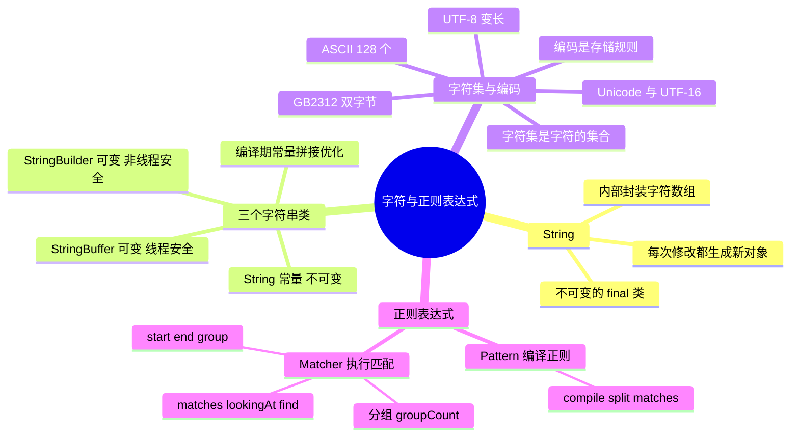

# 字符与正则表达式



---

## 一、String 的不可变性

String 是一个对象，一个封装了字符数组的对象，不可变是指它被定义为 final 类、内部字段也不对外暴露：

```java
public final class String
    implements java.io.Serializable, Comparable, CharSequence {
    /** The value is used for character storage. */
    private final char value[];
    /** The offset is the first index of the storage that is used. */
    private final int offset;
    /** The count is the number of characters in the String. */
    private final int count;
    /** Cache the hash code for the string */
    private int hash; // Default to 0
}
```

- 类被 `final` 修饰不能被继承，字符数组 `value` 被 `final` 修饰且不对外暴露，所以字符串内容一旦创建就不会被改变。
- 拼接、裁剪等操作都会**产生新的 String 对象**，而不是修改原对象。
- （上面是 String 的经典实现；JDK 9 起内部改为 `byte[] value` + `byte coder` 的紧凑字符串实现，但「final 类 + 不暴露内部数组」的不可变本质没有变。)

---

## 二、String、StringBuilder、StringBuffer

### 1. 三者对比

- **String**：字符串常量，不可变；
- **StringBuffer**：字符串变量，可变，**线程安全**；
- **StringBuilder**：字符串变量，可变，**非线程安全**。

简要地说，String 类型和 StringBuffer 类型的主要性能区别其实在于 **String 是不可变的对象**，因此在每次对 String 类型进行改变的时候，其实都等同于生成了一个新的 String 对象，然后将指针指向新的 String 对象。所以经常改变内容的字符串最好不要用 String，因为每次生成对象都会对系统性能产生影响，特别当内存中无引用对象多了以后，JVM 的 GC 就会开始工作，速度会相当慢。

而使用 StringBuffer 类则结果就不一样了，每次结果都会对 StringBuffer 对象本身进行操作，而不是生成新的对象、再改变对象引用。所以在一般情况下我们推荐使用 StringBuffer，特别是字符串对象经常改变的情况下。

### 2. 编译期优化：字符串常量的拼接

在某些特别情况下，String 对象的字符串拼接会被编译器优化成 StringBuilder 的拼接，所以这些时候 String 对象的速度并不会比 StringBuffer 对象慢。特别是以下的字符串对象生成中，String 效率远要比 StringBuffer 快：

```java
String S1 = "This is only a" + " simple" + " test";
StringBuffer Sb = new StringBuffer("This is only a").append(" simple").append(" test");
```

你会很惊讶地发现，生成 String S1 对象的速度简直太快了，而这个时候 StringBuffer 居然在速度上根本一点都不占优势。其实这是 JVM 的一个把戏：对**编译期就能确定的字符串常量**，拼接会被直接折叠成一个字符串，在 JVM 眼里，这段代码其实就是：

```java
String S1 = "This is only a simple test";
```

所以当然不需要太多的时间了。但要注意的是，如果你的字符串是来自另外的 String 对象（变量拼接），速度就没那么快了，譬如：

```java
String S2 = "This is only a";
String S3 = " simple";
String S4 = " test";
String S1 = S2 + S3 + S4;
```

这时候 JVM 会规规矩矩地按照原来的方式去做。

**结论：在大部分情况下，StringBuffer > String；在大部分情况下，StringBuilder > StringBuffer。**

### 3. StringBuffer

`java.lang.StringBuffer` 是线程安全的可变字符序列。一个类似于 String 的字符串缓冲区，虽然任意时间点上它都包含某种特定的字符序列，但通过某些方法调用可以改变该序列的长度和内容。

可将字符串缓冲区安全地用于多个线程。可以在必要时对这些方法进行同步，因此任意特定实例上的所有操作就好像是以串行顺序发生的，该顺序与所涉及的每个线程进行的方法调用顺序一致。

StringBuffer 上的主要操作是 `append` 和 `insert` 方法，可重载这些方法，以接受任意类型的数据。每个方法都能有效地将给定的数据转换成字符串，然后将该字符串的字符追加或插入到字符串缓冲区中：**append 方法始终将这些字符添加到缓冲区的末端，而 insert 方法则在指定的点添加字符。**

例如，如果 z 引用一个当前内容是 "start" 的字符串缓冲区对象，则此方法调用 `z.append("le")` 会使字符串缓冲区包含 "startle"，而 `z.insert(4, "le")` 将更改字符串缓冲区，使之包含 "starlet"。

### 4. StringBuilder

`java.lang.StringBuilder` 是一个可变的字符序列，是 5.0 新增的。此类提供一个与 StringBuffer 兼容的 API，但**不保证同步**。该类被设计用作 StringBuffer 的一个简易替换，用在字符串缓冲区被单个线程使用的时候（这种情况很普遍）。如果可能，建议优先采用该类，因为在大多数实现中，它比 StringBuffer 要快。两者的方法基本相同。

---

## 三、字符集与编码

### 1. 字符集与编码的区别

- **字符**是各种文字和符号的总称，包括各个国家文字、标点符号、图形符号、数字等。**字符集**是多个字符的集合，字符集种类较多，每个字符集包含的字符个数不同，常见字符集有：ASCII 字符集、ISO 8859 字符集、GB2312 字符集、BIG5 字符集、GB18030 字符集、Unicode 字符集等。计算机要准确地处理各种字符集文字，需要进行字符编码，以便计算机能够识别和存储各种文字。
- **编码（encoding）和字符集不同**。字符集只是字符的集合，不一定适合作网络传送、处理，有时须经编码（encode）后才能应用。如 Unicode 可依不同需要以 UTF-8、UTF-16、UTF-32 等方式编码。字符编码就是以二进制的数字来对应字符集的字符，因此，对字符进行编码，是信息交流的技术基础。
- 使用哪些字符，也就是说哪些汉字、字母和符号会被收入标准中，所包含「字符」的集合就叫做**字符集**；规定每个「字符」分别用一个字节还是多个字节存储、用哪些字节来存储，这个规定就叫做**编码**。
- 各个国家和地区在制定编码标准的时候，「字符的集合」和「编码」一般都是同时制定的。因此，平常我们所说的「字符集」，比如 GB2312、GBK、JIS 等，除了有「字符的集合」这层含义外，同时也包含了「编码」的含义。

### 2. ASCII 码

学过计算机的人都知道 ASCII 码，总共有 128 个，用一个字节的低 7 位表示：0~31 是控制字符如换行回车删除等；32~126 是打印字符，可以通过键盘输入并且能够显示出来。

### 3. GB2312

它的全称是《信息交换用汉字编码字符集 基本集》，它是双字节编码，总的编码范围是 A1-F7，其中从 A1-A9 是符号区，总共包含 682 个符号，从 B0-F7 是汉字区，包含 6763 个汉字。

### 4. Unicode 与 UTF-16

说到 UTF 必须要提到 Unicode（Universal Code 统一码），ISO 试图想创建一个全新的超语言字典，世界上所有的语言都可以通过这本字典来相互翻译。可想而知这个字典是多么的复杂，关于 Unicode 的详细规范可以参考相应文档。Unicode 是 Java 和 XML 的基础，下面详细介绍 Unicode 在计算机中的存储形式。

UTF-16 具体定义了 Unicode 字符在计算机中存取方法。UTF-16 用**两个字节**来表示 Unicode 转化格式，这个是**定长**的表示方法，不论什么字符都可以用两个字节表示，两个字节是 16 个 bit，所以叫 UTF-16。UTF-16 表示字符非常方便，每两个字节表示一个字符，这个在字符串操作时就大大简化了操作，这也是 **Java 以 UTF-16 作为内存的字符存储格式**的一个很重要的原因。

### 5. UTF-8

UTF-16 统一采用两个字节表示一个字符，虽然在表示上非常简单方便，但是也有其缺点：有很大一部分字符用一个字节就可以表示的，现在要两个字节表示，存储空间放大了一倍，在现在的网络带宽还非常有限的情况下，这样会增大网络传输的流量，而且也没必要。而 UTF-8 采用了一种**变长技术**，每个编码区域有不同的字码长度，不同类型的字符可以由 1~6 个字节组成（注：早期 UTF-8 规范允许 1~6 字节，现行规范已限制为 1~4 字节）。

UTF-8 有以下编码规则：

- 如果一个字节最高位（第 8 位）为 0，表示这是一个 ASCII 字符（00 - 7F）。可见，所有 ASCII 编码已经是 UTF-8 了。
- 如果一个字节以 11 开头，连续的 1 的个数暗示这个字符的字节数，例如：110xxxxx 代表它是双字节 UTF-8 字符的首字节。
- 如果一个字节以 10 开始，表示它不是首字节，需要向前查找才能得到当前字符的首字节。

---

## 四、正则表达式：Pattern 与 Matcher

Java 正则表达式通过 `java.util.regex` 包下的 Pattern 类与 Matcher 类实现（建议在阅读时打开 Java API 文档，当介绍到哪个方法时查看 Java API 中的方法说明，效果会更佳）。

### 1. Pattern 的创建

Pattern 类用于创建一个正则表达式，也可以说创建一个匹配模式。它的构造方法是私有的，不可以直接创建，但可以通过 `Pattern.compile(String regex)` 简单工厂方法创建一个正则表达式：

```java
Pattern p = Pattern.compile("\\w+");
p.pattern(); // 返回 \w+
```

`pattern()` 返回正则表达式的字符串形式，其实就是返回 `Pattern.compile(String regex)` 的 regex 参数。

### 2. Pattern.split(CharSequence input)

Pattern 有一个 `split(CharSequence input)` 方法，用于分隔字符串，并返回一个 String[]。`String.split(String regex)` 就是通过 `Pattern.split(CharSequence input)` 来实现的：

```java
Pattern p = Pattern.compile("\\d+");
String[] str = p.split("我的QQ是:456456我的电话是:0532214我的邮箱是:aaa@aaa.com");
```

结果：`str[0]="我的QQ是:"`、`str[1]="我的电话是:"`、`str[2]="我的邮箱是:aaa@aaa.com"`。

### 3. Pattern.matches(String regex, CharSequence input)

这是一个静态方法，用于快速匹配字符串，该方法适合用于**只匹配一次、且匹配全部字符串**的场景：

```java
Pattern.matches("\\d+", "2223");    // 返回 true
Pattern.matches("\\d+", "2223aa");  // 返回 false，需要匹配到所有字符串才能返回 true，这里 aa 不能匹配到
Pattern.matches("\\d+", "22bb23");  // 返回 false，需要匹配到所有字符串才能返回 true，这里 bb 不能匹配到
```

### 4. Pattern.matcher(CharSequence input)

说了这么多，终于轮到 Matcher 类登场了，`Pattern.matcher(CharSequence input)` 返回一个 Matcher 对象。

Matcher 类的构造方法也是私有的，不能随意创建，只能通过 `Pattern.matcher(CharSequence input)` 方法得到该类的实例。

Pattern 类只能做一些简单的匹配操作，要想得到更强更便捷的正则匹配操作，那就需要将 Pattern 与 Matcher 一起合作。Matcher 类提供了对正则表达式的**分组支持**，以及对正则表达式的**多次匹配支持**：

```java
Pattern p = Pattern.compile("\\d+");
Matcher m = p.matcher("22bb23");
m.pattern(); // 返回 p，也就是返回该 Matcher 对象是由哪个 Pattern 对象创建的
```

### 5. matches() / lookingAt() / find()

Matcher 类提供三个匹配操作方法，三个方法均返回 boolean 类型，当匹配到时返回 true，没匹配到则返回 false。

**matches() 对整个字符串进行匹配**，只有整个字符串都匹配了才返回 true：

```java
Pattern p = Pattern.compile("\\d+");
Matcher m = p.matcher("22bb23");
m.matches(); // 返回 false，因为 bb 不能被 \d+ 匹配，导致整个字符串匹配未成功
Matcher m2 = p.matcher("2223");
m2.matches(); // 返回 true，因为 \d+ 匹配到了整个字符串
```

我们现在回头看一下 `Pattern.matches(String regex, CharSequence input)`，它与下面这段代码等价：

```java
Pattern.compile(regex).matcher(input).matches()
```

**lookingAt() 对前面的字符串进行匹配**，只有匹配到的字符串在最前面才返回 true：

```java
Pattern p = Pattern.compile("\\d+");
Matcher m = p.matcher("22bb23");
m.lookingAt(); // 返回 true，因为 \d+ 匹配到了前面的 22
Matcher m2 = p.matcher("aa2223");
m2.lookingAt(); // 返回 false，因为 \d+ 不能匹配前面的 aa
```

**find() 对字符串进行匹配**，匹配到的字符串可以在任何位置：

```java
Pattern p = Pattern.compile("\\d+");
Matcher m = p.matcher("22bb23");
m.find(); // 返回 true
Matcher m2 = p.matcher("aa2223");
m2.find(); // 返回 true
Matcher m3 = p.matcher("aa2223bb");
m3.find(); // 返回 true
Matcher m4 = p.matcher("aabb");
m4.find(); // 返回 false
```

### 6. start() / end() / group()

当使用 `matches()`、`lookingAt()`、`find()` 执行匹配操作后，就可以利用以上三个方法得到更详细的信息：

1. `start()` 返回匹配到的子字符串在字符串中的索引位置；
2. `end()` 返回匹配到的子字符串的最后一个字符在字符串中的索引位置；
3. `group()` 返回匹配到的子字符串。

```java
Pattern p = Pattern.compile("\\d+");
Matcher m = p.matcher("aaa2223bb");
m.find();   // 匹配 2223
m.start();  // 返回 3
m.end();    // 返回 7，返回的是 2223 后的索引号
m.group();  // 返回 2223

Matcher m2 = p.matcher("2223bb");
m2.lookingAt(); // 匹配 2223
m2.start();     // 返回 0，由于 lookingAt() 只能匹配前面的字符串，所以当使用 lookingAt() 匹配时，start() 方法总是返回 0
m2.end();       // 返回 4
m2.group();     // 返回 2223

Matcher m3 = p.matcher("2223bb");
m3.matches(); // 匹配整个字符串
m3.start();   // 返回 0
m3.end();     // 返回 6，因为 matches() 需要匹配所有字符串
m3.group();   // 返回 2223bb
```

### 7. 分组

说了这么多，相信大家都明白了以上几个方法的使用，该说说正则表达式的分组在 Java 中是怎么使用的。

`start()`、`end()`、`group()` 均有一个重载方法 `start(int i)`、`end(int i)`、`group(int i)`，专用于分组操作，Matcher 类还有一个 `groupCount()` 用于返回有多少组：

```java
Pattern p = Pattern.compile("([a-z]+)(\\d+)");
Matcher m = p.matcher("aaa2223bb");
m.find();        // 匹配 aaa2223
m.groupCount();  // 返回 2，因为有 2 组
m.start(1);      // 返回 0，返回第一组匹配到的子字符串在字符串中的索引号
m.start(2);      // 返回 3
m.end(1);        // 返回 3，返回第一组匹配到的子字符串的最后一个字符在字符串中的索引位置
m.end(2);        // 返回 7
m.group(1);      // 返回 aaa，返回第一组匹配到的子字符串
m.group(2);      // 返回 2223，返回第二组匹配到的子字符串
```

### 8. 完整示例：提取文本中的所有数字

现在使用一下稍微高级点的正则匹配操作：有一段文本，里面有很多数字，而且这些数字是分开的，现在要将文本中所有数字都取出来，利用 Java 的正则操作非常简单：

```java
Pattern p = Pattern.compile("\\d+");
Matcher m = p.matcher("我的QQ是:456456 我的电话是:0532214 我的邮箱是:aaa123@aaa.com");
while (m.find()) {
    System.out.println(m.group());
}
```

输出：

```text
456456
0532214
123
```

如将以上 while() 循环替换成：

```java
while (m.find()) {
    System.out.println(m.group());
    System.out.print("start:" + m.start());
    System.out.println(" end:" + m.end());
}
```

则输出：

```text
456456
start:6 end:12
0532214
start:19 end:26
123
start:36 end:39
```

现在大家应该知道，每次执行匹配操作后 `start()`、`end()`、`group()` 三个方法的值都会改变，改变成匹配到的子字符串的信息，以及它们的重载方法也会改变成相应的信息。

**注意：只有当匹配操作成功，才可以使用 `start()`、`end()`、`group()` 三个方法，否则会抛出 `java.lang.IllegalStateException`**，也就是当 `matches()`、`lookingAt()`、`find()` 其中任意一个方法返回 true 时，才可以使用。

---

## 五、30 秒口述版

String 是不可变对象，每次修改都会生成新对象，所以频繁改字符串要用 StringBuilder（单线程，优先）或 StringBuffer（多线程安全）；编译期常量拼接会被折叠成字面量，所以字面量相加并不慢。字符集是字符的集合、编码是存储规则，Java 选择 UTF-16 作为内存存储格式，UTF-8 用变长字节换取网络传输空间。正则通过 Pattern 编译、Matcher 执行：matches 匹配整串、lookingAt 匹配开头、find 匹配任意位置，匹配成功后才能用 start/end/group 取位置和内容，分组用带下标的同名重载方法。
