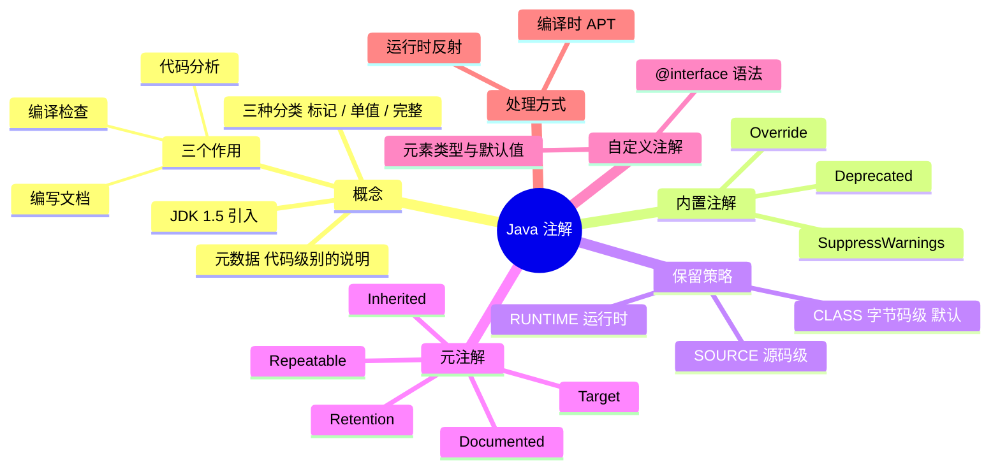

# Java 注解



---

## 一、什么是注解

**定义**：注解（Annotation），也叫元数据，一种代码级别的说明。它是 JDK 1.5 及以后版本引入的一个特性，与类、接口、枚举是在同一个层次。它可以声明在包、类、字段、方法、局部变量、方法参数等的前面，用来对这些元素进行说明、注释。

**作用分类**：

1. **编写文档**：通过代码里标识的元数据生成文档（生成 doc 文档）；
2. **代码分析**：通过代码里标识的元数据对代码进行分析（使用反射）；
3. **编译检查**：通过代码里标识的元数据让编译器能够实现基本的编译检查（比如 `@Override`）。

注解以 `@注解名` 的形式在代码中存在。根据注解参数的个数，可以将注解分为三类：**标记注解、单值注解、完整注解**。

它们都不会直接影响到程序的语义，只是作为标识存在，我们可以通过反射机制编程实现对这些元数据（用来描述数据的数据）的访问。另外，可以在编译时选择代码里的注解是否只存在于源代码级，或者它也能在 class 文件、或者运行时中出现（SOURCE / CLASS / RUNTIME）。

---

## 二、JDK 内置注解

### 1. @Override

作用是对覆盖超类中方法的方法进行标记，如果被标记的方法并没有实际覆盖超类中的方法，则编译器会发出错误警告。

```java
/**
 * 测试 Override 注解
 * @author Administrator
 */
public class OverrideDemoTest {
    // @Override public String tostring() { return "测试注解"; }
}
```

> 上面注释掉的写法里 `tostring()` 并没有覆盖 `Object.toString()`（大小写不同），如果放开 `@Override` 会直接编译报错——这正是 @Override 的编译检查价值。

### 2. @Deprecated

作用是对不应该再使用的方法添加注解，当编程人员使用这些方法时，将会在编译时显示提示信息。它与 javadoc 里的 `@deprecated` 标记有相同的功能，准确地说，它还不如 javadoc `@deprecated`，因为它不支持参数。

```java
/**
 * 测试 Deprecated 注解
 * @author Administrator
 */
public class DeprecatedDemoTest {
    public static void main(String[] args) {
        // 使用 DeprecatedClass 里声明被过时的方法
        DeprecatedClass.DeprecatedMethod();
    }
}

class DeprecatedClass {
    @Deprecated
    public static void DeprecatedMethod() { }
}
```

### 3. @SuppressWarnings

用于抑制编译器产生的警告，其参数有：

| 参数 | 含义 |
| --- | --- |
| `deprecation` | 使用了过时的类或方法时的警告 |
| `unchecked` | 执行了未检查的转换时的警告 |
| `fallthrough` | 当 switch 程序块直接通往下一种情况而没有 break 时的警告 |
| `path` | 在类路径、源文件路径等中有不存在的路径时的警告 |
| `serial` | 当在可序列化的类上缺少 `serialVersionUID` 定义时的警告 |
| `finally` | 任何 finally 子句不能正常完成时的警告 |
| `all` | 关于以上所有情况的警告 |

---

## 三、保留策略：注解的级别及意义

注解的"级别"由元注解 `@Retention` 决定，共三种，决定了注解信息保留到哪个阶段、能用什么方式读取：

| 保留策略 | 保留到 | 能否反射读取 | 典型用途 |
| --- | --- | --- | --- |
| `SOURCE` | 仅源码，编译后丢弃 | 否 | 编译检查、代码生成提示（如 `@Override`、Lint 注解） |
| `CLASS` | 保留到 class 文件，运行时不可见 | 否 | 字节码工具处理、APT 编译期处理 |
| `RUNTIME` | 保留到运行时 | 是 | 反射读取，框架注入（如 Retrofit） |

注意：**不写 `@Retention` 时默认是 `CLASS`**，而不是 RUNTIME——所以想让注解在运行时被反射读到，必须显式声明 `@Retention(RetentionPolicy.RUNTIME)`，这是自定义注解最常见的坑。

在字节码层面，对应的存储结构是 `RuntimeInvisibleAnnotations`（SOURCE/CLASS）与 `RuntimeVisibleAnnotations`（RUNTIME），详见 [JVM.md](./JVM.md) 中"JVM 是如何实现注解的"。

---

## 四、元注解

**元注解**就是修饰注解的注解，JDK 提供了五个：

| 元注解 | 作用 |
| --- | --- |
| `@Retention` | 定义注解的保留策略（SOURCE / CLASS / RUNTIME） |
| `@Target` | 定义注解可以作用的目标，取值来自 `ElementType`：TYPE、FIELD、METHOD、PARAMETER、CONSTRUCTOR、LOCAL_VARIABLE、ANNOTATION_TYPE、PACKAGE 等（Java 8 增加了 TYPE_PARAMETER、TYPE_USE） |
| `@Documented` | 被它修饰的注解会包含在 javadoc 中 |
| `@Inherited` | 被它修饰的注解具有继承性——子类自动继承父类上的该注解。**只对类继承有效，对接口实现无效** |
| `@Repeatable` | Java 8 引入，允许在同一位置重复使用同一个注解（需要配套一个容器注解） |

不写 `@Target` 时，注解可以作用在所有声明上。

---

## 五、如何自定义注解

### 1. 语法

使用 `@interface` 声明，注解中的"方法"称为**元素**，可以用 `default` 指定默认值：

```java
@Retention(RetentionPolicy.RUNTIME)
@Target(ElementType.METHOD)
public @interface MyAnnotation {
    String value() default "";
    int count() default 0;
}
```

使用：

```java
public class Demo {
    @MyAnnotation("hello")
    public void doSomething() { }
}
```

### 2. 元素类型限制

注解元素的类型只能是：**八种基本类型、String、Class、枚举、注解类型，以及这些类型的数组**。元素名若为 `value`，使用时可以省略 `value =` 直接写值（如上面的 `@MyAnnotation("hello")`）；元素不能为 null，默认值也不能为 null，需要表示"不存在"时通常用空字符串或特殊值代替。

---

## 六、注解的处理方式

注解本身只是数据，真正让它生效的是**读取注解的代码**，主要有两种：

1. **运行时反射**：注解声明为 `RUNTIME`，程序运行时通过 `Class` / `Method` / `Field` 的 `getAnnotation()`、`getAnnotations()` 等 API 读取，再执行相应逻辑。典型代表：Retrofit 解析接口方法上的注解生成请求。
2. **编译时 APT（Annotation Processing Tool）**：注解处理器在编译期扫描注解，直接生成 Java 源码或做编译检查；注解通常声明为 `SOURCE` 或 `CLASS`。典型代表：ButterKnife、Dagger、Room、ARouter 等——相比反射，编译期处理没有运行时性能损耗。

```java
Method method = Demo.class.getMethod("doSomething");
MyAnnotation annotation = method.getAnnotation(MyAnnotation.class);
System.out.println(annotation.value());
```

---

## 七、小结

注解是 JDK 1.5 引入的元数据，本身不影响程序语义，价值在于"可以被读取"：`SOURCE` 留给编译器（编译检查），`CLASS` 留给字节码工具（APT 生成代码），`RUNTIME` 留给反射（框架注入）。自定义注解就是 `@interface` + 元注解声明保留策略和作用目标，配合反射或 APT 使用。
