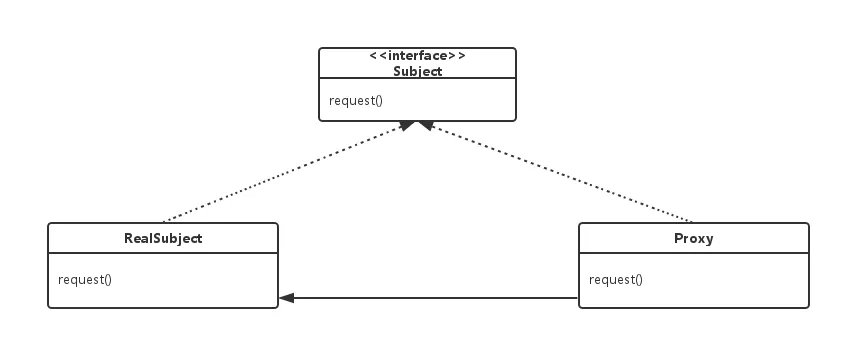
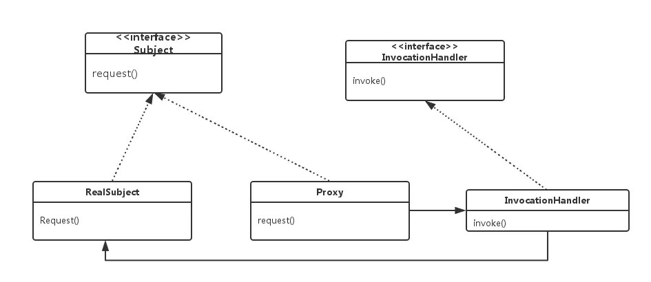

# 代理
## 静态代理

静态代理在程序运行前就已经存在代理类的代码了，代理对象和目标对象实现相同的接口，通过在代理对象中引入目标对象，在内部持有目标类的引用，控制对目标对象的访问，并可以在调用目标对象的方法前后添加一些自己的操作。

### 特点

代理对象和目标对象都要实现相同的接口，如果修改了接口的方法，相应的目标类、代理类都要修改。

需要为每一个目标类编写一个代理类，如果有上百个目标类，需要写上百个代理类，代码量相对较大。

### 使用场景

当代理的对象相对固定，且数量不多时适用静态代理。例如，在不修改原有代码的基础，为某个类的方法添加额外的操作，而且这些操作是通用的，比如日志记录、事务处理等。

* Subject --- 抽象主题类，定义了代理对象和真实对象的共同接口方法，既可以是接口也可以是抽象类。
* RealSubject --- 真实主题类，该类可以被称为被委托类或被代理类，该类定义了代理对象所表示的真实对象，实现了Subject接口，而Client端通过代理类间接的调用的真实主题类中的方法，由其执行真正的业务逻辑。
* ProxySubject --- 代理类，该类也被称为委托类或代理类，该类中持有一个真实主题类的引用，同样实现了Subject接口，在其实现的接口方法中调用真实主题类中相应的接口方法，以此起到代理的作用。
* Client --- 客户端，使用代理。

## 动态代理

与静态代理不同，动态代理在程序运行时动态创建代理对象和代理类。Java 中使用 java.lang.reflect.Proxy 类和 InvocationHandler 接口来实现动态代理。

## 特点

代理类不需要在编译时就存在，可以在运行时动态生成。

一个动态代理可以代理多个类，只要这些类实现了相同的接口。

### 使用场景

动态代理适用于代理的对象不固定或数量较多的情况。尤其是在需要大量实现相同接口的代理功能时，使用动态代理可以减少大量的重复代码。

其中Subject 、ProxySubject、 RealSubject和Client角色的作用和静态代理的一样，这里就多了一个InvocationHandler角色和一个Proxy角色，InvocationHandler是java提供的一个接口，我们需要定义一个类实现InvocationHandler接口，这里就叫InvocationHandler角色；Proxy这个类的作用就是用来动态的创建一个代理对象.

InvocationHandler

java提供了动态代理接口InvocationHandler和动态代理类Proxy供我们使用，它们都在java.lang.reflect包中，可见动态代理和反射有不可逃脱的关系。

InvocationHandler接口 定义如下：

	public interface InvocationHandler {
	  /**
	   * 这个方法的含义是：代理对象proxy要调用真实对象的method
	   * @param proxy 代理对象
	   * @param method 真实对象被调用的方法
	   * @param args 被调用的方法的参数
	   */
	  Object invoke(Object proxy, Method method, Object[] args）throws Throwable;
	}

Proxy

getProxyClass（重点方法）：这个方法的作用是在运行时根据.class的结构生成一个代理Class二进制流，并通过传入的ClassLoader去把代理Class二进制流加载成一个代理Class对象，该代理Class对象继承Proxy并实现了传入的第二个参数对应的Interface列表。

newProxyInstance(常使用的方法)： 这个方法的作用是在运行时根据代理Class对象生成代理对象实例，这个方法中会先调用了getProxyClass方法生成代理Class对象，在获取到代理Class对象后，根据第三个参数InvocationHandler引用通过反射创建代理对象实例，所以newProxyInstance最终的结果是生成一个代理对象实例，该代理对象会继承Proxy类并实现给定的接口列表，同时内部持有一个InvocationHandler引用。

	//实现了InvocationHandler接口的动态代理类
	public class DynamicProxy implements InvocationHandler {
	
	    private Object mObject;//真实对象的引用
	    
	    public DynamicProxy(Object object){
	        this.mObject = object;
	    }
	
	    @Override
	    public Object invoke(Object proxy, Method method, Object[] args) throws Throwable {
	        //通过反射调用真实对象的方法
	        Object result = method.invoke(mObject, args);
	        return result;
	    }
	}
	
	public class Client {
	    public static void main(String[] args) {
	        //构造一个小明
	        IRoom xiaoMing = new XiaoMing();
	        //构造一个动态代理
	        InvocationHandler dynamicProxy = new DynamicProxy(xiaoMing);
	        //获取被代理类小明的ClassLoader
	        ClassLoader classLoader = xiaoMing.getClass().getClassLoader();
	        
	        //1、通过Proxy类的newProxyInstance方法动态构造一个代理人房产中介
	        IRoom roomAgency = (IRoom) Proxy.newProxyInstance(classLoader, new Class[]{IRoom.class}, dynamicProxy);
	        
	        //调用代理对象的方法
	        
	        //房产中介找房
	        roomAgency.watchRoom();
	        //房产中介看房
	        roomAgency.seekRoom();
	        //房产中介租房
	        roomAgency.room();
	        //房产中介完成租房
	        roomAgency.finish();
	    }
	}

