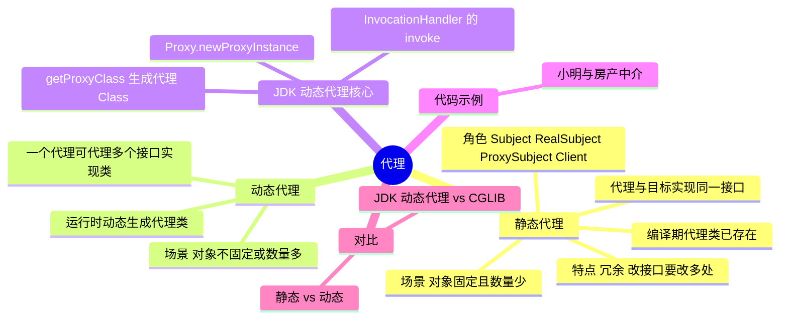
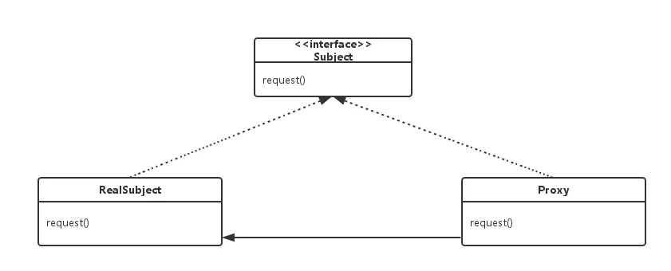
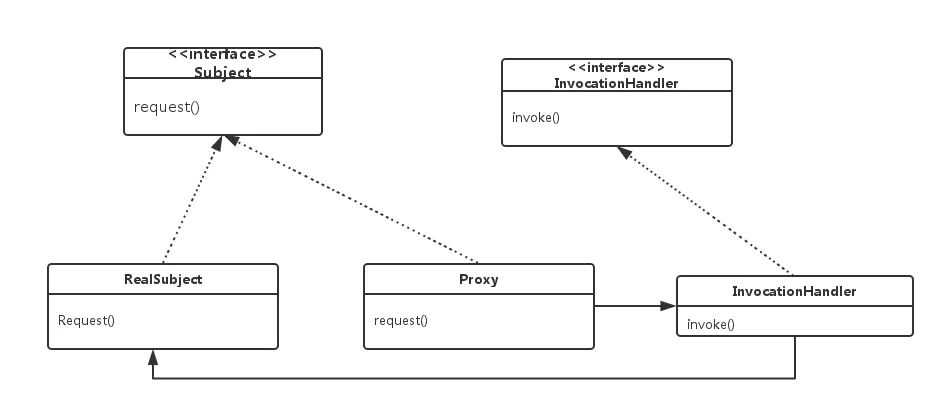

# 代理


```mermaid
mindmap
  root((代理))
    静态代理
      编译期代理类已存在
      代理与目标实现同一接口
      特点 冗余 改接口要改多处
      场景 对象固定且数量少
      角色 Subject RealSubject ProxySubject Client
    动态代理
      运行时动态生成代理类
      一个代理可代理多个接口实现类
      场景 对象不固定或数量多
    JDK 动态代理核心
      InvocationHandler 的 invoke
      Proxy.newProxyInstance
      getProxyClass 生成代理 Class
    代码示例
      小明与房产中介
    对比
      静态 vs 动态
      JDK 动态代理 vs CGLIB
```

---

## 一、代理模式与角色



- **Subject** --- 抽象主题类，定义了代理对象和真实对象的共同接口方法，既可以是接口也可以是抽象类。
- **RealSubject** --- 真实主题类，该类可以被称为被委托类或被代理类，该类定义了代理对象所表示的真实对象，实现了 Subject 接口，而 Client 端通过代理类间接地调用真实主题类中的方法，由其执行真正的业务逻辑。
- **ProxySubject** --- 代理类，该类也被称为委托类或代理类，该类中持有一个真实主题类的引用，同样实现了 Subject 接口，在其实现的接口方法中调用真实主题类中相应的接口方法，以此起到代理的作用。
- **Client** --- 客户端，使用代理。

---

## 二、静态代理

静态代理在程序运行前就已经存在代理类的代码了，代理对象和目标对象实现相同的接口，通过在代理对象中引入目标对象，在内部持有目标类的引用，控制对目标对象的访问，并可以在调用目标对象的方法前后添加一些自己的操作。

### 1. 特点

- 代理对象和目标对象都要实现相同的接口，如果修改了接口的方法，相应的目标类、代理类都要修改。
- 需要为每一个目标类编写一个代理类，如果有上百个目标类，需要写上百个代理类，代码量相对较大。

### 2. 使用场景

当代理的对象相对固定，且数量不多时适用静态代理。例如，在不修改原有代码的基础上，为某个类的方法添加额外的操作，而且这些操作是通用的，比如日志记录、事务处理等。

---

## 三、动态代理

与静态代理不同，动态代理在**程序运行时**动态创建代理对象和代理类。Java 中使用 `java.lang.reflect.Proxy` 类和 `InvocationHandler` 接口来实现动态代理。

### 1. 特点

- 代理类不需要在编译时就存在，可以在运行时动态生成。
- 一个动态代理可以代理多个类，只要这些类实现了相同的接口。

### 2. 使用场景

动态代理适用于代理的对象不固定或数量较多的情况。尤其是在需要大量实现相同接口的代理功能时，使用动态代理可以减少大量的重复代码。

### 3. 角色组成



其中 Subject、ProxySubject、RealSubject 和 Client 角色的作用和静态代理的一样，这里多了一个 **InvocationHandler 角色**和一个 **Proxy 角色**：

- **InvocationHandler** 是 Java 提供的一个接口，我们需要定义一个类实现 InvocationHandler 接口，这里就叫 InvocationHandler 角色；
- **Proxy** 这个类的作用就是用来动态地创建一个代理对象。

---

## 四、JDK 动态代理的两大核心

Java 提供了动态代理接口 `InvocationHandler` 和动态代理类 `Proxy` 供我们使用，它们都在 `java.lang.reflect` 包中，可见动态代理和反射有着不可逃脱的关系。

### 1. InvocationHandler

接口定义如下：

```java
public interface InvocationHandler {
  /**
   * 这个方法的含义是：代理对象proxy要调用真实对象的method
   * @param proxy 代理对象
   * @param method 真实对象被调用的方法
   * @param args 被调用的方法的参数
   */
  Object invoke(Object proxy, Method method, Object[] args) throws Throwable;
}
```

### 2. Proxy

- **`getProxyClass`（重点方法）**：在运行时根据 .class 的结构生成一个代理 Class 二进制流，并通过传入的 ClassLoader 把代理 Class 二进制流加载成一个代理 Class 对象，该代理 Class 对象继承 `Proxy` 并实现了传入的第二个参数对应的接口列表。
- **`newProxyInstance`（常使用的方法）**：在运行时根据代理 Class 对象生成代理对象实例。这个方法会先调用 `getProxyClass` 方法生成代理 Class 对象，拿到代理 Class 对象后，再根据第三个参数 `InvocationHandler` 引用通过反射创建代理对象实例。所以 `newProxyInstance` 最终的结果是生成一个代理对象实例，该代理对象会继承 `Proxy` 类并实现给定的接口列表，同时内部持有一个 `InvocationHandler` 引用。

---

## 五、完整代码示例

```java
//实现了InvocationHandler接口的动态代理类
public class DynamicProxy implements InvocationHandler {

    private Object mObject;//真实对象的引用

    public DynamicProxy(Object object){
        this.mObject = object;
    }

    @Override
    public Object invoke(Object proxy, Method method, Object[] args) throws Throwable {
        //通过反射调用真实对象的方法
        Object result = method.invoke(mObject, args);
        return result;
    }
}

public class Client {
    public static void main(String[] args) {
        //构造一个小明
        IRoom xiaoMing = new XiaoMing();
        //构造一个动态代理
        InvocationHandler dynamicProxy = new DynamicProxy(xiaoMing);
        //获取被代理类小明的ClassLoader
        ClassLoader classLoader = xiaoMing.getClass().getClassLoader();

        //1、通过Proxy类的newProxyInstance方法动态构造一个代理人房产中介
        IRoom roomAgency = (IRoom) Proxy.newProxyInstance(classLoader, new Class[]{IRoom.class}, dynamicProxy);

        //调用代理对象的方法

        //房产中介找房
        roomAgency.watchRoom();
        //房产中介看房
        roomAgency.seekRoom();
        //房产中介租房
        roomAgency.room();
        //房产中介完成租房
        roomAgency.finish();
    }
}
```

调用链：`roomAgency.watchRoom()` → 代理类 → `DynamicProxy.invoke()` → `method.invoke(mObject, args)` → 真实对象 `XiaoMing.watchRoom()`。

---

## 六、代理方式对比

### 1. 静态代理 vs 动态代理

| 维度 | 静态代理 | 动态代理 |
| --- | --- | --- |
| 代理类生成时机 | 编译期，运行前已存在 | 运行时动态生成 |
| 与目标类的关系 | 一个代理类对应一个目标类 | 一个 InvocationHandler 可代理多个实现同一接口的类 |
| 接口变更成本 | 目标类、代理类都要跟着改 | 代理类动态生成，无需手工维护 |
| 适用场景 | 代理对象固定、数量少 | 代理对象不固定、数量多 |
| 实现方式 | 手工编写代理类 | `java.lang.reflect.Proxy` + `InvocationHandler` |

### 2. JDK 动态代理 vs CGLIB

JDK 动态代理要求目标类必须实现接口；如果目标类没有接口，就需要用 CGLIB 这类字节码生成库：

| 维度 | JDK 动态代理 | CGLIB |
| --- | --- | --- |
| 实现原理 | 基于接口，运行时生成实现相同接口的代理类 | 基于继承，运行时生成目标类的子类 |
| 前提条件 | 目标类必须实现接口 | 目标类不能被 final 修饰，被代理方法不能是 final / private |
| 依赖 | JDK 自带（`java.lang.reflect`） | 需要引入第三方字节码库 |

---

## 七、30 秒口述版

代理的核心是**在不修改目标对象的前提下，控制对它的访问并附加额外逻辑**。静态代理在编译期就写好代理类，代理类和目标类实现同一接口——缺点是每个目标类都要写一个代理类，接口一变全都要改。动态代理在运行时用 `Proxy.newProxyInstance` 生成代理对象，把方法调用统一转发到 `InvocationHandler.invoke`，由它通过反射调用真实对象，因此一个处理器就能代理所有实现同一接口的类。JDK 动态代理基于接口，目标类没有接口时可用 CGLIB 基于继承生成子类。
