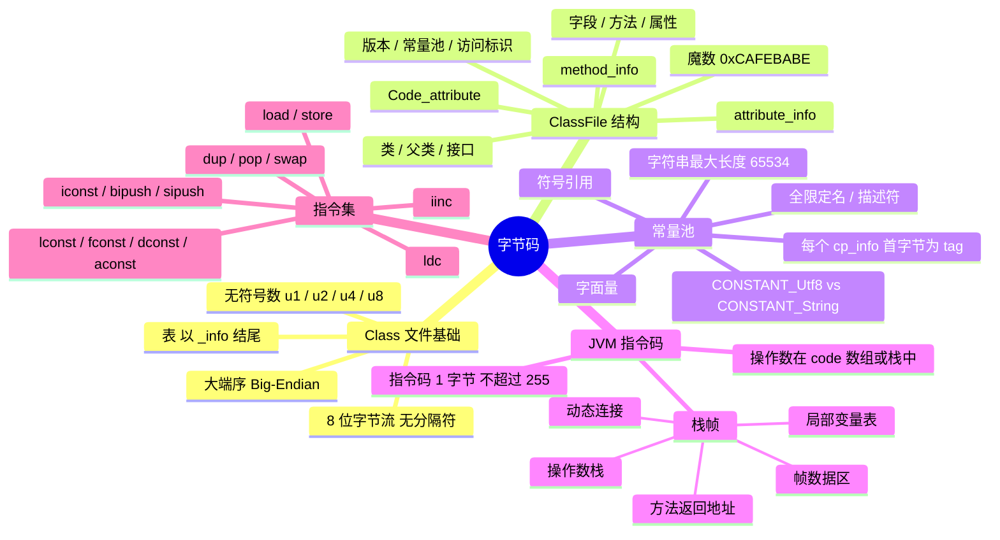

# 字节码

---

## 一、Class 文件基础

### 1. Class 文件的本质

- 一组以 **8 位字节**为基础单位的二进制流，各个数据项目严格按照顺序紧凑地排列在文件之中，中间没有添加任何分隔符，这使得整个 Class 文件中存储的内容几乎全部是程序运行的必要数据，没有空隙存在。
- 当遇到需要占用 8 位字节以上空间的数据项时，则会按照**高位在前**的方式分割成若干个 8 位字节进行存储。
- 高位在前指 "Big-Endian"，即最高位字节在地址最低位、最低位字节在地址最高位的顺序来存储数据；而 X86 等处理器则使用了相反的 "Little-Endian" 顺序。
- 对比 Linux、Windows 上的可执行文件（例如 ELF）而言，Class 文件可以看做是 **JVM 的可执行文件**。

### 2. 无符号数

- 属于基本的数据类型，以 **u1、u2、u4、u8** 分别代表 1 个字节、2 个字节、4 个字节和 8 个字节的无符号数。
- 无符号数可以用来描述数字、索引引用、数量值，或者按照 UTF-8 码构成的字符串值。

### 3. 表

- 由多个无符号数或者其他表作为数据项构成的复合数据类型，所有表都习惯性地以 **"_info"** 结尾。
- 例如 `cp_info constant_pool[constant_pool_count-1]` 表用于描述有层次关系的复合结构的数据。
- **整个 Class 文件本质上就是一张表。**

---

## 二、ClassFile 结构与各数据项

### 1. ClassFile 整体结构

| 数据项 | 类型 | 说明 |
| --- | --- | --- |
| magic | u4 | 魔法数字，表明当前文件是 .class 文件，固定 0xCAFEBABE |
| minor_version | u2 | Class 文件的副版本 |
| major_version | u2 | Class 文件的主版本 |
| constant_pool_count | u2 | 常量池计数 |
| constant_pool[constant_pool_count-1] | cp_info | 常量池内容 |
| access_flags | u2 | 类访问标识 |
| this_class | u2 | 当前类 |
| super_class | u2 | 父类 |
| interfaces_count | u2 | 实现的接口数 |
| interfaces[interfaces_count] | u2 | 实现接口信息 |
| fields_count | u2 | 字段数量 |
| fields[fields_count] | field_info | 包含的字段信息 |
| methods_count | u2 | 方法数量 |
| methods[methods_count] | method_info | 包含的方法信息 |
| attributes_count | u2 | 属性数量 |
| attributes[attributes_count] | attribute_info | 各种属性 |

### 2. attribute_info（属性表）

| 数据项 | 类型 |
| --- | --- |
| attribute_name_index | u2 |
| attribute_length | u4 |
| info[attribute_length] | u1 |

### 3. method_info（方法表）

| 数据项 | 类型 |
| --- | --- |
| access_flags | u2 |
| name | u2 |
| descriptor_index | u2 |
| attributes_count | u2 |
| attributes[attributes_count] | attribute_info |

### 4. Code_attribute（方法体）

| 数据项 | 类型 | 说明 |
| --- | --- | --- |
| attribute_name_index | u2 | 属性名索引 |
| attribute_length | u4 | 属性长度 |
| max_stack | u2 | 操作数栈最大深度 |
| max_locals | u2 | 局部变量表最大容量 |
| code_length | u4 | 字节码长度 |
| code[code_length] | u1 | 字节码指令 |
| exception_table_length | u2 | 异常表长度 |
| exception_table[exception_table_length] | exception_table | 异常处理表 |
| attributes_count | u2 | 属性数量 |
| attributes[attributes_count] | attribute_info | 属性信息 |

其中 `exception_table` 的每一项由 4 个 u2 组成：

- `start_pc`：异常处理生效的起始字节码位置
- `end_pc`：异常处理生效的结束字节码位置
- `handler_pc`：异常处理代码的起始位置
- `catch_type`：捕获的异常类型

---

## 三、常量池

### 1. 常量池是什么

可以理解为 **Class 文件之中的资源仓库**，其它的几种结构或多或少都会最终指向到这个资源仓库之中。

### 2. 字面量与符号引用

- **字面量**：比较接近于 Java 语言层面的常量概念，如文本字符串、声明为 final 的常量值等。
- **符号引用**：属于编译原理方面的概念，包括了三类常量：
  1. 类和接口的全限定名（Fully Qualified Name）
  2. 字段的名称和描述符（Descriptor）
  3. 方法的名称和描述符

### 3. cp_info 与 tag

`constant_pool` 中存储了一个一个的 `cp_info` 信息，并且每一个 `cp_info` 的第一个字节（即一个 u1 类型的标志位）标识了当前常量项的类型，其后才是具体的常量项内容。

### 4. CONSTANT_Utf8 与 CONSTANT_String 的区别

- **CONSTANT_Utf8**：真正存储了字符串的内容，其对应的数据结构中有一个字节数组，字符串便酝酿其中。
- **CONSTANT_String**：本身不包含字符串的内容，但其具有一个指向 CONSTANT_Utf8 常量项的索引。

### 5. 为什么常量池能节省空间

- 在所有常见的常量项之中，只要是需要表示字符串的地方，其实际都会包含有一个指向 `CONSTANT_Utf8_info` 元素的索引。
- 一个字符串最大长度即 u2 所能代表的最大值为 65536，但是需要使用 2 个字节来保存 null 值，所以**一个字符串的最大长度为 65534**。
- 每一个非基本类型的常量项之中，除了其 tag 之外，最终包含的内容都是字符串。**正是这种互相引用的模式，才能有效地节省 Class 文件的空间。**

---

## 四、JVM 指令码与栈帧

### 1. 指令码与操作数

`Code_attribute` 中的 code 数组存储了一个函数源码经过编译后得到的 JVM 字节码，其中仅包含如下两种类型的信息：

1. **JVM 指令码**：用于指示 JVM 执行的动作，例如加操作/减操作/new 对象。其长度为 1 个字节，所以 JVM 指令码的个数不会超过 255 个（0xFF）。
2. **JVM 指令码后的零至多个操作数**：操作数可以存储在 code 数组中，也可以存储在操作数栈（Operand stack）中。

### 2. 栈帧

运行时的栈帧中存储了方法的**局部变量表、操作数栈、动态连接和方法返回地址、帧数据区**等信息。每一个方法从调用开始至执行完成的过程，都对应着一个栈帧在虚拟机栈里面从入栈到出栈的过程。

### 3. 局部变量区与存取指令

局部变量区一般用来缓存计算的结果。实际上，JVM 会把局部变量区当成一个**数组**，里面会依次缓存 this 指针（非静态方法）、参数、局部变量。需要注意的是，同操作数栈一样，**long 和 double 类型的值将占据两个单元，而其它的类型仅仅占据一个单元**。

- **将局部变量区的值加载到操作数栈中**：

  | 类型 | 指令 |
  | --- | --- |
  | int（boolean、byte、char、short） | iload |
  | long | lload |
  | float | fload |
  | double | dload |
  | reference | aload |

- **将操作数栈中的计算结果存储在局部变量区中**：

  | 类型 | 指令 |
  | --- | --- |
  | int（boolean、byte、char、short） | istore |
  | long | lstore |
  | float | fstore |
  | double | dstore |
  | reference | astore |

- **增值指令**：`iinc`。

### 4. 操作数栈与常用指令

操作数栈是为了**存放计算的操作数和返回结果**。在执行每一条指令前，JVM 要求该指令的操作数已经被压入到操作数栈中；并且，在执行指令时，JVM 会将指令所需的操作数弹出，并将计算结果压入操作数栈中。

**1）直接作用于操作数栈的指令：**

- `dup`：复制栈顶元素，常用于复制 new 指令所生成的未初始化的引用。
- `pop`：舍弃栈顶元素，常用于舍弃调用指令的返回结果。
- `swap`：交换栈顶的两个元素的值。
- 需要注意的是，当值为 long 或 double 类型时，需要占用两个栈单元，此时需要使用 `dup2`/`pop2` 指令替代 `dup`/`pop` 指令。

**2）直接将常量加载到操作数栈的指令：**

- 对于 int（boolean、byte、char、short）类型来说，有如下三类常用指令：
  - `iconst`：用于加载 [-1, 5] 的 int 值。
  - `bipush`：用于加载一个字节（byte）所能代表的 int 值即 [-128, 127]。
  - `sipush`：用于加载两个字节（short）所能代表的 int 值即 [-32768, 32767]。
- 而对于 long、float、double、reference 类型来说，各个类型都仅有一类，其实就是类似于 iconst 指令，即 `lconst`、`fconst`、`dconst`、`aconst`。

**3）加载常量池中的常量值的指令：**

- `ldc`：用于加载常量池中的常量值，如 int、long、float、double、String、Class 类型的常量。例如 `ldc #35` 将加载常量池中的第 35 项常量值。

### 5. 帧数据区（常量池引用）

帧数据区中保存着**常量池引用**等信息，栈帧内的指令通过它解析符号引用；与之并列的还有**动态连接**（指向运行时常量池中该栈帧所属方法的引用）和**方法返回地址**（方法退出后返回到调用者的位置）。

---

## 五、一句话总结

Class 文件是 JVM 的可执行文件：一张以 8 位字节为单位、大端序紧凑排列的表，由 u1/u2/u4/u8 无符号数和各种 `_info` 表构成。常量池是它的资源仓库，靠 `cp_info` 之间的互相引用（尤其是统一指向 CONSTANT_Utf8）来压缩体积；方法的 code 数组里则是指令码 + 操作数，配合栈帧中的局部变量表和操作数栈完成执行。
