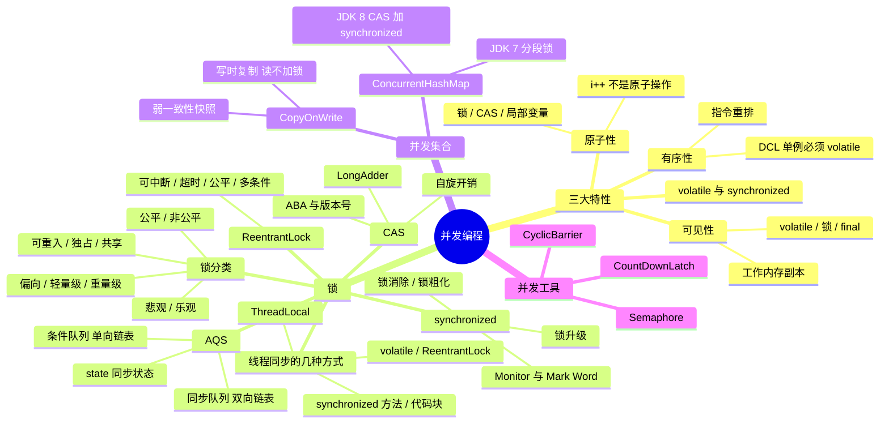

# 并发编程



---

## 一、整体概览

并发编程的 bug 基本都能归到三大特性上：原子性被破坏会丢更新，可见性被破坏会读到旧值，有序性被破坏会看到「构造了一半」的对象。锁、CAS、volatile、并发容器和并发工具，本质上都是在用不同的代价去换这三条性质。参考[《Java并发编程艺术》](./Java并发编程艺术.md)。

本文脉络：

- 三大特性：原子性、可见性、有序性
- 锁：线程同步方式、锁分类、CAS、synchronized、AQS、ReentrantLock
- 并发集合底层源码：CopyOnWrite、ConcurrentHashMap
- 并发工具底层源码：CountDownLatch、Semaphore

线程状态、任务体系（Runnable / Callable / Future）、线程池与死锁独立成篇，见[《线程、线程池、死锁》](./线程、线程池、死锁.md)。

---

## 二、并发编程三大特性

### 1. 原子性

- 一个或多个操作要么全部执行且执行过程不被中断，要么全部不执行。
- `i++` 不是原子操作，它由「读 i → 计算 i+1 → 写回 i」三步组成，多线程下会丢更新；同样，`i = i + 1`、`if (i == 1) i = 2;` 这类复合操作也不具备原子性。
- 32 位 JVM 上，没有被 volatile 修饰的 long/double 的读写在 JMM 中允许拆成两次 32 位操作，因此也不保证原子性（64 位 JVM 一般不会，但规范并不保证）。
- 保证方式：synchronized、Lock、Atomic 系列（底层 CAS）、把共享变量变成线程私有（局部变量、ThreadLocal）。
- volatile 只保证单次读/写的原子性，不保证 `i++` 这类复合操作的原子性。

### 2. 可见性

- 一个线程修改了共享变量的值，其他线程能够立即看到这个修改。
- 根因是 CPU 多级缓存加上 JMM 的「工作内存」抽象：线程读写的是自己工作内存里的副本，看不到其他线程的写。
- 保证方式：
    - volatile：写时立即写回主内存并使其他 CPU 上该缓存行失效，读时从主内存重新读取。
    - synchronized / Lock：解锁前把修改刷新回主内存，加锁时清空工作内存中共享变量的副本，从主内存重新读取。
    - final：被 final 修饰的字段在构造器中一旦初始化完成，并且构造器没有把 this 引用逸出，其他线程就能看到 final 字段的正确值。
    - 线程的启动、中断、终止等操作也会建立 happens-before 关系，把之前线程的写传递给后续线程。

### 3. 有序性

- 编译器、处理器为了优化会做指令重排。单线程内重排要遵守 as-if-serial（不改变单线程的执行结果），但多线程下重排会让结果出乎意料，最典型的就是双重检查锁定（DCL）的单例：`instance = new Singleton()` 被拆成「分配内存 → 初始化对象 → 赋值引用」，第 2、3 步重排后，另一个线程可能拿到一个还没初始化完的对象，所以 DCL 中的 instance 必须用 volatile 修饰。
- 保证方式：
    - volatile：通过内存屏障禁止重排。
    - synchronized：同一个锁的临界区串行执行，天然有序。
    - happens-before 规则：程序顺序规则、监视器锁规则、volatile 变量规则、传递性等，详见[《Java并发编程艺术》](./Java并发编程艺术.md#happen-before)。

### 4. volatile 与 synchronized

- volatile 本质是在告诉 JVM 当前变量在寄存器（工作内存）中的值是不确定的，需要从主存中读取；synchronized 则是锁定当前变量，只有当前线程可以访问该变量，其他线程被阻塞住。
- volatile 变量对所有线程是立即可见的，对 volatile 变量的所有写操作都能立刻反应到其他线程之中。JVM 规范规定了任何一个线程修改了 volatile 变量的值都需要立即将新值更新到主内存中，任何线程任何时候使用到 volatile 变量时都需要重新获取主内存的变量值。
- 具体来说，volatile 的实现靠两条：一是写操作加上 Lock 前缀指令，引起处理器缓存回写到内存；二是这个回写会让其他处理器上对应的缓存行失效，其他处理器再次访问时只能重新从主内存读取。
- 即使是 64 位的 long 和 double 变量，只要它是 volatile 变量，对该变量的读/写就具有原子性。但多个 volatile 操作或者 `volatile++` 这种复合操作，整体上仍然不具备原子性。

两者的区别：

| 维度 | volatile | synchronized |
| --- | --- | --- |
| 作用范围 | 仅能使用在变量级别 | 可以使用在变量、方法和类级别 |
| 原子性 | 仅能实现变量的修改可见性，不能保证原子性 | 既能保证可见性也能保证原子性 |
| 阻塞 | 不会造成线程的阻塞 | 可能会造成线程的阻塞 |
| 优化 | 标记的变量不会被编译器优化（禁止指令重排序，执行顺序与程序顺序一致） | 标记的代码块可以被编译器优化，例如锁消除、锁粗化 |

---

## 三、锁

### 1. 线程同步有几种方式

#### （1）为何要使用同步？

java 允许多线程并发控制，当多个线程同时操作一个可共享的资源变量时（如数据的增删改查），将会导致数据不准确，相互之间产生冲突，因此加入同步锁以避免在该线程没有完成操作之前，被其他线程的调用，从而保证了该变量的唯一性和准确性。

#### （2）同步方法

即有 synchronized 关键字修饰的方法。由于 java 的每个对象都有一个内置锁，当用此关键字修饰方法时，内置锁会保护整个方法。在调用该方法前，需要获得内置锁，否则就处于阻塞状态。

```java
public synchronized void save(){}
```

注：synchronized 关键字也可以修饰静态方法，此时如果调用该静态方法，将会锁住整个类。

#### （3）同步代码块

即有 synchronized 关键字修饰的语句块，被该关键字修饰的语句块会自动被加上内置锁，从而实现同步。

```java
synchronized(object){
}
```

注：同步是一种高开销的操作，因此应该尽量减少同步的内容。通常没有必要同步整个方法，使用 synchronized 代码块同步关键代码即可。

#### （4）使用特殊域变量（volatile）实现线程同步

- volatile 关键字为域变量的访问提供了一种免锁机制。
- 使用 volatile 修饰域相当于告诉虚拟机该域可能会被其他线程更新，因此每次使用该域就要重新计算，而不是使用寄存器中的值。
- volatile 不会提供任何原子操作，它也不能用来修饰 final 类型的变量。

注：多线程中的非同步问题主要出现在对域的读写上，如果让域自身避免这个问题，则就不需要修改操作该域的方法。用 final 域、有锁保护的域和 volatile 域可以避免非同步的问题。

#### （5）使用重入锁实现线程同步

在 JavaSE5.0 中新增了 java.util.concurrent 包来支持同步。ReentrantLock 类是可重入、互斥、实现了 Lock 接口的锁，它与使用 synchronized 方法和块具有相同的基本行为和语义，并且扩展了其能力。ReentrantLock 类的常用方法有：

- ReentrantLock()：创建一个 ReentrantLock 实例。
- lock()：获得锁。
- unlock()：释放锁。

注：ReentrantLock() 还有一个可以创建公平锁的构造方法，但由于能大幅度降低程序运行效率，不推荐使用。

注：关于 Lock 对象和 synchronized 关键字的选择：

- 最好两个都不用，使用一种 java.util.concurrent 包提供的机制，能够帮助用户处理所有与锁相关的代码。
- 如果 synchronized 关键字能满足用户的需求，就用 synchronized，因为它能简化代码。
- 如果需要更高级的功能，就用 ReentrantLock 类，此时要注意及时释放锁，否则会出现死锁，通常在 finally 代码块释放锁。

#### （6）使用局部变量实现线程同步

如果使用 ThreadLocal 管理变量，则每一个使用该变量的线程都获得该变量的副本，副本之间相互独立，这样每一个线程都可以随意修改自己的变量副本，而不会对其他线程产生影响。ThreadLocal 类的常用方法：

- ThreadLocal()：创建一个线程本地变量。
- get()：返回此线程局部变量的当前线程副本中的值。
- initialValue()：返回此线程局部变量的当前线程的「初始值」。
- set(T value)：将此线程局部变量的当前线程副本中的值设置为 value。

注：ThreadLocal 适合把「本可以做成方法参数」的状态藏在线程里，用完记得 remove()，否则在线程池场景下会随线程复用而泄漏。

### 2. 锁分类

| 分类维度 | 类型 | 说明 |
| --- | --- | --- |
| 加锁时是否乐观 | 悲观锁 / 乐观锁 | 悲观锁先加锁再操作（synchronized、ReentrantLock）；乐观锁先操作，提交时校验有没有被改过（CAS、版本号） |
| 竞争时是否排队 | 公平锁 / 非公平锁 | 公平锁按申请顺序获取，避免饥饿但吞吐低；非公平锁直接抢、允许插队，吞吐高。ReentrantLock 通过构造参数控制，默认非公平；synchronized 是非公平的 |
| 同一线程能否重复获取 | 可重入锁 / 不可重入锁 | 可重入锁重入时 state/计数器 +1（synchronized、ReentrantLock） |
| 共享方式 | 独占锁 / 共享锁 | 独占锁同一时刻只允许一个线程持有，共享锁允许多个线程持有。ReentrantReadWriteLock 中写锁独占、读锁共享；StampedLock 进一步提供乐观读 |
| JVM 中的锁状态 | 无锁 → 偏向锁 → 轻量级锁 → 重量级锁 | synchronized 的锁升级路径，只能升级不能降级 |
| 获取失败后的行为 | 阻塞锁 / 自旋锁 / 自适应自旋 | 阻塞锁挂起线程不占 CPU；自旋锁循环重试不放弃 CPU；自适应自旋的次数由上一次在同一个锁上的自旋结果决定 |
| 作用对象 | 对象锁 / 类锁 | 对象锁锁实例（普通同步方法或 `synchronized(this)`），类锁锁 Class 对象（静态同步方法或 `synchronized(Xxx.class)`） |
| 加锁粒度 | 粗粒度锁 / 分段锁 | JDK 7 的 ConcurrentHashMap 用 Segment 分段加锁，降低锁竞争 |
| 是否可中断/超时 | 不可中断 / 可中断 / 可超时 | 对应的获取方式：一直等待、lockInterruptibly、tryLock(timeout) |

### 3. CAS

CAS 全称 Compare And Swap（比较并交换），是一种无锁的原子操作，也是乐观锁最常见的实现方式。

- 语义：CAS 有三个操作数——内存值 V、预期旧值 E、新值 N。仅当 V 等于 E 时，才把 V 更新为 N，否则什么都不做，无论成功与否都返回 V 的旧值（决定是否需要重试）。
- 实现：由处理器提供的 cmpxchg 指令实现，本身不是原子的，要靠 lock 前缀（总线锁或缓存锁）来保证整个操作的原子性。使用总线锁时，处理器在总线上声明 LOCK# 信号，其他处理器的请求会被阻塞，该处理器独占共享内存；使用缓存锁时，处理器只修改内部的内存地址，靠缓存一致性机制阻止同时修改两个以上处理器缓存的内存区域。
- Java 中通过 sun.misc.Unsafe 提供的 compareAndSwapInt、compareAndSwapLong、compareAndSwapObject 等本地方法调用，JDK 9 之后推荐用 java.lang.invoke.VarHandle 替代：
    - AtomicInteger 等原子类的自增、自减，都是「循环 CAS 直到成功」的自旋写法。
    - AQS 中通过 CAS 修改同步状态 state。
    - JDK 8 的 ConcurrentHashMap 用 CAS 插入空桶，用 CAS 修改 sizeCtl 触发扩容。

模拟一次 CAS 自旋：

```java
public final int incrementAndGet() {
    for (;;) {
        int current = get();
        int next = current + 1;
        if (compareAndSet(current, next))
            return next;
    }
}
```

CAS 的三个问题：

- ABA 问题：线程 1 读到 A，线程 2 把 A 改成 B 又改回 A，线程 1 的 CAS 仍然成功，但中间状态已经丢失。解决办法是加版本号，用 AtomicStampedReference（版本号）或 AtomicMarkableReference（布尔标记）；如果只关心最终值是否相等（如数值累加），ABA 并不影响正确性。
- 循环时间长开销大：自旋 CAS 长时间不成功会一直占用 CPU。高并发计数场景可以用 JDK 8 的 LongAdder/DoubleAdder，把热点分散到多个 Cell 上，最后再汇总，以空间换吞吐。
- 只能保证一个共享变量的原子操作：多个共享变量要么封装成一个对象用 AtomicReference 操作，要么直接加锁。

### 4. synchronized

#### （1）用法与原理

三种用法，锁对象各不相同：

- 普通同步方法：锁是当前实例对象。
- 静态同步方法：锁是当前类的 Class 对象。
- 同步方法块：锁是 synchronized 括号里配置的对象。

JVM 基于进入和退出 Monitor 对象来实现方法同步和代码块同步：

- 同步代码块编译成字节码后，在入口和出口处分别插入 monitorenter 和 monitorexit 指令；编译器还会自动生成一个异常处理器，保证抛异常时也能退出 Monitor（这也是为什么 synchronized 不需要手动释放锁）。
- 同步方法则是在方法访问标志上打一个 ACC_SYNCHRONIZED 标志，JVM 在方法调用时隐式地获取和释放 Monitor。
- Monitor（ObjectMonitor）由 Object 对象头中的 Mark Word 指向，Mark Word 同时还保存了 hashCode、GC 分代年龄以及锁状态标志位。重量级锁最终会调用操作系统的 Mutex Lock，涉及用户态与内核态的切换，这也是「重量级」的由来。

#### （2）锁升级

锁一共有 4 种状态，级别从低到高依次是：无锁状态、偏向锁状态、轻量级锁状态和重量级锁状态。锁可以升级但不能降级，目的是为了提高获得锁和释放锁的效率。

- 偏向锁：Mark Word 中记录持有锁的线程 ID，该线程再次进入同步块时不需要任何 CAS 操作。适用于同一个线程反复进入同步块的场景。偏向锁的撤销需要等待全局安全点（safepoint），副作用是停顿时间长，所以 JDK 15 起（JEP 374）已经默认关闭。
- 轻量级锁：线程进入同步块前，先在当前线程的栈帧中创建锁记录（Lock Record）的空间，把对象头的 Mark Word 复制进去，然后用 CAS 把对象头的 Mark Word 替换为指向锁记录的指针；成功即获得锁，失败说明存在竞争，先自旋若干次，自旋失败锁就膨胀为重量级锁。
- 重量级锁：竞争失败的线程直接挂起（放入 Monitor 的 EntryList 等待），不再消耗 CPU 自旋。

除了偏向锁，JVM 实现锁的方式都用了循环 CAS：线程进入同步块时循环 CAS 获取锁，退出时循环 CAS 释放锁。

#### （3）其他优化

- 锁消除：基于逃逸分析，如果判断一段代码中涉及的共享变量不会逃逸出当前线程，就把锁去掉。例如方法内部局部使用的 StringBuffer，其 append 是同步方法，但对象只在本线程可见，编译后同步操作会被消除。
- 锁粗化：把循环体内反复加锁、解锁的操作合并成一次范围更大的加锁，减少无谓的加锁开销。
- 自适应自旋：自旋的次数不再固定，而是由前一次在同一个锁上的自旋时间以及锁的拥有者的状态来决定。

### 5. AQS（AbstractQueuedSynchronizer）

AQS 是 java.util.concurrent 中同步组件的基础框架，ReentrantLock、ReentrantReadWriteLock、Semaphore、CountDownLatch，甚至 ThreadPoolExecutor 里的 Worker 都建立在它之上。它的思路是：把「排队、阻塞、唤醒」这些通用又繁琐的逻辑在 AQS 里一次性实现好，只留一个同步状态 state 和几个 try 开头的方法给子类去定义「什么算获取成功」，典型的模板方法模式（获取/释放的骨架都是 final 的，子类改不了）：

```java
protected boolean tryAcquire(int arg) {
    throw new UnsupportedOperationException();
}
```

- 独占模式：acquire(int)、release(int)，对应子类实现 tryAcquire(int)、tryRelease(int)。
- 共享模式：acquireShared(int)、releaseShared(int)，对应子类实现 tryAcquireShared(int)、tryReleaseShared(int)。

#### （1）state 同步状态

`private volatile int state;` 用一个 int 表示同步状态，具体含义由子类定义：

- ReentrantLock：state 表示锁被重入的次数。0 表示锁空闲，大于 0 表示已被持有，持有线程再次 lock() 时 state 加 1、unlock() 时减 1，减到 0 才真正释放锁，这就是「可重入」的实现方式。
- ReentrantReadWriteLock：把 state 按位拆开，高 16 位是读状态（读锁被获取的总次数），低 16 位是写状态（写锁的重入次数）。
- Semaphore：state 表示当前可用的许可（permit）数量。
- CountDownLatch：state 表示还剩下多少计数。

state 用 volatile 修饰保证可见性，用 CAS 修改保证原子性（所以它设计成 int 而不是 long，32 位机器上一次 CAS 就能改完）。子类通过 getState()、setState(int)、compareAndSetState(expect, update) 这三个 protected final 方法读写它。

#### （2）同步队列：双向链表

获取同步状态失败的线程，会被包装成 Node 节点放入一个 FIFO 的同步队列（CLH 锁队列的变体，区别是把原来的自旋改成了阻塞），节点在队列里等前驱节点来唤醒自己，而不是自己轮询：

```java
static final class Node {
    volatile int waitStatus;   // 等待状态：CANCELLED(1)、SIGNAL(-1)、CONDITION(-2)、PROPAGATE(-3)、0
    volatile Node prev;        // 前驱节点
    volatile Node next;        // 后继节点
    volatile Thread thread;    // 节点对应的线程
    Node nextWaiter;           // 用于条件队列，在同步队列里则兼作模式标记（SHARED / EXCLUSIVE）
}

private transient volatile Node head;
private transient volatile Node tail;
```

- head 是队头，指向刚刚获取到锁（或刚刚释放锁）的节点，它是一个哑节点（dummy），thread 会被置为 null；tail 是队尾，新节点通过 CAS 挂到 tail 后面。
- 节点入队后不会一直自旋占 CPU，而是调用 LockSupport.park() 挂起；释放锁的线程会找到 head 的后继节点（waitStatus 为 SIGNAL 的那个）把它唤醒。
- 为什么必须是双向链表：
    - 释放锁后要唤醒后继者，需要 next 指针定位下一个等待节点。
    - 等待超时或被中断的节点要取消等待，就得把自己从队列中间摘掉（node.prev.next = node.next），这需要 prev 指针。
    - 唤醒时还要从当前节点往前回溯，跳过一连串已经取消（CANCELLED）的前驱，找到真正该负责唤醒自己的那个前驱，这也只能靠 prev。
- 入队（修改 tail）用 CAS 完成，出队（修改 head）只发生在持有锁的线程里，所以出队不需要 CAS。
- 队列本身是 FIFO 的，先入队的先拿到锁；但非公平模式下刚到的线程可以直接抢锁（插队），公平模式才严格按队列顺序来——ReentrantLock 的公平与否，差别就在 tryAcquire 里有没有多判断一次「前面还有没有人在排队」。

#### （3）条件队列：单向链表

一个 AQS 里除了同步队列，还可以有多个条件队列（每调用一次 newCondition() 就多一个）。

- 线程调用 await() 时，会释放锁，并把自己包装成节点加入条件队列，然后挂起。
- 其他线程调用 signal() 时，会把条件队列里的第一个节点转移到同步队列的队尾，让它重新去竞争锁。
- 条件队列是单向链表，只用 Node 的 nextWaiter 指针串联，入口只有 firstWaiter 和 lastWaiter 两个指针（ConditionObject 的成员）。
- 为什么是单向链表：
    - 条件队列上的节点只有两种去向——从队尾追加进来、从队头被 signal 转移走，不需要从中间摘除某个节点，也就用不上 prev 指针。
    - 节点被转移到同步队列后，改用 next/prev 参与双向链表，nextWaiter 就功成身退了。也就是说同一个 Node 对象会在两个队列之间「搬家」，靠 waitStatus 区分自己当前属于哪个队列（CONDITION 表示在条件队列，转入同步队列时会被改成 0），不需要新建对象。
    - 代价是取消等待的节点只能从队头开始遍历着摘除（unlinkCancelledWaiters），所以条件队列里的等待都是短生命周期的。
- 一个锁可以对应多个条件队列，可以精确地唤醒某一类等待线程，这也是 ReentrantLock 相比 synchronized（只有一个对象监视器，只有一组 wait/notify）的优势之一。

### 6. ReentrantLock

ReentrantLock 实现了 Lock 接口，是基于 AQS（AbstractQueuedSynchronizer）构建的独占式可重入锁，它提供了 synchronized 所不具备的可中断、可超时、公平性和多条件变量等能力。

- 重入：每重入一次，AQS 的同步状态 state 加 1，释放时减 1，减到 0 才真正释放锁。
- 公平/非公平：构造方法传 true 得到公平锁，在绝对时间上先请求锁的线程一定先被满足；默认非公平，允许刚到的线程插队，吞吐更高但可能造成饥饿。
- 可中断与超时：lockInterruptibly() 在等待锁时可以响应中断，tryLock(timeout, unit) 超时后放弃获取，这两个能力是打破死锁的关键——配合固定的加锁顺序使用。
- 条件变量：Condition 的 await/signal/signalAll 与 Lock 配合实现等待/通知，相比 Object 的 wait/notify，一个锁可以创建多个 Condition，从而精确地唤醒某一类等待线程。
- 注意：lock() 之后必须在 finally 中 unlock()，否则一旦业务代码抛异常，锁永远不会释放。
- 并发包中 AQS 的同步队列、独占式获取与释放、Condition 的实现细节见[《Java并发编程艺术》](./Java并发编程艺术.md#锁)。

```java
ReentrantLock lock = new ReentrantLock();
lock.lock();
try {
    // 临界区
} finally {
    lock.unlock();
}
```

与 synchronized 的对比：

| 维度 | synchronized | ReentrantLock |
| --- | --- | --- |
| 实现层面 | JVM 层面的关键字，基于对象头 Mark Word 与 Monitor | JDK 层面基于 AQS 的 API |
| 释放 | 自动释放锁 | 需要手动在 finally 中释放 |
| 公平性 | 只能是非公平锁 | 可以构造公平锁 |
| 灵活性 | 只能一直等待 | 支持可中断获取、超时获取、尝试获取（tryLock 立即返回） |
| 条件变量 | 只能配合一个对象监视器（wait/notify） | 可以绑定多个 Condition |
| 性能 | JDK 6 之后 JVM 做了大量优化（偏向锁、轻量级锁、锁消除） | 两者性能差距已经很小，不应该再把「性能」作为选型依据 |

选型：能用 synchronized 就用 synchronized，代码简洁且不会忘记释放；需要公平锁、超时、可中断或者多个条件变量时，才用 ReentrantLock。

---

## 四、并发集合

### 1. CopyOnWrite

CopyOnWrite（写时复制）的思路是：读操作不加锁，写操作上锁并复制一份新数组，在副本上修改，改完把数组引用指向新数组。引用是 volatile 的，所以其他线程能立刻读到新数组。

- 代表类：CopyOnWriteArrayList、CopyOnWriteArraySet（内部就是 CopyOnWriteArrayList）。
- 读操作（get、迭代）全程不加锁，直接读当前数组的引用，因此读性能极高，也不会抛 ConcurrentModificationException。
- 迭代器是「快照」式的，拿到的是创建迭代器那一刻的数组，迭代过程中其他线程的修改不可见，属于弱一致性（weakly consistent）——不保证实时性，但保证不抛异常。
- 缺点：每次写都要复制整个数组，内存开销大、写性能差；数组很大或者写很频繁时完全不适合；复制期间可能同时存在两个数组，占用双倍内存。
- 适用场景：读多写极少，且能容忍最终一致性，例如监听器列表、配置白名单、黑名单。

### 2. ConcurrentHashMap

HashMap 线程不安全，并发 put 在 JDK 7 会形成环形链表导致死循环（JDK 8 修复了成环，但仍然会丢数据）；HashTable 对所有方法加同一把锁，读写共用一把锁，效率低下。ConcurrentHashMap 是这两者的替代方案，详细演进见 [ConcurrentHashMap](./ConcurrentHashMap.md)。

- JDK 7：采用分段锁（Segment）设计，Segment 继承 ReentrantLock，每个 Segment 里是一个 HashEntry 数组。不同段之间的访问互不影响，并发度等于段的数量（默认 16），理论上支持 16 个线程同时写。size() 会先不加锁统计两次，两次结果不同再加锁统计，因为可能修改了两次导致计数抵消。
- JDK 8：废弃分段锁，改成「数组 + 链表 + 红黑树」的结构（与 HashMap 一致）。插入空桶用 CAS，桶非空时用 synchronized 锁住桶的头节点，锁的粒度从段细化到了单个桶的头节点。
- 链表长度达到 8 且数组长度不小于 64 时，链表转为红黑树，把查询复杂度从 O(n) 降到 O(log n)；节点数降到 6 时退化回链表。
- size 统计使用 baseCount + CounterCell 数组分散累加，避免所有线程竞争同一个计数器（与 LongAdder 同思路）。
- 扩容支持多线程协助：扩容期间已迁移的桶被替换成 ForwardingNode，其他线程遇到它就一起参与迁移，而不是干等。
- ConcurrentHashMap 不允许 key 或 value 为 null，因为无法区分「没找到」和「值为 null」。
- ConcurrentHashMap 只保证单个操作的原子性，`if (!map.containsKey(k)) map.put(k, v);` 这样的复合操作仍然需要额外同步（用 putIfAbsent 或者 computeIfAbsent）。

---

## 五、并发工具

### 1. CountDownLatch

CountDownLatch 是一个「倒计时门闩」，它允许一个或多个线程等待其他线程完成一组操作后再继续执行。内部基于 AQS 的共享模式实现：state 就是计数器，countDown() 递减 state，await() 在 state 不为 0 时把自己挂到同步队列上，state 减到 0 时唤醒所有等待的线程。

- 构造方法传入初始计数：`new CountDownLatch(n)`。
- await()：阻塞当前线程，直到计数减到 0；await(timeout, unit) 支持超时返回。
- countDown()：计数减 1，减到 0 时唤醒所有 await 的线程。
- 是一次性的，计数归零后不能再重置，需要重复计数请用 CyclicBarrier。

两个典型用法：

- 一等多：主线程 await，等所有子任务（每个子任务完成后 countDown）执行完，再汇总结果。
- 多等一：所有工作线程 await 同一个 latch，主线程准备好资源后 countDown，制造「发令枪」，让所有线程同时开始跑（模拟最大并发）。

```java
CountDownLatch latch = new CountDownLatch(3);
for (int i = 0; i < 3; i++) {
    new Thread(() -> {
        try {
            // 处理业务
        } finally {
            latch.countDown();   // 必须在 finally 中，否则业务异常会导致计数永远不归零
        }
    }).start();
}
latch.await();
// 三个线程都执行完了
```

### 2. Semaphore

Semaphore 是「信号量」，用来控制同时访问某个资源的线程数量，内部的 state 表示可用许可（permit）的数量，同样是 AQS 的共享模式。

- acquire()：获取一个许可，没有许可时阻塞（可中断、可超时）。
- release()：归还一个许可，可以是其他线程来归还（这点与锁不同，Semaphore 不要求释放者就是获取者）。
- 构造方法第二个参数可以指定公平性，默认非公平。
- 与 CountDownLatch 的区别：Semaphore 的许可数量可以增（release）也可以减（acquire），可以循环使用；CountDownLatch 只能减到 0，且不可重置。

典型用法是限流，例如限制同时执行的任务数不超过 10 个：

```java
Semaphore semaphore = new Semaphore(10);
// 每个任务开始时
semaphore.acquire();
try {
    // 业务处理
} finally {
    semaphore.release();
}
```

### 3. CyclicBarrier

CyclicBarrier（循环屏障）让一组线程互相等待，凑齐 parties 个线程后一起放行，并且可以重复使用（内部通过 Generation 换代，靠 ReentrantLock + Condition 实现）。与 CountDownLatch 的区别是：CountDownLatch 是「一个线程等多个线程（或其他线程等一个线程）」，计数只减不增、用完即废；CyclicBarrier 是「一组线程互相等待」，计数到齐后自动重置，还能通过构造函数传入一个 barrierAction，在放行时执行。

---

## 六、30 秒口述版

并发编程的 bug 都能归到原子性、可见性、有序性上：锁和 CAS 保原子，volatile、锁、final 保可见，内存屏障和 happens-before 保有序。锁的实现从 synchronized 的对象头 Mark Word + Monitor，到 AQS 的 state + 双向同步队列 + 单向条件队列，ReentrantLock 在此之上提供了可中断、超时、公平性和多条件变量。并发容器里 CopyOnWrite 适合读多写极少，ConcurrentHashMap 在 JDK 8 之后是 CAS + 桶头节点 synchronized + 红黑树；并发工具 CountDownLatch、Semaphore、CyclicBarrier 都建立在 AQS 的共享模式之上。线程状态、任务体系、线程池和死锁见[《线程、线程池、死锁》](./线程、线程池、死锁.md)。
